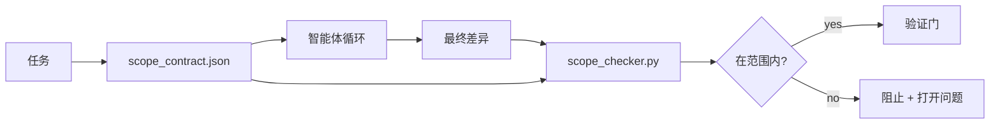

# Scope Contracts and Task Boundaries

> 模型不知道工作在哪里结束。scope contract 是每个任务的文件，说明工作从哪里开始、在哪里结束，以及如果溢出如何回滚。该合同把“保持在范围内”从一个愿望变成了一个检查。

**Type:** 构建  
**Languages:** Python（标准库）  
**Prerequisites:** Phase 14 · 32（最小工作台）、Phase 14 · 33（规则作为约束）  
**Time:** ~50 分钟

## 学习目标

- 编写一个 scope contract，智能体在任务开始时读取，验证者在任务结束时读取。
- 指定允许的文件、禁止的文件、验收标准、回滚计划以及审批边界。
- 实现一个 scope checker，将 diff 与合同比较并标记违规项。
- 使范围蔓延可见、自动化且可审查。

## 问题描述

智能体会发生蔓延。任务是“修复登录 bug”。差异触及了登录路由、电子邮件辅助库、数据库驱动、README 和发布脚本。每次修改在当时都有合理理由，但汇总起来它们就是不同于最初审查的改动。

范围蔓延是智能体工作中最不受监控的失败模式，因为智能体会以善意叙述每一步。解决方法不是更严格的提示词工程，而是磁盘上的一份合同，说明所承诺的内容，以及一个将结果与承诺比较的检查器。

## 概念



### scope contract 中应包含的内容

| Field | Purpose |
|-------|---------|
| `task_id` | 链接到看板上的任务 |
| `goal` | 一句审阅者可以核验的目标陈述 |
| `allowed_files` | 允许智能体写入的 glob（通配符） |
| `forbidden_files` | 智能体不得触碰的 glob（即使是意外也不允许） |
| `acceptance_criteria` | 证明完成的测试命令或断言行 |
| `rollback_plan` | 操作员在需要中止时可以执行的一段操作说明（段落级） |
| `approvals_required` | 范围外操作需要明确人工签署的动作 |

没有 `forbidden_files` 的合同是不完整的。负空间（即不允许的部分）占了合同的一半。

### 使用 glob，而非原始路径

真实仓库会移动文件。将合同固定为 glob（例如 `app/**/*.py`, `tests/test_signup*.py`），以便会话间的重构不会使合同失效。

### 回滚是范围的一部分

列出如何回滚迫使合同作者思考可能出错的情况。无法回滚的合同不应获批。

### 范围检查是差异检查

智能体写出一个差异。checker 读取差异、允许的 glob、禁止的 glob 以及任何运行过的验收命令列表。每个违规项都会成为一个带标签的发现，验证门可据此拒绝通过。

### 两个层级的范围：功能列表与任务合同

scope contract 约束单个任务。它并不约束整个项目。智能体可以完全遵守登录修复的合同，但在下一回合仍然决定项目也需要设置页面、深色模式开关和路由重写。合同并未被要求说明哪些工作属于项目范围，仅说明哪些文件属于该任务范围。

第二个高度需要其自身原语：一个 `feature_list.json`，智能体在会话开始时读取。它是机器可读的、有序的项目待办列表。智能体选择其中一个 `status` 为 `todo` 的 feature，将其 `id` 写入活动的 scope contract，同时被禁止在同一会话中开始第二个 feature。“一次一个 feature”不再是智能体可以辩解过去的提示行，而是磁盘上读取的值以及门控强制的检查。

```json
{
  "project": "knowledge-base",
  "active": "import-pdf",
  "features": [
    { "id": "import-pdf",   "status": "in_progress", "goal": "import a PDF into the library",        "done_when": "pytest tests/test_import.py && a sample PDF appears in the library view" },
    { "id": "full-text-search", "status": "todo",     "goal": "search document text and rank hits",   "done_when": "query returns ranked results with snippets" },
    { "id": "cite-answers", "status": "todo",         "goal": "answers carry source citations",        "done_when": "every answer renders at least one clickable citation" }
  ]
}
```

| Field | Purpose |
|-------|---------|
| `active` | 当前会话可触及的单一 feature；为空表示需要选择一个并设置它 |
| `features[].id` | 稳定的 slug，scope contract 的 `task_id` 指向它 |
| `features[].status` | `todo`、`in_progress`、`done`、`blocked`；同时只能有一个 `in_progress` |
| `features[].goal` | 一句审阅者可以核验的目标陈述 |
| `features[].done_when` | 将 `in_progress` 翻转为 `done` 的验收行 |

两条规则使该列表成为承重而非装饰。第一，不超过一个 `in_progress` 的不变式本身是启动检查（Phase 14 · 33）：如果列表显示两个，除非人工解决，否则会话拒绝开始。第二，feature 列表是一个文件，而不是聊天消息，因为聊天会失去上下文且文件能跨会话、跨智能体持久存在。交接（Phase 14 · 40）会把完成的 feature 的状态写回 `done`，这样下一次会话打开时能看到准确的看板，而不是重新推导剩余工作。

合同与列表按最小特权合成，正如下文所述的合并策略：任务合同的 `allowed_files` 必须位于活动 feature 所触及的范围之内，绝不应超出其外。

## 构建实现

`code/main.py` 实现了：

- `scope_contract.json` 的 schema（JSON Schema 的子集，包含 glob 数组）。  
- 一个差异解析器，将被触及文件列表和已运行命令列表转换为 `RunSummary`。  
- 一个 `scope_check`，根据合同返回 `(violations, in_scope, off_scope)`。  
- 两个演示运行：一个保持在范围内，一个发生蔓延。checker 会以确切的文件和原因标记蔓延。

运行：

```
python3 code/main.py
```

输出：合同、两个运行、每次运行的裁决，以及保存的 `scope_report.json`。

## 生产中常见的模式

一位实践者在“规格最大化”（在调用智能体前用 YAML 写好 scope contracts）后三周报告“入兔洞率”从 52% 降到 21%，而智能体本身未变。是合同发挥了作用，而不是模型。三种模式使收益得以固化。

- 违规预算，而非二元失败。`agent-guardrails`（Claude Code、Cursor、Windsurf、Codex via MCP 使用的 OSS 合并闸）每个任务带 `violationBudget`：轻微的范围滑移在预算内作为警告呈现；只有当预算被超出时合并闸才拒绝。配合 `violationSeverity: "error" | "warning"` 使用。预算是那条介于“发布”与“被团队禁用”的差距。
- 路径族的严重性不对称。对 `docs/**` 的范围外写入通常为 `warn`；对 `scripts/**`、`migrations/**`、`config/prod/**` 的范围外写入则始终 `block`。这种不对称必须写入合同，而非仅存在运行时，因为它依赖项目并且随任务变化。
- 文件预算之外的时间与网络预算。在合同中增加 `time_budget_minutes` 字段以限制挂钟时间；运行时在超时前拒绝继续而需重新批准。在主机名上设置 `network_egress` 允许列表可以防止智能体悄悄调用任务外的外部 API。这些也是范围维度；文件 glob 是必需的但不充分。

- 多合同合并语义（最小特权）。当两个 scope contract 同时适用（例如项目范围的合同与任务特定合同）时，合并策略为：对 `allowed_files` 做交集（路径需被两个合同同时允许），对 `forbidden_files` 做并集（任一方可禁止），`time_budget_minutes` 取更严格的值（min），`approvals_required` 累积。`network_egress` 为 `None` 表示不做强制、`[]` 表示全拒、`[...]` 为允许列表；合并规则：`None` 让位于另一方、两个列表取交集、拒绝全部保持为拒绝全部。在合同 schema 中注明这些规则，使合并成为机械且可审查的操作。

## 使用场景

生产实践：

- Claude Code 的斜杠命令。`/scope` 命令写入合同并将其固定为会话上下文。子智能体在行动前读取合同。
- GitHub PR。将合同以 JSON 文件推送到 PR 正文或作为已签入的产物。CI 在合并差异上运行 scope checker。
- LangGraph 中断。发生范围违规时触发中断；处理器询问人工是扩展合同，还是让智能体回退。

合同随任务同行。任务关闭时，合同归档到 `outputs/scope/closed/`。

## 发布

`outputs/skill-scope-contract.md` 为任务说明生成 scope contract，并生成一个在 CI 上对每个智能体差异运行的支持 glob 的 checker。

## 练习

1. 添加一个 `network_egress` 字段，列出允许的外部主机。拒绝访问其他主机的运行。  
2. 将 checker 扩展为：对 `docs/**` 软失败（警告），对 `scripts/**` 硬失败（阻断）。说明不对称性的理由。  
3. 让合同使用一组静态规则（不使用 LLM）从 `goal` 字段推导 `allowed_files`。在第一个边缘情况会出现什么问题？  
4. 添加 `time_budget_minutes` 并在挂钟时间超出时拒绝继续。  
5. 对同一差异运行两个合同。当两者都适用时，正确的合并语义是什么？

## 关键术语

| Term | What people say | What it actually means |
|------|----------------|------------------------|
| Scope contract | "The task brief" | 每任务的 JSON，列出允许/禁止的文件、验收标准、回滚 |
| Scope creep | "It also touched..." | 同一任务中更改了合同之外的文件 |
| Rollback plan | "We can revert" | 操作员用于中止的一段一段操作说明（runbook） |
| Approval boundary | "Needs sign-off" | 合同中列为需要明确人工批准的动作 |
| Diff check | "Path audit" | 将被触及文件与合同的 glob 进行比较 |

## 延伸阅读

- [LangGraph human-in-the-loop interrupts](https://langchain-ai.github.io/langgraph/concepts/human_in_the_loop/)  
- [OpenAI Agents SDK tool approval policies](https://platform.openai.com/docs/guides/agents-sdk)  
- [logi-cmd/agent-guardrails — merge gates and scope validation](https://github.com/logi-cmd/agent-guardrails) — 违规预算、严重性分层  
- [Dev|Journal, Preventing AI Agent Configuration Drift with Agent Contract Testing](https://earezki.com/ai-news/2026-05-05-i-built-a-tiny-ci-tool-to-keep-ai-agent-configs-from-drifting-in-my-repo/) — `--strict` 模式且无外部依赖  
- [Agentic Coding Is Not a Trap (production logs)](https://dev.to/jtorchia/agentic-coding-is-not-a-trap-i-answered-the-viral-hn-post-with-my-own-production-logs-33d9) — 规格最大化收益：52% → 21%  
- [OpenCode permission globs](https://opencode.ai/docs/agents/) — 细粒度的每权限范围  
- [Knostic, AI Coding Agent Security: Threat Models and Protection Strategies](https://www.knostic.ai/blog/ai-coding-agent-security) — 将范围作为最小特权的一部分  
- [Augment Code, AI Spec Template](https://www.augmentcode.com/guides/ai-spec-template) — 三层边界系统（must/ask/never）  
- Phase 14 · 27 — 与范围锁配合的提示注入防御  
- Phase 14 · 33 — 本合同为每个任务专门化的规则集  
- Phase 14 · 38 — checker 报告进入的验证门