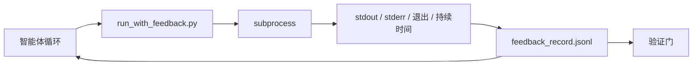

# 运行时反馈循环

> 看不到真实命令输出的智能体会猜测。一个反馈运行器捕获 stdout、stderr、退出码和时长，并将其写入结构化记录，下一轮智能体可以读取。这样智能体会根据事实而不是它对事实的预测来反应。

**Type:** 构建
**Languages:** Python（stdlib）
**Prerequisites:** Phase 14 · 32（最小化工作台）, Phase 14 · 35（初始化脚本）
**Time:** ~50 分钟

## 学习目标

- 区分运行时反馈和可观测性遥测（observability telemetry）。
- 构建一个反馈运行器，封装 shell 命令并持久化结构化记录。
- 以确定性方式截断大量输出，使循环保持在令牌预算内。
- 当缺少反馈时拒绝推进循环。

## 问题

智能体说“现在运行测试”。下一条消息说“所有测试通过”。而事实上没有运行任何测试。智能体要么虚构了输出，要么运行了命令却没有读取结果，要么读取了结果但静默地截断了失败行。

反馈运行器消除了这一空白。每个命令都通过运行器执行。每条记录包含命令、捕获的 stdout 和 stderr、退出码、墙钟时长，以及一行智能体备注。智能体在下一轮读取该记录。验证闸在任务结束时读取这些记录进行验证。

## 概念



### 反馈记录包含哪些内容

| 字段 | 为什么重要 |
|------|------------|
| `command` | 精确的 argv，避免 shell 扩展导致的意外 |
| `stdout_tail` | 最后 N 行，确定性截断 |
| `stderr_tail` | 最后 N 行，独立于 stdout 保存 |
| `exit_code` | 明确无歧义的成功信号 |
| `duration_ms` | 揭示慢探测和失控进程 |
| `started_at` | 回放用的时间戳 |
| `agent_note` | 智能体写下的其期望的一行备注 |

### 截断必须是确定性的

一个 50 MB 的日志会破坏循环。运行器对头部和尾部进行截断，并插入 `...truncated N lines...` 标记，确保确定性——相同的输出总是产生相同的记录。不做采样；智能体需要看到的部分（最终错误、最终概要）保留在尾部。

### 反馈 vs 遥测

遥测（Phase 14 · 23，OTel GenAI 约定）用于人工运营者跨时间查看运行。反馈用于本次运行的下一轮。它们共享一些字段，但保存在不同的文件中，保留策略不同。

### 在缺失反馈时拒绝推进

如果运行器在捕获退出之前发生错误，记录中会包含 `exit_code: null` 和 `error: <reason>`。智能体循环必须在 `exit_code` 为 `null` 时拒绝声称成功。没有退出码，就不能推进。

## 构建它

`code/main.py` 实现了：

- `run_with_feedback(command, agent_note)`：封装 `subprocess.run`，捕获 stdout/stderr/退出/时长，进行确定性截断，追加到 `feedback_record.jsonl`。
- 一个小型加载器，将 JSONL 流式读入 Python 列表。
- 一个示例，运行三个命令（成功、失败、慢）并打印每个命令的最后一条记录。

运行：

```
python3 code/main.py
```

输出：三条反馈记录追加到 `feedback_record.jsonl`，并在内联打印每个命令对应的最后一条记录。跨多次运行 tail 该文件可见循环如何累积记录。

## 生产环境中的常见模式

三个模式能将运行器强化到可上线的程度。

**写入时清理（redact at write），而不是读取时清理。** 任何触及 stdout 或 stderr 的记录都可能泄露密钥。运行器在追加 JSONL 之前应进行清理：删除匹配 `^Bearer `、`password=`、`api[_-]?key=`、`AKIA[0-9A-Z]{16}`（AWS）、`xox[baprs]-`（Slack） 的行。读取时再清理容易出错；磁盘上的文件就是攻击者能获取的内容。应每季度对生产运行时观察到的秘密格式审计清理模式。

**采用轮换策略，而不是单一文件。** 将 `feedback_record.jsonl` 限制为每文件 1 MB；溢出时轮换为 `.1`、`.2`，丢弃 `.5`。智能体循环仅读取当前文件，因此运行时成本有上界。CI 的 Artifact 存储保存完整的轮换集。否则文件会在每次加载时成为瓶颈。

**重试链的父命令 id。** 每条记录带有 `command_id`；重试的记录带有指向上一次尝试的 `parent_command_id`。审阅者的“失败尝试”列表（Phase 14 · 40）和验证闸的审计都沿着链条追溯。没有此链接，重试会看起来像独立的成功，审计会隐藏失败历史。

## 使用场景

生产模式示例：

- **Claude Code Bash 工具。** 该工具已经捕获 stdout、stderr、退出和时长。本课的运行器是一个框架无关的等价物，适用于任何智能体产品。
- **LangGraph 节点。** 将任何 shell 节点包装到运行器，这样记录就会在图状态之外持久化。
- **CI 日志。** 将 JSONL 管道到你的 CI artifact 存储；审阅者可以回放任意命令而无需重新运行会话。

运行器是一个轻量封装，能在框架迁移中幸存，因为它掌握了记录的形状。

## 上线交付

`outputs/skill-feedback-runner.md` 生成一个项目专用的 `run_with_feedback.py`，带有合适的截断预算、连接到工作台的 JSONL 写入器，以及智能体每轮读取的加载器。

## 练习

1. 为每条记录增加 `cwd` 字段，以便同一命令在不同目录下的运行可区分。
2. 增加一个 `redaction` 步骤，去除匹配 `^Bearer ` 或 `password=` 的行。在一个测试记录上验证。
3. 将总的 `feedback_record.jsonl` 大小限制在 1 MB，通过轮换为 `.1`、`.2` 文件来实现。说明并防御你的轮换策略。
4. 增加 `parent_command_id`，使重试链可见：哪个命令产生了下一条命令的输入。
5. 将 JSONL 管道到一个小型 TUI，该 TUI 会高亮最新的非零退出。设计该 TUI 的八个关键特性，使其在审查时有用。

## 关键术语

| 术语 | 人们怎么说 | 实际意思 |
|------|-----------|---------|
| Feedback record | “运行日志” | 结构化的 JSONL 条目，包含命令、输出、退出、时长 |
| Tail truncation | “修剪日志” | 确定性的头+尾捕获，使记录适合令牌预算（尾部优先保留） |
| Refuse-on-null | “在缺少数据时阻塞” | 当 `exit_code` 为 null 时，循环不得推进 |
| Agent note | “期望标签” | 智能体在读取结果前写下的一行预测备注 |
| Telemetry split | “两个日志文件” | 反馈用于下一轮，遥测用于运营者 |

## 延伸阅读

- [OpenTelemetry GenAI semantic conventions](https://opentelemetry.io/docs/specs/semconv/gen-ai/)
- [Anthropic, Effective harnesses for long-running agents](https://www.anthropic.com/engineering/effective-harnesses-for-long-running-agents)
- [Guardrails AI x MLflow — deterministic safety, PII, quality validators](https://guardrailsai.com/blog/guardrails-mlflow) — 将清理模式作为回归测试
- [Aport.io, Best AI Agent Guardrails 2026: Pre-Action Authorization Compared](https://aport.io/blog/best-ai-agent-guardrails-2026-pre-action-authorization-compared/) — 事前/事后工具捕获
- [Andrii Furmanets, AI Agents in 2026: Practical Architecture for Tools, Memory, Evals, Guardrails](https://andriifurmanets.com/blogs/ai-agents-2026-practical-architecture-tools-memory-evals-guardrails) — 可观测性表面
- Phase 14 · 23 — 遥测侧的 OTel GenAI 约定
- Phase 14 · 24 — 智能体可观测性平台（Langfuse、Phoenix、Opik）
- Phase 14 · 33 — 要求在声明完成前有反馈的规则
- Phase 14 · 38 — 读取 JSONL 的验证闸