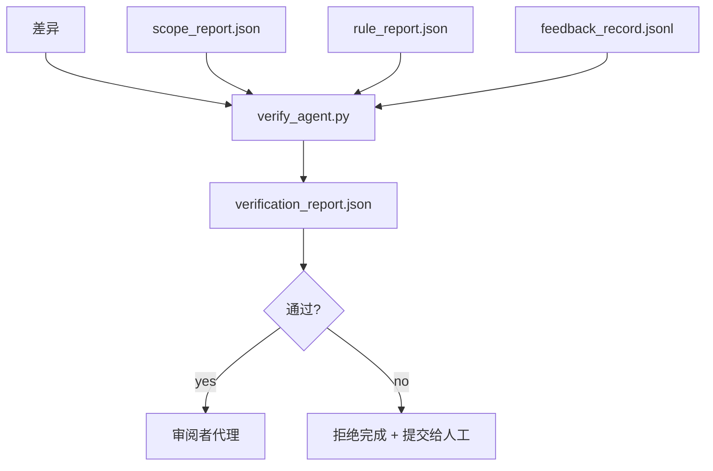

# Verification Gates

> 代理不能自己标记自己的工作为已完成。验证门读取 scope contract、feedback log、rule report 和 diff，然后回答一个问题：这个任务真的完成了吗？如果验证门回答“不”，任务就未完成，无论对话如何说明。

**Type:** 构建  
**Languages:** Python (stdlib)  
**Prerequisites:** Phase 14 · 33 (Rules), Phase 14 · 36 (Scope), Phase 14 · 37 (Feedback)  
**Time:** ~55 分钟

## 学习目标

- 将验证门定义为对 workbench 工件的一个确定性函数。
- 将 rule report、scope report、feedback 记录与 diff 合并成单一裁定。
- 输出一个 reviewer agent 和 CI 都能读取的 `verification_report.json`。
- 在任何 block 级别的失败上拒绝推进任务，毫无例外。

## 问题

代理太容易宣称成功。三种失败形态占主导：

- "Looks good."（看起来不错）。模型读取了自己的 diff 并决定其正确。
- "Tests passed."（测试通过）。自信地说，但没有测试实际运行的记录。
- "Acceptance met."（满足验收）。对验收标准解释得足够宽松，以至于意味着“任何类似完成的东西”。

workbench 的修复是一个单一的验证门，它读取代理已经生成的工件并做出裁定。该门是确定性的。门在版本控制中。门连接到 CI。代理无法贿赂它。

## 概念



### 验证门检查内容

| Check | Source artifact | Severity |
|-------|-----------------|----------|
| All acceptance commands ran | `feedback_record.jsonl` | block |
| All acceptance commands exited zero | `feedback_record.jsonl` | block |
| Scope check has no forbidden writes | `scope_report.json` | block |
| Scope check has no off-scope writes | `scope_report.json` | block or warn |
| All block-severity rules pass | `rule_report.json` | block |
| No `null` exit codes in feedback | `feedback_record.jsonl` | block |
| Touched files match `scope.allowed_files` | both | warn |

一个 `warn` 发现会在裁定上做注释；任何 `block` 发现都会阻止 `passed: true`。

### 确定性，而非概率性

验证门对于相同的一组工件必须每次产生相同的裁定。不允许使用 LLM 作为裁判。LLM 裁判应属于审阅者环节（Phase 14 · 39），其目标是定性评估，而非状态判定。

### 一份报告，一条路径

验证门在每次任务结项时输出一份 `verification_report.json`，写在 `outputs/verification/<task_id>.json` 下。CI 消费相同路径。多个路径的多个门会分裂真相来源。

### 无例外的拒绝

block 级别的发现不能由代理覆盖。它们只能被人工覆盖，并记录 `override_reason` 与 `overridden_by` 用户 id。覆盖必须是已签名的变更，不是代理的决定。

## 实现

`code/main.py` 实现了：

- 每种输入工件的加载器，全部在本地 stub，使课程自包含。
- 一个 `verify(task_id, artifacts) -> VerdictReport` 的纯函数。
- 一个打印器，用于展示每项检查结果和最终通过/失败。
- 三个任务场景的演示：完全通过、范围蔓延、缺少验收。

运行它：

```
python3 code/main.py
```

输出：三个裁定报告，每个保存在脚本旁。

## 生产中流行的模式

四种模式能将验证门从“又一个 lint 任务”提升为“决定性边缘”。

- 防御深度，而非单一门。pre-commit hook → CI 状态检查 → pre-tool 授权钩子 → pre-merge 门。每一层都是确定性的，因此一层失败会被下一层捕获。microservices.io 2026 年 3 月的手册明确：pre-commit hook 无法被绕过，因为它不像模型端的技能那样依赖代理遵循指令。验证门位于 CI / pre-merge 层。
- 用确定性检查来防御，模型裁判只处理细微之处。Anthropic 2026 的混合规范：可验证的奖励（单元测试、模式检查、退出码）回答“代码是否解决了问题？”，LLM 评分则回答“代码是否可读、安全、符合风格？”。验证门运行第一类；审阅者（Phase 14 · 39）运行第二类。混合两者会使信号塌缩。
- 签名覆盖日志，而非 Slack 讨论。每次覆盖都会在 `outputs/verification/overrides.jsonl` 中写一行：时间戳、发现代码、原因、签名用户、当前 HEAD commit。运行时拒绝任何缺少签名的覆盖；审计轨迹由 git 跟踪。这划分了覆盖策略与覆盖戏剧的界线。
- 代码覆盖率下限作为一级检查。`coverage_report.json` 提供一个 `coverage_floor`（默认 80%）检查。如果测得覆盖率低于下限或比上一次合并的下限下降超过 1 个百分点，门失败。没有这一检查，代理会悄悄删除失败的测试，而验证报告保持绿色。
- `--strict` 模式将所有 warn 升级为 block。对于 release 分支、阻塞发布的 PR，或事件后处置，`--strict` 将所有警告视为硬性失败。该标志按分支可选，不是全局默认，因为对一切都严格会侵蚀日常流程。

## 使用场景

生产中的应用模式：

- CI 步骤。一个 `verify_agent` 作业对代理的最终工件运行验证门。合并保护在 `passed: true` 之前拒绝合并。
- 交接前钩子。代理运行时在生成交接文档前调用验证门。没有绿色裁定就不允许交接。
- 手动分类。操作员在代理宣称成功但人工怀疑时，阅读报告进行判断。

验证门是 workbench 流程中的决定性边缘。所有其它表面都在它的上游。

## 部署

`outputs/skill-verification-gate.md` 将验证门接入具体项目：哪些验收命令供其使用，哪些规则为 block 级别，哪些离域写入被容忍，覆盖日志如何存储。

## 练习

1. 添加 `coverage_floor` 检查：测试命令必须生成覆盖率报告且至少为 80%。决定哪个工件携带下限信息。
2. 支持 `--strict` 模式，将每个 `warn` 升级为 `block`。记录在哪些情况下 strict 模式是正确的默认值。
3. 使验证门除 JSON 外还生成一份 Markdown 摘要。为哪些字段应进入摘要提出理由。
4. 添加 `time_since_last_human_touch` 检查：任何在距人工击键 60 秒内编辑过的文件可免于离域标记。
5. 在你们产品的真实代理 diff 上运行验证门。多少发现是真实问题，多少是噪声？验证门在哪些方面需要扩展？

## 关键术语

| 术语 | 常见说法 | 实际含义 |
|------|--------|----------|
| 验证门（Verification gate） | "阻止事情的检查" | 针对 workbench 工件的确定性函数，产生通过/不通过的裁定 |
| Block 严重性（Block severity） | "硬性失败" | 一类发现会阻止 `passed: true`，且需要签名覆盖 |
| 覆盖日志（Override log） | "为什么放行" | 带原因和用户 id 的签名条目，供审计 |
| 验收命令（Acceptance command） | "证明" | 一个 shell 命令，其零退出码就是“已完成”的含义 |
| 单一路径报告（One report path） | "事实来源" | `outputs/verification/<task_id>.json`，供 CI 和人工共同消费 |

## 延伸阅读

- [Anthropic, Harness design for long-running application development](https://www.anthropic.com/engineering/harness-design-long-running-apps)
- [OpenAI Agents SDK guardrails](https://platform.openai.com/docs/guides/agents-sdk/guardrails)
- [microservices.io, GenAI dev platform: guardrails](https://microservices.io/post/architecture/2026/03/09/genai-development-platform-part-1-development-guardrails.html) — pre-commit 与 CI 之间的深度防御
- [ICMD, The 2026 Playbook for Agentic AI Ops](https://icmd.app/article/the-2026-playbook-for-agentic-ai-ops-guardrails-costs-and-reliability-at-scale-1776661990431) — 审批门阶梯（draft → approval → auto under thresholds）
- [Type-Checked Compliance: Deterministic Guardrails (arXiv 2604.01483)](https://arxiv.org/pdf/2604.01483) — 将 Lean 4 作为确定性门的上限
- [logi-cmd/agent-guardrails — merge gate spec](https://github.com/logi-cmd/agent-guardrails) — 范围 + 变更测试门
- [Guardrails AI x MLflow](https://guardrailsai.com/blog/guardrails-mlflow) — 将确定性验证器作为 CI 评分器
- [Akira, Real-Time Guardrails for Agentic Systems](https://www.akira.ai/blog/real-time-guardrails-agentic-systems) — 前/后工具门
- Phase 14 · 27 — 提示注入防御（验证门的对抗面）
- Phase 14 · 36 — 该门执行的 scope contract
- Phase 14 · 37 — 该门打分的 feedback log
- Phase 14 · 39 — 验证门交接的审阅者代理