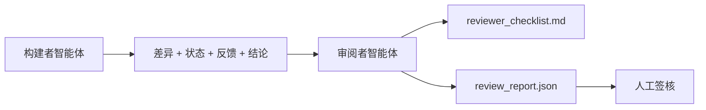

# 审阅者智能体：将构建者与评分者分离

> 写代码的智能体不能为自己的代码打分。审阅者是第二道循环，使用不同的 system prompt、不同的目标，并且对构建者产生的所有产物只有只读访问权限。构建者与审阅者之间的鸿沟是可靠性的主要来源。

**Type:** 构建  
**Languages:** Python（标准库）  
**Prerequisites:** Phase 14 · 38（验证门）  
**Time:** ~55 分钟

## 学习目标

- 说明为什么同一个智能体不能可靠地复审自己的工作。  
- 构建一个审阅者智能体循环，消耗构建者的产物并输出结构化的审阅报告。  
- 编写一个对特定维度评分、不靠感觉打分的审阅者评分表（rubric）。  
- 将审阅者接入工作台，使人工审阅步骤从真实产物开始。

## 问题描述

你要求智能体修复一个 bug。它编辑了四个文件，运行了测试，然后报告完成。验证门（Phase 14 · 38）确认 acceptance 已运行且范围没有扩大。门显示 `passed: true`。你合并了变更。两天后你发现修复解决了错误的一半，而且解决的是错误的那一半。

通过 acceptance 是必要条件，但不是充分条件。审阅者要问 acceptance 无法问的问题：这是否解决了正确的问题？是否在未标注的情况下扩大了范围？是否把应当质疑的假设记录下来？是否把工作台留在了下一个环节能够接手的状态？

## 概念



### 审阅者评分表（rubric）

五个维度，每个维度评分 0 到 2。

| Dimension | Question |
|-----------|----------|
| Problem fit | 变更是否解决了所述任务，而不是一个相近但不同的任务？ |
| Scope discipline | 编辑是否被限制在合同范围内，还是合同被有意识地扩大了？ |
| Assumptions | 所有隐含假设是否有记录，且可以被审阅？ |
| Verification quality | acceptance 命令是否真正证明了目标，还是只证明了一个更弱的版本？ |
| Handoff readiness | 下一个会话是否能从当前状态干净地接手？ |

满分 10 分。低于 7 分为软失败（soft fail）；低于 5 分为硬失败（hard fail）。

### 审阅者是一个独立的角色，而不是一个独立的模型

审阅者可以使用与构建者相同的模型。纪律在于角色分离：不同的 system prompt、不同的输入、对 diff 没有写入权限。姿态的改变就是信号的改变。

### 审阅者不能修改 diff

审阅者读取 diff、状态、反馈、裁定。它撰写报告，但不打补丁。如果报告写着“修复这个”，下一轮由构建者来修复；审阅者再回去复审。角色混杂会破坏这种鸿沟。

### 审阅者评分表与验证门的区别

验证门（Phase 14 · 38）检查确定性事实：acceptance 是否运行，规则是否通过，范围是否保持。审阅者做定性判断：这是正确的工作吗？是否有文档化假设？交接是否可用？两者都必需。

## 构建实现

`code/main.py` 实现：

- 一个 `ReviewerInputs` dataclass，打包审阅者读取的产物。  
- 一个评分器，对每个维度都有一个函数。每个函数都是确定性的、为本课准备的简化评分；真实实现会调用 LLM。  
- 一个 `review_report.json` 写入器，包含五个分数、总分和一个裁定（`pass`、`soft_fail`、`hard_fail`）。  
- 两个演示案例：一个干净的变更和一个“测试通过但问题搞错了”的变更。

运行它：

```
python3 code/main.py
```

输出：两个审阅报告写入磁盘，并在控制台打印各维度分数的表格。

## 真实环境下的生产模式

案例：Cloudflare 在 2026 年 4 月的 AI 代码审阅系统在 30 天内对 5,169 个仓库中的 48,095 个合并请求运行了 131,246 次审阅。中位审阅完成时间为 3 分 39 秒。最多有 7 个专业审阅者（安全、性能、代码质量、文档、发布管理、合规、工程准则）在一个审阅协调器下并行运行，协调器会去重发现并判断严重性。顶级模型保留给协调器使用；专业审阅者使用更便宜的模型层。

四种模式使其在规模上可行。

- 专家池，而不是单一的大审阅者。单个具备 5 维评分表的审阅者适用于小型仓库。一旦代码库出现安全关键、性能关键和文档敏感面，拆分为更小提示的专家审阅者。协调器负责去重；专家不运行完整的评分表。模型层次自然分化：便宜的专家，昂贵的协调器。

- 将偏见缓解作为设计需求而非优化。LLM 评审表现出四类可靠偏见（Adnan Masood, 2026 年 4 月）：位置偏见（GPT-4 在 (A,B) vs (B,A) 顺序上的不一致约 40%）、冗长偏见（长回复带来约 15% 的分数膨胀）、自我偏好（评审偏好来自同一模型家族的产出）、权威偏见（评审对已知作者的引用评分过高）。缓解方法：评估两个顺序并仅计入一致的胜出；使用明确奖励简洁性的 1-4 量表；轮换不同模型家族的评审；在评分前剥离作者名。

- 使用校准集，而不是凭感觉。准备 10-20 个带已知正确裁定的历史任务集合。在每次提示变更时对审阅者运行这些任务。如果与历史记录的一致率低于 80%，则在审阅者发布前需要修订评分表。这是每个团队最终都会重新发现的做法；最好一开始就建立。

- 与验证门的混合规范。验证门（Phase 14 · 38）处理确定性检查（acceptance 是否运行、测试是否通过、范围是否保持）。审阅者处理语义检查（这是否是正确的工作、假设是否记录、交接是否可用）。Anthropic 在 2026 年的指导明确划分了这两者：不要让审阅者重复验证门已经证明的东西。

## 使用场景

生产模式示例：

- Claude Code 子智能体。构建者完成任务后运行一个审阅子智能体。它在 PR 上发布带有评分表得分的评论。  
- OpenAI Agents SDK 交接。构建者在任务完成时将工作交给审阅者。审阅者可以带回发现清单，也可以上交给人工。  
- 双模型配对。构建者使用更快更便宜的模型运行。审阅者使用更强的模型且上下文更小，专注于判断。

当人类无法亲自完成所有审阅时，审阅者成为工作台增长出的第二双眼睛。

## 交付成果

`outputs/skill-reviewer-agent.md` 生成一个项目特定的审阅者评分表、一个连接到构建者产物的审阅者智能体存根，以及与验证门的集成，使人工审阅从一份已写的报告开始，而不是空白页。

## 练习

1. 为你的产品领域增加第六个维度。说明它为什么不能被现有五个维度吸收。  
2. 使用两个不同的 system prompt（简洁、详细）运行审阅者。哪一个更可能产出人类愿意阅读的报告？  
3. 为每个维度增加一个 `confidence` 字段。当最低维度的置信度低于 0.6 时拒绝发布报告。  
4. 构建一个校准集：10 个带已知正确裁定的历史任务。对它们运行审阅者。在哪些地方与历史记录存在分歧？  
5. 增加“请求更多证据”的能力：审阅者可以在评分前向构建者请求一次具体的测试运行。什么样的回退策略可以防止该流程循环往复？

## 术语表

| Term | What people say | What it actually means |
|------|----------------|------------------------|
| Reviewer rubric | "Checklist" | 五维 0-2 评分，每个维度配有书面问题 |
| Soft fail | "Needs revisions" | 总分低于 7；构建者收到需要处理的发现项 |
| Hard fail | "Reject" | 总分低于 5 或任一维度为 0；停止并上报人工处理 |
| Role separation | "Different prompt" | 同一模型可以扮演两个角色；纪律在于输入和姿态 |
| Confidence floor | "Don't ship low-signal reports" | 在评分表信号不足时拒绝给出裁定 |

注意：文中术语使用了行业通行的翻译，例如“提示词工程”（Prompt engineering）、RAG、“嵌入”（Embeddings）、“微调”（Fine-tuning）、“上下文窗口”（Context window）、“少样本”（few-shot）、“思维链”（chain-of-thought）、“护栏”（guardrails）、“函数调用”（function calling）、“智能体循环”（agent loop）、“有状态图”（stateful graphs）、“参与者模型”（actor model）。

## 延伸阅读

- [OpenAI Agents SDK handoffs](https://platform.openai.com/docs/guides/agents-sdk/handoffs)  
- [Anthropic Claude Code subagents](https://docs.anthropic.com/en/docs/agents-and-tools/claude-code/sub-agents)  
- [Cloudflare, Orchestrating AI Code Review at Scale](https://blog.cloudflare.com/ai-code-review/) — 7 专家 + 协调器架构，131k 次运行 / 30 天  
- [Agent-as-a-Judge: Evaluating Agents with Agents (OpenReview / ICLR)](https://openreview.net/forum?id=DeVm3YUnpj) — DevAI 基准，366 个层级化解决方案需求  
- [Adnan Masood, Rubric-Based Evaluations and LLM-as-a-Judge: Methodologies, Biases, Empirical Validation](https://medium.com/@adnanmasood/rubric-based-evals-llm-as-a-judge-methodologies-and-empirical-validation-in-domain-context-71936b989e80) — 四类偏见与缓解方法  
- [MLflow, LLM-as-a-Judge Evaluation](https://mlflow.org/llm-as-a-judge) — 用于分离构建者/评估者的生产工具链  
- [LangChain, How to Calibrate LLM-as-a-Judge with Human Corrections](https://www.langchain.com/articles/llm-as-a-judge) — 校准集工作流  
- [Evidently AI, LLM-as-a-judge: a complete guide](https://www.evidentlyai.com/llm-guide/llm-as-a-judge)  
- [Arize, LLM as a Judge — Primer and Pre-Built Evaluators](https://arize.com/llm-as-a-judge/)  
- Phase 14 · 05 — Self-Refine 和 CRITIC（单智能体自我复审基线）  
- Phase 14 · 30 — 基于评估的智能体开发（校准集生成器）  
- Phase 14 · 38 — 审阅者所读取的验证门  
- Phase 14 · 40 — 审阅者报告用于生成的交接包