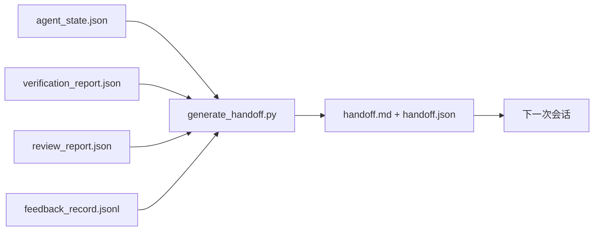

# 多会话交接

> 会话要结束了。工作还没有。交接包是把“智能体工作了一个小时”变成“下一次会话在第一分钟就高效”的工件。要有意地构建它，而不是事后想起才补一下。

**Type:** 构建  
**Languages:** Python (stdlib)  
**Prerequisites:** Phase 14 · 34 (Repo Memory), Phase 14 · 38 (Verification), Phase 14 · 39 (Reviewer)  
**Time:** ~50 分钟

## 学习目标

- 识别每个交接包需要的七个字段。
- 从工作台工件生成交接，而不是手写篇幅性的说明。
- 将大型反馈日志修剪为适合交接的摘要。
- 使下一次会话的第一个动作具有确定性。

## 问题

会话结束。智能体说“很好，我们有进展了”。下一次会话打开。下一个智能体问“我们停在哪儿了？”第一个智能体的答案不见了。下一个智能体重新发现、重新运行相同命令、重新问人类相同问题，花费三十分钟来恢复上一次会话的最后三十秒工作。

一次糟糕交接的代价会在任务的生命周期内每次会话都会付出。解决办法是在会话结束时自动生成一个包：发生了什么、为什么、尝试过什么、失败了什么、剩下什么、下一次应首先做什么。

## 概念



### 每个交接包含的七个字段

| Field | Question it answers |
|-------|---------------------|
| `summary` | 一段话说明已完成的工作 |
| `changed_files` | 一目了然的差异 |
| `commands_run` | 实际执行了什么命令 |
| `failed_attempts` | 尝试了什么以及为什么失败 |
| `open_risks` | 可能在下一次会话造成麻烦的事项，并标注严重性 |
| `next_action` | 下一次会话要执行的第一个具体步骤 |
| `verdict_pointer` | 指向验证与评审报告的路径 |

`next_action` 字段是承重的那个。缺少 `next_action` 的交接包含了其他所有信息也只是一个状态报告，而不是交接。

### 交接是生成的，而不是手写的

手写的交接是在艰难时会被跳过的交接。生成器读取工作台工件并产生包。智能体的任务是把工作台留在生成器可以总结的状态，而不是写总结。

### 两种形式：人类可读和机器可读

`handoff.md` 是人类阅读的内容。`handoff.json` 是下一个智能体加载的内容。两者来源于相同的源工件。如果它们不一致，以 JSON 为准。

### 反馈日志修剪

完整的 `feedback_record.jsonl` 可能有数百条记录。交接只携带最后 K 条以及所有退出码非零的条目。下一次会话如果需要，会加载完整日志，但包保持小巧。

### 保持清洁状态

交接描述了工作。清洁的状态使工作可恢复。两者不是同一回事。即使 `handoff.md` 写得再完美，如果下一次会话打开的是半应用的 diff、智能体忘记的临时文件、散落的分支，以及在运行前就报错的测试，那这个交接是无用的。下一次智能体会把前十分钟花在清理上，而不是构建，代价会在每次会话中累积。

因此，会话在功能工作完成时并未结束。它在工作台处于生成器可以总结、下一次会话可以信任的状态时结束。清理是一个独立阶段，在交接前运行，并且它是一个检查点，而不是一种习惯，因为习惯是在艰难时会被跳过的那件事。

| 检查项 | 干净意味着 | 脏会阻塞因为 |
|-------|-------------|----------------------|
| 工作树 | 每个更改都已提交或已明确地用备注 stash | 半应用的 diff 会让下一次智能体误以为是有意的工作 |
| 临时产物 | 没有 `*.tmp`、临时目录、调试打印或保留的注释代码块 | 游离文件会污染 diff 并扰乱下一次智能体的心智模型 |
| 测试 | 绿，或者若失败则在 `open_risks` 中明确说明失败原因 | 沉默失败的测试是下一次会话会踩到的陷阱 |
| 功能面板 | `feature_list.json` 的状态反映现实 (Phase 14 · 36) | 过时的面板会让下一次会话去做已完成的工作 |
| 分支 | 在预期的分支上，没有 detached HEAD，没有孤立分支 | 错误的分支会导致下一次会话的第一个提交落在错误地方 |

清理阶段会输出一个列出阻塞问题的 `clean_state.json`；空列表是生成器在写包之前断言的先决条件。基于脏树构建的交接不是交接，而是一个转发的烂摊子。两个工件配对存在：清理证明工作台可以安全离开，交接证明下一次会话知道从何开始。

## 构建它

`code/main.py` 实现了：

- 一个加载器，将 state、verdict、review 和 feedback 收集到单个 `WorkbenchSnapshot` 中。
- 一个 `generate_handoff(snapshot) -> (markdown, payload)` 函数。
- 一个筛选器，挑选最后 K 条反馈条目加上所有退出码非零的条目。
- 一个示例运行，在脚本旁写出 `handoff.md` 和 `handoff.json`。

运行它：

```
python3 code/main.py
```

输出：打印的交接正文，以及磁盘上的两个文件。

## 生产中出现的模式

Codex CLI、Claude Code 和 OpenCode 各自实现了不同的压缩(compaction)策略；结构化的交接包位于三者之上。

Compaction 策略各有不同；包的模式(schema)是不变的。Codex CLI 的 POST /v1/responses/compact 是服务器端的不可见 AES blob（为 OpenAI 模型提供快速路径）；回退方案是本地的 “handoff summary” 作为 `_summary` 的用户角色消息追加。Claude Code 在 95% 上下文时运行五阶段渐进式压缩。OpenCode 做基于时间戳的消息隐藏并附带一个五段式 LLM 摘要。三种不同机制，同一需求：把能在压缩后仍能保留的内容序列化为可移植的工件。交接包就是那个工件。

新会话交接不是 compaction。Compaction 是在原地延续会话；交接是把会话干净地关闭并开始下一次。Hermes Issue #20372 的表述（2026 年 4 月）是对的：当原地压缩开始退化时，智能体应该写一个紧凑交接，结束会话，并在新上下文中恢复。交接包使这种转换廉价。错误是一直压缩直到质量崩塌；修正是为早期、干净的交接预算时间。

每个分支与主题只应有一个活跃的交接。多智能体协调在过时交接上比在模型输出上更容易崩溃。总要包含 `branch`、`last_known_good_commit`，以及 `status` 的 `active | superseded | archived`。过时的交接会被存档；只有活跃的交接驱动下一次会话。这就是交接作为“状态”而非仅作为“笔记”的区别。

在 50-75% 的上下文使用率之前完成收尾，而不是等到最后一刻。手写模板（CLAUDE.md + HANDOVER.md）的实践报告显示，当会话在 50-75% 上下文预算结束而非 95% 时效果最好。包生成器在压缩产物开始污染源状态之前能干净运行。在上下文尚完好的时候写成本便宜；当模型已丢失位置信息时写就昂贵。

## 使用它

生产模式：

- 会话结束钩子。运行时在用户关闭聊天时触发生成器。包存到 `outputs/handoff/<session_id>/`。
- PR 模板。生成器的 Markdown 也是 PR 正文。审阅者无需打开五个其他文件就能阅读。
- 跨智能体交接。用一个产品（Claude Code）构建，换另一个（Codex）继续。包是通用语言。

包应小、规则化、易产生。节省的成本会在每次会话中复利增长。

## 部署它

`outputs/skill-handoff-generator.md` 会生成一个针对项目工件路径调优的生成器，一个在会话结束时运行的钩子，以及下一个智能体在启动时读取的 `handoff.json` 模式。

## 练习

1. 添加一个 `assumptions_to_validate` 字段，列出构建者记录但审阅者评分未超过 1 的所有假设。
2. 对失败运行与通过运行分别采用不同的反馈摘要修剪策略。为这种不对称性辩护。
3. 包括一个“给人类的问题”列表。什么阈值会把一个问题放进包里而不是留在聊天消息里？
4. 使生成器幂等：运行两次产生相同包。为此需要哪些稳定性？
5. 添加“下一次会话前置条件”部分，精确列出下一次会话在行动前必须加载的工件。

## 术语表

| Term | What people say | What it actually means |
|------|----------------|------------------------|
| Handoff packet | "Session summary" | 生成的工件，携带七个字段，包含 Markdown 和 JSON |
| Next action | "What to do first" | 启动下一次会话的那个具体第一步 |
| Feedback trim | "Log summary" | 最近 K 条记录加上所有退出码非零的记录 |
| Status report | "What we did" | 缺少 `next_action` 的文档；有用，但不是交接 |
| Verdict pointer | "Receipt" | 指向验证与评审报告以便溯源的路径 |

（注：文中常用术语映射示例 — 提示词工程、RAG、嵌入、微调、上下文窗口、少样本、思维链、护栏、函数调用、智能体循环、有状态图、参与者模型 — 请在实现与文档中采用标准中文译法。）

## 延伸阅读

- [Anthropic, Effective harnesses for long-running agents](https://www.anthropic.com/engineering/effective-harnesses-for-long-running-agents)
- [OpenAI Agents SDK handoffs](https://platform.openai.com/docs/guides/agents-sdk/handoffs)
- [Codex Blog, Codex CLI Context Compaction: Architecture, Configuration, Managing Long Sessions](https://codex.danielvaughan.com/2026/03/31/codex-cli-context-compaction-architecture/) — POST /v1/responses/compact and local fallback
- [Justin3go, Shedding Heavy Memories: Context Compaction in Codex, Claude Code, OpenCode](https://justin3go.com/en/posts/2026/04/09-context-compaction-in-codex-claude-code-and-opencode) — 三厂商压缩比较
- [JD Hodges, Claude Handoff Prompt: How to Keep Context Across Sessions (2026)](https://www.jdhodges.com/blog/ai-session-handoffs-keep-context-across-conversations/) — CLAUDE.md + HANDOVER.md，50-75% 上下文预算
- [Mervin Praison, Managing Handoffs in Multi-Agent Coding Sessions: Fresh Context Without Losing Continuity](https://mer.vin/2026/04/managing-handoffs-in-multi-agent-coding-sessions-fresh-context-without-losing-continuity/) — 分布式系统视角
- [Hermes Issue #20372 — automatic fresh-session handoff when compression becomes risky](https://github.com/NousResearch/hermes-agent/issues/20372)
- [Hermes Issue #499 — Context Compaction Quality Overhaul](https://github.com/NousResearch/hermes-agent/issues/499) — 面向交接的 Codex CLI 提示词改造
- [Microsoft Agent Framework, Compaction](https://learn.microsoft.com/en-us/agent-framework/agents/conversations/compaction)
- [OpenCode, Context Management and Compaction](https://deepwiki.com/sst/opencode/2.4-context-management-and-compaction)
- [LangChain, Context Engineering for Agents](https://www.langchain.com/blog/context-engineering-for-agents)
- Phase 14 · 34 — 生成器读取的状态文件
- Phase 14 · 38 — 包所指向的验证裁定
- Phase 14 · 39 — 打包进交接的审阅报告