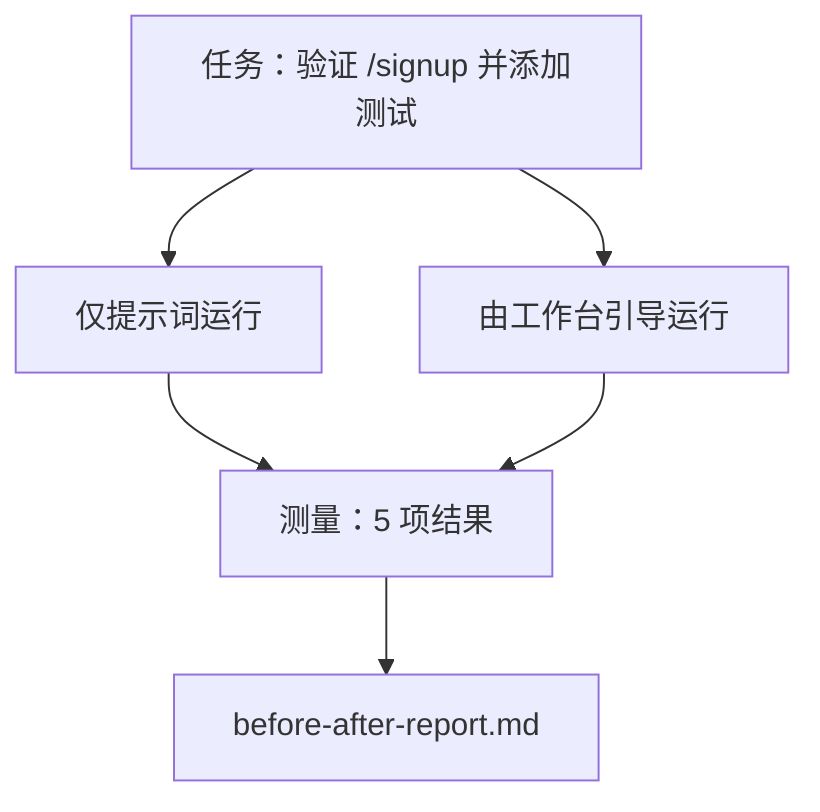

# 实际仓库上的工作台

> 如果不能在真实代码库中经受住考验，十一条界面经验就毫无意义。本课将在一个小示例应用上对同一任务运行两次：仅提示词与工作台引导。用数据来证明效果。

**Type:** 构建  
**Languages:** Python（标准库）  
**Prerequisites:** 阶段 14 · 32 至 14 · 40  
**Time:** ~60 分钟

## 学习目标

- 在一个小型应用上将七个工作台表面组合起来。
- 对同一任务运行两次（仅提示词与工作台引导），并测量五项结果。
- 阅读前/后报告并判断哪些表面带来了最大杠杆效应。
- 针对“但我的模型已经足够好”之类的质疑为工作台进行辩护。

## 问题

在玩具任务上的演示不足以说服任何人。当一个真实感的任务在真实感的仓库中以更少的失败、更少的回退、并产生下次会话可用的交接包方式进入生产时，工作台的价值才成立。

本课提供那个真实感的仓库，并把同一任务分别放入两条流水线。结果是一份你可以交给怀疑者的前/后报告。

## 概念



### 示例应用

在 `sample_app/` 中的最小 FastAPI 风格处理器：

- `app.py` 含 `/signup` （目前尚无校验）。
- `test_app.py` 含一个成功路径的测试。
- `README.md` 和 `scripts/release.sh` 作为禁区诱饵。

### 任务

> 为 `/signup` 添加输入校验：拒绝长度小于 8 的密码，返回 422 并使用类型化的错误包。添加一个能证明新行为的测试。

### 两条流水线

仅提示词：

1. 阅读 README。
2. 阅读 `app.py`。
3. 编辑文件。
4. 声称完成。

工作台引导：

1. 运行初始化脚本（Phase 35）。
2. 阅读范围契约（Phase 36）。
3. 读取状态（Phase 34）。
4. 仅编辑允许的文件。
5. 通过反馈运行器运行验收命令（Phase 37）。
6. 运行验证闸门（Phase 38）。
7. 运行审查器（Phase 39）。
8. 生成交接包（Phase 40）。

### 测量的五项结果

| Outcome | Why it matters |
|---------|----------------|
| `tests_actually_run` | Most "tests passed" claims are unverifiable |
| `acceptance_met` | The test that proves the goal must be the test that ran |
| `files_outside_scope` | Scope creep is the dominant silent failure |
| `handoff_quality` | The next session pays for or benefits from this |
| `reviewer_total` | Qualitative judgment on top of the gate |

（注：表中左列为指标键名，保持原样以便机器可读。）

## 构建它

`code/main.py` 对相同的示例应用夹具以两条流水线做编排。两条流水线都是脚本化的（环路中没有 LLM），因此测量是可复现的。该脚本会把比较结果写入 `before-after-report.md` 和 `comparison.json`。

运行：

```
python3 code/main.py
```

输出：控制台表格显示各流水线的结果，脚本旁保存的 Markdown 报告，以及用于可视化的 JSON 文件。

## 生产中的模式

怀疑者的问题是“工作台到底有多大帮助？”2026 年的数据表明，差距相当显著。

- 终端基准从 Top-30 到 Top-5（同模型）。LangChain 的《Anatomy of an Agent Harness》（2026 年 4 月）：通过仅更改 harness，一个编码智能体在 Terminal Bench 2.0 从第 30 多名跃升到第 5 名。模型不变，只改表面。排名跃升 25 位。
- Vercel：通过删除工具将成功率从 80% 提升到 100%。Vercel 报告称删除 80% 的智能体工具使成功率从 80% 提升到 100%。更小的工具面、更清晰的范围、更少的失败方式。留白带来收益。
- Harvey：仅通过优化 harness 将准确率提高 2 倍。法律类智能体通过仅优化 harness 就将准确率翻番，模型未变。
- 88% 的企业 AI 智能体项目未能进入生产。preprints.org 的《Harness Engineering for Language Agents》（2026 年 3 月）将失败原因归结为运行时，而非推理：陈旧的状态、脆弱的重试、过度增长的上下文、对中间错误的糟糕恢复。
- 长上下文崩塌。WebAgent 在基线条件成功率为 40–50%，在长上下文下成功率降至不足 10%，主要因无限循环和目标丢失。Ralph Loop 和交接包旨在吸收这些问题。
- 假阴性仍然存在。单步事实性任务、一行 lint、格式化运行，任何模型已逐字记住的内容——这些用仅提示词运行更快。基准应诚实地列出这些情况，以免将工作台描述为过度设计。

结论不是“harness 永远赢”。模型会随着时间吸收 harness 的技巧。结论是今天工程负载集中在七个表面上，数据证明了这一点。

## 使用场景

当你需要引用事实案例时，可以使用本课文件：

- 当有人问为什么每个 PR 都带有 `agent-rules.md` 和范围契约时。
- 当一个团队想要“仅在本次冲刺”移除验证闸门时。
- 当一个新的智能体产品上线，你需要一个可移植的基准来判断它是否真正节省时间。

数据比解释更有说服力。

## 发布它

`outputs/skill-workbench-benchmark.md` 是一个可移植的评估 harness，可以把任何智能体产品通过两条流水线在项目的示例应用上运行，并报告五项结果。

## 练习

1. 添加第六项结果：首次有意义编辑时间（time-to-first-meaningful-edit）。如何干净地测量它？
2. 在你代码库的真实第二天任务上运行比较。工作台的哪些数值开始下滑？
3. 添加一个“假阴性”通道：那些仅提示词更快且工作台开销真实的任务。为保留工作台辩护。
4. 将脚本化的“智能体”替换为真实的 LLM 调用。哪些结果变得更嘈杂（更随机）？
5. 为非工程师撰写一页摘要。哪些内容能保留？

## 关键术语

| Term | What people say | What it actually means |
|------|----------------|------------------------|
| Sample app | "Toy repo" | Small but realistic enough to exercise all seven surfaces |
| Pipeline | "Workflow" | Ordered sequence of surface reads/writes the agent follows |
| Before/after report | "The receipts" | The artifact you hand to a skeptic |
| False negative | "Workbench overkill" | Tasks where prompt-only is faster; useful to enumerate honestly |
| Workbench benchmark | "Reliability score" | Portable harness that runs the comparison on your codebase |

（注：表中第一列为术语原文以便对齐行业用语，第二列保留常见说法，第三列解释已用专业术语翻译。）

## 延伸阅读

- [LangChain, The Anatomy of an Agent Harness](https://blog.langchain.com/the-anatomy-of-an-agent-harness/) — Terminal Bench 从 Top-30 到 Top-5 的记录
- [MongoDB, The Agent Harness: Why the LLM Is the Smallest Part of Your Agent System](https://www.mongodb.com/company/blog/technical/agent-harness-why-llm-is-smallest-part-of-your-agent-system) — Vercel 与 Harvey 的数据
- [preprints.org, Harness Engineering for Language Agents](https://www.preprints.org/manuscript/202603.1756) — 88% 企业失败率与运行时根因
- [HN: Improving 15 LLMs at Coding in One Afternoon. Only the Harness Changed](https://news.ycombinator.com/item?id=46988596) — 在 15 个模型上复现的结果
- [Cloudflare, Orchestrating AI Code Review at Scale](https://blog.cloudflare.com/ai-code-review/) — 生产环境下 30 天内 131k 次审查运行
- [Anthropic, Building Effective Agents](https://www.anthropic.com/research/building-effective-agents)
- Phases 14 · 32 to 14 · 40 — 本课端到端练习所涉及的表面
- Phase 14 · 19 — 本课补充的宏观基准：SWE-bench、GAIA、AgentBench
- Phase 14 · 30 — 由同一 harness 插入的基于评估的智能体开发