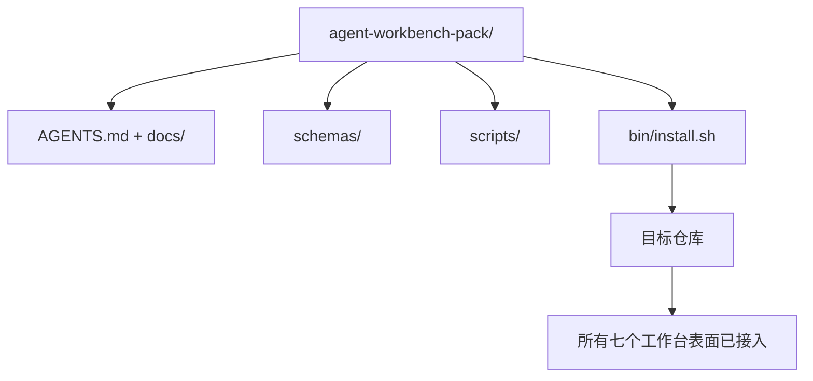

# Capstone: Ship a Reusable Agent Workbench Pack

> 该迷你课程以一个可以放入任何仓库的包结束。将十一课的表面压缩到一个目录中，你可以 `cp -r` 并在第二天早上拥有一个可靠工作的智能体。结业作品是本课程的交付物。

**Type:** 构建  
**Languages:** Python（标准库）  
**Prerequisites:** 阶段 14 · 31 到 14 · 41  
**Time:** ~75 分钟

## 学习目标

- 将七个工作台表面打包到一个可直接投放的目录中。
- 固定（pin）模式、脚本和模板，使新的仓库获得已知良好的基线。
- 添加一个单一的安装脚本，以幂等方式部署该包。
- 决定哪些内容保留在包中，哪些内容留在外部，并为每一项决策进行辩护。

## 问题

一个生活在 Google 文档、聊天历史和三段半记得住的脚本中的工作台，会每个季度都被重建。解决办法是一个有版本控制的包：一个包含表面、模式、脚本和一条命令安装器的仓库或目录。

本课结束时，你将在磁盘上交付 `outputs/agent-workbench-pack/`，并生成一个 `bin/install.sh`，可以把它放入任何目标仓库中。

## 概念



### 包的布局

```
outputs/agent-workbench-pack/
├── AGENTS.md
├── docs/
│   ├── agent-rules.md
│   ├── reliability-policy.md
│   ├── handoff-protocol.md
│   └── reviewer-rubric.md
├── schemas/
│   ├── agent_state.schema.json
│   ├── task_board.schema.json
│   └── scope_contract.schema.json
├── scripts/
│   ├── init_agent.py
│   ├── run_with_feedback.py
│   ├── verify_agent.py
│   └── generate_handoff.py
├── bin/
│   └── install.sh
└── README.md
```

### 什么放入，什么放出

放入：

- 表面模式（Surface schemas）。它们是契约。
- 上述四个脚本。它们是运行时。
- 这四份文档。它们是规则和评分量表（rubric）。

放出：

- 项目特定的任务。任务应属于目标仓库的看板，而不是包内。
- 厂商 SDK 调用。包应与框架无关。
- 入职介绍性文字（onboarding prose）。包应放在团队现有入职资料旁，而不是替代它。

### 安装器

一个简短的 `bin/install.sh`（或 `bin/install.py`）应当：

1. 在没有 `--force` 时拒绝覆盖已有的包。
2. 将包复制到目标仓库。
3. 如果存在 `.github/workflows/`，则接入 CI 配置。
4. 打印下一步：填写看板、设置验收命令、运行 init 脚本。

### 版本控制

包携带一个 `VERSION` 文件。模式（schema）升级和需要迁移的脚本变更应提升主版本号。仅文档变更提升补丁号（patch）。目标仓库的 `agent_state.json` 记录了它基于哪个包版本初始化。

## 构建它

`code/main.py` 将把包组装到本课旁的 `outputs/agent-workbench-pack/`，种子内容来自本迷你课程前面的模式和脚本以及你已经编写的文档。

运行它：

```
python3 code/main.py
```

该脚本会复制并固定表面、写入 README、打印包结构并以零退出码结束。重复运行应保持幂等。

## 生产环境中流行的模式

只有能在分叉、更新和不友好的上游中幸存下来的包才有价值。四种模式能实现这一点。

**`VERSION` 是契约，而非市场宣传。** 主版本升级需要状态迁移。次版本需要重新运行检查器。补丁版本仅限文档。安装器在每次安装时向目标仓库写入 `.workbench-version`；`lint_pack.py` 在目标锁文件与包的 `VERSION` 不一致时拒绝发布。这就是 `npm`、`Cargo` 和 `pyproject.toml` 如何在十年变迁中存活下来的方式；智能体并不会改变基本规则。

**用于跨工具分发的单一源。** Nx 提供一个 `nx ai-setup`，从单一配置放置 `AGENTS.md`、`CLAUDE.md`、`.cursor/rules/`、`.github/copilot-instructions.md` 和一个 MCP 服务器。包也应如此；安装器发出符号链接（`ln -s AGENTS.md CLAUDE.md`），使单一事实源传播到每个编程智能体。为支持某个特定工具而分叉包是一种失败模式。

**在有非平凡状态时拒绝卸载的 `uninstall.sh`。** 卸载包不得删除用户的 `agent_state.json`、`task_board.json` 或 `outputs/`。卸载脚本移除模式、脚本、文档和 `AGENTS.md`（带有 `--keep-agents-md` 的可选项），并在状态文件有任何未提交更改时拒绝继续。状态属于用户；包不拥有它。

**作为可发布技能的分发，类似 SkillKit。** 包可以作为 SkillKit 的 skill 发布：`skillkit install agent-workbench-pack` 从单一源将其铺设到 32 个 AI 智能体上。包仓库是事实源；SkillKit 是分发渠道。厂商锁定被削弱；七个表面保持一致。

## 使用方式

包可通过三种方式发布：

- 作为一个目录放入仓库。`cp -r outputs/agent-workbench-pack /path/to/repo`。
- 作为一个公共模板仓库。Fork 并自定义，`VERSION` 控制漂移。
- 作为 SkillKit skill。接入你的智能体产品，使单条命令即可部署。

包是配方。每次安装是一次出餐。

## 发布它

`outputs/skill-workbench-pack.md` 会生成一个面向项目的打包：规则根据团队历史进行打磨，作用域 globs 与仓库匹配，评分维度增加一个领域特定项。

## 练习

1. 决定哪一份可选的第五份文档值得提升为规范包内容。为你的选择辩护。  
2. 将安装器改写为 Python，并添加 `--dry-run` 标志。与 bash 实现比较可用性。  
3. 添加一个 `bin/uninstall.sh`，安全移除包并在状态文件有非平凡历史时拒绝。什么算作“非平凡”？  
4. 添加一个 `lint_pack.py`，在包与 `VERSION` 偏离时失败。将其接入包本身仓库的 CI。  
5. 从现有手工工作台迁移到该包，撰写迁移运行手册。最小化停机时间的操作顺序是什么？

## 关键术语

| 术语 | 大家怎么说 | 实际含义 |
|------|----------------|------------------------|
| Workbench pack | “入门包” | 一个有版本的目录，携带所有七个表面 |
| Installer | “安装脚本” | 幂等地部署包的 `bin/install.sh` |
| Pack version | “VERSION” | 模式/脚本变更升主版本，文档变更升补丁 |
| Drop-in pack | “cp -r and go” | 安装当天即可使用，无需每仓库定制 |
| Forkable template | “GitHub template” | GitHub 的“使用此模板”可以克隆的公共仓库 |

## 相关阅读

- 阶段 14 · 31 到 14 · 41 — 本包所捆绑的每一个表面  
- [SkillKit](https://github.com/rohitg00/skillkit) — 在 32 个 AI 智能体上安装该 skill  
- [Nx Blog, Teach Your AI Agent How to Work in a Monorepo](https://nx.dev/blog/nx-ai-agent-skills) — 跨六个工具的单一源生成器  
- [agents.md — the open spec](https://agents.md/) — 你的包的路由器必须实现的规范  
- [HKUDS/OpenHarness](https://github.com/HKUDS/OpenHarness) — 等同包的参考实现  
- [andrewgarst/agentic_harness](https://github.com/andrewgarst/agentic_harness) — 基于 Redis 的参考实现与评估套件  
- [Augment Code, A good AGENTS.md is a model upgrade](https://www.augmentcode.com/blog/how-to-write-good-agents-dot-md-files) — 包文档的质量标准  
- [Anthropic, Effective harnesses for long-running agents](https://www.anthropic.com/engineering/effective-harnesses-for-long-running-agents)  
- [Anthropic, Harness design for long-running application development](https://www.anthropic.com/engineering/harness-design-long-running-apps)  
- 阶段 14 · 30 — 基于评估的智能体开发，消费包的验证门（verification gate）  
- 阶段 14 · 41 — 本包改善前后的基准对比