# 通信协议

> 不能说同一种语言的代理不是一个团队。他们只是向虚空喊话的陌生人。

**Type:** 构建  
**Languages:** TypeScript  
**Prerequisites:** 第14阶段（Agent Engineering），第16.01课（Why Multi-Agent）  
**Time:** ~120 分钟

## 学习目标

- 实现 `MCP` 工具发现与调用，使代理能使用外部服务器公开的工具  
- 构建一个 A2A Agent Card 和任务端点，允许一个代理通过 HTTP 将工作委派给另一个代理  
- 比较 `MCP`（工具访问）、`A2A`（代理间）、`ACP`（企业审计）与 `ANP`（去中心化信任），并解释每个协议解决哪些问题  
- 在单一系统中将多种协议串联：代理通过 `MCP` 发现工具，并通过 `A2A` 委派任务

## 问题描述

你将系统拆分为多个代理。一个研究员、一个编码器、一个审阅者。各自都擅长自己的工作。但现在你需要它们真正互相通信。

你的第一种尝试很直观：传递字符串。研究员返回一大段文本，编码器随便解析。这能工作，直到编码器误解研究摘要，或两个代理因相互等待而死锁，或你需要不同团队构建的代理协作。突然间，“仅传字符串”就不再可行。

这就是通信协议问题。没有统一的合同来规定代理如何交换信息，多代理系统就会变得脆弱、不可审计，并且无法扩展到超出你亲自编写的少数代理。

AI 生态对这个问题提出了四种协议，每个协议解决问题的不同切片：

- `MCP` 用于工具访问  
- `A2A` 用于代理间协作  
- `ACP` 用于企业可审计性  
- `ANP` 用于去中心化身份与信任

本课深入讲解。你将阅读每个规范的真实线格式（wire formats）、构建可工作的实现，并把这四种协议连接成一个统一系统。

## 概念

### 协议格局

把这四个协议想象成分层结构，每层解决不同的问题：

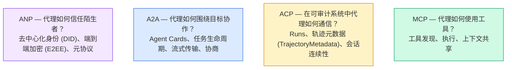

它们不是互相竞争的。它们在不同层次上解决不同的问题。

### MCP（回顾）

`MCP` 在第13阶段中有深入覆盖。快速回顾：`MCP` 标准化了 LLM 如何连接到外部工具和数据源。它是一个客户端-服务器协议，代理（客户端）发现并调用由服务器公开的工具。

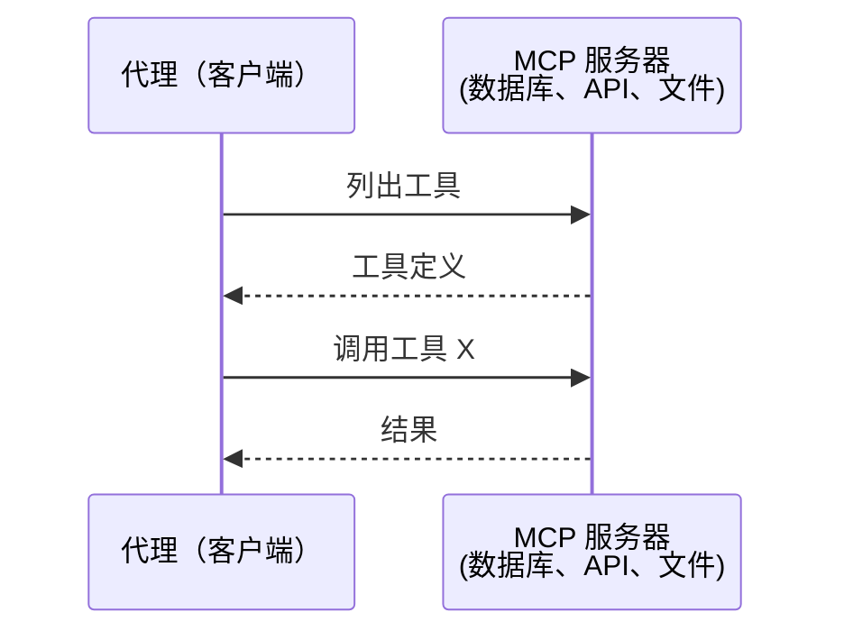

`MCP` 是“代理到工具”的通信。它不能帮助代理相互对话。

### A2A（Agent2Agent 协议）

**创建者：** Google（现纳入 Linux Foundation，名为 `lf.a2a.v1`）  
**规范版本：** 1.0.0  
**问题：** 自主代理如何相互协作、协商并把任务委派给对方？

`A2A` 是用于点对点代理协作的协议。`MCP` 将代理连接到工具，而 `A2A` 将代理连接到其他代理。每个代理在一个众所周知的 URL 发布一个 **Agent Card**，其他代理会发现、协商并向其委派任务。

#### A2A 的工作流程

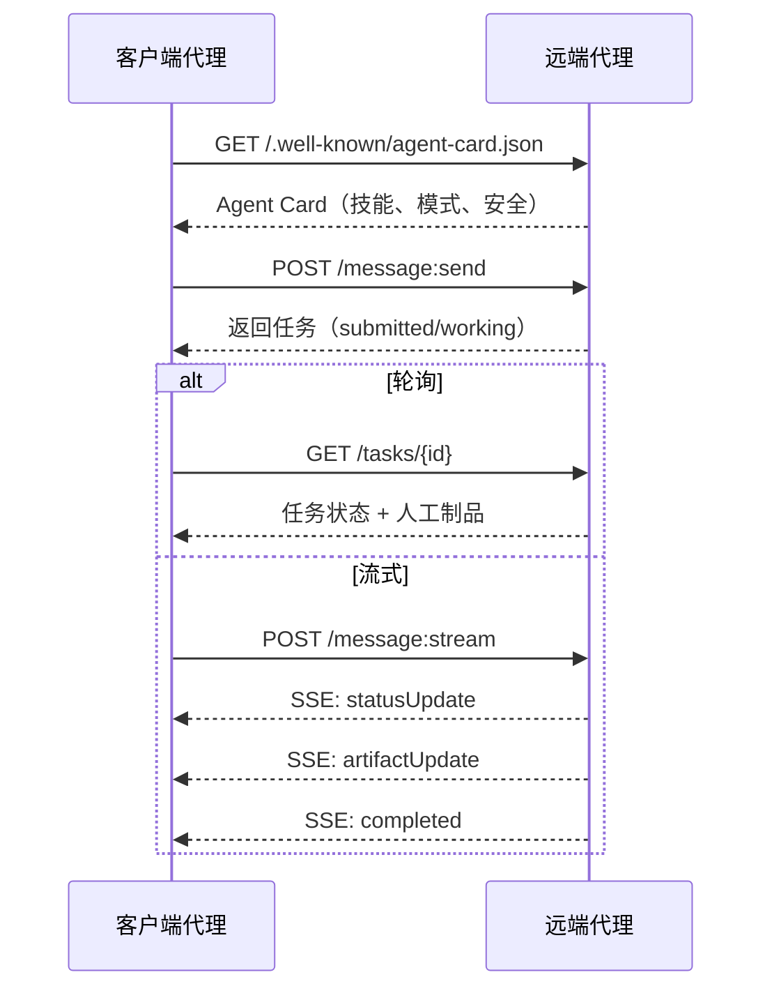

#### 真实的 Agent Card

这是一份在实际中会放在 `GET /.well-known/agent-card.json` 的 A2A Agent Card 示例：

```json
{
  "name": "Research Agent",
  "description": "Searches documentation and summarizes findings",
  "version": "1.0.0",
  "supportedInterfaces": [
    {
      "url": "https://research-agent.example.com/a2a/v1",
      "protocolBinding": "JSONRPC",
      "protocolVersion": "1.0"
    },
    {
      "url": "https://research-agent.example.com/a2a/rest",
      "protocolBinding": "HTTP+JSON",
      "protocolVersion": "1.0"
    }
  ],
  "provider": {
    "organization": "Your Company",
    "url": "https://example.com"
  },
  "capabilities": {
    "streaming": true,
    "pushNotifications": false
  },
  "defaultInputModes": ["text/plain", "application/json"],
  "defaultOutputModes": ["text/plain", "application/json"],
  "skills": [
    {
      "id": "web-research",
      "name": "Web Research",
      "description": "Searches the web and synthesizes findings",
      "tags": ["research", "search", "summarization"],
      "examples": ["Research the latest changes in React 19"]
    },
    {
      "id": "doc-analysis",
      "name": "Documentation Analysis",
      "description": "Reads and analyzes technical documentation",
      "tags": ["docs", "analysis"],
      "inputModes": ["text/plain", "application/pdf"],
      "outputModes": ["application/json"]
    }
  ],
  "securitySchemes": {
    "bearer": {
      "httpAuthSecurityScheme": {
        "scheme": "Bearer",
        "bearerFormat": "JWT"
      }
    }
  },
  "security": [{ "bearer": [] }]
}
```

需要注意的关键点：
- **Skills（技能）** 是代理能做的事情。每个技能都有 ID、标签和支持的输入/输出 MIME 类型。客户端代理据此判断远端代理是否能处理请求。  
- **supportedInterfaces** 列出了多种协议绑定。单个代理可以同时支持 JSON-RPC、REST 和 gRPC。  
- **Security（安全）** 被内置在卡片中。客户端在发起请求前就知道需要什么认证。

#### 任务生命周期

任务是 A2A 的核心工作单元。它们经过定义好的状态迁移：

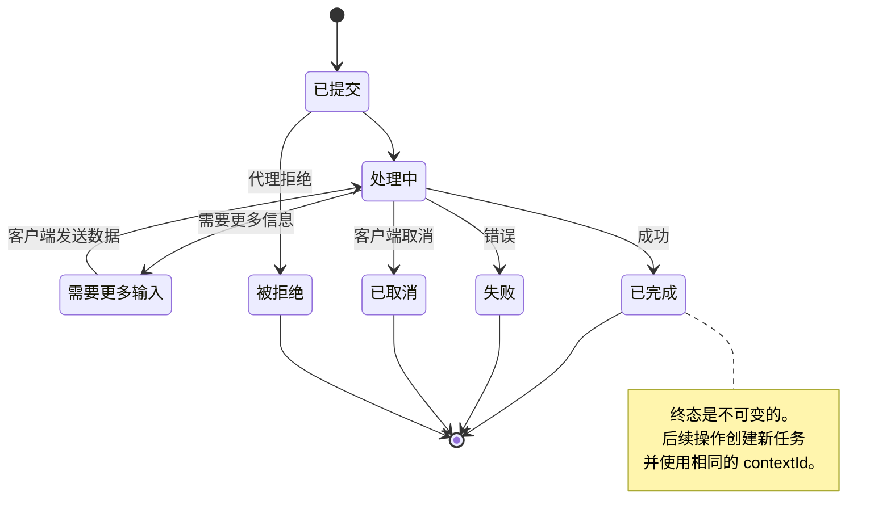

（规范中还定义了 `UNSPECIFIED` 作为哨兵，此处省略。）

| 状态 | 是否终态？ | 含义 |
|---|---:|---|
| `TASK_STATE_SUBMITTED` | 否 | 已确认，尚未处理 |
| `TASK_STATE_WORKING` | 否 | 正在处理 |
| `TASK_STATE_INPUT_REQUIRED` | 否 | 代理需要客户端提供更多信息 |
| `TASK_STATE_AUTH_REQUIRED` | 否 | 需要认证 |
| `TASK_STATE_COMPLETED` | 是 | 成功完成 |
| `TASK_STATE_FAILED` | 是 | 出错完成 |
| `TASK_STATE_CANCELED` | 是 | 在完成前被取消 |
| `TASK_STATE_REJECTED` | 是 | 代理拒绝处理该任务 |

任务达到终态后即不可变。不会有进一步消息。后续操作需要在相同的 `contextId` 下创建新任务。

#### 线格式（Wire Format）

`A2A` 使用 JSON-RPC 2.0。以下是实际消息交换示例：

**客户端发送任务：**
```json
{
  "jsonrpc": "2.0",
  "id": 1,
  "method": "SendMessage",
  "params": {
    "message": {
      "messageId": "msg-001",
      "role": "ROLE_USER",
      "parts": [{ "text": "Research React 19 compiler features" }]
    },
    "configuration": {
      "acceptedOutputModes": ["text/plain", "application/json"],
      "historyLength": 10
    }
  }
}
```

**代理以任务回应：**
```json
{
  "jsonrpc": "2.0",
  "id": 1,
  "result": {
    "task": {
      "id": "task-abc-123",
      "contextId": "ctx-xyz-789",
      "status": {
        "state": "TASK_STATE_COMPLETED",
        "timestamp": "2026-03-27T10:30:00Z"
      },
      "artifacts": [
        {
          "artifactId": "art-001",
          "name": "research-results",
          "parts": [{
            "data": {
              "findings": [
                "React 19 compiler auto-memoizes components",
                "No more manual useMemo/useCallback needed",
                "Compiler runs at build time, not runtime"
              ]
            },
            "mediaType": "application/json"
          }]
        }
      ]
    }
  }
}
```

**通过 SSE 的流式示例：**
```text
POST /message:stream HTTP/1.1
Content-Type: application/json
A2A-Version: 1.0

data: {"task":{"id":"task-123","status":{"state":"TASK_STATE_WORKING"}}}

data: {"statusUpdate":{"taskId":"task-123","status":{"state":"TASK_STATE_WORKING","message":{"role":"ROLE_AGENT","parts":[{"text":"Searching documentation..."}]}}}}

data: {"artifactUpdate":{"taskId":"task-123","artifact":{"artifactId":"art-1","parts":[{"text":"partial findings..."}]},"append":true,"lastChunk":false}}

data: {"statusUpdate":{"taskId":"task-123","status":{"state":"TASK_STATE_COMPLETED"}}}
```

### ACP（Agent Communication Protocol）

**创建者：** IBM / BeeAI  
**规范版本：** 0.2.0（OpenAPI 3.1.1）  
**状态：** 正在并入 A2A（Linux Foundation）  
**问题：** 在保证完整可审计性、会话连续性和轨迹跟踪的前提下，代理如何通信？

`ACP` 是面向企业的协议。与许多摘要所说不同，`ACP` 并不使用 JSON-LD。它是一个通过 OpenAPI 定义的简单 REST/JSON API。其特殊之处在于 **TrajectoryMetadata（轨迹元数据）**：每个代理响应都可以携带详细的推理步骤和工具调用日志。

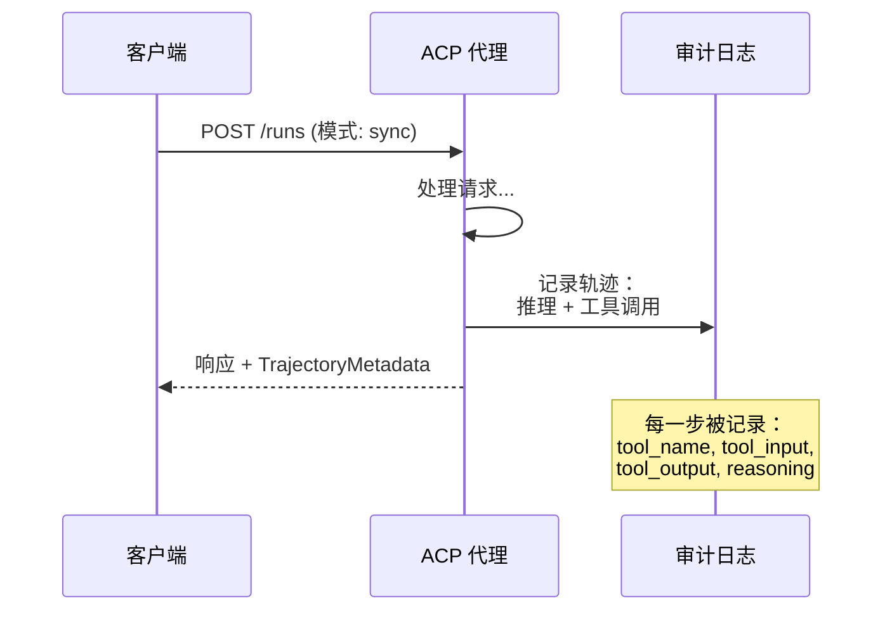

#### ACP 中的代理发现

`ACP` 定义了四种发现方法：

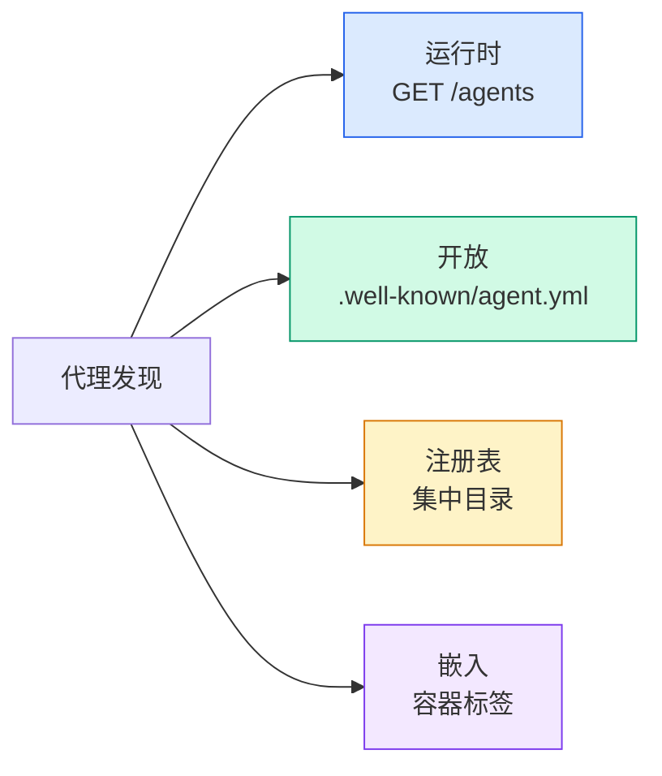

`AgentManifest` 比 A2A 的 Agent Card 更简单：

```json
{
  "name": "summarizer",
  "description": "Summarizes documents with source citations",
  "input_content_types": ["text/plain", "application/pdf"],
  "output_content_types": ["text/plain", "application/json"],
  "metadata": {
    "tags": ["summarization", "RAG"],
    "framework": "BeeAI",
    "capabilities": [
      {
        "name": "Document Summarization",
        "description": "Condenses long documents into key points"
      }
    ],
    "recommended_models": ["llama3.3:70b-instruct-fp16"],
    "license": "Apache-2.0",
    "programming_language": "Python"
  }
}
```

#### Run 生命周期

`ACP` 使用 "Runs" 而非 "Tasks"。一个 Run 是一次代理执行，支持三种模式：

| 模式 | 行为 |
|---|---|
| `sync` | 阻塞。响应包含完整结果。 |
| `async` | 立即返回 202。通过 `GET /runs/{id}` 轮询状态。 |
| `stream` | SSE 流。事件在代理工作时触发。 |

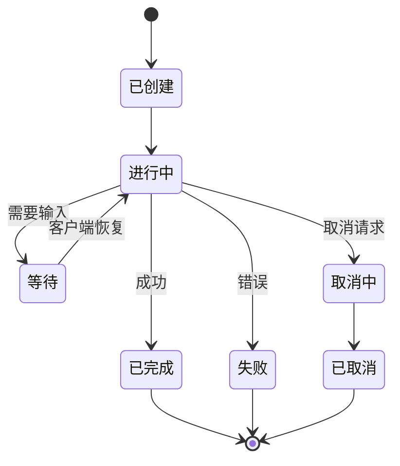

#### 轨迹元数据（TrajectoryMetadata）（审计线）

这是 `ACP` 的关键差异化功能。每个消息部分都可以包含元数据，显示代理实际所做的操作：

```json
{
  "role": "agent/researcher",
  "parts": [
    {
      "content_type": "text/plain",
      "content": "The weather in San Francisco is 72F and sunny.",
      "metadata": {
        "kind": "trajectory",
        "message": "I need to check the weather for this location",
        "tool_name": "weather_api",
        "tool_input": { "location": "San Francisco, CA" },
        "tool_output": { "temperature": 72, "condition": "sunny" }
      }
    }
  ]
}
```

对于受监管行业来说这是金矿。每个答案都带有可证明的推理链：调用了哪些工具、使用了哪些输入、收到了哪些输出。没有黑盒。

`ACP` 还支持用于来源归属的 **CitationMetadata**：

```json
{
  "kind": "citation",
  "start_index": 0,
  "end_index": 47,
  "url": "https://weather.gov/sf",
  "title": "NWS San Francisco Forecast"
}
```

### ANP（Agent Network Protocol）

**创建者：** 开源社区（由 GaoWei Chang 发起）  
**仓库：** [github.com/agent-network-protocol/AgentNetworkProtocol](https://github.com/agent-network-protocol/AgentNetworkProtocol)  
**问题：** 来自不同组织的代理如何在没有中央权威的情况下相互信任？

`ANP` 是去中心化身份协议。它使用 W3C 去中心化标识符（DID）和端到端加密来构建信任。与 A2A 通过已知端点发现代理不同，`ANP` 让代理通过加密证明自己的身份。

`ANP` 有三层：

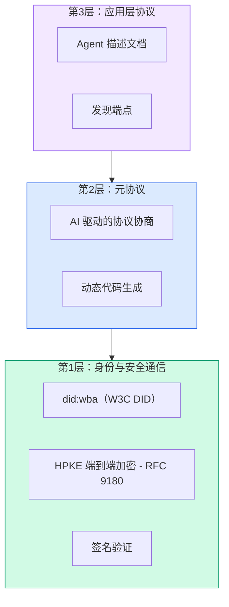

#### DID 文档（真实结构）

`ANP` 使用一种名为 `did:wba`（基于 Web 的代理）的自定义 DID 方法。DID `did:wba:example.com:user:alice` 解析到 `https://example.com/user/alice/did.json`：

```json
{
  "@context": [
    "https://www.w3.org/ns/did/v1",
    "https://w3id.org/security/suites/jws-2020/v1",
    "https://w3id.org/security/suites/secp256k1-2019/v1"
  ],
  "id": "did:wba:example.com:user:alice",
  "verificationMethod": [
    {
      "id": "did:wba:example.com:user:alice#key-1",
      "type": "EcdsaSecp256k1VerificationKey2019",
      "controller": "did:wba:example.com:user:alice",
      "publicKeyJwk": {
        "crv": "secp256k1",
        "x": "NtngWpJUr-rlNNbs0u-Aa8e16OwSJu6UiFf0Rdo1oJ4",
        "y": "qN1jKupJlFsPFc1UkWinqljv4YE0mq_Ickwnjgasvmo",
        "kty": "EC"
      }
    },
    {
      "id": "did:wba:example.com:user:alice#key-x25519-1",
      "type": "X25519KeyAgreementKey2019",
      "controller": "did:wba:example.com:user:alice",
      "publicKeyMultibase": "z9hFgmPVfmBZwRvFEyniQDBkz9LmV7gDEqytWyGZLmDXE"
    }
  ],
  "authentication": [
    "did:wba:example.com:user:alice#key-1"
  ],
  "keyAgreement": [
    "did:wba:example.com:user:alice#key-x25519-1"
  ],
  "humanAuthorization": [
    "did:wba:example.com:user:alice#key-1"
  ],
  "service": [
    {
      "id": "did:wba:example.com:user:alice#agent-description",
      "type": "AgentDescription",
      "serviceEndpoint": "https://example.com/agents/alice/ad.json"
    }
  ]
}
```

关键点：
- 强制执行 **密钥分离**。签名密钥（secp256k1）与加密密钥（X25519）分离。  
- **`humanAuthorization`** 是 `ANP` 的独有项。这些密钥在使用前需要人工授权（生物识别、密码、HSM）。高风险操作（如资金转移）走这条路径。  
- **`keyAgreement`** 密钥用于 HPKE 的端到端加密（RFC 9180）。  
- **service** 部分链接到了 Agent 描述文档。

#### ANP 中的信任机制

`ANP` 并不使用信任网络或 endorsement 图。信任是双边的、按交互实时验证的：

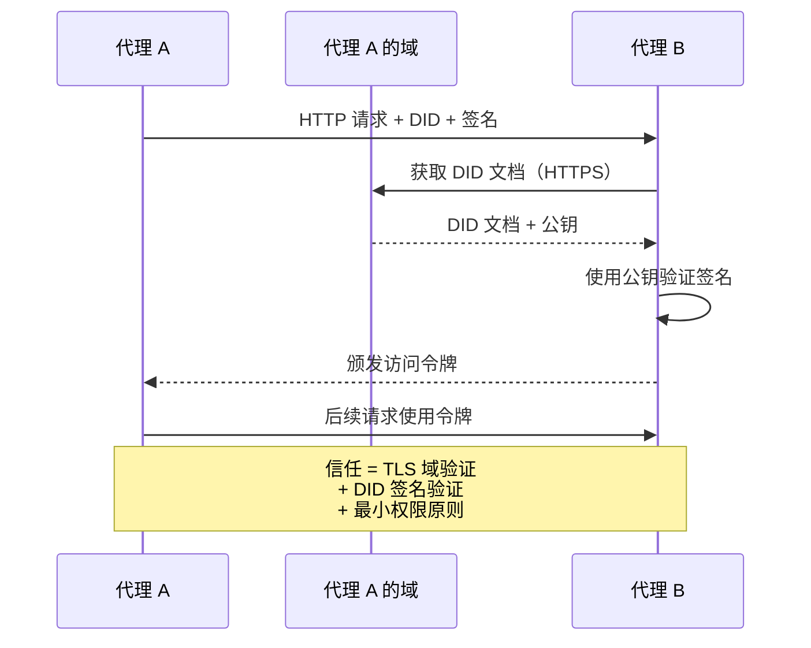

信任来自三个来源：
1. **域级 TLS** 验证 DID 文档的托管域  
2. **DID 密码学签名** 验证代理身份  
3. **最小信任原则** 仅授予最少权限

没有基于流言的信任传播或 PageRank 打分。你直接验证每个代理。

#### 元协议协商（Meta-Protocol Negotiation）

这是 `ANP` 最具创新性的特性。当来自不同生态系统的两个代理相遇时，它们不需要预先约定数据格式。它们用自然语言协商：

```json
{
  "action": "protocolNegotiation",
  "sequenceId": 0,
  "candidateProtocols": "I can communicate using:\n1. JSON-RPC with hotel booking schema\n2. REST with OpenAPI 3.1 spec\n3. Natural language over HTTP",
  "modificationSummary": "Initial proposal",
  "status": "negotiating"
}
```

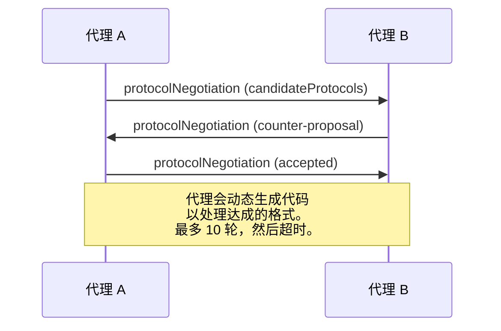

代理往返协商（最多 10 轮）直到达成格式一致，然后动态生成代码来处理该格式。状态值包括：`negotiating`、`rejected`、`accepted`、`timeout`。

这意味着两个此前从未见过面的代理也能在没有预定义共享 schema 的情况下，自己弄清楚如何通信。

### 比较（修正）

|  | MCP | A2A | ACP | ANP |
|---|---|---|---|---|
| **创建者** | Anthropic | Google / Linux Foundation | IBM / BeeAI | 社区 |
| **规范格式** | JSON-RPC | JSON-RPC / REST / gRPC | OpenAPI 3.1 (REST) | JSON-RPC |
| **主要用途** | 代理到工具 | 代理到代理 | 代理到代理 | 代理到代理 |
| **发现** | 工具列举 | `/.well-known/agent-card.json` | `GET /agents`、`/.well-known/agent.yml` | `/.well-known/agent-descriptions`、DID 服务端点 |
| **身份** | 隐式（本地） | 安全方案（OAuth、mTLS） | 服务器级别 | W3C DID（`did:wba`）+ 端到端加密 |
| **审计链** | N/A | 基本（任务历史） | TrajectoryMetadata（工具调用、推理） | 未正式指定 |
| **状态机** | N/A | 9 个任务状态 | 7 个运行状态 | N/A |
| **流式** | N/A | SSE | SSE | 传输无关（transport-agnostic） |
| **独特特性** | 工具 schema | Agent Card + Skills | 轨迹审计链 | 元协议协商 |
| **适用场景** | 工具与数据 | 动态协作 | 受监管行业 | 跨组织信任 |
| **状态** | 稳定 | 稳定（v1.0） | 正在并入 A2A | 积极开发中 |

### 它们如何协同工作

这些协议并不互斥。现实中的企业系统会同时使用多种协议：

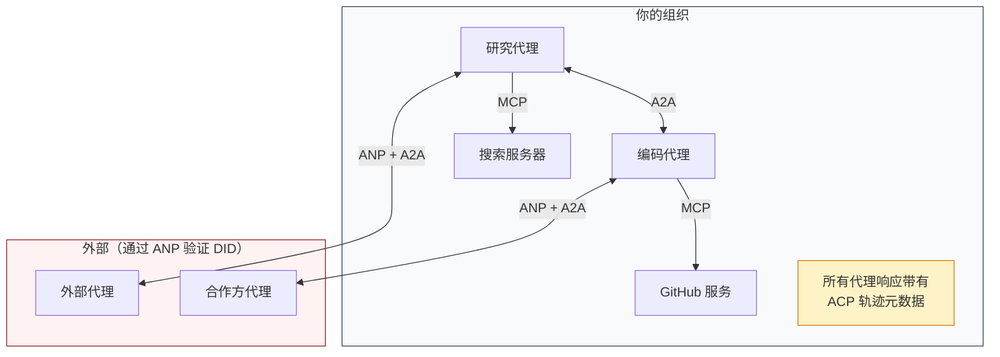

- `MCP` 连接每个代理与其工具  
- `A2A` 处理代理之间的协作（内部与外部）  
- `ACP` 将响应包装上轨迹元数据以便审计  
- `ANP` 为非受控代理提供身份验证

## 构建它

### 步骤 1：核心消息类型

每个多代理系统都始于一种消息格式。我们定义一些类型，映射到真实协议中使用的结构：

```typescript
import crypto from "node:crypto";

type MessageRole = "user" | "agent";

type MessagePart =
  | { kind: "text"; text: string }
  | { kind: "data"; data: unknown; mediaType: string }
  | { kind: "file"; name: string; url: string; mediaType: string };

type TrajectoryEntry = {
  reasoning: string;
  toolName?: string;
  toolInput?: unknown;
  toolOutput?: unknown;
  timestamp: number;
};

type AgentMessage = {
  id: string;
  role: MessageRole;
  parts: MessagePart[];
  trajectory?: TrajectoryEntry[];
  replyTo?: string;
  timestamp: number;
};

function createMessage(
  role: MessageRole,
  parts: MessagePart[],
  replyTo?: string
): AgentMessage {
  return {
    id: crypto.randomUUID(),
    role,
    parts,
    replyTo,
    timestamp: Date.now(),
  };
}

function textMessage(role: MessageRole, text: string): AgentMessage {
  return createMessage(role, [{ kind: "text", text }]);
}
```

注意：`MessagePart` 是多模态的（文本、结构化数据、文件），与真实的 `A2A` 与 `ACP` 规范类似。`TrajectoryEntry` 捕获了推理链，匹配 `ACP` 的 TrajectoryMetadata。

### 步骤 2：A2A Agent Card 与注册表

构建与真实 `A2A` 规范匹配的代理发现机制：

```typescript
type Skill = {
  id: string;
  name: string;
  description: string;
  tags: string[];
  inputModes: string[];
  outputModes: string[];
};

type AgentCard = {
  name: string;
  description: string;
  version: string;
  url: string;
  capabilities: {
    streaming: boolean;
    pushNotifications: boolean;
  };
  defaultInputModes: string[];
  defaultOutputModes: string[];
  skills: Skill[];
};

class AgentRegistry {
  private cards: Map<string, AgentCard> = new Map();

  register(card: AgentCard) {
    this.cards.set(card.name, card);
  }

  discoverBySkillTag(tag: string): AgentCard[] {
    return [...this.cards.values()].filter((card) =>
      card.skills.some((skill) => skill.tags.includes(tag))
    );
  }

  discoverByInputMode(mimeType: string): AgentCard[] {
    return [...this.cards.values()].filter(
      (card) =>
        card.defaultInputModes.includes(mimeType) ||
        card.skills.some((skill) => skill.inputModes.includes(mimeType))
    );
  }

  resolve(name: string): AgentCard | undefined {
    return this.cards.get(name);
  }

  listAll(): AgentCard[] {
    return [...this.cards.values()];
  }
}
```

这比简单的名称到能力映射要丰富得多。你可以按技能标签、按输入 MIME 类型或按名称发现代理，就像真实的 `A2A` 规范支持的那样。

### 步骤 3：A2A 任务生命周期

构建完整的任务状态机：

```typescript
type TaskState =
  | "submitted"
  | "working"
  | "input-required"
  | "auth-required"
  | "completed"
  | "failed"
  | "canceled"
  | "rejected";

const TERMINAL_STATES: TaskState[] = [
  "completed",
  "failed",
  "canceled",
  "rejected",
];

type TaskStatus = {
  state: TaskState;
  message?: AgentMessage;
  timestamp: number;
};

type Artifact = {
  id: string;
  name: string;
  parts: MessagePart[];
};

type Task = {
  id: string;
  contextId: string;
  status: TaskStatus;
  artifacts: Artifact[];
  history: AgentMessage[];
};

type TaskEvent =
  | { kind: "statusUpdate"; taskId: string; status: TaskStatus }
  | {
      kind: "artifactUpdate";
      taskId: string;
      artifact: Artifact;
      append: boolean;
      lastChunk: boolean;
    };

type TaskHandler = (
  task: Task,
  message: AgentMessage
) => AsyncGenerator<TaskEvent>;

class TaskManager {
  private tasks: Map<string, Task> = new Map();
  private handlers: Map<string, TaskHandler> = new Map();
  private listeners: Map<string, ((event: TaskEvent) => void)[]> = new Map();

  registerHandler(agentName: string, handler: TaskHandler) {
    this.handlers.set(agentName, handler);
  }

  subscribe(taskId: string, listener: (event: TaskEvent) => void) {
    const existing = this.listeners.get(taskId) ?? [];
    existing.push(listener);
    this.listeners.set(taskId, existing);
  }

  async sendMessage(
    agentName: string,
    message: AgentMessage,
    contextId?: string
  ): Promise<Task> {
    const handler = this.handlers.get(agentName);
    if (!handler) {
      const task = this.createTask(contextId);
      task.status = {
        state: "rejected",
        timestamp: Date.now(),
        message: textMessage("agent", `No handler for ${agentName}`),
      };
      return task;
    }

    const task = this.createTask(contextId);
    task.history.push(message);
    task.status = { state: "submitted", timestamp: Date.now() };

    this.processTask(task, handler, message).catch((err) => {
      task.status = {
        state: "failed",
        timestamp: Date.now(),
        message: textMessage("agent", String(err)),
      };
    });
    return task;
  }

  getTask(taskId: string): Task | undefined {
    return this.tasks.get(taskId);
  }

  cancelTask(taskId: string): boolean {
    const task = this.tasks.get(taskId);
    if (!task || TERMINAL_STATES.includes(task.status.state)) return false;
    task.status = { state: "canceled", timestamp: Date.now() };
    this.emit(taskId, {
      kind: "statusUpdate",
      taskId,
      status: task.status,
    });
    return true;
  }

  private createTask(contextId?: string): Task {
    const task: Task = {
      id: crypto.randomUUID(),
      contextId: contextId ?? crypto.randomUUID(),
      status: { state: "submitted", timestamp: Date.now() },
      artifacts: [],
      history: [],
    };
    this.tasks.set(task.id, task);
    return task;
  }

  private async processTask(
    task: Task,
    handler: TaskHandler,
    message: AgentMessage
  ) {
    task.status = { state: "working", timestamp: Date.now() };
    this.emit(task.id, {
      kind: "statusUpdate",
      taskId: task.id,
      status: task.status,
    });

    try {
      for await (const event of handler(task, message)) {
        if (TERMINAL_STATES.includes(task.status.state)) break;

        if (event.kind === "statusUpdate") {
          task.status = event.status;
        }
        if (event.kind === "artifactUpdate") {
          const existing = task.artifacts.find(
            (a) => a.id === event.artifact.id
          );
          if (existing && event.append) {
            existing.parts.push(...event.artifact.parts);
          } else {
            task.artifacts.push(event.artifact);
          }
        }
        this.emit(task.id, event);
      }
    } catch (err) {
      task.status = {
        state: "failed",
        timestamp: Date.now(),
        message: textMessage("agent", String(err)),
      };
      this.emit(task.id, {
        kind: "statusUpdate",
        taskId: task.id,
        status: task.status,
      });
    }
  }

  private emit(taskId: string, event: TaskEvent) {
    for (const listener of this.listeners.get(taskId) ?? []) {
      listener(event);
    }
  }
}
```

该实现匹配真实的 `A2A` 任务生命周期：`submitted`、`working`、`input-required`、以及终态。处理器是异步生成器，会产出事件（状态更新和工件块），与 SSE 流式模型相符。

### 步骤 4：ACP 风格的审计轨迹

用轨迹跟踪包装通信：

```typescript
type AuditEntry = {
  runId: string;
  agentName: string;
  input: AgentMessage[];
  output: AgentMessage[];
  trajectory: TrajectoryEntry[];
  status: "created" | "in-progress" | "completed" | "failed" | "awaiting";
  startedAt: number;
  completedAt?: number;
  sessionId?: string;
};

class AuditableRunner {
  private log: AuditEntry[] = [];
  private handlers: Map<
    string,
    (input: AgentMessage[]) => Promise<{
      output: AgentMessage[];
      trajectory: TrajectoryEntry[];
    }>
  > = new Map();

  registerAgent(
    name: string,
    handler: (input: AgentMessage[]) => Promise<{
      output: AgentMessage[];
      trajectory: TrajectoryEntry[];
    }>
  ) {
    this.handlers.set(name, handler);
  }

  async run(
    agentName: string,
    input: AgentMessage[],
    sessionId?: string
  ): Promise<AuditEntry> {
    const entry: AuditEntry = {
      runId: crypto.randomUUID(),
      agentName,
      input: structuredClone(input),
      output: [],
      trajectory: [],
      status: "created",
      startedAt: Date.now(),
      sessionId,
    };
    this.log.push(entry);

    const handler = this.handlers.get(agentName);
    if (!handler) {
      entry.status = "failed";
      return entry;
    }

    entry.status = "in-progress";
    try {
      const result = await handler(input);
      entry.output = structuredClone(result.output);
      entry.trajectory = structuredClone(result.trajectory);
      entry.status = "completed";
      entry.completedAt = Date.now();
    } catch (err) {
      entry.status = "failed";
      entry.trajectory.push({
        reasoning: `Error: ${String(err)}`,
        timestamp: Date.now(),
      });
      entry.completedAt = Date.now();
    }
    return entry;
  }

  getFullAuditLog(): AuditEntry[] {
    return structuredClone(this.log);
  }

  getAuditLogForAgent(agentName: string): AuditEntry[] {
    return structuredClone(
      this.log.filter((e) => e.agentName === agentName)
    );
  }

  getAuditLogForSession(sessionId: string): AuditEntry[] {
    return structuredClone(
      this.log.filter((e) => e.sessionId === sessionId)
    );
  }

  getTrajectoryForRun(runId: string): TrajectoryEntry[] {
    const entry = this.log.find((e) => e.runId === runId);
    return entry ? structuredClone(entry.trajectory) : [];
  }
}
```

每次代理执行都会产生完整的审计条目：输入、输出，以及中间工具调用和推理步骤的完整轨迹。你可以按代理、按会话或按单次运行查询。

### 步骤 5：ANP 风格的身份验证

构建基于 DID 的身份与验证：

```typescript
type VerificationMethod = {
  id: string;
  type: string;
  controller: string;
  publicKeyDer: string;
};

type DIDDocument = {
  id: string;
  verificationMethod: VerificationMethod[];
  authentication: string[];
  keyAgreement: string[];
  humanAuthorization: string[];
  service: { id: string; type: string; serviceEndpoint: string }[];
};

type AgentIdentity = {
  did: string;
  document: DIDDocument;
  privateKey: crypto.KeyObject;
  publicKey: crypto.KeyObject;
};

class IdentityRegistry {
  private documents: Map<string, DIDDocument> = new Map();

  publish(doc: DIDDocument) {
    this.documents.set(doc.id, doc);
  }

  resolve(did: string): DIDDocument | undefined {
    return this.documents.get(did);
  }

  verify(did: string, signature: string, payload: string): boolean {
    const doc = this.documents.get(did);
    if (!doc) return false;

    const authKeyIds = doc.authentication;
    const authKeys = doc.verificationMethod.filter((vm) =>
      authKeyIds.includes(vm.id)
    );

    for (const key of authKeys) {
      const publicKey = crypto.createPublicKey({
        key: Buffer.from(key.publicKeyDer, "base64"),
        format: "der",
        type: "spki",
      });
      const isValid = crypto.verify(
        null,
        Buffer.from(payload),
        publicKey,
        Buffer.from(signature, "hex")
      );
      if (isValid) return true;
    }
    return false;
  }

  requiresHumanAuth(did: string, operationKeyId: string): boolean {
    const doc = this.documents.get(did);
    if (!doc) return false;
    return doc.humanAuthorization.includes(operationKeyId);
  }
}

function createIdentity(domain: string, agentName: string): AgentIdentity {
  const did = `did:wba:${domain}:agent:${agentName}`;
  const { publicKey, privateKey } = crypto.generateKeyPairSync("ed25519");

  const publicKeyDer = publicKey
    .export({ format: "der", type: "spki" })
    .toString("base64");

  const keyId = `${did}#key-1`;
  const encKeyId = `${did}#key-x25519-1`;

  const document: DIDDocument = {
    id: did,
    verificationMethod: [
      {
        id: keyId,
        type: "Ed25519VerificationKey2020",
        controller: did,
        publicKeyDer,
      },
      {
        id: encKeyId,
        type: "X25519KeyAgreementKey2019",
        controller: did,
        publicKeyDer,
      },
    ],
    authentication: [keyId],
    keyAgreement: [encKeyId],
    humanAuthorization: [],
    service: [
      {
        id: `${did}#agent-description`,
        type: "AgentDescription",
        serviceEndpoint: `https://${domain}/agents/${agentName}/ad.json`,
      },
    ],
  };

  return { did, document, privateKey, publicKey };
}

function signPayload(identity: AgentIdentity, payload: string): string {
  return crypto
    .sign(null, Buffer.from(payload), identity.privateKey)
    .toString("hex");
}
```

这模拟了真实的 `ANP` 身份模型：代理具有 DID 文档，文档包含独立的认证、密钥协商和人工授权密钥。`IdentityRegistry` 模拟了 DID 解析（生产环境中会通过 HTTPS 获取代理域名上的 DID 文档）。

### 步骤 6：协议网关

把这四种协议连接到一个统一系统中：

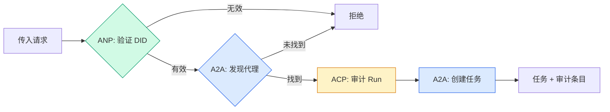

```typescript
class ProtocolGateway {
  private registry: AgentRegistry;
  private taskManager: TaskManager;
  private auditRunner: AuditableRunner;
  private identityRegistry: IdentityRegistry;

  constructor(
    registry: AgentRegistry,
    taskManager: TaskManager,
    auditRunner: AuditableRunner,
    identityRegistry: IdentityRegistry
  ) {
    this.registry = registry;
    this.taskManager = taskManager;
    this.auditRunner = auditRunner;
    this.identityRegistry = identityRegistry;
  }

  async delegateTask(
    fromDid: string,
    signature: string,
    targetAgent: string,
    message: AgentMessage,
    sessionId?: string
  ): Promise<{ task: Task; audit: AuditEntry } | { error: string }> {
    if (!this.identityRegistry.verify(fromDid, signature, message.id)) {
      return { error: "Identity verification failed" };
    }

    const card = this.registry.resolve(targetAgent);
    if (!card) {
      return { error: `Agent ${targetAgent} not found in registry` };
    }

    const audit = await this.auditRunner.run(
      targetAgent,
      [message],
      sessionId
    );
    const task = await this.taskManager.sendMessage(targetAgent, message);

    return { task, audit };
  }

  discoverAndDelegate(
    fromDid: string,
    signature: string,
    skillTag: string,
    message: AgentMessage
  ): Promise<{ task: Task; audit: AuditEntry } | { error: string }> {
    const candidates = this.registry.discoverBySkillTag(skillTag);
    if (candidates.length === 0) {
      return Promise.resolve({
        error: `No agents found with skill tag: ${skillTag}`,
      });
    }
    return this.delegateTask(
      fromDid,
      signature,
      candidates[0].name,
      message
    );
  }
}
```

网关在一次调用中完成四件事：
1. **ANP：** 通过 DID 签名验证调用方身份  
2. **A2A：** 发现目标代理并检查能力  
3. **ACP：** 用带轨迹的审计条目包装执行  
4. **A2A：** 创建一个具有完整生命周期跟踪的任务

### 步骤 7：把一切连起来

```typescript
async function protocolDemo() {
  const registry = new AgentRegistry();
  registry.register({
    name: "researcher",
    description: "Searches and summarizes findings",
    version: "1.0.0",
    url: "https://researcher.local/a2a/v1",
    capabilities: { streaming: true, pushNotifications: false },
    defaultInputModes: ["text/plain"],
    defaultOutputModes: ["text/plain", "application/json"],
    skills: [
      {
        id: "web-research",
        name: "Web Research",
        description: "Searches the web",
        tags: ["research", "search", "summarization"],
        inputModes: ["text/plain"],
        outputModes: ["application/json"],
      },
    ],
  });
  registry.register({
    name: "coder",
    description: "Writes code from specs",
    version: "1.0.0",
    url: "https://coder.local/a2a/v1",
    capabilities: { streaming: false, pushNotifications: false },
    defaultInputModes: ["text/plain", "application/json"],
    defaultOutputModes: ["text/plain"],
    skills: [
      {
        id: "code-gen",
        name: "Code Generation",
        description: "Generates code",
        tags: ["coding", "generation"],
        inputModes: ["text/plain", "application/json"],
        outputModes: ["text/plain"],
      },
    ],
  });

  const taskManager = new TaskManager();
  const auditRunner = new AuditableRunner();

  const researchTrajectory: TrajectoryEntry[] = [];

  taskManager.registerHandler(
    "researcher",
    async function* (task, message) {
      yield {
        kind: "statusUpdate" as const,
        taskId: task.id,
        status: { state: "working" as const, timestamp: Date.now() },
      };

      researchTrajectory.push({
        reasoning: "Searching for React 19 documentation",
        toolName: "web_search",
        toolInput: { query: "React 19 compiler features" },
        toolOutput: {
          results: ["react.dev/blog/react-19", "github.com/react/react"],
        },
        timestamp: Date.now(),
      });

      researchTrajectory.push({
        reasoning: "Extracting key findings from search results",
        toolName: "doc_analysis",
        toolInput: { url: "react.dev/blog/react-19" },
        toolOutput: {
          summary:
            "React 19 compiler auto-memoizes, no manual useMemo needed",
        },
        timestamp: Date.now(),
      });

      yield {
        kind: "artifactUpdate" as const,
        taskId: task.id,
        artifact: {
          id: crypto.randomUUID(),
          name: "research-results",
          parts: [
            {
              kind: "data" as const,
              data: {
                findings: [
                  "React 19 compiler auto-memoizes components",
                  "No more manual useMemo/useCallback needed",
                  "Compiler runs at build time, not runtime",
                ],
                sources: ["react.dev/blog/react-19"],
              },
              mediaType: "application/json",
            },
          ],
        },
        append: false,
        lastChunk: true,
      };

      yield {
        kind: "statusUpdate" as const,
        taskId: task.id,
        status: { state: "completed" as const, timestamp: Date.now() },
      };
    }
  );

  auditRunner.registerAgent("researcher", async () => ({
    output: [
      textMessage("agent", "React 19 compiler auto-memoizes components"),
    ],
    trajectory: researchTrajectory,
  }));

  const identityRegistry = new IdentityRegistry();

  const coderIdentity = createIdentity("coder.local", "coder");
  const researcherIdentity = createIdentity("researcher.local", "researcher");

  identityRegistry.publish(coderIdentity.document);
  identityRegistry.publish(researcherIdentity.document);

  const gateway = new ProtocolGateway(
    registry,
    taskManager,
    auditRunner,
    identityRegistry
  );

  console.log("=== Protocol Demo ===\n");

  console.log("1. Agent Discovery (A2A)");
  const researchAgents = registry.discoverBySkillTag("research");
  console.log(
    `   Found ${researchAgents.length} agent(s):`,
    researchAgents.map((a) => a.name)
  );

  console.log("\n2. Identity Verification (ANP)");
  const message = textMessage("user", "Research React 19 compiler features");
  const signature = signPayload(coderIdentity, message.id);
  const verified = identityRegistry.verify(
    coderIdentity.did,
    signature,
    message.id
  );
  console.log(`   Coder DID: ${coderIdentity.did}`);
  console.log(`   Signature verified: ${verified}`);

  console.log("\n3. Task Delegation (A2A + ACP + ANP)");
  const result = await gateway.delegateTask(
    coderIdentity.did,
    signature,
    "researcher",
    message,
    "session-001"
  );

  if ("error" in result) {
    console.log(`   Error: ${result.error}`);
    return;
  }

  console.log(`   Task ID: ${result.task.id}`);
  console.log(`   Task state: ${result.task.status.state}`);
  console.log(`   Artifacts: ${result.task.artifacts.length}`);

  console.log("\n4. Audit Trail (ACP)");
  console.log(`   Run ID: ${result.audit.runId}`);
  console.log(`   Status: ${result.audit.status}`);
  console.log(`   Trajectory steps: ${result.audit.trajectory.length}`);
  for (const step of result.audit.trajectory) {
    console.log(`     - ${step.reasoning}`);
    if (step.toolName) {
      console.log(`       Tool: ${step.toolName}`);
    }
  }

  console.log("\n5. Full Audit Log");
  const fullLog = auditRunner.getFullAuditLog();
  console.log(`   Total runs: ${fullLog.length}`);
  for (const entry of fullLog) {
    const duration = entry.completedAt
      ? `${entry.completedAt - entry.startedAt}ms`
      : "in-progress";
    console.log(`   ${entry.agentName}: ${entry.status} (${duration})`);
  }
}

protocolDemo().catch((err) => {
  console.error("Protocol demo failed:", err);
  process.exitCode = 1;
});
```

## 会出错的地方

协议解决的是理想路径问题。以下是在生产中会出的问题：

**模式漂移（Schema drift）。** 代理 A 发布 Agent Card 声称输出为 `application/json`，但 JSON 模式在版本之间发生变化。代理 B 解析老模式，得到垃圾数据。修复方法：对技能和输出模式进行版本控制。`A2A` 规范支持在 Agent Card 上定义 `version`。

**状态机违规。** 代理处理器发出 `completed` 事件后，尝试继续发出更多工件。任务已是不可变的。你的代码会静默丢弃更新或抛出异常。修复方法：在发出事件前检查终态。上面的 `TaskManager` 实现通过在终态后 `break` 来强制执行这一点。

**信任解析失败。** 代理 A 尝试验证代理 B 的 DID，但代理 B 的域不可达，无法获取 DID 文档。你是选择开放失败（接受未经验证代理）还是封闭失败（拒绝一切）？`ANP` 建议采用封闭失败并遵循最少信任原则。

**轨迹膨胀。** `ACP` 的轨迹日志功能很强大，但代价高昂。一个复杂代理每次运行调用 200 次工具会生成巨大的审计条目。修复方法：将轨迹记录设为可配置的详细程度。为合规记录工具名和 I/O，非受监管工作可跳过推理步骤。

**发现的群体风暴（thundering herd）。** 50 个代理在启动时同时查询 `GET /agents`。修复方法：对 Agent Card 做带 TTL 的缓存、错开发现间隔，或使用推送注册代替轮询。

## 使用它

### 真实实现

**A2A** 是最成熟的。Google 的 [官方规范](https://github.com/google/A2A) 是开源的（Linux Foundation）。有 Python 与 TypeScript 的 SDK。如果你的代理需要动态发现与协作，从这里开始。

**ACP** 正在并入 A2A。IBM 的 [BeeAI 项目](https://github.com/i-am-bee/acp) 创建了 ACP 作为 REST 优先的替代方案，但轨迹元数据概念正被吸纳到 A2A 生态中。即便使用 A2A 作为传输层，也请采用 ACP 的模式（轨迹日志、运行生命周期）。

**ANP** 最为实验性。[社区仓库](https://github.com/agent-network-protocol/AgentNetworkProtocol) 有 Python SDK（AgentConnect）。元协议协商概念确实新颖。值得关注跨组织代理部署场景。

**MCP** 已在第13阶段覆盖。如果你希望代理使用工具，`MCP` 是标准。

### 选择合适的协议

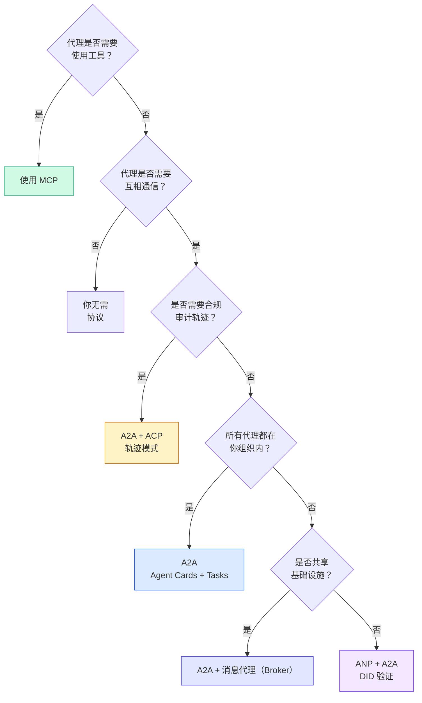

## 上线交付

本课产出：
- `code/main.ts` -- 实现了上述四种协议模式的完整实现  
- `outputs/prompt-protocol-selector.md` -- 一个帮助你为系统选择协议的提示词

## 练习

1. 多跳任务委派。扩展 `TaskManager`，使代理处理器可以将子任务委派给其他代理。研究者收到任务后，将“搜索”和“摘要”子任务分别委派给两个专项代理，等待两者完成，然后将结果合并为自己的工件。

2. 流式审计轨迹。修改 `AuditableRunner` 以支持流式模式。不再等待完整结果，而是在轨迹条目被添加时实时生成 `AuditEntry` 更新。使用一个产出审计快照的异步生成器。

3. DID 轮换。为 `IdentityRegistry` 添加密钥轮换功能。代理应能发布带有更新密钥的新 DID 文档，同时保留 `previousDid` 引用。在宽限期内，验证者应接受来自当前和先前密钥的签名。

4. 协议协商。实现 `ANP` 的元协议概念。两个代理交换 `protocolNegotiation` 消息，列出候选格式（如“我会说 JSON-RPC” vs “我更喜欢 REST”）。最多 3 轮协商后，达成一致或超时。达成的格式决定使用哪个 `TaskManager` 或 `AuditableRunner`。

5. 限速发现。添加一个 `RateLimitedRegistry` 包装器，对 Agent Card 查找进行带 TTL 的缓存并限制每个代理每秒的发现查询数。模拟 100 个代理在启动时相互发现，并测量差异。

## 术语表

| 术语 | 口语描述 | 实际含义 |
|------|----------------|----------------------|
| MCP | “AI 工具的协议” | 一个客户端-服务器协议，供代理发现并使用工具。是代理到工具的，而非代理到代理。 |
| A2A | “Google 的代理协议” | 一个点对点代理协作协议（Linux Foundation）。通过 Agent Cards 发现、9 状态任务生命周期、通过 SSE 流式传输。支持 JSON-RPC、REST 与 gRPC 绑定。 |
| ACP | “企业代理消息” | IBM/BeeAI 的 REST API，用于代理 Runs 并带有 TrajectoryMetadata：每个响应携带完整的推理链和工具调用。正在并入 A2A。 |
| ANP | “去中心化代理身份” | 一个社区协议，使用 `did:wba`（DID）进行密码学身份验证，使用 HPKE 做 E2EE，并提供用于从未见过面的代理之间的 AI 驱动元协议协商。 |
| Agent Card | “代理的名片” | 一个位于 `/.well-known/agent-card.json` 的 JSON 文档，描述技能、支持的 MIME 类型、安全方案与协议绑定。 |
| DID | “去中心化 ID” | W3C 标准，用于在代理自托管域上可加密验证的身份。`ANP` 使用 `did:wba` 方法。 |
| TrajectoryMetadata | “审计凭证” | `ACP` 的机制，用于将推理步骤、工具调用及其输入/输出附加到每个代理响应中。 |
| Meta-protocol | “代理协商如何通信” | `ANP` 的方法：代理使用自然语言动态达成数据格式协议，然后生成代码以处理该格式。 |
| Task | “一项工作” | `A2A` 的有状态对象，用于跟踪从提交到完成的工作。达到终态后不可变。 |

## 深入阅读

- [Google A2A specification](https://github.com/google/A2A) -- 官方规范与 SDK（v1.0.0，Linux Foundation）  
- [IBM/BeeAI ACP specification](https://github.com/i-am-bee/acp) -- OpenAPI 3.1 的 agent runs 与轨迹元数据规范  
- [Agent Network Protocol](https://github.com/agent-network-protocol/AgentNetworkProtocol) -- 基于 DID 的身份、端到端加密与元协议协商  
- [Model Context Protocol docs](https://modelcontextprotocol.io/) -- Anthropic 的 MCP 规范（在第13阶段已覆盖）  
- [W3C Decentralized Identifiers](https://www.w3.org/TR/did-core/) -- 支撑 ANP 的身份标准  
- [RFC 9180 (HPKE)](https://www.rfc-editor.org/rfc/rfc9180) -- `ANP` 用于 E2EE 的加密方案  
- [FIPA Agent Communication Language](http://www.fipa.org/specs/fipa00061/SC00061G.html) -- 现代代理协议的学术前身