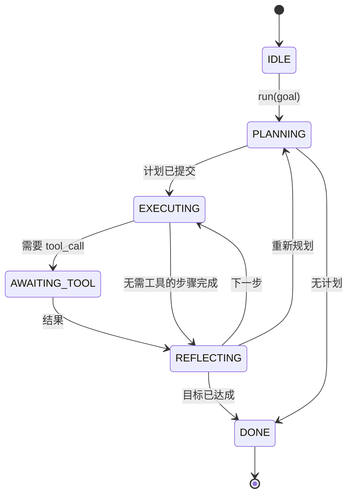

# Agent Harness Loop Contract

> Harness 是代理。模型是协处理器。本课固定了你可以接入任何模型的循环契约。

**Type:** 构建
**Languages:** Python
**Prerequisites:** 第13阶段课程 01-07, 第14阶段课程 01
**Time:** ~90 分钟

## Learning Objectives
- 将代理 harness 循环指定为具有显式转换的确定性状态机。
- 实现十个生命周期钩子主题，供操作员挂接策略、遥测和护栏。
- 定义两个拉取点（pull points），循环在这些点上将控制权让回调用者并在新输入上恢复。
- 在超出预算时强制执行每会话预算（回合数、工具调用、墙钟时间），且不泄露部分状态。
- 发出由十一种事件类型构成的类型化流，以便下游 UI 和追踪器无需直接检查循环即可订阅。

## The frame

一个无人值守运行四十回合的编码代理不是一个聊天循环。它是一个状态机，其节点可以被操作员拦截，其边可以被操作员审计。一旦你把契约写清楚，替换模型、工具或策略不再是一次重构，而是一次注册调用。

本课构建了该契约。我们命名了六个状态、十个钩子主题、两个拉取点、十一种事件类型和一个预算包络。harness 中的其他所有东西（工具注册表、JSON-RPC 传输、调度器、规划器）都可以插入到这个形状中。

## The states

循环有六个状态。五个是活跃的。一个是终止的。



`IDLE` 是唯一合法的入口。`DONE` 是唯一合法的出口。`AWAITING_TOOL` 是唯一会产生拉取点的状态。其它所有转换都是内部的。

该状态机是确定性的。给定相同的事件日志，harness 会重新进入相同状态。该性质使你能够在不重新调用模型的情况下回放会话以进行调试。

## The hook topics

钩子是操作员接入循环的接缝。harness 触发十个主题。每个主题接受任意数量的订阅者。订阅者按注册顺序触发。订阅者可以修改负载、抛出以中止回合，或返回一个哨兵以跳过下一步骤。

```text
before_plan         after_plan
before_tool_call    after_tool_call
before_step         after_step
on_error
on_pause
on_budget_exceeded
on_complete
```

这个形状与 Claude Code、Cursor 和 OpenCode 在 2025 年中期达成的做法相呼应。名称是功能性的，而非品牌化的。一个会阻止 `rm -rf` 的钩子应该放在 `before_tool_call`。一个会发送 OpenTelemetry span 的钩子应该放在 `after_step`。一个会在暂停的会话上恢复的钩子应该放在 `on_pause`。

## The pull points

循环会让出控制两次。第一次是在 `AWAITING_TOOL`，当没有工具结果时无法推进。第二次是在 `on_pause`，当预算耗尽或某个钩子显式请求人工审核时。

拉取点不是异常。它是一次返回。调用者检查 harness 状态，获取 harness 所请求的内容，然后调用 `resume(payload)`。harness 从停止处继续。这与 Python generator 的形状相同。拉取点上的传输方式由你决定。在 TUI 中是按键。在 MCP 上是 `tools/call`。在队列上是任务轮询。

## The event stream

循环在契约的特定点将事件追加到类型化流中。该流是追加式的，订阅者可以从任意偏移回放。实现的十一种事件类型为：

- `session.start` — 在调用 `run(goal)` 时发出一次
- `plan.draft` — 当规划器返回草案计划时发出
- `plan.commit` — 在草案被提交为活动计划后发出
- `step.start` — 在每个执行步骤开始时发出
- `step.end` — 在每个执行步骤结束时发出
- `tool.call` — 当需要工具的步骤将控制权让给调用者时发出
- `tool.result` — 在带有工具结果的 resume 上发出
- `tool.error` — 在 resume 时带有错误或当钩子中止调用时发出
- `budget.warn` — 在达到预算限制时发出
- `session.pause` — 在循环因暂停（预算或钩子）而让出时发出
- `session.complete` — 在循环达到 `DONE` 时发出一次

事件不会复制钩子的负载。钩子是命令式的（修改、终止）。事件是观测性的（记录、发送）。将它们视为正交的。

## The budget envelope

一个会话携带三个限制：回合计数、工具调用计数、墙钟秒数（实际经过时间，以秒为单位）。每个回合将回合数加一。每次工具调用将工具调用计数加一。墙钟在每次状态转换时检查。当任何限制被达到时，循环触发 `on_budget_exceeded`，发出 `budget.warn`，然后在下一个拉取点以预算超出原因转到 `IDLE`。

预算不是一个强制终止开关。它是一次让出（yield）。调用者决定是扩展预算并恢复，还是关闭会话。

## What this lesson does not do

它不调用模型。它不注册真实工具。它不实现传输。这些将在接下来的四课中实现。本课把契约钉死，这样接下来的四课就可以在不重写的情况下插入。

`main.py` 中的确定性规划器只是替身。它返回一个硬编码的三步计划，其中两步需要工具结果。重点是循环，而不是计划。

## How to read the code

`HarnessLoop` 是主类。它保存状态、触发钩子、发出事件。`Budget` 跟踪限制。`Event` 是流上的类型化信封。`HookRegistry` 是分发表。`_transition` 是唯一会改变状态的函数，因此状态机的不变量集中在一处。

自上而下阅读 `main.py`。然后阅读 `code/tests/test_loop.py`。测试钉住了每一个转换和每一个钩子触发顺序。

## Going further

在生产中构建 harness 最难的部分不是状态机，而是让契约可强制执行。契约必须能在规划器热重载后继续生效。它必须能应对返回格式错误 JSON 的工具。它必须能应对在四十回合会话进行到三分之二时在 `before_tool_call` 抛出的钩子。这个课中的测试覆盖了这些故障模式。运行它们。打破它们。添加用例。

下一课加入工具注册表。之后是 JSON-RPC 传输。再之后是调度器。到第 24 课时，这个文件中的循环将针对真实工具运行真实计划，并强制执行真实预算。