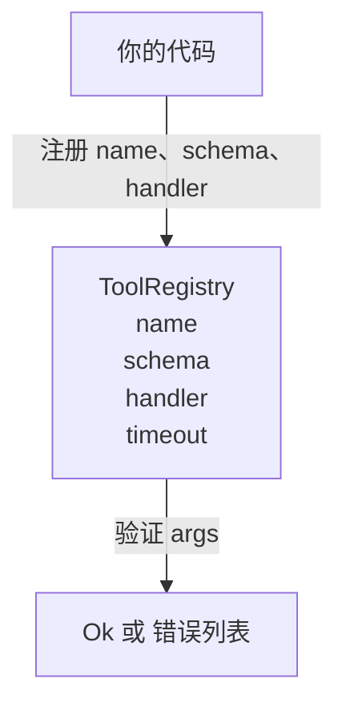

# Tool Registry with Schema Validation

> 一个代理无法验证的工具就是一个代理无法调用的工具。在构建工具之前先构建注册表和模式检查器。

**Type:** 构建  
**Languages:** Python  
**Prerequisites:** 第13阶段 课程 01-07， 第14阶段 课程 01  
**Time:** ~90 分钟

## 学习目标
- 持有一个类型化的注册表，将工具名称 → schema → handler 记录下来，调度器只需询问一次并可以信任该信息。
- 实现 JSON Schema 2020-12 的一个子集，覆盖九成工具调用实际使用的关键字。
- 返回精确的、json-pointer 形状的错误路径，使模型能在一次往返内自我修正。
- 拒绝未显式覆盖（override）的重复注册，因为静默覆盖是生产工具目录漂移的根源。
- 保持验证器为纯函数（无 I/O、无时间依赖、无全局）以便可以在重放日志上重新运行。

## 为什么注册表要先于工具

到 2026 年，编码代理注册的工具比模型能放进单个上下文窗口的数量要多。一个非平凡的工具框架会注册两百个工具，并在任意回合暴露十到四十个工具。注册表是“哪些工具存在”、“它们的参数形状是什么”、“我该调用哪个 handler” 的事实来源。一旦这三个答案被固定，其余的框架部分就可以停止猜测。

我们避免的错误是发布没有 schema 的 handler，或发布有 schema 但没有验证的 handler。这两种情况都很常见，都会把下一层（第 23 课的调度器）变成一个猜谜游戏，唯一的失败模式就是来自 handler 的堆栈追踪。

## 工具记录的样子

```text
ToolRecord
  name        : str          (unique, lowercase alphanumeric and underscore segments separated by dots, e.g., snake_case.segment.case)
  description : str          (one line, shown to the model)
  schema      : dict         (JSON Schema 2020-12 subset)
  handler     : Callable     (async or sync, returns Any)
  idempotent  : bool         (dispatcher uses this for retry decisions)
  timeout_ms  : int          (override per-tool dispatcher default)
```

schema 是验证器触及的唯一字段。handler 对它来说是不可见的。我们有意将它们分离。schema 是数据。handler 是代码。将二者混在一起会诱导你把验证逻辑放到 handler 内部，而这是我们要阻止的错误。

## JSON Schema 2020-12 子集

完整的 2020-12 规范像一篇论文。我们只需要八个关键字。

```text
type           string / number / integer / boolean / object / array / null
properties     map of property name -> schema
required       list of property names
enum           list of allowed primitive values
minLength      integer, applies to strings
maxLength      integer, applies to strings
pattern        ECMA-262-compatible regex, applies to strings
items          schema applied to every array element
```

这已经足够覆盖工具 API 实际需要的内容。我们没有添加的关键字（oneOf、anyOf、allOf、$ref、conditionals）在生产 schema 中是有效的，但会把验证器变成带有环的树遍历器。我们是在构建一个注册表，而不是一个完整的 JSON Schema 引擎。

## Json pointer 错误路径

当验证失败时，验证器返回一个错误列表。每个错误都携带一个指向输入的 json-pointer 路径。指针是以斜杠开头的一系列属性名和数组索引。

```text
{"a": {"b": [1, 2, "x"]}}
                    ^
                    /a/b/2
```

模型比读句子更能读懂错误路径。如果 schema 需要 `args.user.email` 而模型传入了一个整数，错误应为 `/user/email` 并带有 `expected_type: string`。模型会在下一次调用中修复它，而不需要一次自然语言的往返。

## 注册与覆盖

`register(name, schema, handler, **opts)` 默认拒绝重复注册。调用方必须传入 `override=True` 来替换。这是运行时的良好习惯。代码库的两个部分静默注册同一个工具名，是那种在生产环境里要花一周时间才能找到的 bug。

注册表暴露三个读取方法。`get(name)` 返回记录或抛出异常。`validate(name, args)` 返回一个 `Ok` 或一个错误列表。`names()` 以注册顺序返回工具名。

## 验证器是什么与不是什么

它是对 schema 树的单遍递归。它是纯函数。它不调用 handler。它不做类型强制（字符串 `"42"` 不会通过 number 类型的 schema）。它不做静默截断。

它不是安全边界。恶意的 handler 在验证通过后仍然可以表现不良。第 23 课中的调度器会加入超时和沙箱层。注册表只负责形状（shape）。

## 架构图



## 如何阅读代码

`code/main.py` 定义了 `ToolRegistry`、`ToolRecord`、`ValidationError`，以及八个验证函数。验证器根据 `schema["type"]` 分发（或者把带有 `enum` 的 schema 当作无类型的枚举检查）。每个类型验证器要么返回空列表，要么返回 `ValidationError` 列表。顶层的遍历器会在下降过程中合并错误并在前面追加路径段。

`code/tests/test_registry.py` 覆盖了注册、覆盖、验证成功、带路径的验证失败，以及子集内的每个关键字。

## 拓展方向

当该课交付后，你很可能想要添加两个扩展：对本地 definitions 块的 `$ref` 解析，以及 `additionalProperties: false` 以实现严格形状。这两个都很小，并且在工具目录超过五十个时常见。我们为了保持文件可读性把它们留在了课外。

下一课（第22 课）构建将此注册表暴露给模型客户端的 JSON-RPC stdio 传输。之后一课（第23 课）会在其前面包一层带有超时和重试的调度器。