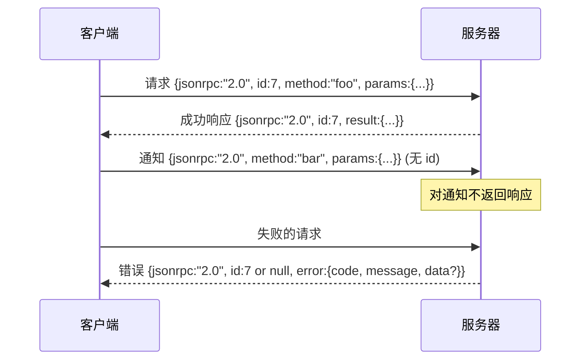

# JSON-RPC 2.0 通过换行分隔的 stdio

> 模型客户端与工具服务器之间的传输是通过 stdio 的 JSON-RPC。手工实现一次可以让你理解每一层帧结构各自承担的职责。

**Type:** 构建  
**Languages:** Python  
**Prerequisites:** 第13阶段 课程01-07，第14阶段 课程01  
**Time:** ~90 分钟

## 学习目标
- 理解将 JSON-RPC 2.0 表示为通过 stdin 和 stdout 的换行分隔 JSON。
- 将五个标准错误代码（-32700、-32600、-32601、-32602、-32603）映射并以正确语义暴露。
- 在不发明新的信封键的情况下区分请求、响应、通知和批处理。
- 在每行只处理一个解析错误，且不污染流的剩余部分。
- 使用 io.BytesIO 构建一个自终止的演示，使本课在不生成子进程的情况下运行。

## 为什么 JSON-RPC 仍然是通用语

到 2026 年，编码代理在一个会话中可能会与大约十二个工具服务器交互。每个服务器是一个独立进程或远程端点。自 2013 年以来，传输格式基本没变。JSON-RPC 2.0 是一份两页的规范。它之所以长存，是因为替代方案（gRPC、每次调用的 HTTP、自定义二进制）都强加了 JSON-RPC 所避免的权衡：它们在流式、批处理或与传输耦合之间做选择。JSON-RPC 在 stdio、套接字、websocket 和 HTTP 之间是对称的，如果客户端和服务器都遵守规范，客户端可以驱动从未见过的服务器。

本课实现 stdio 变体。换行分隔的 JSON。每个请求占一行。每个响应占一行。传输边界是 `\n`。

## 线上的数据格式

存在四种信封形状。两种由客户端发出。两种由服务器发出。



通知没有 `id`。服务器不得对通知作出响应。如果服务器对通知返回了响应，客户端无法将其关联到某个调用点。这个单一规则使得帧结构的数学变得简单。

批处理是由请求或通知组成的 JSON 数组。服务器以响应数组回复，顺序可以任意，但每个非通知条目必须有对应的一条响应。如果批次中的每一项都是通知，服务器不返回任何内容。

## 五个错误代码

```text
-32700  Parse error      JSON could not be parsed
-32600  Invalid Request  Envelope shape is wrong
-32601  Method not found
-32602  Invalid params
-32603  Internal error
```

代码区间 -32000 到 -32099 保留给服务器自定义错误。其他代码由应用定义。本课遵循这五个代码。如果你的处理器抛出异常，传输会将其封装为 -32603，并在 `data.exception` 中包含异常类名。

解析错误有一条特殊规则。响应中的 `id` 为 `null`，因为请求没有被解析到足以提取 id。

## 换行帧与 BytesIO 演示

传输逐行读取。行是包含 `\n` 的字节序列。如果某一行无法解析，传输会写入一个 -32700 响应，`id: null`，然后继续。流不会被污染。下一行会被重新解析。

在本课中，我们用一对 `io.BytesIO` 作为 stdin 和 stdout 包装。服务器读取请求直到 EOF，为每个请求写入响应，然后返回。客户端读取响应。没有进程生成，没有超时。传输行为与真实子进程管道相同，因为 Python 的 `io` 接口提供了相同的 `.readline()` 和 `.write()` 协议。

## 方法分派

传输不知道哪些方法存在。它将调用交给测试框架提供的可调用对象 `handler(method, params)`。handler 返回一个结果或者抛出异常。三类异常会被映射为特定代码。

```text
MethodNotFound -> -32601
InvalidParams  -> -32602
Anything else  -> -32603 with exception name in data
```

传输从不直接看到工具注册表。注册表在 handler 之后。这就是我们想要的分层。传输讲 JSON-RPC，注册表讲工具形态。调度器（第 23 课）把它们连起来。

## 错误时的流行为

```text
client writes              server reads             server writes
---------------            -----------              -------------
{...valid request...}      parses ok                {...response, id matches...}
{...broken json...         parse fails              {id:null, error: -32700}
{...valid request...}      parses ok                {...response, id matches...}
{...missing method...}     invalid envelope         {id:X, error: -32600}
```

一行损坏的 JSON 不会停止循环。缺失 `method` 字段也不会停止循环。handler 抛出异常也不会停止循环。传输会一直读到 EOF。

## 通知与非对称流程

通知是一次性且不等待响应的。测试框架使用通知来发送进度事件、取消信号和日志行。通知是长运行工具在不为每次状态更新做往返的情况下流式输出状态更新的方式。

本课实现了一个出站通知辅助函数 `write_notification`。服务器在请求进行中使用它来发出进度。演示展示了该模式：一个请求到达，handler 发出两条进度通知，然后写入最终响应。

## 如何阅读代码

`code/main.py` 定义了 `StdioTransport`、解析辅助函数（`parse_request`）、三个写入辅助（`write_response`、`write_error`、`write_notification`）以及调度循环 `serve`。错误代码常量位于模块作用域。

`code/tests/test_transport.py` 覆盖了五个错误代码、通知（不写响应）、批处理（数组输入，数组输出，通知被跳过）、损坏的 JSON（解析错误然后继续）以及处理器在调用中间写入通知的非对称流程。

## 拓展阅读

这个传输已足够支撑后续课程。生产环境的传输会增加三件事。一是保留能在转发时持续的关联 id 字段（你的 `id` 已经满足局部需求，但在网格中你还需要外层跟踪 id）。二是取消通道（类似 `$/cancelRequest` 的带有进行中调用 id 的通知）。三是内容类型协商握手，以便相同套接字可以同时说 JSON-RPC 和可流式 HTTP。它们都不改变线上的数据格式，仅仅添加元数据。