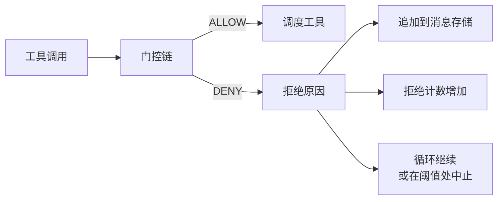
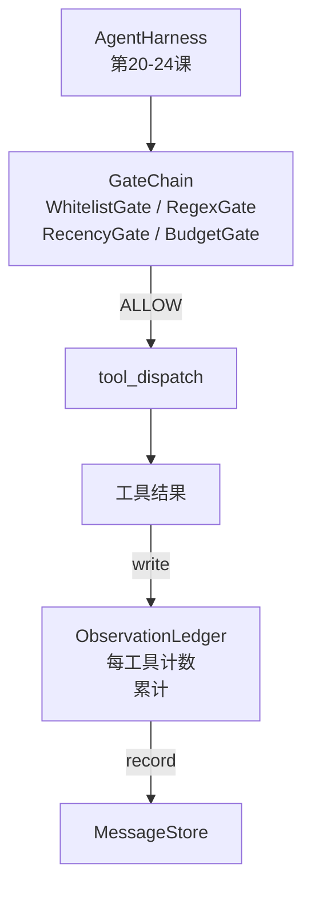

# Capstone Lesson 25: Verification Gates and the Observation Budget

> 没有验证层的代理框架不过是一件披着风衣的愿望。 本课构建决定是否允许工具调用、代理可以看到多少输出以及何时因为读取过多而必须停止循环的确定性门链。该链由若干小型、具名的门和一个跟踪模型已被展示的每 一个标记的观察账本组成。

**Type:** 构建
**Languages:** Python（标准库）
**Prerequisites:** Phase 19 · 20-24 (Track A1: agent loop, tool registry, message store, prompt builder, model router), Phase 14 · 33 (instructions as constraints), Phase 14 · 36 (scope contracts), Phase 14 · 38 (verification gates)
**Time:** ~90 分钟

## 学习目标

- 构建一个带有确定性 `evaluate(call)` 方法的 `VerificationGate` 协议。
- 将预算、时效性、白名单和正则门按短路语义组合成链。
- 通过按工具和回合键控的 `ObservationLedger` 跟踪每一次观察。
- 当累计观察预算将被超出时，拒绝工具调用。
- 揭示下游可观察性可以摄取的结构化 `GateDecision` 记录。

## 问题

当代理框架让模型自由调用工具时，实际使用的第一个小时内会出现三类 bug。

第一类是无限观察。对一个 20 万行的仓库做 grep，会将几十万标记的输出倾倒到下一回合。模型每千字节看到一个匹配，其余上下文被浪费。代价很大，而且代理在任务上变得更糟而不是更好。

第二类是陈旧的时效性。一个长期运行的任务累积了五十次工具调用。模型像读取实时状态一样重新读取第三回合的第一次 read_file。第 47 回合所做的编辑从未出现，因为 prompt builder 将最早的观察先序列化了。

第三类是权限蔓延。一个研究任务从调用 `web_search` 开始，然后不知怎的跑到了 `shell`，因为模型捏造了工具名而框架默认了宽松策略。当任何人查看踪迹时，/tmp 里已经有了垃圾文件，curl 已经对私有 API 发起了请求。

验证门是说“不”的框架组件。它不是模型，也不是裁判。它是 `(call, history, ledger)` 的确定性函数，返回 ALLOW 或 DENY 并附带原因。原因被记录。模型被告知。循环继续或中止。

## 概念



一个门是任何具有 `evaluate(call, ctx) -> GateDecision` 方法的东西。链是一个有序列表。评估在第一个 deny 时短路。顺序很重要：廉价的结构性门在昂贵的计数门之前运行。

本课交付四个门：

- `WhitelistGate`。允许的工具名是显式集合。集合外的一切都被拒绝。这是最便宜的门，首先运行。
- `RegexGate`。工具参数与正则匹配。用于拒绝包含 `rm -rf` 的 shell 调用，或对内部 IP 发起的 HTTP 调用。纯粹基于调用负载。
- `RecencyGate`。模型只看到最近 N 回合的观察。较旧的观察被屏蔽。若某次工具调用的结果会扩展已经过期的观察窗口，则该门拒绝该调用。
- `BudgetGate`。模型在会话中已读取的累计标记数有上限。当账本表明达到上限时，所有进一步的工具调用都被拒绝。

观察账本是簿记。每次成功的工具调用写入一行：工具名、回合、发出的标记数、累计。账本回答两个问题：模型总共看到了多少，以及模型对某个工具看到了多少。BudgetGate 读取第一个。你将作为练习编写的按工具预算门会读取第二个。

## 架构



框架询问链。链要么点头通过要么拒绝。如果点头通过，工具运行，账本递增，结果附加到消息存储。如果被拒绝，模型会以系统消息形式收到拒绝，循环决定是重试还是中止。

## 你将构建的内容

实现为一个单文件 `main.py` 加上测试。

1. `Observation` 和 `ToolCall` dataclasses 定义数据结构。
2. `ObservationLedger` 记录 `(turn, tool, tokens)` 行并提供 `cumulative()` 和 `per_tool(name)`。
3. `GateDecision` 携带 `(allow, reason, gate_name)`。
4. `VerificationGate` 是协议。每个门实现 `evaluate(call, ctx)`。
5. `GateChain` 封装有序列表。它调用每个门，返回第一个拒绝，或在所有门通过时返回允许。
6. 演示运行一个小型合成代理循环。三回合。第三回合触发预算门，循环报告带有非零拒绝计数的干净拒绝。

令牌计数器故意使用了一个愚蠢的 `len(text) // 4` 启发式。此课重点在于门的管道，而不是分词器。在生产环境中可替换为真实的分词器。

## 为何链的顺序很重要

拒绝比允许更便宜。`WhitelistGate` 在 O(1) 哈希查找内运行。`RegexGate` 在 O(pattern * argv) 运行。`RecencyGate` 读取消息存储的一小片段。`BudgetGate` 读取整个账本。你应按成本从低到高排序，这样被拒绝的调用会在做昂贵工作之前短路。

你还应按影响半径排序。白名单是最强的声明：此工具不在合同中。正则门次之：此参数不在合同中。时效性门随后：框架仍然关心，但调用在结构上是合法的。预算门最后，因为按定义它只在其他所有门都通过时触发。

## 与 Track A 其余部分的组合方式

之前的课程给了你循环、工具注册表、消息存储、prompt builder 和 model router。本课在模型与工具之间增加了这一层。第 26 课交付 dispatcher 在门链返回 ALLOW 后将工具调用交给的沙箱。第 27 课交付记录拒绝计数作为质量信号的评估框架。第 28 课将门决策连接到 OpenTelemetry span。第 29 课把这一切拼接成一个可工作的代码代理。

## 运行

```bash
cd phases/19-capstone-projects/25-verification-gates-observation-budget
python3 code/main.py
python3 -m pytest code/tests/ -v
```

演示会逐回合打印包括每个门决策的跟踪并以零退出。测试覆盖账本、各个门的孤立行为、链的短路以及合成循环的端到端行为。