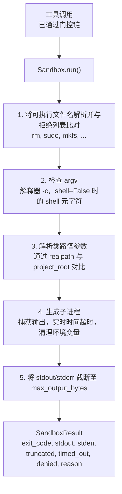
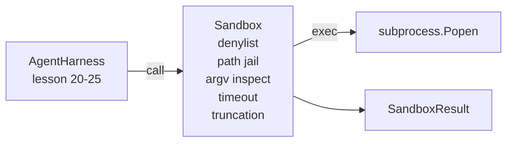

# Capstone Lesson 26: Sandbox Runner with Denylist and Path Jail

> The verification gate decides whether a tool call should run. The sandbox decides what happens when it does. This lesson ships a subprocess runner that refuses dangerous executables, refuses dangerous argv shapes, jails every file path to a project root, truncates oversized output, and kills runaway processes on a wall-clock timeout. It is the second of two layers that sit between the model and the operating system.

**Type:** 构建  
**Languages:** Python (stdlib)  
**Prerequisites:** Phase 19 · 25 (verification gates and observation budget), Phase 14 · 33 (instructions as constraints), Phase 14 · 38 (verification gates)  
**Time:** ~90 分钟

## Learning Objectives

- 构建一个包裹 `subprocess.run` 的 `Sandbox` 类，支持超时、捕获输出和截断。
- 对可执行文件名使用 denylist 拒绝，对 argv 结构使用检验器拒绝。
- 拒绝任何解析后位于声明的 project_root 之外的路径参数。
- 在 shell 模式关闭时拒绝 shell 元字符。
- 返回结构化的 `SandboxResult`，以便下游可观测性和评估框架消费。

## The Problem

A coding agent that can shell out can install backdoors, exfiltrate keys, brick a developer laptop, and rack up a cloud bill in a single turn. The least costly defense is to not give it shell. The second least costly is a sandbox that says no to a precise list of patterns.

Three classes of failure recur in agent traces.

The first is dangerous executables. A model under pressure to fix a path issue will try `sudo`, `chmod -R 777`, `rm -rf`, `mkfs`, `dd`. None of these belong in an agent run. The denylist catches them by name and by alias.

The second is argv tricks. A model that has been told no shell will pipe an attack through an interpreter: `python3 -c "import os; os.system('rm -rf /')"`, `bash -c '...'`, `node -e '...'`, `perl -e '...'`. The sandbox needs to know that any interpreter run with a `-c`-like flag is just a shell call with extra steps.

The third is path escape. The model is told to read `./src/main.py` and instead reads `../../etc/passwd`. The sandbox jails every path argument by resolving it through `os.path.realpath` and asserting the prefix.

The sandbox is not a security boundary in the operating system sense. A determined attacker with code execution can still break out. The sandbox is a development-time guardrail: it makes the common failure modes loud and stops the agent from doing damage out of sheer ineptitude.

## The Concept



sandbox 有四个拒绝轴：按 name、按 argv、按 path、按结构。每个轴都是对调用的纯函数判断，在没有启动子进程前完成。只有在所有轴都通过后，才会启动子进程。

`SandboxResult` 的退出码遵循约定：0 表示成功，非零表示失败，另外还有三个哨兵码用于 denied (-100)、timed_out (-101)，以及截断（退出码为真实的进程退出码，同时设置一个标志）。下游课程读取这个结构化结果而不是解析 stderr。

## Architecture



denylist 是一个 frozenset 的可执行文件基名集合。别名（例如 `/bin/rm`, `/usr/bin/rm`）都会被解析为相同的 basename。argv 检查器识别解释器的形态：任何 argv[0] 是解释器且后续任何参数以 `-c` 或 `-e` 开头的调用都应被拒绝。当调用没有显式请求 shell 时，shell 元字符（`;`, `|`, `&`, `>`, `<`, 反引号，`$()`）会导致拒绝。

路径监狱是最微妙的一部分。sandbox 在构造时接受一个 `project_root`。任何看起来像路径的参数（包含 `/` 或与现有文件匹配）都会通过 `os.path.realpath` 归一化，然后与 project_root 的 realpath 做前缀检查。如果解析后的目标不在根目录下则拒绝。通过检查 realpath（而不是字面路径）可以阻止符号链接越狱尝试（例如项目根下的符号链接指向根目录外）。

## What you will build

实现为 `main.py` 加上一个 tests 目录。

1. `SandboxResult` dataclass：exit_code, stdout, stderr, truncated, timed_out, denied, reason, duration_ms。
2. `SandboxConfig` dataclass：project_root, max_output_bytes, timeout_seconds, denylist, interpreter_block。
3. `Sandbox` 类：`run(argv, *, shell=False, cwd=None)` 返回一个 `SandboxResult`。
4. 内部拒绝辅助函数：`_check_executable_denylist`, `_check_argv_interpreter`, `_check_shell_metachars`, `_check_path_jail`。
5. 输出截断，带清晰的 `truncated` 标志以及在捕获流中加入标记行。
6. 底部演示：一系列合法与对抗性调用，并展示它们的结果。

sandbox 使用 `subprocess.run`，默认 `shell=False` 且 `capture_output=True`。实时时间超时使用 `timeout` 参数；在捕获 `TimeoutExpired` 时，sandbox 会杀死进程组并合成一个 SandboxResult。

## Why this is not a real sandbox

The lesson sandbox does not use namespaces, cgroups, seccomp, gVisor, Firecracker, or any kernel-level isolation. Anything the subprocess can do, the sandbox can do. The protection is structural: the agent is denied the most common dangerous invocations, and the loud refusal goes into observability instead of silently running.

For production agents you layer on top: run inside an unprivileged Docker container, run inside a microVM, drop capabilities, mount the project root read-only and a scratch dir read-write, set ulimit on memory and CPU, scrub the environment to a known-safe whitelist. Lesson 29 does some of this. Operating-system isolation is out of scope for this lesson.

## Running it

```bash
cd phases/19-capstone-projects/26-sandbox-runner-denylist
python3 code/main.py
python3 -m pytest code/tests/ -v
```

演示会创建一个临时目录，将一个干净的文件放入其中，然后运行一系列调用。合法调用会成功。被拒绝的调用会返回 `denied=True` 的 SandboxResult 并给出原因。超时返回 `timed_out=True`。截断会设置 `truncated=True`。演示以 JSON 表格打印结果并以零退出码结束。

## How this composes with the rest of Track A

Lesson 25 produced the gate chain. Lesson 26 is the executor that runs after a gate ALLOW. Lesson 27's eval harness compares the sandbox results against the expected exit-code per task. Lesson 28 emits a `gen_ai.tool.execution` span around each `Sandbox.run` invocation. Lesson 29's end-to-end demo wires a real coding agent through both layers.