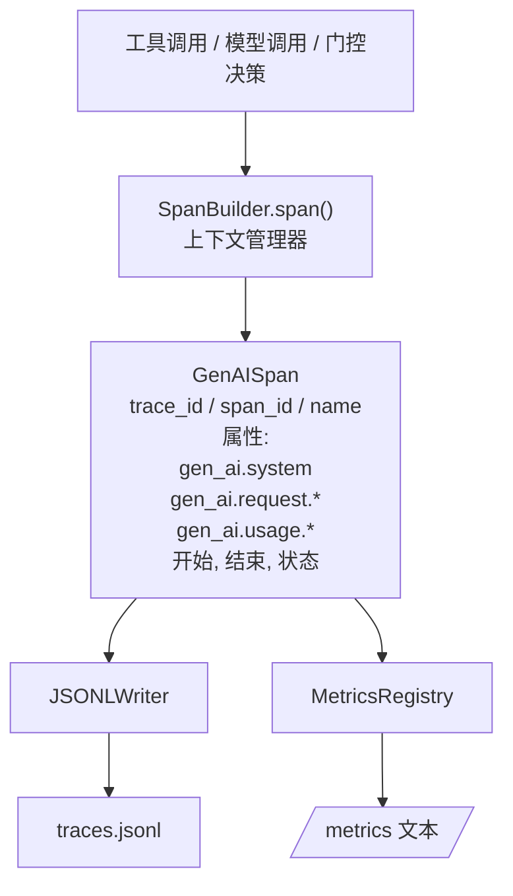
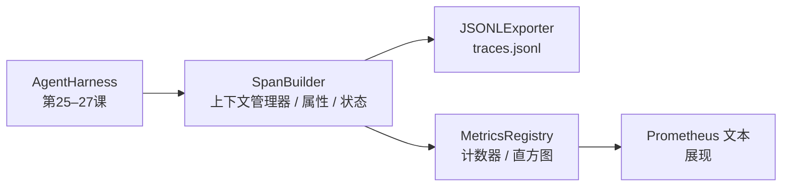

# Capstone Lesson 28: Observability with OTel GenAI Spans and Prometheus Metrics

> An agent harness without observability is a black box that costs money. This lesson hand-rolls a span builder that emits records compliant with the OpenTelemetry GenAI semantic conventions, writes them to a JSON-Lines file one span per line, and exposes counters and histograms in Prometheus text format. The whole thing is stdlib Python and runs offline.

**Type:** 构建  
**Languages:** Python (stdlib)  
**Prerequisites:** Phase 19 · 25（验证门）, Phase 19 · 26（沙盒）, Phase 19 · 27（评估 harness）, Phase 13 · 20（OpenTelemetry GenAI）, Phase 14 · 23（OTel GenAI 约定）  
**Time:** ~90 分钟

## Learning Objectives

- 构建一个符合 OpenTelemetry GenAI 语义约定形状的 span 数据类。
- 实现一个 JSONL 导出器，每行写入一个自包含的 span。
- 构建带标签的计数器和直方图，并以 Prometheus 文本格式导出。
- 将任意可调用对象包装在记录持续时间、状态和异常的 span 上下文管理器中。
- 验证发出的 spans 可通过 `json.loads` 完整地往返序列化，并且匹配规范的结构。

## The Problem

生产环境中的编码 agent 在每个回合会产生三类工件：一次模型调用、一次工具执行、以及一次验证闸决策。没有结构化的遥测，这些记录都没有用。

第一种失败模式是缺失的 trace。周二出了问题，但唯一的记录是 500 行的聊天日志。没有记录哪个工具运行了、多长时间、提示词中有多少 token，或者闸是否拒绝了什么。agent 作者不得不去猜测。

第二种失败模式是不可解析的 trace。harness 写了 spans，但使用了自定义的字段名。Grafana、Honeycomb、Jaeger 或本地 CLI 都无法读取它们。团队栈中现有的任何工具都会被浪费，因为这些 spans 非标准。

第三种失败模式是没有聚合的指标。你可以在 trace 中看到一次慢的工具调用，但你无法回答“过去一小时 read_file 调用的 p95 延迟是多少？”，因为只有 traces 没有指标。

OpenTelemetry GenAI 语义约定正是为此而存在。它们定义了一组标准属性，跨 LLM 框架的 span 发射器都应共享这些属性。如果你的 harness 写入这些属性，任何兼容 OTel 的后端都能读取它们。

## The Concept



每个 harness 中的操作都会产生一个 span。一个 span 有一个 trace id（整个 agent 调用）、一个 span id（本次操作）、一个名称（例如 `gen_ai.chat`、`gen_ai.tool.execution`）、遵循 GenAI 约定的属性集、开始和结束时间，以及一个状态。

GenAI 约定标准化了这些属性键：`gen_ai.system`（哪个提供方，例如 `anthropic`、`openai`）、`gen_ai.request.model`（模型 id）、`gen_ai.request.max_tokens`、`gen_ai.usage.input_tokens`、`gen_ai.usage.output_tokens`、`gen_ai.response.model`、`gen_ai.response.id`、`gen_ai.operation.name`，以及工具特定的键 `gen_ai.tool.name` 和 `gen_ai.tool.call.id`。

导出器写入 JSONL。每行一个 JSON 对象。这是下游工具可以流式处理、grep 和导入的最简单格式。真实的 OTel 导出器会使用 OTLP gRPC；本课的 JSONL 导出器是离线等价物，并且在每台工作站上都以零退出码结束。

指标与 traces 并存。每次工具调用会递增一个计数器：`tools_called_total{tool="read_file"}`。一个直方图记录观测到的延迟：`tool_latency_ms{tool="read_file"}`。两者都会序列化为 Prometheus 文本展示格式，这是基于 pull 的指标的事实标准。

```figure
trace-spans
```

## Architecture



span 构建器是一个小类，提供 `span(name, attrs)` 方法，返回一个上下文管理器。该上下文管理器在进入时记录开始时间，在退出时记录结束时间，若抛出异常则附加异常信息，并将最终的 span 推送给导出器。

指标注册表是两个字典。计数器的结构是 `{(name, frozen_labels): int}`。直方图将原始样本保存在列表中，并在导出时计算 Prometheus 直方图桶。

## What you will build

`main.py` 包含：

1. `GenAISpan` dataclass：trace_id、span_id、parent_span_id、name、attributes、start_unix_nano、end_unix_nano、status、status_message、events。
2. 带有 `span(name, attrs, parent=None)` 上下文管理器的 `SpanBuilder` 类。
3. `JSONLExporter` 类，带有将一条 span 追加为一行的 `export(span)` 方法。
4. `Counter` 和 `Histogram` 类以及 `MetricsRegistry`。
5. 生成文本格式输出的 `prometheus_exposition(registry)`。
6. `wrap_tool_call(name)` 装饰器，用于发出 span 并更新指标。
7. 演示：合成一个完整的 agent 调用（在工具 spans 周围包裹一个 gen_ai.chat span），写入 traces.jsonl，打印 Prometheus 展示，并以零退出码结束。

span id 和 trace id 是 16 字节的十六进制字符串，从 `os.urandom` 生成。这与 OTel 的 W3C trace context 匹配。导出器从不抛出；IO 错误会被暴露，但 harness 会继续运行。

直方图有一组固定桶（OTel 对延迟的默认毫秒桶）：5, 10, 25, 50, 100, 250, 500, 1000, 2500, 5000, 10000, +Inf。样本以列表形式存储；在展示时按需计算每个桶的计数。

## Why hand-rolled instead of opentelemetry-sdk

OTel Python SDK 是一个真实的依赖。它也是几千行代码、用于 OTLP 导出器的多个进程，并且运行时成本会超出本课预算。手工实现版本教授线格式（wire format）。在生产中你会把相同的属性接入真实的 SDK，从而获得 OTLP 导出器、批处理和资源检测等优势。

约定是稳定的。本课发出的线格式在 2030 年仍将可解析，因为 OTel 不会破坏 GenAI 属性名；他们只会添加新的属性。

## How this composes with the rest of Track A

第 25 课产生了闸链。第 26 课产生了沙盒。第 27 课产生了评估 harness。第 28 课让这三者都有可观测性。第 29 课会将端到端演示的每一步都包裹在 spans 中，并在最后打印 Prometheus 文本。

## Running it

```bash
cd phases/19-capstone-projects/28-observability-otel-traces
python3 code/main.py
python3 -m pytest code/tests/ -v
```

演示会在本课的工作目录中生成一个 `traces.jsonl`（在结束时会被清理），然后打印三条 spans 的示例，接着打印计数器和直方图的 Prometheus 展示。测试会验证 spans 能往返序列化、规范的 GenAI 属性存在、计数器正确递增，以及直方图展示包含预期的桶计数。