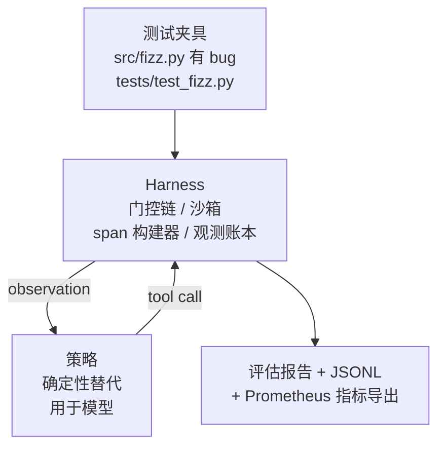
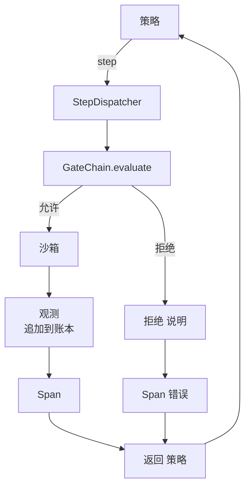

# Capstone Lesson 29: End-to-End Coding Agent on the Harness

> Track A 的收尾。本课将门链、沙箱、评估 harness 与 OTel spans 拼接为一个完整的编码代理，该代理能在一个多文件的 Python 项目中修复一个真实（小型、fixture 级别）的 bug。代理是一个确定性策略，而不是 LLM；这个替换使得课程可复现，并展示出真正有趣的是 harness 本身。合约保持不变：真实模型可以在策略接口处插入。

**Type:** 构建
**Languages:** Python（标准库）
**Prerequisites:** Phase 19 · 25（验证门），Phase 19 · 26（沙箱），Phase 19 · 27（评估框架），Phase 19 · 28（可观测性），Phase 14 · 38（验证门），Phase 14 · 41（针对真实仓库的工作台），Phase 14 · 42（agent 工作台 结业）
**Time:** ~90 分钟

## Learning Objectives

- 将门链、沙箱、评估 harness 与 span 构建器组合成单一的代理循环。
- 实现一个确定性策略，使用 read_file、run_tests 与 write_file 来修复一个 fixture bug。
- 在端到端运行中强制执行全局步骤预算以及观测 token 预算。
- 为完整运行发出完整的 OTel GenAI traces 和 Prometheus 指标。
- 验证代理在少于 12 步内解决 fixture，且在合法工具上没有触发任何门拒绝。

## The Problem

大多数代理演示是孤立运行的：单独的沙箱，单独的评估 harness，单独的 span 发射器。单看各自都不错。把它们组合起来，接缝处的问题就显现了。

门链返回 ALLOW，但沙箱出于门链未预料到的原因拒绝了。评估 harness 记录了通过，但 OTel spans 显示门拒绝了代理声称使用的工具。Prometheus 计数器本应递增一次却被递增了两次。观测预算被超额使用，但代理继续执行，因为预算记录在链条里而沙箱并不知情。

本课是整个 track 的集成测试。代理必须按顺序完成四件事：读取工程、运行测试、根据测试失败定位 bug、写入修复、重新运行测试并停止。每次操作都通过门链。每次工具执行都在沙箱中运行。每一步都被包裹在一个 span 中。评估 harness 在结束时对整个流程打分。

## The Concept



代理的策略是一个状态机。五个状态。

`SURVEY`：代理读取项目清单。下一个状态是 RUN_TESTS。

`RUN_TESTS`：代理运行测试命令。如果测试通过，状态机以成功停止。否则下一个状态是 INSPECT。

`INSPECT`：代理读取失败的源文件。下一个状态是 FIX。

`FIX`：代理写入修正后的文件。下一个状态是 VERIFY。

`VERIFY`：代理再次运行测试命令。如果测试通过，则成功停止。否则以失败停止。

每个状态对应一次工具调用。每次工具调用都通过门链。如果工具调用被拒绝，代理在追踪中报告该拒绝并停止。

fixture 的 bug 是 `fizz.py` 中的一个越界一位（off-by-one）。确定性策略通过正则从测试失败信息中检测出该 bug 并输出修复后的文件。将策略替换为 LLM 并不会改变 harness 的合约。

## Architecture



本课是自包含的。每个先前课程的原语都在 `main.py` 中以最小规模重新实现（gate、sandbox、ledger、span），因此课程可以在不导入其他模块的情况下运行。名称与课程 25-28 完全一致，所以概念映射无歧义。

## What you will build

`main.py` 包含：

1. 最小化的 harness 原语，使用与课程 25-28 相同的名称：`GateChain`、`Sandbox`、`ObservationLedger`、`SpanBuilder`、`MetricsRegistry`。
2. `CodingAgentPolicy` 类：具有五个状态的状态机。
3. `Repo` 辅助：准备一个包含捆绑 buggy fixture 的临时目录。
4. `AgentRun` 类：驱动策略，通过 harness 分发，返回一个 `AgentRunReport`。
5. 一个捆绑 fixture（`fixture_repo/`），包含 src/fizz.py、tests/test_fizz.py，以及用于评估 harness 的 expected/ 目录。
6. 演示：端到端运行策略，打印逐步 trace，断言通过，并打印指标。

捆绑的 fixture 与课程 27 的任务结构相同：一个有 bug 的文件和一个 tests 文件。测试失败信息中包含足够的信息供确定性策略识别修复。真实的 LLM 会完成同样的工作，速度更慢、回想更广，但不会改变 harness 的期望。

## Why the policy is not an LLM

真实的 LLM 需要 API key、网络调用以及不可验证的随机性。harness 才是本课关心的部分。使用确定性策略可以让课程在任何开发者笔记本上运行且无需外部依赖，并允许测试套件断言精确的步骤计数。

本课的策略是 LLM 代理所做事情的严格子集。策略读取仓库、查看失败测试、定位行并生成修复。LLM 在同样的循环中遵循相同的 harness 合约；记账方式完全相同。

## What the demo asserts

端到端演示在退出时断言五件事，测试套件会以程序方式重新断言它们。

- 策略在少于 12 步内解决了 fixture。
- 观测预算从未被超额使用。
- 在合法工具上零门拒绝触发。（代理从未发明一个被拒绝的工具名称。）
- 每一步在 traces.jsonl 中都有对应的 span。
- Prometheus 导出包含 `tools_called_total{tool="read_file"}` 条目和一个 `tool_latency_ms` 直方图。

## How this composes with the rest of Track A

本课是集成。第 25 课实现了门链。第 26 课实现了沙箱。第 27 课实现了评估 harness。第 28 课实现了可观测性。第 29 课证明它们作为一个系统能协同工作。真实的代理 harness 从此处扩展：将确定性策略替换为模型、将捆绑的 fixture 替换为真实仓库任务、将 JSONL 导出替换为 OTLP。

## Running it

```bash
cd phases/19-capstone-projects/29-end-to-end-coding-task-demo
python3 code/main.py
python3 -m pytest code/tests/ -v
```

演示将打印逐步 trace、最终评估报告和 Prometheus 导出。退出码为零。测试覆盖策略状态转换、对合成工具调用的门拒绝、捆绑 fixture 的端到端运行以及步骤预算不变量。