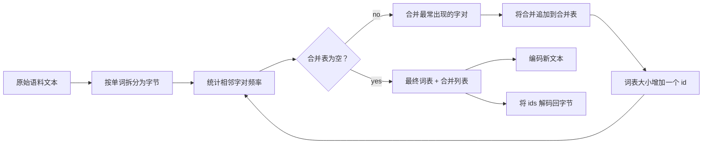
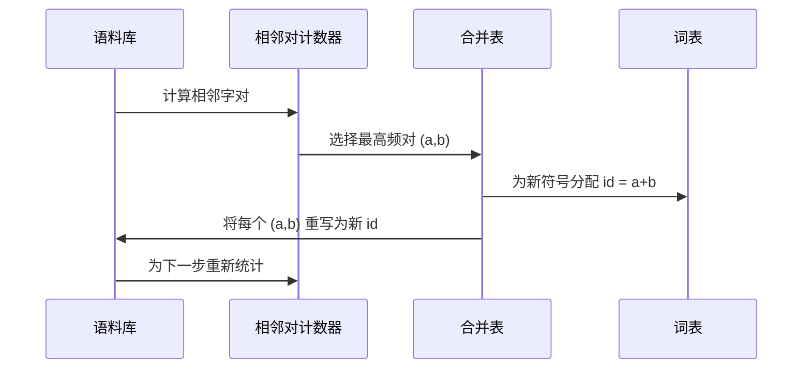

# 从头实现 BPE 分词器

> 字节输入，ids 输出，再从 ids 精确还原回相同的字节。构建每个现代文本模型仍然以其为起点的分词器。

**Type:** 构建  
**Languages:** Python  
**Prerequisites:** 第04阶段课程， 第07阶段 Transformer 课程  
**Time:** ~90 分钟

## 学习目标
- 通过反复合并训练语料中出现频率最高的相邻符号对，从原始文本语料中训练字节对编码（Byte-Pair Encoding, BPE）词表。
- 实现一个确定性的合并表并将其应用到新文本以生成子词 ids 流。
- 对任意 UTF-8 输入实现无信息损失的往返（编码为 ids 并解码回原始字节）。
- 预留并保护特殊标记（`<|endoftext|>`、`<|pad|>`），使它们在训练和解码过程中保持不变。
- 说明为什么字节级字母表是通用分词器的合适底层。

## 框架概述

语言模型从不直接“看到”文本，它看到的是整数。从字符串到整数列表再回到字符串的映射就是分词器。如果这层做错了，训练过程中的每一条损失曲线都在度量错误的东西。

面向通用文本模型的主流子词分词器族是字节对编码（BPE）。思想很简单：从已知字母表开始。找到训练语料中出现频率最高的相邻符号对，将其合并为一个新符号。重复该过程直到词表达到目标大小。对新文本的编码使用相同的合并列表并按同一顺序应用。

我们将构建字节级变体。字母表是 256 个原始字节（0x00 到 0xFF），而不是 Unicode 码点。这个选择使分词器能够处理任意 UTF-8 输入而不必退回到未知标记。

## 流水线

训练端和推理端共享同一合并表。这种共享就是契约。如果在推理时改变合并顺序，得到的 ids 流就会不同。

## 字节字母表

前 256 个 id 保留给原始字节 0x00 到 0xFF。这保证了在任何合并发生之前，每个输入字符串都可以在词表中表示。字节块之后我们再保留一小段 id 用于特殊标记。训练循环绝不会将这些 id 作为合并目标，因为我们将它们完全排除在预分词流之外。

预分词器在训练看到数据之前按空白和标点边界拆分语料。如果不进行该拆分，BPE 合并步骤会很乐意学习跨词边界的合并，词表会被常见短语占满。通过拆分，合并限制在单词内部，从而结果具有更好的泛化性。

## 训练循环

每个训练步骤循环执行三件事。遍历语料中的每个单词并统计当前符号序列中每个相邻对出现的次数，计数按单词出现频率加权。选择计数最高的对。将该对的每个出现位置重写为一个单一的新符号，其 id 是词表中的下一个空闲槽。然后记录该合并。

每一步的代价与语料表示为符号序列列表的大小线性相关。对于一百万个单词和目标词表一万 id 的情况，由于合并后符号序列会变短，循环在几秒内完成。

## 对新文本的编码

推理不再调用合并计数器。它按学习时的顺序应用合并表。对于一个新单词，编码器从字节拆分开始。它在当前序列中扫描最低排序（在表中最先）的可应用合并，并执行该合并，然后重新扫描。循环在合并表中没有合并可应用到当前序列时结束。

按排序应用合并是使编码确定性并且与训练行为匹配的关键属性。最先学习到的合并位于表顶，最先被应用。如果两个合并都可以在同一位置应用，排序靠前的合并胜出。

## 特殊标记

特殊标记是字节流绝不会产生的 id。我们通过手工保留它们。两个标记足以满足本课需求。

- `<|endoftext|>` 在预训练期间分隔文档。它告诉模型“这里开始一个新文档，不要让之前文档的上下文泄漏进来。”
- `<|pad|>` 用于填充短序列，使批次成为矩形张量。训练时通过损失掩码屏蔽它。

编码器接受一个标志以允许输入中包含特殊标记。该标志关闭时，字符串 `<|endoftext|>` 和 `<|pad|>` 会被按拼写对应的字节来分词。当标志开启时，字面字符串会被映射到它们保留的 id，并且不参与任何合并。

## 往返保证

编码再解码必须精确返回输入字节。解码器按顺序连接每个 id 的字节展开。由于每个 id 要么是原始字节，要么是两个先前已知 id 的串联，递归展开最终总会归结为原始字节。然后解码返回这些字节所表示的 UTF-8 字符串。

本课的测试套件会在一个未见过的句子、一个包含 Unicode 表情符号的句子，以及一个包含字面 `<|endoftext|>` 标记的句子上检验该属性。

## 本课不做的事

本课不构建像最大规模生产分词器那样由正则驱动的预分词器。这里的预分词器只是一个按空白和标点的小拆分器。它足以在一个小语料上产生合理的合并，并且与本课程链的其余部分保持契约。下一课会将分词器视为黑盒，并在其之上构建滑动窗口数据集。

本课不并行化相邻对计数器。在几千词的语料上用 Python 循环运行在不到一秒内完成。对于更大的语料，明显的做法是并行地对每个单词计数相邻对然后归约。

## 如何阅读代码

`main.py` 定义了四个对象。`BPETokenizer` 保存词表、合并表和特殊标记表。`train` 是训练循环。`encode` 是推理路径。`decode` 是字节连接。文件底部的演示在内置语料上训练一个小型分词器，编码一个保留的句子，将 ids 解码回字节并打印两者。`code/tests/test_bpe.py` 中的测试固定了往返属性、特殊标记保留和合并排序。

运行演示。然后将演示中的目标词表大小从 300 改为 600，观察保留句子的编码长度如何下降。那条曲线就是 BPE 的压缩曲线。