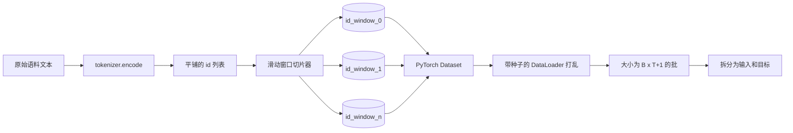
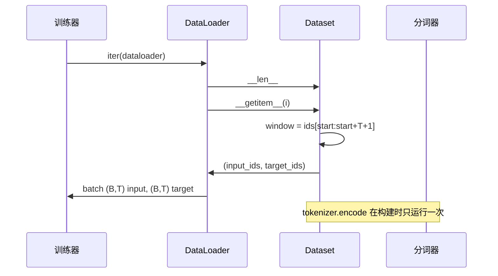

# Tokenized Dataset with Sliding Window

> A pretraining run is a function from token ids to gradients. This lesson builds the conveyor that feeds the ids in.

**Type:** 构建
**Languages:** Python
**Prerequisites:** 第04阶段课程, 第07阶段 transformer 课程, 本阶段的第30课
**Time:** ~90 分钟

## Learning Objectives
- 将原始语料一次性通过分词器（tokenizer）转换为一个标记 id 的流。
- 以可配置的重叠步幅（stride）将 id 流切成固定长度的窗口。
- 构建一个返回下一词预测输入和目标张量的 PyTorch Dataset。
- 使用按 epoch 设定种子的确定性打乱将 Dataset 包装进 DataLoader。
- 理解步幅、冗余与有效数据集大小之间的权衡。

## The frame

一次预训练运行每次读取一批 token ids 并更新模型。每个 batch 的形状由训练契约固定。对于因果语言模型，batch 包含 `(B, T)` 的输入 ids 和 `(B, T)` 的目标 ids，其中目标是输入左移一个位置。数据管道的任务是根据这个契约按需从可能为数 GB 的原始文本语料中以确定性和可复现的方式产生这些数据。

本课构建该管道。上节课的分词器将文本变为一长串平铺的 id。滑动窗口将该 id 列表切分成训练样本。自定义的 Dataset 将样本以张量形式暴露。DataLoader 将它们批处理并使用已知种子进行打乱。

## The shape contract

因果 LM 接受形状为 `(B, T)` 的 ids，其中 B 为批大小，T 为上下文长度。位置 t 的目标是位置 t+1 的输入。这意味着每个训练样本覆盖 `T+1` 个原始 id。窗口步幅控制相邻样本之间的重叠量。

切片器绝不会与语料边界重叠。如果最后一个窗口没有足够的 id 填满 `T+1` 个位置，切片器会丢弃它。也可以用 `<|pad|>` 去填充尾部，但那会使损失掩码更复杂。本课中选择丢弃。

## Why a sliding window

预训练语料是一个很长的 id 流。如果模型只看到不重叠的窗口，每个训练样本都会教模型相同的 T 边界。调整步幅会移动这些边界，使模型看到更多样化的下一个 token 预测任务。

步幅为 `T` 时产生不重叠窗口。步幅为 `T // 2` 时产生 50% 重叠并使有效数据集翻倍。步幅为 `1` 时产生最大重叠并使数据集增加至 T 倍。代价是每个 epoch 需要更多计算，收益是边界多样性更高。大多数预训练运行使用与上下文长度相等的步幅，因为语料通常远大于模型在一个 epoch 内能处理的量，此时边界多样性的论点较弱。

## The Dataset class

一个 PyTorch Dataset 需要两个方法。`__len__` 返回样本数。`__getitem__` 返回单个样本，作为一对张量。我们的 Dataset 存储编码后的 id 流和步幅。索引时按需计算窗口的起始位置，所以内存开销只是一份 id 流副本，与步幅产生的样本数量无关。

那个“左移一位”的操作在 `__getitem__` 内部完成。Dataset 返回 `(input, target)`，其中 `input = window[:-1]`，`target = window[1:]`。两者都是 PyTorch 的 long 张量。训练循环将它们作为真实标签来对待。

## Deterministic shuffle

一个设置了 `shuffle=True` 的 DataLoader 使用 PyTorch 的随机数生成器。通过传入一个在每个 epoch 上按种子初始化的 `torch.Generator`，我们可以在重启运行时得到相同的打乱顺序。当你想比较仅在单一超参上有差别的两个运行时，这一点非常重要。没有固定种子，两个运行会以不同顺序看到数据，从而使损失曲线因与改动无关的原因而分歧。

本课中的种子契约很简单。`epoch_seed = base_seed + epoch_index`。base seed 在构造时传入。epoch index 在每个 epoch 开始时由训练器递增。使用相同 base seed 的重跑会在每个 epoch 中始终看到相同的顺序。

## Batch sampler

PyTorch 的默认 sampler 无放回地均匀随机挑选索引。这正是我们对预训练想要的行为。对小数据集的微调来说契约相同。DataLoader 通过调用 `__getitem__` B 次并将结果堆叠来组装一个 batch。由于每个样本按构造具有相同长度，因此不需要填充逻辑。

为简化演示，本课保持 `num_workers=0`。在生产运行中，workers 会并行化 `__getitem__` 调用。对于我们的管道来说这在大多数情况下是无操作的，因为工作只是对内存中张量的切片，但相同的 Dataset API 可以很好地支持 workers。

## Counting examples

对于长度为 `N` 的 id 流、上下文长度 `T` 和步幅 `S`，样本数量为 `max(0, 1 + (N - (T + 1)) // S)`。本课将该计算作为 Dataset 的静态方法暴露，以便训练器在不迭代的情况下计算每个 epoch 的总步骤数。

## What this lesson does not do

它不从磁盘流式读取。语料在内存中被完全编码并作为单个张量保存。对于几百万个 id 的语料，这远小于一百 MB，并且适合本课。磁盘流式是一个单独的关注点，可以通过替换存储方式来插入，但保持 Dataset 契约不变。

它不处理多个文档。语料被视为一个连续的 id 流。当语料由多个文档构成时，可在构建语料时插入 `<|endoftext|>` id 来编码下一文档边界。模型会学习在边界处的预测。

## How to read the code

`main.py` 定义了两个类和一个辅助函数。`SlidingWindowDataset` 是 PyTorch 的 Dataset。`make_dataloader` 返回一个配置好的带种子生成器的 DataLoader。`_encode_corpus_to_ids` 是那次分词器的一次性调用。文件底部的演示在进程内构建了一个小分词器，对内置语料进行编码，构造 dataset 和 dataloader，打印一个 batch，并断言形状契约。`code/tests/test_dataset.py` 中的测试固定了窗口计数公式、左移一位属性、确定性打乱以及步幅权衡。

运行演示。然后将上下文长度从 16 改为 32，观察每个 epoch 的样本数量如何下降。那个数字就是你每个 epoch 的步骤预算。