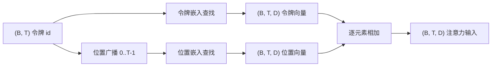
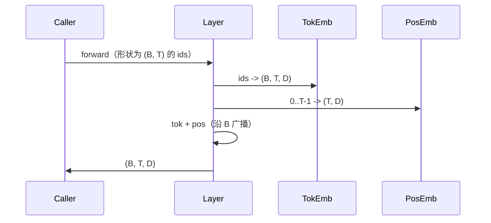

# Token and Positional Embeddings

> Ids are integers. The model wants vectors. Two lookup tables sit between them, and the choice of the positional one shapes what the model can learn.

**Type:** 构建
**Languages:** Python
**Prerequisites:** Phase 04 课程、Phase 07 Transformer 课程、本阶段的第 30 和第 31 课
**Time:** ~90 分钟

## Learning Objectives
- 构建一个将词表 id 映射到稠密向量的令牌嵌入查找表（token-embedding）。
- 构建一个按位置索引的可学习位置嵌入（learned positional embedding）查找表。
- 构建一个按位置索引、无参数的固定正弦位置嵌入（sinusoidal positional embedding）。
- 将令牌嵌入与位置嵌入合成成 transformer block 的单一输入。
- 对比可学习位置嵌入与正弦位置嵌入在长度泛化和参数量上的差异。

## The frame

模型与令牌 id 的第一次接触是对令牌嵌入矩阵的一行查找。该矩阵每个词表 id 一行、每个模型维度一列，shape 为 (V, D)。查找返回一个向量，其余模型部分将其视为该 id 的含义。在反向传播时，仅更新前向过程中被使用到的那些行。随着训练进行，这些行的几何结构会学会用方向来编码相似性。

仅有令牌 id 并不包含位置信息。模型需要第二个信号来告诉它位置 1 不同于位置 17。两种主要选择是可学习的位置嵌入（第二个查找表，每个位置一行）和固定的正弦位置嵌入（无参数的数学公式）。选择会带来不同后果：可学习表是一个参数，且受模型训练时的最大上下文长度限制；理论上正弦表无参数且公式可扩展到任意位置，但本课中的 `SinusoidalPositionalEmbedding` 在构造时预计算了一个固定表，大小为 `max_context_length`，并且其 `forward` 会在超出该界限时抛错；因此在这里两个模块都强制了最大上下文长度。即便位置表足够大以支持更长输入，模型在超过训练长度时仍可能表现不佳。

本课会构建两种位置嵌入，并将它们与令牌嵌入合成，为下一课的注意力模块提供输入。

## The shape contract

嵌入阶段的输入是形状为 `(B, T)` 的令牌 id 批次。输出是形状为 `(B, T, D)` 的张量，其中 `D` 是模型维度。每个 batch 元素具有相同的上下文长度 `T`。每个位置具有相同的向量维度 `D`。



合成采用逐元素相加，而不是拼接。相加可以在整个网络中保持 `D` 不变，并允许模型在每个特征上决定令牌含义或位置信息在各层中哪个占主导。

## The token embedding matrix

令牌嵌入是一个形状为 `(V, D)` 的参数张量，其中 `V` 是词表大小。PyTorch 以 `nn.Embedding(V, D)` 的形式暴露它。初始化时条目通常从一个均值为 0、标准差约为 0.02 的小高斯分布中采样（这是 transformer 规模模型的传统做法）。具体的初始化细节不如在不同运行间保持一致重要。

前向仅是一次索引操作。PyTorch 将 `(B, T)` 的 int64 id 映射为 `(B, T, D)` 的浮点数，通过聚合行来实现。反向传播仅在前向过程中访问到的行上累积梯度。在某一步中若两个行从未出现在 batch 中，它们在该步的梯度为零。

一个细微之处：令牌嵌入与模型末尾的输出投影常常权重共享（weight tying）。在这种情况下，每次反向传播都会通过输出侧触及嵌入的每一行。本课展示了它们作为独立模块，但在完整模型中同一矩阵可以同时扮演这两种角色。

## The learned positional embedding

可学习的位置嵌入是第二个 `nn.Embedding`，形状为 `(max_context_length, D)`。查找以位置 id 0, 1, 2, ..., T-1 为键。前向会把该位置向量在 batch 维度上广播。

可学习表的缺点是，如果模型只训练到位置 T-1，就无法查询位置 T——对应的行不存在。采用此方案的生产级解码器模型会把最大上下文长度写入架构，并拒绝处理更长的输入。

## The sinusoidal positional embedding

正弦位置嵌入是一个从位置到向量的函数。位置 `p` 和维度特征 `i` 产生：

```python
angle = p / (10000 ** (2 * (i // 2) / D))
emb[p, 2k]     = sin(angle)
emb[p, 2k + 1] = cos(angle)
```

该函数无参数。每个位置有唯一的向量。波长在特征维度上按几何级数变化，所以低维度编码的是粗糙的位置，高维度编码的是精细的位置。

选择 `sin` 和 `cos` 的一个重要属性是，位置 `p + k` 的向量是位置 `p` 向量的线性函数。这为注意力层学习相对位移提供了一条容易的路径。模型不需要一个独立的参数来表示“向后看五个令牌”。

本课在构造时一次性计算完整的正弦表，并在前向时对其进行索引。

## The composition

输入流水线按顺序做三件事。读取令牌 id。查找令牌向量。加上位置向量。返回和。



相加步骤中的广播会将形状为 `(T, D)` 的位置张量在 batch 维度上复制。PyTorch 会自动处理这一步，因为位置张量在 unsqueeze 后具有形状 `(1, T, D)`。

## Contrastive analysis

本课在相同输入上运行两种变体并打印两个诊断指标。

第一个是参数计数。可学习变体在令牌嵌入之外增加了 `max_context_length * D` 个参数。正弦变体增加为零。

第二个是相邻位置嵌入之间的余弦相似度。由于正弦函数是连续的，正弦变体表现出平滑且可预测的衰减。可学习变体在初始化时相似度接近随机，因为各行是独立采样的。训练后，可学习变体通常会发展出类似的平滑结构，但它必须从数据中发现该结构。

## What this lesson does not do

本课不构建旋转位置编码（RoPE）或 AliBi。这些是生产级 transformer 的现代选择。它们都遵循与此处嵌入相同的形状约定（对形状为 `(B, T, D)` 的向量应用与位置相关的变换），但它们在注意力投影步骤而非输入处应用。下一课将构建注意力模块，其中的一个可选扩展是把 RoPE 融入到 query-key 投影中。

本课不训练嵌入。训练需要损失函数，而损失需要模型输出，而模型输出需要注意力和语言模型头。那是下一课和下下一课的内容。

## How to read the code

`main.py` 定义了三个模块。`TokenEmbedding` 封装了 `nn.Embedding(V, D)`。`LearnedPositionalEmbedding` 封装了 `nn.Embedding(L, D)`。`SinusoidalPositionalEmbedding` 预计算表并将其作为 buffer 暴露。`EmbeddingComposer` 将令牌嵌入与位置嵌入绑定在一起。底部的演示会打印形状、参数计数以及相邻位置相似度诊断。`code/tests/test_embeddings.py` 中的测试固定了形状、广播行为、参数计数和正弦公式的正确性。

运行演示。然后把模型维度 `D` 从 64 改为 32，观察正弦波长带（wavelength bands）如何变化。