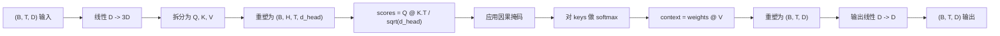
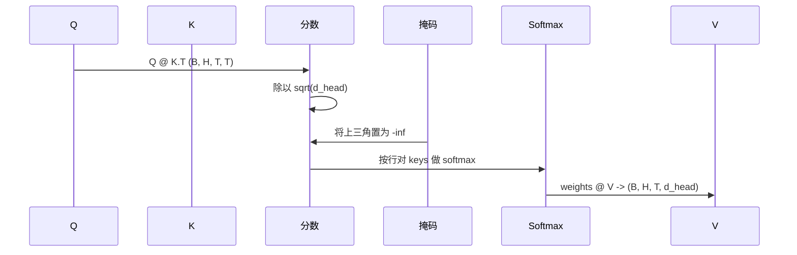

# Multi-Head Self-Attention

> One linear projection, three views, H parallel heads, one mask. The attention block as the model actually uses it.

**Type:** 构建
**Languages:** Python
**Prerequisites:** 第 04 阶段课程，第 07 阶段的 transformer 课程，本阶段的第 30 到 32 节课程
**Time:** ~90 分钟

## 学习目标
- 实现一个将 Query/Key/Value 投影为单个线性层并拆分为 H 个头的批处理投影。
- 计算缩放点积注意力，正确处理归一化和数据类型（dtype）。
- 应用因果掩码，防止某个位置关注未来的位置。
- 在固定输入上检查每个头的注意力权重，并推理每个头关注的内容。
- 在一个玩具任务上训练一个小的注意力模块，观察随着头部专业化损失下降。

## 框架概述

注意力是允许某个 token 的表示从同一序列的其他 token 拉取信息的函数。自注意力（self-attention）意味着 queries、keys、values 都来自相同输入。多头（multi-head）意味着投影被分成 H 个并行的注意力子问题，子问题的输出再被串联并投回去。

高效的实现模式是用一个线性层将维度从 `D` 投影到 `3 * D`，然后切分成三种视图（Q、K、V），再重塑为 H 个大小为 `D // H` 的头。矩阵乘法（matmul）、softmax 和加权和作为批处理张量操作并行执行，使得头部在加速器上并行运行。

本课构建了这个模块，同时加入因果掩码，使得同样的代码可以作为解码器（decoder-only）语言模型中的注意力层被使用。下一课会把该模块堆叠成完整的 transformer，随后一课会对其进行训练。

## 形状约定

输入为 `(B, T, D)`。输出为 `(B, T, D)`。掩码为 `(T, T)` 或可广播到该形状。模块内部的中间张量形状为 `(B, H, T, d_head)`，其中 `d_head = D // H`。约束条件是 `D % H == 0`。

两个线性层（QKV 投影和输出投影）是模块中唯一的参数。掩码、softmax、矩阵乘法和重塑都是无参数的。

## QKV 切分

朴素实现会用三个独立的线性层，分别生成 Q、K、V。高效实现用一个线性层输出 `3 * D` 个特征然后切分。数学上它们等价，因为三个独立的 `(D, D)` 权重矩阵的矩阵乘法，等价于把它们堆叠成一个 `(3D, D)` 权重矩阵再做一次矩阵乘法。

高效版本更快，因为加速器只需启动一次矩阵乘法而不是三次。同时也更容易初始化，因为三个子矩阵共享同一个参数张量，可以一起初始化。

## 头部重塑

切分后，每个 Q、K、V 的形状为 `(B, T, D)`。要把它变成 H 个并行的注意力问题，我们先重塑为 `(B, T, H, d_head)`，然后转置为 `(B, H, T, d_head)`。头维现在与批次维相邻，PyTorch 会把每个头视为在 `B * H` 个独立实例上的批处理操作。

d_head 维保持在最后，这样分数矩阵 `Q @ K.transpose(-2, -1)` 的收缩轴就是 d_head。结果是每头的注意力分数形状为 `(B, H, T, T)`。

## 缩放（Scaling）

在做 softmax 之前需要把分数除以 `sqrt(d_head)`。如果不做缩放，随着 `d_head` 增大，点积值的方差也会增大，从而把 softmax 推到一种某一项占绝大多数质量而其他项接近零的极端状态，这会导致梯度非常小且学习停滞。除以 `sqrt(d_head)` 可以使得分数的方差在不同头大小间大致恒定。

## 因果掩码

解码器-only 的语言模型在预测下一个 token 时只能条件化过去的内容。掩码用于强制贯彻这一点。具体地，在 softmax 之前， `(T, T)` 分数矩阵的上三角（即未来位置）被替换为负无穷。经过 softmax 后，这些位置的权重为零。

我们在构造时将掩码注册为一个 buffer，这样它会与模型位于相同设备上且不属于梯度图。掩码覆盖模块可能看到的最大上下文长度。在前向时我们会切取左上角的 `(T, T)` 窗口。

## 输出投影

在得到每头的上下文向量 `(B, H, T, d_head)` 后，我们把它转置回 `(B, T, H, d_head)`，重塑为 `(B, T, D)`，然后应用最后的 `(D, D)` 线性投影。输出投影让模型能够混合各头的信息。没有它的话，H 个头只能通过后续层来重新组合，模块会被人为限制。

## 注意力权重检查

本课在前向传递上提供了 `return_weights=True` 的标志。设置后，模块会返回形状为 `(B, H, T, T)` 的每头注意力权重与输出一起。演示会在一个短输入上打印某个头的热力图，让你看到因果三角结构以及每个位置的关注焦点。

在训练好的模型中，不同头会学习到不同的模式。有些头关注紧邻的前一个 token，有些头关注序列的起始位置，有些头的注意力近似均匀分布。注意力检查是可解释性工作的切入点。

## 训练演示

在 `main.py` 底部的演示将注意力模块连接到一个微型的 LM 头，并在一个重复任务上训练整个模型。输入的每一行都是单个随机 id 在上下文内重复。目标是将输入右移一位，也就是模型必须学会下一个 token 与前一个 token 相同。损失使用交叉熵。在 H=4、D=32、T=12、词表大小为 64 的设置下，损失会从随机（约 `log(64) ~ 4.16`）在三轮迭代内下降到远低于 `1.0`（在 CPU 上）。

演示的目的不是训练出一个有用的模型，而是确认梯度可以流经模块的每一部分，并且头能够在一个答案显而易见的问题上学到东西。

## 本课不涉及的内容

- 它没有添加前馈（feed-forward）块。真实模型中的 transformer 层是注意力之后跟一个两层的 MLP，并在每个子层周围有残差连接和层归一化（layer norm）。下一课会加入这些。
- 它没有实现 rotary 或 AliBi 位置编码。这两者都作用在 QKV 投影步骤中，但属于单独的教学单元。这里构建的模块兼容在此外转换 Q 和 K 后再做矩阵乘法的任一方法。
- 它没有实现推理时的 KV 缓存。跨前向传递缓存 keys 和 values 是使自回归解码快速的优化。它会改变 K 和 V 张量的形状约定，但不改变 Q 的形状约定。这属于推理专题。

## 如何阅读代码

`main.py` 定义了 `MultiHeadSelfAttention`。该类包含两个线性层和一个注册的掩码 buffer。前向流程为：投影、重塑、打分、掩码、softmax、加权和、重塑、再投影。底部的演示构建了一个用 token 与位置嵌入以及 LM 头包装的微型模型，在复制任务上训练三轮，打印损失曲线并可视化每个头的注意力热力图。`code/tests/test_attention.py` 中的测试固定了形状约定、因果性属性、softmax 属性、头拆分属性以及梯度流通性。

运行演示。然后把 `n_heads` 从 4 增加到 8（保持 `d_model=32`，因此 `d_head=4`），观察热力图的变化。