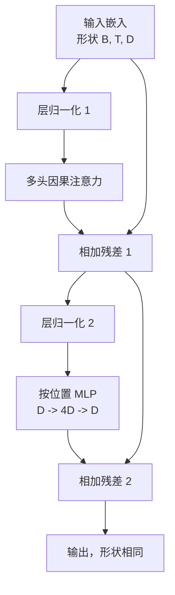
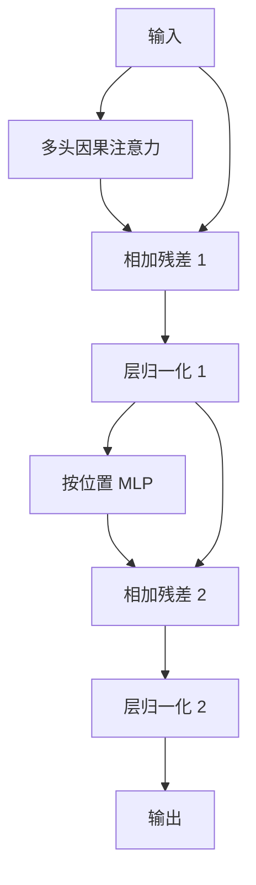

# Transformer Block from Scratch

> One block is the unit of every modern decoder LLM. Layer norm, multi head attention, residual, MLP, residual. The pre-LN variant trains stably without warmup. The post-LN variant is what the original paper shipped. This lesson builds both, side by side, and shows which one survives a 12 layer stack at common learning rates.

**Type:** 构建  
**Languages:** Python  
**Prerequisites:** Phase 19 课程 30 到 33（分词器、嵌入、注意力数学、批量数据加载器）  
**Time:** ~90 分钟

## Learning Objectives

- 在 PyTorch 中从四个可动部件构建一个 transformer block：LayerNorm、多头因果注意力（multi head causal attention）、残差连接、按位置的 MLP。
- 将 LayerNorm 放在两种配置（pre-LN 和 post-LN）中，并解释为什么前者在没有 warmup 的情况下也能稳定训练。
- 在多头注意力内实现因果掩码，确保令牌 i 无法看到令牌 j (j > i)。
- 在 12 层堆栈中跟踪两种变体的梯度流，并以不含糊的方式读取结果。
- 在下一课将 124M 参数的 GPT 组装起来时，可将该块作为可替换单元重用。

## The Problem

一个 transformer 就是重复一个 block。如果把 block 写错一次，重复 12 次，就会得到一个在第一轮就发散或需要各种 warmup hack 的模型。本课中你将看到的两种失败模式并不罕见，通常在初学者把 block 直接堆叠时就会出现。一种是注意力层关注到了未来（没有正确的因果掩码）。另一种是 LayerNorm 放在不能在深度处驯服残差信号的位置。

一旦看懂，修复是机械化的。这个 block 恰好有两条残差路径和两个归一化位置。把位置选对，剩下的就是账务工作。

## The Concept

每个仅含解码器的 transformer block 都是一个函数，接受形状为 `(batch, sequence, embedding)` 的张量并返回相同形状的张量。内部有两个子层在起作用。



这是 pre-LN 变体。LayerNorm 位于残差分支内部，子层之前。残差连接携带未归一化的信号向前传递。

post-LN 变体把 LayerNorm 移到残差相加之后。



形状相同，但训练行为不同。在 post-LN 中，沿残差路径反向流动的梯度必须通过 LayerNorm。在 12 层且学习率为 `3e-4` 时，这部分梯度会快速缩小到需要 warmup 的程度。pre-LN 让残差路径保持未归一化，因此梯度能干净地传播到嵌入层。出于这个原因，从 GPT-2 开始的实现采用的是 pre-LN 配置。

### 因果多头注意力（Causal multi head attention）

注意力子层将输入投影为 query、key、value 三个张量。每个张量的形状从 `(B, T, D)` 重塑为 `(B, H, T, D/H)`，其中 H 是头数。缩放点积注意力对每个头计算 `softmax(Q K^T / sqrt(d_k))`，将上三角掩码为负无穷，通过 softmax 应用掩码，然后乘以 `V`。各头再拼回成一个 `(B, T, D)` 的张量并再次投影。掩码是使模型具有因果性的唯一部分。忘记掩码就会训练出一个会作弊的模型。

### MLP

按位置的 MLP 对每个令牌独立应用相同的两层网络。隐藏层宽度是嵌入宽度的四倍，激活函数为 GELU，第二个线性之后接一个 dropout。MLP 内部没有令牌间通信。所有令牌混合都发生在注意力中。

### 残差连接的两个作用

它们让梯度路径在深度上呈加法，从而在十二层内保持梯度范数的尺度。它们还允许每个 block 学习对运行表示的加性更新，而不是完全替换。这两个效果都是 block 能够扩展的原因。

## Build It

`code/main.py` 实现了：

- `class LayerNorm`：具备可学习的 scale 和 shift、有偏 eps、按每个令牌向量应用。
- `class MultiHeadAttention`：带有 `num_heads`、`head_dim = d_model // num_heads`、融合的 QKV 投影、注册的因果掩码、注意力和残差 dropout。
- `class FeedForward`：两层线性、GELU 激活、dropout。
- `class TransformerBlock`：带有 `pre_ln` 标志以在两种变体间切换。
- 一个演示，构建一个 6 层的 pre-LN 堆栈和一个 6 层的 post-LN 堆栈，使用相同输入并打印 (a) 输出形状，(b) 一次反向传播后嵌入层的梯度范数。

运行：

```bash
python3 code/main.py
```

输出：对两个堆栈的形状检查，以及并排的嵌入梯度范数。pre-LN 堆栈在相同学习率下嵌入梯度要比 post-LN 大一个数量级，这就是经验上 pre-LN 在没有 warmup 时能训练的信号。

## Stack

- 使用 `torch` 做张量运算、自动微分和 `nn.Module` 管线。
- 不使用 `transformers`，不使用预训练权重。block 从原语实现。

## Production patterns in the wild

三种模式把教科书里的 block 变成可部署的实现。

**融合的 QKV 投影（Fused QKV projection）。** 三个独立的线性层需要三次 kernel 启动和三次矩阵乘法。一层宽度为 `3 * d_model` 的线性层在一次启动中完成相同工作，然后在最后一个轴上拆分输出。融合路径在所有加速器上都更快，也与 GPT-2、LLaMA、Mistral 的参考实现一致。

**注册的因果掩码缓冲区（Registered causal mask buffer）。** 掩码只依赖于最大上下文长度。构造时只分配一次，用 `register_buffer` 注册，在每次前向通过时切片活跃窗口，避免每次分配。忘记这一点会在长上下文时把掩码变成分配热点。

**两个位置上的 dropout，而不是三个。** Dropout 应该放在注意力 softmax 之后（注意力 dropout），以及 MLP 第二个线性之后（残差 dropout）。在残差本身上放 dropout 会破坏允许梯度在深度处流动的加性恒等。一些早期实现写错了这一点，训练变得脆弱。

## Use It

- 本课的 block 可以直接插入第 35 课的 GPT 组装中，无需修改。
- pre-LN 变体是现代开源权重 LLM 使用的配置。post-LN 是 2017 年原始论文使用的配置。了解两者足以阅读你将遇到的任何解码器架构。
- 将 GELU 换成 SiLU，得到 LLaMA 系列的激活；将 LayerNorm 换成 RMSNorm，得到 LLaMA 系列的归一化。骨架相同。

## Exercises

1. 给 block 中的每个线性添加 `bias=False` 标志。现代开源权重 LLM 的线性层通常没有偏置。在一个 12 层 768 维的模型中测量你能节省多少参数。
2. 将 `nn.LayerNorm` 换成手写的 RMSNorm，并验证输出形状不变。
3. 添加一个标志，返回第一个头的注意力权重，形状为 `(B, T, T)`。绘制上三角以确认 softmax 之后上三角为零。
4. 做一个健全性检查：用 `H=6` 将形状为 `(2, 16, 384)` 的张量分别通过两种变体，并断言在权重初始化相同且 dropout 设为零时前向输出是不同的（例如 `not torch.allclose`）。

## Key Terms

| Term | What people say | What it actually means |
|------|-----------------|------------------------|
| Pre-LN | "Pre norm" | LayerNorm 在残差分支内、每个子层之前；残差携带未归一化信号 |
| Post-LN | "Post norm" | LayerNorm 在残差相加之后；2017 年论文使用的版本，需要 warmup |
| Causal mask | "Triangle mask" | 注意力 logits 的上三角被设置为负无穷，使得当 j 大于 i 时令牌 i 不能读取令牌 j |
| Fused QKV | "Combined projection" | 用一个宽度为 3D 的线性层替代三个宽度为 D 的线性层；一次 kernel，一次 matmul |
| Residual stream | "Skip connection" | 在每个 block 之间自上而下流动的未归一化张量；每个 block 对其做加性更新 |

## Further Reading

- Phase 7 课程 02（从零实现自注意力）了解本 block 底层的注意力数学。
- Phase 7 课程 05（完整 transformer）了解同一骨架的编码器-解码器版本。
- Phase 10 课程 04（预训练迷你 GPT）了解本 block 所插入的训练流程。
- Phase 19 课程 35（此系列）将这类 block 堆成十二层的 GPT 模型。