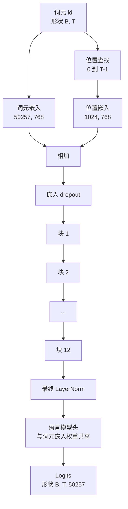
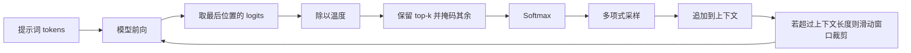

# GPT 模型组装

> 十二个块堆叠、一个 token 嵌入、一个可学习的位置嵌入、一个最终的 LayerNorm，以及一个权重共享的语言模型头。这就是整个 1.24 亿参数的 GPT 模型。本课将这些部分组装成一个可工作的类，计算参数以确认模型匹配参考的 124M 形状，并使用多项式采样、温度和 top-k 生成文本。

**Type:** 构建  
**Languages:** Python  
**Prerequisites:** Phase 19 第 30 到 34 课  
**Time:** ~90 分钟

## 学习目标

- 将第 34 课中的 transformer 块组装到完整的 GPT 模型：词元嵌入（token embedding）、位置嵌入（position embedding）、N 个块、最终 LayerNorm、语言模型头（language model head）。
- 复现 1.24 亿参数的配置：`vocab 50257`、`context 1024`、`d_model 768`、12 个头、12 层。
- 将语言模型头的权重与词元嵌入绑定（weight tying），并解释为何在该规模上可节省约 3800 万参数。
- 从提示词生成文本，支持温度（temperature）、top-k 截断和多项式采样（multinomial），并用滑动窗口保持上下文长度。
- 测量参数计数和前向开销，验证是否接近 124M 目标。

## 问题背景

单个 transformer 块本身并不能完成全部工作。你需要把 token id 转成向量，混入位置信息，送入堆栈，然后再投影回词表 logits。少了这四步中的任何一步，模型要么无法前向，要么位置信息丢失，要么无法生成语句。

模型的形状也很重要。参考的 GPT-2 small 在上述配置下正好是 1.24 亿参数。这些数字并非凭空而来。`vocab 50257` × `embedding 768` 就是 token 表。`position 1024` × `768` 是位置表。12 个块每个大约 700 万参数，合计 8400 万。最终头部通过权重绑定复用 token 表。把这些部分加起来就得到 1.24 亿。构建一个参数数量与参考不匹配的模型，说明你的连接有问题。

## 概念



词元 id 变为词元向量。位置 id 变为位置向量。两者相加后送入堆栈。最终的 LayerNorm 是所有现代变体中块外保留的那一项。LM 头复用词元嵌入矩阵，这就是权重绑定（weight tying）的含义。

### 权重绑定（Weight tying）

词元嵌入的形状为 `(vocab, d_model)`。语言模型头需要将 `d_model` 投影回 `vocab`。两者互为转置。权重绑定即字面意义上使用同一个参数张量两次。在 `vocab 50257`、`d_model 768` 的规模下，该矩阵约为 3800 万参数。若不绑定，这部分参数将被重复付费；绑定后只需付一次，并且由于嵌入和头部共同更新，梯度信号会更干净。

### 位置嵌入是可学习的，而非正弦的

GPT-2 使用可学习的位置嵌入（learned position embedding）。位置表是一个形状为 `(1024, 768)` 的参数张量。模型在每次前向时查表获取位置 0 到 T-1，并将查到的向量加到词元嵌入上。这是最简单的位置方案（RoPE、ALiBi、T5 相对偏置是替代方案），也是参考的 124M 配置所使用的方案。

### 生成：温度、top-k、多项式采样

生成是自回归的。在每一步，模型会为每个位置返回对整个词表的 logits。你取最后一个位置的 logits，对其除以温度（temperature），可选地将除 top-k 外的 logits 掩成负无穷（-inf），对剩余做 softmax 得到概率，从概率分布中采样一个 token。



三个旋钮、三种不同行为。温度接近零会退化为贪心（greedy）。温度为一则与模型的原始分布一致。top-k 为 1 等同于贪心。top-k 为 40 会裁掉长尾。组合方式很重要；下一课的训练会把生成作为定性评估信号。

## 构建实现

`code/main.py` 实现了：

- `class GPTConfig` dataclass，带有 124M 的默认值：`vocab_size=50257`、`context_length=1024`、`d_model=768`、`num_heads=12`、`num_layers=12`、`mlp_expansion=4`、`dropout=0.1`、`use_bias=True`、`weight_tying=True`。
- `class GPTModel`，包含词元嵌入、位置嵌入、嵌入 dropout、12 个 `TransformerBlock`、最终 LayerNorm，以及在 `weight_tying` 为真时与词元嵌入共享的 `lm_head`。
- 一个 `count_parameters` 辅助函数，返回唯一的参数计数（以便权重绑定被正确计数）。
- 一个 `generate` 函数，支持温度、top-k、多项式采样和滑动窗口上下文。
- 一个演示，会构建模型、打印参数计数并与参考 124M 比较，并从固定提示生成短序列以展示流水线端到端运行。

运行：

```bash
python3 code/main.py
```

输出：参数计数并列出参考 124M、从随机提示生成的 token id，以及确认当开启权重绑定时 LM 头与词元嵌入共享存储的提示。

为保持演示快速，脚本还会运行一个微小配置（`d_model=64`、`num_layers=2`）的端到端示例并内联打印生成的 token 序列。124M 配置会被构建，但只会对其参数计数和一次前向进行检测。

## 技术栈

- 使用 `torch` 进行张量计算、自动求导和模块组合。
- `code/main.py` 在本地重实现了第 34 课中的同一块模式。

## 生产实践（实际工程中常见的优化）

三种模式决定了模型能否稳定运行并投入生产。

- 初始化残差投影较小。注意力的输出投影和 MLP 的第二个线性层都会直接流入残差相加。如果用与其它线性层相同的标准差初始化，残差流会随深度增长并把最终 LayerNorm 推入不稳定区域。对于这两个投影，将标准差缩放为 `1 / sqrt(2 * num_layers)`；在十二层时，残差流保持在合理范围内。
- 缓存位置 id 张量，避免重复生成。`torch.arange(T)` 会在每次前向时分配新的内存。应在 `__init__` 中为最大上下文分配一次，然后在每次调用时切片前 T 个条目，跳过分配开销。
- 在参数层面绑定权重，而不是仅仅复制。设置 `lm_head.weight = token_embedding.weight` 会共享张量；复制则不会。优化器只需更新一个参数且 autograd 的梯度累加只有一份。如果你复制，头部会偏离嵌入，权重绑定就失去意义。

## 使用建议

- 本课中的模型类与下一课中的训练模型形状一致。
- 将可学习的位置嵌入替换为 RoPE 可以得到 LLaMA 家族，而无需改动块或头部。
- 将 GELU 替换为 SiLU 并把 LayerNorm 换成 RMSNorm 可以得到 LLaMA 的其它改动。
- 生成函数可以和任何 logits 源配合使用，不仅限于本模型。你可以在第 37 课加载预训练的 GPT-2 权重并复用相同的生成循环。

## 练习题

1. 解除 LM 头与词元嵌入的绑定并重新计数参数。验证差值为 `50257 * 768 = 38,xxx,xxx`（约 3800 万）。
2. 在构造时用正弦表替换可学习的位置嵌入。确认模型仍能前向且参数计数减少了 786,432。
3. 在生成中加入 `greedy=True` 标志以跳过采样并选择 argmax。确认序列在多次运行中是确定性的。
4. 添加一个 `repetition_penalty` 控制项，在 softmax 之前将提示词或已生成历史中出现的 token 的 logit 除以一个常数。在固定提示上演示该值大于 1 时如何减少重复次数。
5. 在 `top_k` 旁加入 `top_p`（nucleus）采样。用两行代码验证被保留 token 的概率和是否超过 `top_p`。

## 关键词

| 术语 | 大家怎么说 | 实际含义 |
|------|-----------|----------|
| Weight tying | “Tied embeddings” | `LM head` 和 `token embedding` 共享同一个参数张量；节省了 `vocab * d_model` 的参数并匹配 GPT-2 参考实现 |
| Position embedding | “Learned positions” | 一个形状为 `(context length, d_model)` 的独立表，加到词元向量上；端到端可学习 |
| Sliding window context | “Context cap” | 当提示词加生成的 token 超过上下文长度时，丢弃最旧的 token 以让活动窗口适配 |
| Top-k sampling | “K truncation” | 保留 K 个最大的 logits，将其余掩为负无穷，然后对剩余部分做 softmax |
| Temperature | “Sampling temperature” | 在 softmax 前将 logits 除以 T；T < 1 会使分布更尖锐，T = 1 保持原始分布，T > 1 会使分布更平坦 |

## 延伸阅读

- 第 19 阶段（Phase 19）第 34 课：本模型堆叠的 block（参见第 34 课）。
- 第 19 阶段第 36 课：驱动本模型的训练循环及交叉熵损失。
- 第 19 阶段第 37 课：将预训练的 GPT-2 权重加载到该架构中。
- 第 7 阶段第 07 课：关于下一 token 预测的数学原理（GPT 因果语言建模）。
- 第 10 阶段第 04 课：在相同架构上进行原始训练流程的迷你 GPT。