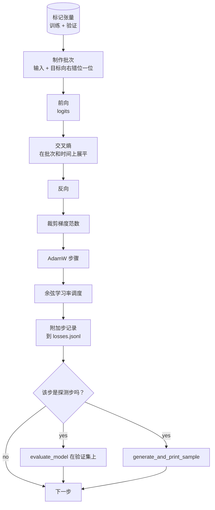

# 训练循环与评估

> 一个不衡量的循环就是在说谎。本课构建驱动 GPT 模型的训练循环：AdamW 带权重衰减分组、线性预热加余弦学习率调度、一个 `calc_loss_batch` 帮手、在保留数据上运行的 `evaluate_model`、每 K 步运行的定性探测 `generate_and_print_sample`，以及可供后续绘图的每步损失 JSONL 日志。相同的骨架可以训练你将来构建的每一个解码器 LLM。

**Type:** 构建  
**Languages:** Python  
**Prerequisites:** Phase 19 第 30 到 35 课  
**Time:** ~90 分钟

## 学习目标

- 构建一个训练循环，针对下一个 token 预测正确对齐输入与目标并计算交叉熵损失。
- 配置 AdamW，使权重衰减仅应用于权重张量，不应用于 LayerNorm 或偏置张量。
- 实现线性预热加余弦衰减的学习率调度，并读取随时间变化的学习率值。
- 在保留集上通过 `evaluate_model` 评估，使评估损失在不同运行间可比。
- 每隔 K 步使用 `generate_and_print_sample` 生成一个定性样本，以在损失曲线之前捕捉发散。
- 将每步损失持久化为 JSONL，以便你可以重载、绘图并将训练日志作为交付物。

## 问题

一个只打印损失但不做其他衡量的训练脚本会失败于三点。它无法告诉你损失是否因为正确的原因下降（模型可能在训练集上过拟合而没有真正学到东西）。它无法告诉你是否开始发散（损失可能某一步骤急剧上升再恢复，或者一步骤就崩溃）。它无法告诉你模型学到了什么（损失是标量；生成样本是一段文本）。除非循环进行测量，这些失败都会被隐藏。

本课的循环以三种方式进行测量：每步记录训练批次损失；每隔 K 步在保留批次上记录损失；每隔 K 步从固定提示生成一个续写样本。训练日志写入 JSONL，使得日志成为循环的证据。

## 概念



两个不明显的要点是损失对齐和 AdamW 的衰减分组。

### 损失对齐

模型在每个位置预测下一个 token。如果输入批次是 tokens `[t0, t1, t2, t3]`，目标批次必须是 `[t1, t2, t3, t4]`。交叉熵在展平后的形状 `(batch * seq, vocab)` 上与展平后的目标 `(batch * seq,)` 一起计算。忘记这个错位，你就是训练模型去预测它自己，这会收敛到接近零的损失，但学不到有用的东西。

### AdamW 衰减分组

权重衰减应当正则化权重张量，但不应当作用于归一化的缩放参数或偏置。对 LayerNorm 的缩放施加衰减会慢慢把缩放推向零，从而破坏归一化。对偏置施加衰减在数学上无害但浪费计算。标准分组是：矩阵形状的张量（线性层权重、嵌入表）使用衰减，任何看起来像缩放或偏移的参数不使用衰减。

### 线性预热加余弦衰减

预热会在几百步内把学习率从零逐步升到目标值，使得优化器状态有时间填充。余弦衰减在剩余步数内将学习率逐渐降回接近零，使得训练后期以较小步长精调权重。组合使用在开源权重的 LLM 训练中最为常见，因为它移除了头千步和尾千步中的大多数脆弱时刻。

### 保留集评估

`evaluate_model` 在验证切分上运行固定数量的批次，累计损失并除以批次数量后返回。无梯度。无 dropout。在相同种子和相同切分下，这个数字在不同运行间可复现。将保留集损失与训练损失并列报告是发现过拟合的方式。

### 定性采样作为早期信号

训练损失下降但生成样本都是相同 token 的模型就是坏的。损失曲线看起来平坦但生成样本逐渐变得连贯则说明模型在学习。定性探测比仅看完整曲线更快，能捕捉标量损失遗漏的模式。

## 构建它

`code/main.py` 实现了：

- `make_batches(token_ids, batch_size, context_length)`：将长的 token 张量切片为输入和目标对。
- `calc_loss_batch(model, inputs, targets)`：前向、展平并返回标量交叉熵。
- `evaluate_model(model, val_loader, max_batches)`：在无梯度模式下迭代固定数量的验证批次并返回平均损失。
- `generate_and_print_sample(model, prompt, max_new_tokens)`：对固定提示运行第 35 课的生成函数并打印结果。
- `build_param_groups(model, weight_decay)`：生成两个组的 AdamW 参数列表。
- `cosine_with_warmup(step, warmup_steps, total_steps, max_lr, min_lr)`：返回给定步数的学习率。
- `train(...)`：运行循环，持久化 `outputs/losses.jsonl`，并每 `eval_every` 步打印评估损失与样本。
- 一个演示，在合成数据上训练一个小模型若干步，写出 JSONL 日志并在探测点打印评估损失和样本。该演示在 CPU 上运行很快，远低于一分钟。

运行：

```bash
python3 code/main.py
```

输出：每步损失行、每个探测步的评估损失、每个探测步的生成样本，以及最终的 `outputs/losses.jsonl`，你可以用 `json.loads` 对每行加载。

## 技术栈

- 使用 `torch` 提供自动微分、优化器和模块。
- `main.py` 在本地重新实现了第 35 课的 `GPTModel` 和支持模块。

## 生产环境中的常见模式

三种模式能把教科书式循环变成可以放着跑一整晚的系统。

- 梯度范数裁剪是不可协商的。一个坏批次（异常数据、学习率突变、数值极端情况）可能产生巨大的梯度，抹掉数小时的训练。把 `backward` 后 `step` 前调用 `torch.nn.utils.clip_grad_norm_(params, max_norm=1.0)` 可以让优化器在安全范围内。裁剪值是一个可调参数；1 是在大多数设置中能幸存下来的默认值。
- 可恢复的 JSONL 日志，而不是 pickle 的状态。每步损失记录为 JSONL 行 `{"step": int, "train_loss": float, "lr": float}` 是耐久的：任何崩溃都会留下可读的产物，你可以 grep，可以用几十行 Python 绘图，还可以通过读取最后一步来恢复训练。Pickle 状态把你绑定到生成该文件的精确模块布局，对重构非常脆弱。
- 从固定切片抽取评估批次。验证 tokens 在脚本启动时一次性切成批次，而不是在运行时动态切分。可复现性依赖于评估批次在不同运行间保持一致；否则比较两个运行的评估损失时，批次的随机性会和模型本身的差异掺杂在一起。

## 使用方式

- 本课的循环骨架与训练一个 124M 模型的骨架相同。把合成 token 张量替换为 `datasets` 风格的加载器，循环即可不变地运行。
- JSONL 日志是把一次训练运行变成证据的交付物。下一课会使用它来比较新训练的检查点与预训练检查点。
- 定性样本探测是标量损失无法替代的捕获手段。

## 练习

1. 添加 `weight_decay_groups()` 单元测试，确认缩放和偏置参数被放入无衰减组，而线性层和嵌入权重被放入有衰减组。
2. 用小文本文件中的字节替换合成随机 tokens，使演示在某些可读文本上训练。验证生成的样本中使用了文件中出现的字符。
3. 为余弦调度添加一个最小学习率 floor，为 `max_lr` 的 10%，并重新绘图。
4. 每隔 `eval_every` 步保存一个检查点，除了写 JSONL 之外。添加 `resume_from` 标志以重载模型状态和优化器状态并恢复训练。
5. 在损失旁边记录每步吞吐（每秒 tokens），并确认其保持在稳定范围内。

## 关键词

| Term | What people say | What it actually means |
|------|-----------------|------------------------|
| Loss alignment | "Shift by one" | 输入 tokens 位于 0..T-1，目标 tokens 位于 1..T；交叉熵在展平形状上计算 |
| Decay split | "Two groups" | AdamW 接收对矩阵形状张量使用权重衰减、对缩放或偏置张量不使用衰减 |
| Warmup | "Ramp" | 学习率在固定步数内从零爬升到目标值，以便优化器状态填充 |
| Eval batches | "Held out batches" | 验证 token 张量的固定切片，在脚本启动时一次切好，每次探测使用相同切片 |
| Qualitative probe | "Sample print" | 每 K 步从固定提示生成并打印一段短续写以捕捉标量损失无法发现的失败模式 |

## 延伸阅读

- 第 19 阶段第 35 课，关于驱动该循环的模型。  
- 第 19 阶段第 37 课，关于将预训练权重加载到相同模型中。  
- 第 10 阶段第 04 课（mini GPT 预训练），关于在真实数据上的流程。  
- 第 10 阶段第 10 课（评估），关于超出交叉熵损失的更广泛评估面。