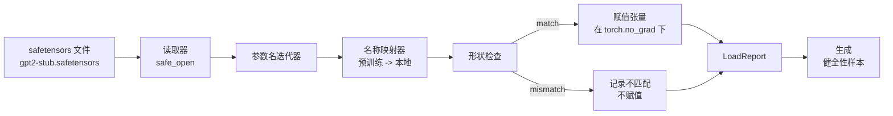

# Loading Pretrained Weights

> 从头训练一个有 1.24 亿参数的模型是预算决策；加载一个已发布的检查点只是家常便饭。本课从 safetensors 文件加载预训练的 GPT-2 风格权重到第 35 课的精确架构，逐条讲解参数名映射，并用生成的续写进行基本验证以证明加载生效。无需网络、无需第三方加载器、无不透明的魔法。

**Type:** 构建  
**Languages:** Python  
**Prerequisites:** 第19阶段 第30至36课  
**Time:** ~90 分钟

## Learning Objectives

- 使用 `safetensors` Python 库读取 safetensors 文件并检查张量名与形状。
- 将每个预训练参数名映射到第 35 课 GPT 模型内的参数上。
- 处理已发布 GPT-2 权重与本轨模型之间的两种不同命名约定：`wte/wpe/h.N.attn.c_attn/c_proj` 和 `mlp.c_fc/c_proj` 与本地命名的 `tok_embed/pos_embed/blocks.N.attn.qkv/out_proj` 与 `mlp.fc1/fc2`。
- 在任何权重赋值发生前检测并拒绝形状不匹配，给出清晰错误信息。
- 使用已加载的权重生成简短续写，确认生成的标记来自已加载的分布而不是随机初始化的分布。

## The Problem

已发布的权重并不是为你的架构打包的。它们带有原始实现使用的名称。预训练文件中有 `transformer.h.0.attn.c_attn.weight`，形状为 `(2304, 768)`；而你的模型期望 `blocks.0.attn.qkv.weight`，形状为 `(2304, 768)`（这是相同矩阵但采用了不同的布局约定），或者你的模型使用 `nn.Linear`，它以转置的形式存储矩阵。相同的参数会以三种微妙不同的身份出现（名称、形状、字节布局），加载器必须调和这三者。

盲目复制的加载器会把正确的张量放在错误的位置，导致模型生成废话。一个在形状不同时拒绝复制但不记录任何信息的加载器会让你猜测哪个张量没有落位。本课的加载器是明确的：每次赋值都会记录、每次形状都会检查，并且一个 `LoadReport` 汇总命中、缺失和形状不匹配，以便你可以读取发生了什么。

## The Concept



名称映射器只是一个从字符串到字符串的函数。形状检查是一个 if 判断。赋值发生在 `torch.no_grad()` 内，这样 autograd 不会跟踪加载。报告保存每个名称的结果。

### The GPT-2 naming convention

已发布的 GPT-2 权重使用如下名称：

| Pretrained name | Shape | Meaning |
|-----------------|-------|---------|
| `wte.weight` | (50257, 768) | Token embedding |
| `wpe.weight` | (1024, 768) | Position embedding |
| `h.N.ln_1.weight` | (768,) | LayerNorm 1 scale at block N |
| `h.N.ln_1.bias` | (768,) | LayerNorm 1 shift at block N |
| `h.N.attn.c_attn.weight` | (768, 2304) | Fused QKV linear weight |
| `h.N.attn.c_attn.bias` | (2304,) | Fused QKV linear bias |
| `h.N.attn.c_proj.weight` | (768, 768) | Attention output projection |
| `h.N.attn.c_proj.bias` | (768,) | Attention output projection bias |
| `h.N.ln_2.weight` | (768,) | LayerNorm 2 scale |
| `h.N.ln_2.bias` | (768,) | LayerNorm 2 shift |
| `h.N.mlp.c_fc.weight` | (768, 3072) | MLP fc1 weight |
| `h.N.mlp.c_fc.bias` | (3072,) | MLP fc1 bias |
| `h.N.mlp.c_proj.weight` | (3072, 768) | MLP fc2 weight |
| `h.N.mlp.c_proj.bias` | (768,) | MLP fc2 bias |
| `ln_f.weight` | (768,) | Final LayerNorm scale |
| `ln_f.bias` | (768,) | Final LayerNorm shift |

需要注意两点。`c_attn`、`c_proj`、`c_fc` 这些线性层的权重相对于 `nn.Linear.weight` 期望的形式是转置存储的。加载器在赋值时会做转置。LM head 并不在文件中；模型依赖与 `wte` 的权重绑定（weight tying），因此在 `wte` 到位后通过别名设置头权重。

### The local naming convention

本轨模型使用更具描述性的名称：

| Local name | Meaning |
|------------|---------|
| `tok_embed.weight` | Token embedding |
| `pos_embed.weight` | Position embedding |
| `blocks.N.ln1.scale` | LayerNorm 1 scale at block N |
| `blocks.N.ln1.shift` | LayerNorm 1 shift |
| `blocks.N.attn.qkv.weight` | Fused QKV |
| `blocks.N.attn.qkv.bias` | Fused QKV bias |
| `blocks.N.attn.out_proj.weight` | Attention output projection |
| `blocks.N.attn.out_proj.bias` | Output projection bias |
| `blocks.N.ln2.scale` | LayerNorm 2 scale |
| `blocks.N.ln2.shift` | LayerNorm 2 shift |
| `blocks.N.mlp.fc1.weight` | MLP fc1 |
| `blocks.N.mlp.fc1.bias` | MLP fc1 bias |
| `blocks.N.mlp.fc2.weight` | MLP fc2 |
| `blocks.N.mlp.fc2.bias` | MLP fc2 bias |
| `final_ln.scale` | Final LayerNorm scale |
| `final_ln.shift` | Final LayerNorm shift |

映射是一个固定函数。本课提供了一个字典，加载器遍历该字典进行映射。

### The stub fixture

真实的 GPT-2 权重约为 0.5 GB。本示例不会下载它们；首次运行时会生成一个小型的 safetensors 夹具，使用与 GPT-2 相同的命名约定，但形状适配一个具有 12 个块且 d_model 为 192（而不是 768）的模型。该夹具具有正确的结构，可以覆盖加载器中的所有代码路径。将夹具替换为真实文件时，加载器无需修改即可工作。

## Build It

`code/main.py` 实现了：

- 一个第 35 课 `GPTModel` 的小型复现，使本课自包含。
- `make_pretrained_to_local(num_layers)`，展开每层的映射条目。
- `load_safetensors(model, path)`，迭代名称、映射它们、检查形状、对 conv1d 风格的权重做转置，并在 `torch.no_grad()` 下赋值。返回一个 `LoadReport`。
- `make_stub_safetensors(path, cfg)`，生成一个具有精确预训练命名约定的夹具文件。
- 一个演示：首次运行时在 `outputs/gpt2-stub.safetensors` 生成夹具，构建一个新的模型，捕获随机初始化下的一个生成续写，加载夹具，捕获另一个续写，打印两者，并验证两者不同（加载确实改变了模型）。

运行：

```bash
python3 code/main.py
```

输出：夹具路径、每个名称的加载日志、一个 `LoadReport` 摘要、加载前的续写、加载后的续写，以及注入到夹具中的一个故意的坏张量导致的形状不匹配（以便测试失败路径）。

## Stack

- 使用 `safetensors` 作为磁盘格式和流式读取器。
- 使用 `torch` 作为模型与赋值的计算库。
- 不使用 `transformers`、`huggingface_hub`，也不进行网络调用。

## Production patterns in the wild

三种实践模式能让加载器在接触非你创建的权重时幸存下来。

- 始终在任何赋值前验证文件。打开文件，列出每个张量名及其 dtype 和形状，运行完整的映射并做形状检查，只有在成功后才开始赋值。半加载的模型是无声失败的制造器。
- 记录每次赋值的源名称和目标名称。当出现问题时，日志会告诉你哪个张量落到了哪里；否则你得去读十六进制转储。课程中的 `LoadReport` dataclass 跟踪 `loaded`、`missing`、`unexpected` 和 `shape_mismatch` 列表，并在结束时打印摘要。
- LM head 是通过权重绑定（weight tying）实现的别名，而不是独立拷贝。加载 `tok_embed` 后设置 `model.lm_head.weight = model.tok_embed.weight` 是规范做法。将嵌入矩阵复制到一个新的 `lm_head.weight` 参数会破坏绑定并悄无声息地使参数数量翻倍。

## Use It

- 加载器适用于任何使用预训练命名约定的 safetensors 文件。真实的 GPT-2 文件（small / medium / large / xl）无需修改代码即可工作；唯一不同的是模型配置。
- 相同模式可扩展到 LLaMA、Mistral、Qwen 权重，一旦你更新名称映射即可。形状检查和报告保持不变。
- 在加载后进行健全性生成是一个快速检查：如果加载后的样本看起来与加载前相同，说明加载没有改变模型，这意味着映射悄无声息地错过了所有张量。

## Exercises

1. 给加载器添加一个 `dtype` 参数，在赋值期间将每个张量转换为目标 dtype（`bfloat16`、`float16`、`float32`）。确认一个 `float32` 模型可以被降精度到 `bfloat16` 并仍能生成。
2. 添加一个 `expected_layers` 参数，如果检查点中的 `h.N` 索引与模型的 `num_layers` 不匹配则拒绝加载。
3. 将加载器接入第 35 课的生成函数，并生成两段并排样本：一段来自随机初始化，一段来自加载的夹具。
4. 添加一个导出路径：使用预训练命名约定将当前模型状态写入一个新的 safetensors 文件。对该文件做一次往返加载，并确认报告中没有形状不匹配。
5. 扩展 `NAME_MAP` 以处理 LLaMA 的命名约定（无偏差、RMSNorm、融合 qkv 布局），并对你生成的 LLaMA 夹具重新运行加载器。

## Key Terms

| Term | What people say | What it actually means |
|------|-----------------|------------------------|
| 名称映射 (Name map) | "Key remapping" | 从预训练张量名到本地参数名的函数；通常是一个在循环中按层索引展开的字面 dict |
| 形状不匹配 (Shape mismatch) | "Bad shape" | 在映射后预训练张量存在但其维度与本地参数不一致；加载器拒绝赋值并记录该对 |
| 加载时转置 (Transpose-on-load) | "Conv1d layout" | 已发布的 GPT-2 将注意力和 MLP 投影以 nn.Linear 不期望的转置形式存储；加载器在赋值时做转置 |
| 权重绑定别名 (Weight tying alias) | "Shared LM head" | 通过设置 model.lm_head.weight = model.tok_embed.weight 让头和嵌入共享存储；头不在文件中就是因为这一点 |
| 加载报告 (Load report) | "Coverage summary" | 一个小的 dataclass，跟踪 loaded、missing、unexpected、shape_mismatch 列表；打印它可以告诉你加载是否成功 |

## Further Reading

- 第 19 阶段 第 35 课：接收权重的架构。
- 第 19 阶段 第 36 课：产生具有相同形状检查点的训练循环。
- 第 10 阶段 第 11 课（量化）：在内存紧张时如何处理已加载的权重。
- 第 10 阶段 第 13 课（构建完整的 LLM 管道）：围绕加载与推理的完整生命周期。