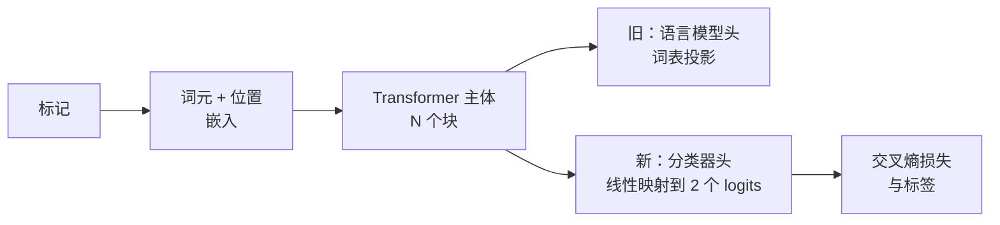
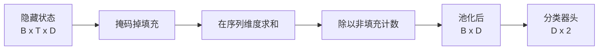
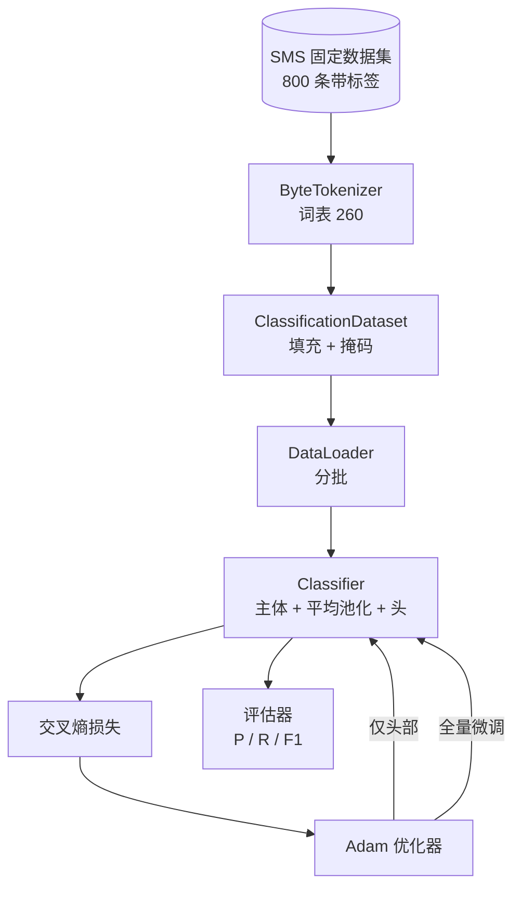

# Capstone Lesson 38: Classifier Fine-Tuning by Head Swap

> Track B 的第一个结业项目。预训练语言模型是由一堆自注意力块堆叠而成，最后接一个令牌预测头。当你要做垃圾短信 vs 正常短信分类时，头是错的，但主体大部分是对的。本课把头拆掉，粘上一个将池化表示映射到二分类的线性层，并用两种不同方式训练分类器：仅训练最后一层（head-only）和全量微调（full fine-tuning）。评估在保留集上计算精确率、召回率和 F1。你将学习每种策略带来的收益与代价。

**Type:** 构建
**Languages:** Python（torch, numpy）
**Prerequisites:** Phase 19 lessons 30-37 (NLP LLM track: tokenizer, embedding table, attention block, transformer body, pre-training loop, checkpointing, generation, perplexity)
**Time:** ~90 分钟

## Learning Objectives

- 在不重新初始化主体的情况下，将语言模型头替换为分类头。
- 实现两种训练方案：冻结主体（仅头部）和全量微调，使用同一个训练循环。
- 构建一个对分词器友好的数据管道，处理填充、掩码填充并对注意力输出进行池化。
- 从原始 logits 计算精确率、召回率、F1 以及混淆矩阵。
- 分析参数数量、训练时间与可提升空间之间的权衡。

## The Problem

你在一个通用语料上预训练了一个小型 transformer。输出头将最后一层隐藏状态投影到一个 1000 词表。现在你有 800 条带有垃圾/正常标签的短信，你想要一个二分类器。有三种选择。

错误的选择是用这 800 个样本从零训练一个新的分类器。预训练模型的主体已经编码了有用的结构：词的身份、位置、简单的共现关系。丢弃它会浪费构建它所消耗的计算资源。

两个正确的选择是：替换头并冻结主体，或替换头并允许主体可训练。仅头部训练速度快、内存几乎不受影响，并且在如此少的数据上很少过拟合。全量微调更慢，在小数据上可能过拟合，但当下游领域与预训练语料存在漂移时能够达到更高的准确率。

本课会实现两种方案，便于在相同数据集上比较。

## The Concept

模型是一个函数 `f_theta(tokens) -> hidden_states`。头是一个函数 `g_phi(hidden) -> logits`。替换头意味着保留 `theta` 并替换 `g_phi`。主体的参数是昂贵的部分，头只是一个线性层。

有两个可训练参数集合重要：

- `theta`（主体）：每个注意力块都有成千上万的权重。
- `phi`（头）：`hidden_dim * num_classes` 的权重加上偏置。

在仅头部训练中，你只对 `phi` 计算梯度并对 `theta` 置零。PyTorch 可以通过对主体参数设置 `requires_grad=False` 来实现。优化器只会看到头部参数，主体保持冻结。

在全量微调中，你让梯度回流穿过整个堆栈。主体的权重会为了分类目标而发生移动。风险是在小数据上发生灾难性遗忘：主体的预训练成果可能被噪声的过拟合冲掉。

## The Pooling Question

分类器需要每个序列的一个向量，而不是每个令牌一个向量。三种常见选择：

- **Mean pool**：对隐藏状态沿序列维度取加权均值（用注意力掩码加权）。
- **CLS pool**：在前面加一个特殊 token，并只使用它的输出。这是 BERT 的做法。
- **Last-token pool**：使用最后一个非填充令牌的表示。这是 GPT 类分类器常用的做法。

本课使用显式注意力掩码加权的均值池化。它最简单，对不同长度的序列提供稳定信号，并且不需要在预训练时额外训练一个 CLS token。

## The Data

八百条短信，均衡地包括 400 条垃圾和 400 条正常，由 `code/main.py` 以确定性方式生成。生成器使用固定随机种子，选择模板并替换槽位内容，生成长度在 5 到 25 令牌之间的消息。真实数据集包含的噪声在此 fixture 中没有体现。本 fixture 的目的是可重复性。

数据按 80/20 划分：640 条训练，160 条测试。划分是分层的，因此测试集保持 50/50 的平衡。有一个已知平衡的保留集使得精确率和召回率可以被诚实地解读。

## The Metrics

二分类以类 1 作为正类（spam）。计数为：

- `TP`：预测为垃圾，实际为垃圾。
- `FP`：预测为垃圾，实际为正常。
- `FN`：预测为正常，实际为垃圾。
- `TN`：预测为正常，实际为正常。

三个关键指标：

- `precision = TP / (TP + FP)`。在被标为垃圾的消息中，实际为垃圾的占比是多少？
- `recall = TP / (TP + FN)`。在所有真实垃圾中，被模型标出的比例是多少？
- `F1 = 2 * P * R / (P + R)`。二者的调和平均数。

混淆矩阵把四个计数以 2x2 网格打印出来。演示会把这两个训练方案的结果都写到 stdout。

## Architecture

主体是故意做得很小的 transformer：词表 260、隐藏维度 64、4 个头、2 个块、最大序列长度 32。它小到可以在 CPU 上在九十秒内把两种训练方案都训练到收敛。为了自包含，本课并没有直接使用预训练权重；相反，`pretrain_quick` 辅助函数会在相同 fixture 的文本上进行五个 epoch 的语言模型训练，为主体提供一个非平凡的起点。

## What you will build

实现是一个 `main.py` 和一个测试模块（`code/tests/test_main.py`）。

1. `ByteTokenizer`：将字节映射到 id，保留一个 pad id。
2. `Block`：带多头注意力和前馈层的 transformer 块。使用 pre-norm。
3. `LMBody`：token + 位置嵌入加上一堆 Block。返回隐藏状态。
4. `MeanPool`：沿序列轴的掩码加权平均。
5. `Classifier`：主体、池化、线性头。主体在两种训练方案中是同一个实例。
6. `freeze_body` 和 `unfreeze_body`：切换主体参数的 `requires_grad`。
7. `train_classifier`：一个共享的训练循环。接受模型和一个为可训练参数配置好的优化器。
8. `evaluate`：运行测试集并返回 `Metrics(precision, recall, f1, confusion)`。
9. `run_demo`：先短暂预训练主体，然后分别训练并评估仅头部和全量微调，打印两个报告并以零退出。

## Why the comparison matters

仅头部训练通常训练更快且更不容易过拟合。在这个 fixture 上，通常在 20 个 epoch 的仅头部训练后可以看到精确率接近 0.9、召回率接近 0.85。全量微调大约慢三倍，并会在几个百分点内浮动，取决于随机种子。

课程并不选出一个“赢家”。它教你如何阅读数值和成本。在 800 个样本和一个小主体的情况下，仅头部通常是正确选择。在 80,000 个样本和更大主体的场景下，全量微调开始变得值得。你从本课中得到的契约是 API：同一个 `train_classifier` 函数处理两者，切换只需一次调用。

## Stretch goals

- 添加第三种方案：只解冻最后一个块。这有时称为部分微调。它比全量微调代价更小，但能学到比仅头部更多的东西。
- 添加学习率调度器。对头使用余弦退火调度，同时对主体使用较小的常数学习率是常见的生产配置。
- 用一个可学习的注意力池替代均值池：一个带有单个可学习查询的小注意力层。这通常在更长的序列上胜过均值池化。

实现已经给出相应的钩子。测试固定了契约。具体数值留给你去优化。