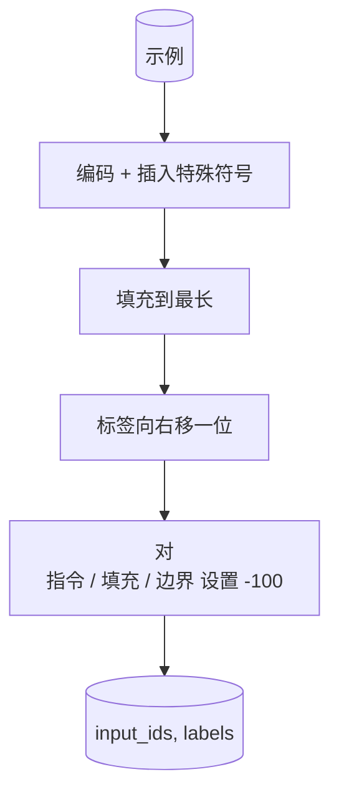
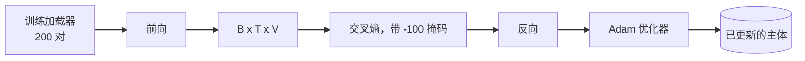

# Capstone Lesson 39: Instruction Tuning by Supervised Fine-Tuning

> A pretrained base model can extend a sequence but cannot follow an instruction. Supervised fine-tuning is the smallest change that fixes this: feed the model paired examples of an instruction and a desired response, and train the body to predict the response tokens. The trick is that you only want the loss to count the response, not the instruction. This lesson builds an Alpaca-style SFT loop with a custom collate function that masks instruction tokens with `ignore_index=-100`, trains on 200 instruction-response pairs, and evaluates on a held-out split using exact-match.

**Type:** 构建  
**Languages:** Python (torch, numpy)  
**Prerequisites:** Phase 19 lessons 30-37（NLP LLM 路线：tokenizer、嵌入表、注意力块、transformer 主体、预训练循环、检查点、生成、困惑度）  
**Time:** ~90 分钟

## 学习目标

- 将配对的指令-响应数据格式化为单个因果序列，并使用显式边界令牌分隔区域。
- 构建一个 collate 函数，屏蔽指令令牌以便交叉熵仅计算响应令牌的损失。
- 在 SFT 目标下训练一个小型 transformer 主体，并观察评估指标的变化。
- 实现尊重响应起始边界的贪心和温度采样生成。
- 计算生成完成结果的保留集完全匹配（exact-match）。

## 问题

一个以下一词预测训练的基础模型不知道“指令”是什么。给它字符串 "What is the capital of France?"，它会继续扩展这个问题或编造新句子。模型有语言能力但没有格式契约。

SFT 的契约是一个字符串模板。每个训练示例变为一个具有三个区域的单一序列：

```text
<INST> What is the capital of France? <RESP> The capital of France is Paris.
```

边界令牌是在训练时保留的特殊令牌。模型学习到 `<RESP>` 之后的一切都是响应，响应是被评分的部分。基础模型的下一词目标仍然适用；只是它在一个每个示例都具有这种形状的语料上训练。

但有一个问题。如果你把整个序列喂给普通的交叉熵损失，你就在训练模型去预测指令令牌。指令是已知的。你希望这些位置的梯度为零。解决办法是掩码。

## 概念


`ignore_index` 是 `torch.nn.functional.cross_entropy` 的一个特性。任何等于 `ignore_index` 的目标位置贡献零损失和零梯度。在 PyTorch 中的约定是 `-100`。collate 函数为每个示例构建两个张量：`input_ids`（完整序列）和 `labels`（`input_ids` 的副本，其中指令位置被覆盖为 `-100`）。

模型在前向传递中看到整个序列；注意力可以关注指令。损失只统计响应令牌。这正是你想要的：以指令为条件，预测响应。

## 数据

`main.py` 中确定性地生成了两百对指令-响应。它们涵盖六种任务类型：

- 事实单次（例如 X 的首都）
- 算术
- 列表提取
- 一句话摘要
- 代码（print、sort）
- 定义

每种任务都有一个模板化的指令和一个确定性的响应。这是故意简化的。完全匹配非常脆弱，本课使用了一个正确答案是单一字符串的夹具。真实的 SFT 数据集需要模糊评测；原理相同。

划分为 160 训练，40 测试。测试集覆盖所有六种任务类型，因此可以报告按类别的完全匹配率。

## 分词与填充

分词器是字节级的，带有三种保留特殊值：

- `INST_ID = 256`：标记指令区域的开始。
- `RESP_ID = 257`：标记指令与响应之间的边界。
- `PAD_ID = 258`：用于可变长度批次的填充。

序列形式为 `[INST] inst_bytes [RESP] resp_bytes [PAD]*`。collate 函数的步骤：

1. 对每个示例进行分词编码。
2. 将批次内每个示例填充到批次中最长的序列长度。
3. 构建 `labels` = `input_ids` 的右移一位（因果 LM 目标），并：
   - 将指令区域替换为 `-100`。
   - 将填充区域替换为 `-100`。
   - 将 `RESP_ID` 边界位置本身替换为 `-100`（你不训练模型去预测边界令牌；它预测边界之后的内容）。



右移是标准的因果技巧：`input_ids` 的位置 `i` 预测位置 `i+1`，因此 `labels[i] = input_ids[i+1]`（输入的最后一位被丢弃，目标的第一位被丢弃）。掩码在右移之后应用以定位到正确的位置。

## 训练



循环是标准的 PyTorch SFT 循环。Adam，学习率大约在 3e-4 到 1e-3，十到二十个 epoch 在这个夹具上，无需调度器。模型足够小（隐藏维 96，2 个块，最大长度 64），可在 CPU 上两分钟内收敛。

每五个 epoch 运行一次小型评估通过持出集并打印完全匹配率。观察完全匹配从第一个 epoch 的 0.0 到第十五个 epoch 的大约 0.85 是本课的回报：你可以同时看到模型学习格式与答案。

## 生成

在评估时，模型获取前缀 `[INST] inst_bytes [RESP]` 并生成令牌直到：

- 序列达到 `max_len`，或
- 模型发出一个特殊停止启发式：两个连续的句子结束字节（`.`, `!`, `?`）。

本课提供贪心解码以及可选的温度采样。完全匹配使用贪心，因为温度采样会使该指标随机化。真实系统通常先采样然后用模糊指标判断；那条流水线在第 41 课。

## 完全匹配评估

完全匹配是最严格的文本指标。预测的响应字符串会被归一化（小写、去除首尾空白、合并多余空格）并与参考响应同样归一化后比较。每个示例的指标是 1 或 0。总体是均值。

真实 SFT 流程会用 token 级的 F1（第 41 课）和判定模型补足完全匹配。完全匹配仍然有用，因为它没有歧义；如果它显示 0.7，说明正好 70% 的测试指令生成了与黄金响应字符逐字相同的答案。

## 你将构建的内容

实现包含一个 `main.py` 和测试：

1. `InstructionTokenizer`: 字节级编码器，带保留特殊令牌。能对指令前缀或完整配对进行编码。
2. `make_dataset`: 使用固定随机种子生成覆盖六类任务的 200 对。
3. `SFTDataset`: 每个示例返回 `(input_ids, labels)`，已准备好掩码。
4. `sft_collate`: 动态填充，构建批次张量，并在指令和填充位置设为 `-100`。
5. `TinyGPT`: transformer 主体以及绑定或不绑定的 LM 头。
6. `train_sft`: SFT 循环，带每 epoch 的评估钩子。
7. `generate`: 从前缀进行因果解码，支持贪心或采样，并实现停止启发式。
8. `exact_match`: 归一化后的字符串比较，返回区间 [0, 1] 内的 float。
9. `run_demo`: 构建数据，训练 20 个 epoch，评估，打印按类别的分解，成功时返回 0 退出码。

## 为什么掩码很重要

没有掩码，损失会把指令令牌也当作目标。模型会学习去预测指令。这是一个不同的目标，会在两个方面让模型表现更差。首先，模型容量被浪费在重构用户总是提供的输入上。其次，在梯度和中响应部分的损失相对较小，因为在大多数批次中指令令牌数量超过响应令牌；优化器在你关心部分上的实际学习率比你预期的要低。掩码不是锦上添花；它定义了目标。

## 拓展目标

- 添加学习率预热然后余弦衰减。SFT 对学习率比预训练更敏感。
- 添加逐令牌损失记录并绘制训练损失曲线。注意早期 epoch 由模板令牌（`<RESP>`、常见前缀）主导，晚期 epoch 由实际答案令牌主导。
- 将评估扩展为 BLEU-1 或 chrF。完全匹配会低估生成了语义等价但措辞不同的模型。
- 添加带多轮格式的聊天模板，并在包含后续问答的夹具上训练。

实现会给你格式契约、掩码以及训练循环。从基础模型到能遵循指令的模型，这个目标的改变只需一个 collate 函数。