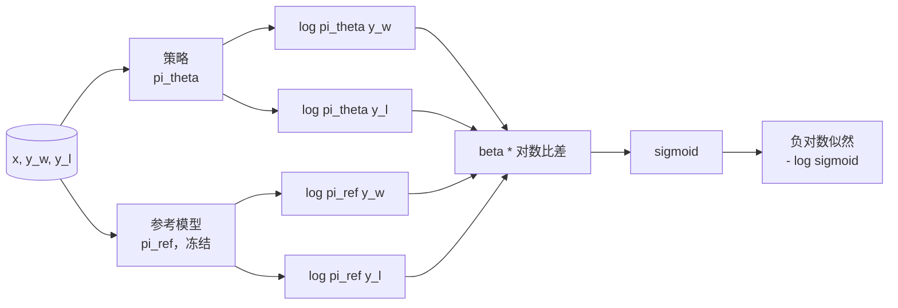
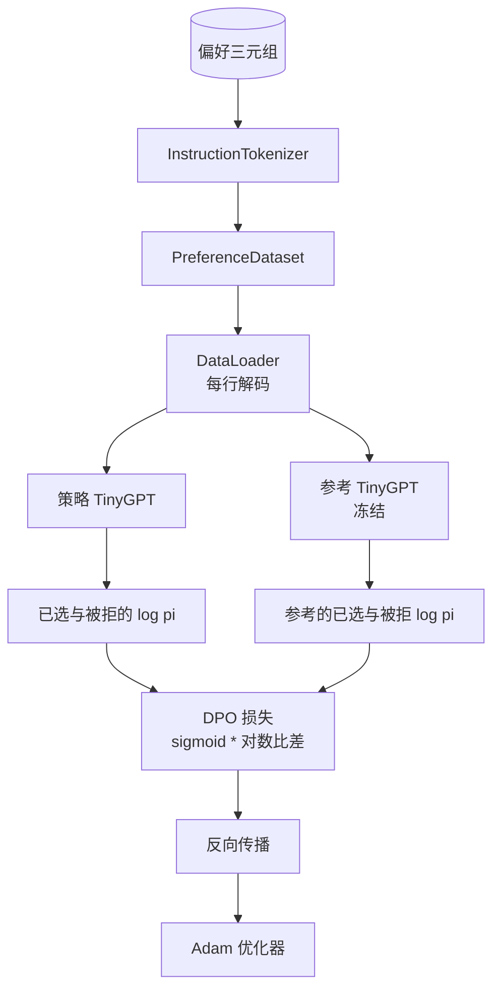

# Capstone Lesson 40: Direct Preference Optimization from Scratch

> 奖励模型和 PPO 是经典的 RLHF 堆栈。DPO 将该堆栈折叠为单个监督损失，直接用偏好对来拟合策略。本课推导 DPO 损失（从奖励差恒等式出发）、提供一个可运行的参考模型与策略模型、计算逐 token 的对数概率，并在一个由已选与被拒绝完成组成的偏好夹具上训练一个小型 transformer。测试固定损失的数学形式和梯度方向，以确保实现与论文一致。

**Type:** 构建  
**Languages:** Python（torch、numpy）  
**Prerequisites:** Phase 19 lessons 30-37（NLP LLM 路线：分词器、嵌入表、注意力模块、transformer 主体、预训练循环、检查点、生成、困惑度）  
**Time:** ~90 分钟

## 学习目标

- 将 DPO 损失推导为一个对缩放后对数比差的 sigmoid，并将其与隐式奖励联系起来。  
- 构建一个参考模型 + 策略模型对，其中参考模型被冻结且策略可训练。  
- 计算两者下的序列级别对数概率，对提示（prompt）部分进行掩码，避免计入。  
- 在 `(prompt, chosen, rejected)` 三元组上训练策略，并观察已选（chosen）的对数概率相对于被拒（rejected）上升。  
- 用关于损失数学、梯度符号与参考不变性的测试来钉住行为（pin behaviour）。

## 问题陈述

你有一个 SFT 模型。它会遵循指令，但输出不够稳定：有些完成很清晰，有些冗长或是错误。你还有一个小规模的偏好对数据集：对相同的 prompt，人工标注其中一个完成为已选（chosen），另一个为被拒（rejected）。

经典的 RLHF 答案是两阶段流水线：先在偏好上训练奖励模型，然后用 PPO 根据奖励优化策略。这种方式可行但代价高：PPO 时内存中要放两个模型、需要 KL 控制以保持策略接近参考、奖励模型脆弱时会产生 reward hacking。

DPO 用单个监督损失替代了这两个阶段。奖励模型不再显式存在。策略直接用偏好对训练，并带有朝向 SFT 参考的显式 KL 惩罚（以封闭式形式体现）。在 Bradley–Terry 偏好模型下，它与经典方法有相同的最优解，但代码量大大减少。

## 概念

从 Bradley–Terry 模型开始。给定 prompt `x` 和两个完成 `y_w`（已选）与 `y_l`（被拒），人工偏好 `y_w` 的概率为

```text
P(y_w > y_l | x) = sigmoid( r(x, y_w) - r(x, y_l) )
```

其中 `r` 是某个潜在奖励函数。RLHF 先用偏好拟合 `r`，然后带 KL 锚点去训练策略 `pi`：

```text
max_pi   E_{x, y~pi} [ r(x, y) ] - beta * KL(pi || pi_ref)
```

DPO 的推导观察到，在该目标下的最优策略 `pi*` 对 `r` 有一个封闭解：

```text
pi*(y | x) = (1/Z(x)) * pi_ref(y | x) * exp( r(x, y) / beta )
```

对 `r` 做变形：

```text
r(x, y) = beta * ( log pi*(y | x) - log pi_ref(y | x) ) + beta * log Z(x)
```

注意 `log Z(x)` 只依赖于 `x`（不依赖于 `y`），因此在计算已选与被拒的奖励差时会抵消：

```text
r(x, y_w) - r(x, y_l) = beta * ( log pi_theta(y_w|x) - log pi_ref(y_w|x)
                                - log pi_theta(y_l|x) + log pi_ref(y_l|x) )
```

代入 Bradley–Terry 的 sigmoid，并对偏好对取负对数似然：

```text
L_DPO(theta) = - E_{(x, y_w, y_l)} [
  log sigmoid( beta * ( log pi_theta(y_w|x) - log pi_ref(y_w|x)
                       - log pi_theta(y_l|x) + log pi_ref(y_l|x) ) )
]
```

这就是损失。它是对每个样本计算的一个标量上的 sigmoid。只需四个对数概率就能计算出损失。没有独立的奖励模型。没有 PPO。损失中也没有显式的 KL 项；KL 约束在闭式推导中已被吸收。



## 梯度的符号

在任何训练前的有用健全性检查。对 `log pi_theta(y_w | x)` 求梯度：

```text
d L_DPO / d log pi_theta(y_w | x) = - beta * (1 - sigmoid(z))
```

其中 `z` 是 sigmoid 的自变量。该表达式对所有 `z` 都是负的，这意味着：增加策略对已选完成的对数概率会降低损失。对 `log pi_theta(y_l | x)` 的梯度则是正的：增加被拒的对数概率会增加损失。训练会把已选向上推，把被拒向下推。参考模型被冻结；它不会改变。

## 数据

本课附带 12 个偏好三元组。每个三元组是 `(prompt, chosen, rejected)`。已选的完成通常简短且精确；被拒则冗长、离题或错误。这些对覆盖了与第 39 课相同的任务族（首都问题、算术、列表），因此如果策略从 SFT 基线开始，会有合理的起点。

夹具故意很小。DPO 在生产环境可在数万对上工作；这里的目的在于让损失数学和训练循环在一个小数据集上端到端运行，并且能直观看到已选与被拒对数概率差距的增长。

## 参考不变性

DPO 实现必须谨慎处理参考模型。参考模型是被冻结的不动 SFT。需要满足三条性质：

- 参考参数永远不接收梯度。  
- 参考的对数概率在各 epoch 之间不改变。  
- 策略从与参考相同的权重开始。（最优的 theta 是参考加上学习到的更新；把策略初始化为参考的拷贝是合理的起点。）

实现中通过以下手段保证这些性质：

- 在前向时使用 `torch.no_grad()` 包裹参考模型。  
- 将参考模型每个参数的 `requires_grad=False`。  
- 在构建策略后用 `policy.load_state_dict(reference.state_dict())` 来拷贝权重。

## 架构



模型与第 39 课中使用的 TinyGPT 相同（decoder-only，自回归，字节分词器）。参考与策略共享架构；训练过程中策略的权重会从参考上漂移，而参考保持不动。

## 你将构建的内容

实现由一个 `main.py` 和若干测试组成。

1. `InstructionTokenizer`：字节分词器，带 `INST` 和 `RESP` 特殊 token。与第 39 课形状相同。  
2. `TinyGPT`：仅解码器的 transformer。与第 39 课相同形状，这样即使跳过了第 39 课也能自包含运行。  
3. `make_preferences`：返回 12 个 `(prompt, chosen, rejected)` 三元组。  
4. `sequence_log_prob`：给定模型、prompt 前缀与完成，返回对完成部分的下一个 token 对数概率之和（不计入 prompt 部分）。  
5. `dpo_loss`：接受四个对数概率与 `beta`，返回每个样本的损失张量以及用于日志的隐式奖励差值。  
6. `train_dpo`：每轮循环计算策略与参考在已选/被拒上的对数概率，应用损失，并用 Adam 更新。  
7. `evaluate_margins`：在任意时刻返回策略上已选与被拒对数概率差的均值。  
8. `run_demo`：构建参考与策略（先进行少量预训练热身）、拷贝权重、训练三十步、打印每步的损失与差值，并在成功时以零退出。

## 为什么 DPO 有效

在 Bradley–Terry 偏好模型下，DPO 在数学上等价于 RLHF（到奖励参数化的差别为止）。隐式奖励 r(x, y) = beta * (log pi(y|x) - log pi_ref(y|x)) 从偏好中可识别，因加上只依赖 x 的项会在差分中抵消。封闭形式的策略使你可以跳过显式奖励模型。KL 约束在结构上得到执行：任何偏离 pi_ref 的 pi 都会让对数比增大，sigmoid 在策略移动过远时会饱和，从而抑制梯度。参考模型是你的安全网。

## 延展目标

- 在对数概率和上加入长度归一化：除以完成长度。长度偏差是 DPO 的已知失败模式，模型可能偏好较短的完成，因为其对数概率在绝对值上更大。  
- 添加 IPO 变体的损失：将 sigmoid + log 替换为 (z - 1)^2，并比较在夹具上的收敛性。  
- 添加标签平滑参数，在硬性已选/被拒标签与均匀 0.5 之间插值。  
- 用更小、更便宜的模型替换参考（知识蒸馏味道）。

实现会给你损失函数、参考不变性和训练循环。数学就是课程的核心，代码把数学变为具体实现。