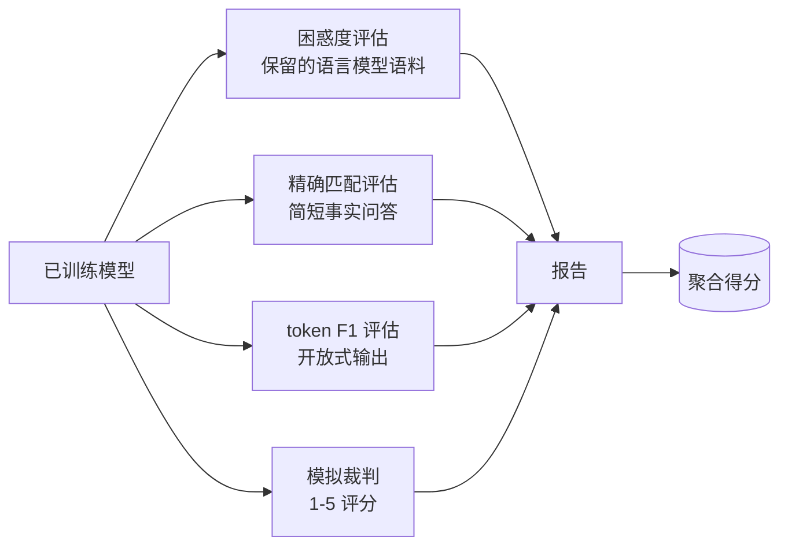
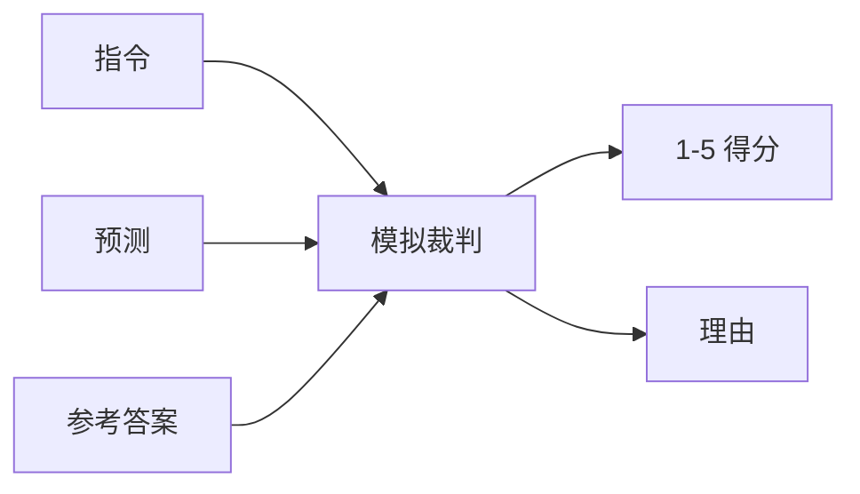
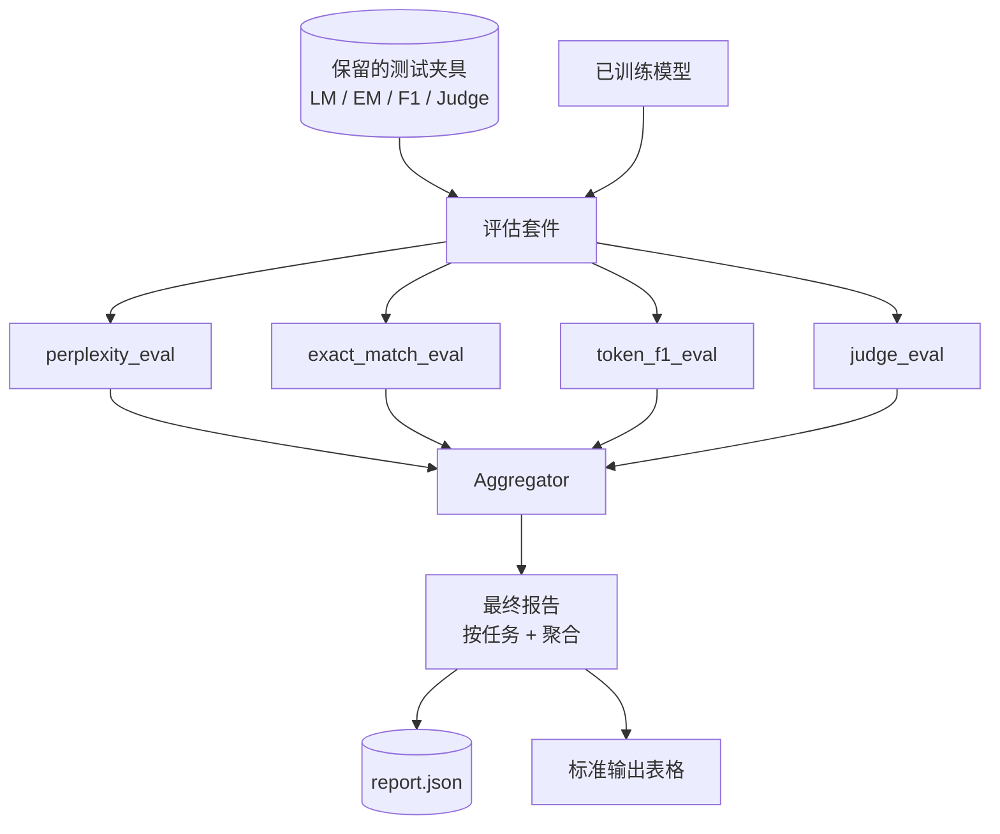

# Capstone Lesson 41: Full Evaluation Pipeline

> Training is the part you can monitor with loss curves. Evaluation is the part you have to design. This lesson builds a unified eval pipeline that takes any trained language model, runs four heterogeneous evals on it, aggregates the results into a per-task report, and ships a local mock LLM-as-judge so the loop runs without a network. The four evals cover the dimensions every shipping model needs: language modelling (perplexity), short-form correctness (exact-match), open-form similarity (token F1), and qualitative scoring (judge).

**Type:** 构建
**Languages:** Python (torch, numpy)
**Prerequisites:** Phase 19 lessons 30-37 (NLP LLM track: tokenizer, embedding table, attention block, transformer body, pre-training loop, checkpointing, generation, perplexity)
**Time:** ~90 分钟

## Learning Objectives

- 在一个微型 transformer 上计算保留集的困惑度（perplexity），并正确处理被掩码的位置计数。
- 在简短事实型提示上运行精确匹配（exact-match）评估。
- 计算预测与参考字符串之间的逐标记 F1（token-level F1），包含归一化。
- 构建一个本地离线的模拟 LLM 作为裁判（mock LLM-as-judge），对模型输出给出 1-5 的评分。
- 将四个评估结果聚合为一个带有按任务细分的加权报告。

## The Problem

单一指标无法完整描述一个语言模型。困惑度说明模型对语言分布的拟合度，但无法反映其是否能够回答问题。精确匹配说明模型是否输出了黄金串，但会惩罚正确的同义改写。Token F1 宽容同义改写，但会被与错误内容的词汇重合所误导。LLM 作为裁判能捕捉到质量层面的维度，但代价高且具有随机性。

你真正需要的评估流水线包含这四项。每个评估覆盖其他评估遗漏的维度。每项评估在为该指标设计的不同保留数据子集上运行。最终报告并列展示每个任务的数值与聚合值，让审阅者一眼看出模型在做出哪些权衡。

本课在一个文件中端到端构建该流水线。

## The Concept

每个评估都是从 `(model, dataset) -> EvalResult` 的函数。结果包含度量值、用于检查的逐例细节，以及用于聚合的名字。流水线通过配置组合这些评估，配置定义要运行哪些评估以及如何加权它们。

## Perplexity, properly counted

困惑度定义为 `exp(mean negative log-likelihood per token)`。实现上有两个陷阱：

- 平均必须在实际的 token 位置上计算，而不是在 batch * sequence 上。填充标记必须从分母中排除，否则困惑度会显得比实际更好。
- 模型预测下一个标记，所以位置 `i` 的 logits 预测的是位置 `i+1` 的标记。这里的错位是无声的错误：损失仍会训练，但指标会变得毫无意义。

评估在每个批次中累加非填充位置上的 `-log p(token)` 并计数有效标记数，最后再做除法。这比对批次困惑度求平均数数值上更稳定（后者会对短序列低估权重），且符合教科书定义。

## Exact-match, with normalisation

工具会在比较之前对预测与参考都做归一化处理：

- 小写化。
- 去除两侧多余空白。
- 将内部连续空白折叠为单个空格。
- 如果两边唯一区别是结尾标点（`.`, `!`, `?`），则删除尾部终结性标点。

归一化使精确匹配在实践中更有用。模型输出 `"Paris"` 是正确的；输出 `"Paris."` 也被视为正确；输出 `"  paris  "` 也被视为正确。该指标仍然要求归一化后字符串完全一致。

## Token F1, the right way

Token F1 是在 bag-of-tokens 上由精确率和召回率的调和平均得到的。步骤：

1. 对预测和参考做归一化（和精确匹配相同的规则）。
2. 用空白分词将各自分割为令牌列表（whitespace tokenization）。
3. 计算多重集合的交集计数。
4. Precision = `intersection_count / len(pred_tokens)`。Recall = `intersection_count / len(ref_tokens)`。F1 = 调和平均。

如果预测和参考都为空，则 F1 定义为 1（空集匹配）。如果只有一方为空，则 F1 为 0。该方式与 SQuAD 的评估参考一致，并能在同义改写间产出稳定数字。

## Local Mock LLM-as-Judge

真实的裁判是部署在 API 后面的前沿模型。为本课目的裁判必须离线运行。模拟裁判是一个确定性评分器，它接受指令、模型的预测与参考，并返回属于 `{1, 2, 3, 4, 5}` 的分数以及一行理由。评分规则是明确的：

- 如果归一化后的预测等于归一化后的参考，给 5 分。
- 如果预测与参考的 token F1 至少为 0.8，给 4 分。
- 如果 token F1 在 `[0.5, 0.8)`，给 3 分。
- 如果 token F1 在 `[0.2, 0.5)`，给 2 分。
- 否则给 1 分。

这不是一个真实的裁判，但它具有正确的接口。以后通过修改一个函数即可替换为真实模型。流水线并不关心内部实现。

## Aggregation

聚合是对归一化评估分数的加权平均。每个评估报告自己的数值，范围是 `[0, 1]`：

- 困惑度：用 `1 / (1 + log(perplexity))` 做归一化。困惑度为 1 对应 1，趋于无穷大对应 0。
- 精确匹配：本身就在 `[0, 1]`。
- Token F1：本身就在 `[0, 1]`。
- 裁判：除以 5。

权重是可配置的。默认混合为 0.2 困惑度、0.3 精确匹配、0.3 token F1、0.2 裁判。权重的选择是产品决策；本课暴露了这个旋钮，方便你试验。

## Architecture

`EvalSuite` 是一个轻量的编排器。每个单独的评估都是一个自由函数，签名为 `(model, tokenizer, dataset, config)` 并返回一个 `EvalResult`。`Aggregator` 收集结果并生成最终报告。演示会打印表格并写入一份 JSON 副本供下游 CI 使用。

## What you will build

实现由一个 `main.py` 加上测试组成。

1. `TinyGPT`：与课程 38-40 中相同的 decoder-only 架构，包含在内以使本课自包含。
2. `InstructionTokenizer`：带有 INST / RESP / PAD 特殊标记的字节分词器。
3. 四个夹具：一个 LM 语料、一个 EM 集、一个 F1 集以及一个裁判集。每个集合 20 个确定性示例。
4. `perplexity_eval`：返回包含困惑度值和逐标记损失直方图的 `EvalResult`。
5. `exact_match_eval`：返回平均精确匹配率和逐例记录。
6. `token_f1_eval`：返回平均 token F1 和逐例记录。
7. `mock_judge` 与 `judge_eval`：逐例评分与理由，以及集合上的平均分。
8. `Aggregator.normalise`：每种评估的归一化规则。
9. `Aggregator.aggregate`：加权平均与组装报告。
10. `run_demo`：短暂训练一个微型模型，运行四项评估，打印报告表并写入 JSON，成功时以 0 退出。

## Reading the report

报告有三层。顶层是聚合得分。下面是四个按评估划分的数值。再下面是逐例的细分用于诊断。失败的 CI 运行通常只需要聚合值，而追踪回归的审阅者会查看逐例细分以定位模型错误的输入。

JSON 导出使用稳定键名，便于 CI 仪表板绘制版本间的趋势曲线。漂亮打印的表格用于训练运行后人工查看终端输出。

## Stretch goals

- 添加校准评估：模型的 softmax 概率与其准确率是否匹配？按置信度对预测分桶并报告每个桶的经验准确率。
- 添加鲁棒性评估：为每个示例贴上扰动标签（拼写错误、改写、干扰项），并报告按扰动划分的指标下降。
- 用真实模型替换模拟裁判，通过 HTTP 调用。函数签名不变。
- 添加按任务权重学习：不使用固定权重，而是拟合出满足目标模型偏好序列的权重。

实现会给出四个评估、聚合器以及报告。真实的评估流水线在此基础上会叠加更多维度；模式不变：每个评估一个函数，一个聚合器，一个报告。