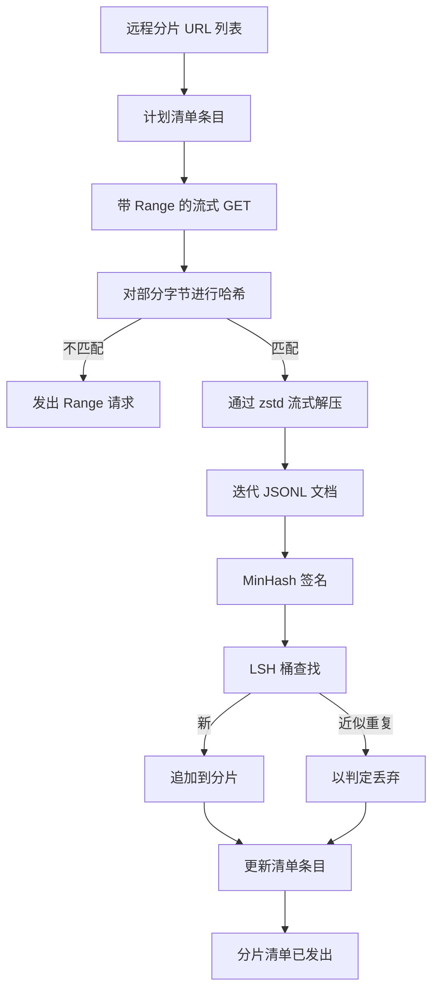

# Large Corpus Downloader

> 在第一次进行语言模型训练之前很久，训练就已经开始了。语料需要落盘、解压、去重，并且可以被索引访问，且在网络在 4% 时断开前就要设计好恢复策略。本课构建一个流式下载器，它拉取压缩分片，使用 Zstandard 在线解压，通过 MinHash 加上局部敏感哈希（LSH）对近似重复进行指纹识别，并写出其余流水线可以信赖的分片清单（manifest）。

**Type:** 构建
**Languages:** Python
**Prerequisites:** Phase 19 lessons 30-37
**Time:** ~90 分钟

## 学习目标

- 使用 `urllib` 流式拉取远端分片，并用 `zstandard` 在线解压，而不将整个文件缓存在内存中。
- 通过对已验证的字节偏移发起 HTTP `Range` 请求来恢复部分下载（断点续传）。
- 为每个文档构建 MinHash 签名，并用 LSH 将其分桶，以便近似重复发生碰撞。
- 发出包含内容哈希、字节大小、文档计数和去重判定的分片清单。

## 问题

第一次在 200 GB 语料上训练时，网络在 41% 处断开，脚本抛出 `urllib` 异常并退出。第二次在 78% 处断开。到 99% 时你已经重写了循环三次。从第一分钟起就必须为两类失败设计：断点续传和重复文档移除。两者都有成熟的解决方案；但通常被跳过，因为流水线一开始只是一个长成牙齿的 `requests.get` 调用。

断点续传是一个 HTTP 问题。服务端必须支持 `Range`，客户端必须对照磁盘记录跟踪已验证的偏移量，且已验证的偏移必须在进程死亡后存活。如果偏移和文件相差哪怕一个字节，恢复的下载就会写入垃圾，语料会以只有在分词时才显现的方式被损坏。

去重是一个签名问题。基于精确哈希的去重会漏掉近似重复：同一篇 Wikipedia 文章出现三种不同的页脚样式、同一份代码文件有不同的许可证头、同一篇博客文章在每个链接上带有追踪参数。MinHash 加 LSH 可以以次线性成本捕获这些。成本是对每个文档生成一个签名，并对每个签名进行一次分桶查找。

## 概念



### 使用 `urllib` 流式传输

标准库的 `urllib.request.urlopen` 返回一个类文件对象。将其包装到 `zstandard.ZstdDecompressor().stream_reader` 中，字节就会从网络通过解压器流到文档迭代器，而不会在内存中同时物化压缩分片或解压后的分片。唯一的内存开销是行缓冲、当前文档的 MinHash 签名，以及 LSH 索引。

### 使用 `Range` 进行恢复

下载器为每个分片写两个文件：分片本身和一个 `.partial.json` 检查点。检查点记录 `verified_bytes`、`expected_size`、`sha256_prefix`（在前 `verified_bytes` 字节上计算）和源 URL。启动时下载器读取检查点，在磁盘字节上重新计算 `sha256_prefix`，只有在重算哈希匹配时才继续恢复。如果哈希不对，部分文件会被丢弃，下载从字节零重新开始。由于检查的是已验证的字节而不是做假设，静默损坏是不可能的。

### MinHash 加 LSH

MinHash 在固定空间中估计两个集合的 Jaccard 相似度。对于文档，集合是其文本的 shingles（重叠 n-gram）。签名是 k 个最小哈希值，每个独立哈希函数给出一个值。两个 Jaccard 相似度为 s 的文档，在签名的任一组件上相等的概率为 s。

LSH 将 k 个组件分成 b 个 band，每个 band 包含 r 行，其中 k = b * r。两个文档在至少一个 band 上发生碰撞的概率为 1 - (1 - s^r)^b，这是一个围绕你为 (b, r) 调整的 s 值的尖锐阈值。典型语料去重的阈值是 s = 0.8，研究文献常用 k = 128、b = 32、r = 4 达到这一点。

### 分片清单作为契约

下载器唯一的持久输出是清单（manifest）。清单为每个分片保存 URL、解压后的字节数、文档计数、去重后的唯一文档计数，以及最终分片文件的 sha256。下游的分词阶段读取的是清单，而不是目录列表。如果某个分片缺失或其 sha256 错误，清单会告诉下一阶段拒绝开始。清单是“数据已下载”与“数据已下载且可验证”之间的决定性边界。

## 构建它

`code/main.py` 实现了：

- `ShardPlanner` - 读取分片 URL 列表并生成计划的清单条目。
- `StreamingDownloader` - 使用可选的 `Range` 打开 `urllib` 流，写入临时文件，在每个块更新 `.partial.json` 检查点，并在恢复时验证 sha256 前缀。
- `ZstdDocIterator` - 将类文件流包装到 `zstandard.ZstdDecompressor` 中，按行产出单个文档。
- `MinHasher` - 使用固定的哈希种子族为字符串生成 k 分量签名。
- `LSHIndex` - 按 band 将签名分桶并报告碰撞。
- `Dedup` - 结合 hasher 和索引，为每个文档打标签为 `keep` 或 `near_duplicate`，并返回匹配的分片 id。
- `ManifestWriter` - 收集每个分片的统计并写入 `manifest.json`。

文件底部的演示会在磁盘上构建一个小的合成语料，用 `zstandard` 压缩它，通过 `file://` URL 下载，去重，并打印清单。

运行：

```bash
python3 code/main.py
```

脚本以零退出并打印清单摘要。

## 生产模式

四种模式将本课扩展到真实语料。

**在写入前先检查点（Checkpoint before write）。** `.partial.json` 必须在附加分片字节之前 `fsync`。否则断电会反转顺序：磁盘上有分片字节，而检查点没有这些字节，下一次恢复会认为已验证的字节更少，重复的后缀字节破坏文件。先写检查点，然后写字节。这与预写日志（write-ahead log）的纪律相同。

**分片化的 LSH 索引（Sharded LSH index）。** 对整个语料的单一 LSH 索引在 200 GB 规模下无法放入内存。按第一 band 的哈希对 LSH 索引分区，将分区存储在磁盘上，仅咨询新签名会落入的分区。代价是每个文档多一次磁盘读取；好处是 LSH 索引不再是硬性的内存上限。

**使用墓碑而非删除（Tombstone, not delete）。** 被丢弃的重复项在清单中记录为判定 `near_duplicate` 并记录与之碰撞的分片 id。删除这些条目会丢失重复体与其保留者之间的链接。使用墓碑标记可以保留审计轨迹，并允许下游流程重新调整阈值后改变决定。

**清单中包含每个分片的 sha256，以及整个清单的 sha256。** 清单本身需要一个内容哈希。下游阶段在信任分片条目之前验证清单哈希。没有这一点，清单就是静默攻击面：能够编辑单个文件的攻击者可以破坏整个流水线。

## 使用它

生产注意事项：

- **在每次 CI 运行时都进行恢复。** CI 运行器是短暂的。下载器必须假设每次运行都是一个新磁盘，并能从缓存或远端恢复。`--cache-dir` 是一项一等公民的标志。
- **在分词之前去重。** 分词代价高。对同一文档跑两次分词是两倍的成本而没有收益。去重应当在分词上游而不是下游。
- **清单作为合并门（Manifest as merge gate）。** 训练运行从一个固定提交读取清单的 sha256。新的数据集版本需要新的清单提交。代码与数据之间的联系应由 git 固定，而不是凭空传说。

## 交付

`outputs/skill-corpus-downloader.md` 在真实项目中会描述哪些 URL 提供给下载器、检查点目录如何布局、去重使用的 shingle 宽度和 `(k, b, r)` 三元组，以及清单在版本控制中的存放位置。本课交付的是引擎本身。

## 练习

1. 添加一个 `--shingle-width` 标志，并在宽度为 3、5、9 时测量去重判定的变化。为所选默认值辩护。
2. 在 zstd 旁添加 gzip 支持，通过嗅探魔数实现。下载器不应要求调用者指定编解码器。
3. 添加一个 `--resume-only` 模式：若没有检查点则拒绝启动新的下载。在 CI 中很有用，可以防止一次运行意外重新拉取 200 GB。
4. 将 LSH 索引移到 shelf 或 sqlite 文件中，测量其吞吐量与内存变体的比较。
5. 在启动时添加对清单 sha256 的校验。如果磁盘上的清单与 `manifest.lock` 中的清单哈希不一致，下载器应安全失败。

## 关键词

| Term | What people say | What it actually means |
|------|-----------------|------------------------|
| Shard | "A file" | 一个自包含的语料切片，具有自己的 sha256，作为恢复和去重的单元 |
| MinHash signature | "Fingerprint" | 一个集合的 k 分量摘要，其中每个分量是对集合上某个独立哈希的最小值 |
| LSH band | "Bucket" | 用作碰撞检测的单个桶键的 r 个签名分量的组合 |
| Verified bytes | "Resume offset" | 磁盘上的字节，其 sha256 前缀与检查点匹配；这是唯一安全的恢复偏移 |
| Manifest | "The index" | 下载器产出的单个持久记录，包括内容哈希等 |

## 延伸阅读

- [RFC 7233](https://datatracker.ietf.org/doc/html/rfc7233) - HTTP Range 请求，断点续传协议
- [Zstandard format specification](https://datatracker.ietf.org/doc/html/rfc8478) - 支持安全流式解压的帧格式
- [MinHash](https://en.wikipedia.org/wiki/MinHash) - 本课使用的签名族
- [Locality-sensitive hashing](https://en.wikipedia.org/wiki/Locality-sensitive_hashing) - 支撑去重阈值的分带方案
- Phase 19 · 43 - 下载器所提供的 HDF5 分词语料
- Phase 19 · 44 - 在该语料上训练的余弦学习率调度
- Phase 19 · 45 - 消耗该调度的 AMP 循环