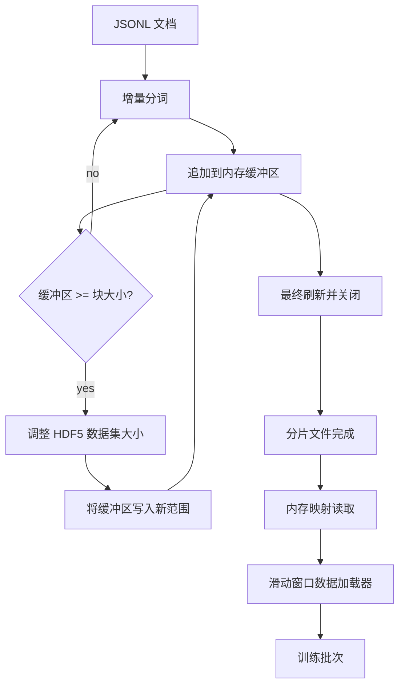

# HDF5 Tokenized Corpus

> 下载后的语料必须以训练器能够以线速（line speed）流式读取的布局保存到磁盘。磁盘上的 JSONL 无法在拥有 16 个 dataloader worker 时幸存；使用可调整大小、分块的整型 HDF5 数据集可以。此课程将流式分词写入可调整大小的 HDF5 数据集，跨多个文件分片写入，训练时进行基于内存映射的读取，并实现一个产生定长序列且具备正确打包规则的滑动窗口 dataloader。

**Type:** 构建
**Languages:** Python
**Prerequisites:** Phase 19 课程 30-37
**Time:** ~90 分钟

## 学习目标

- 将文档流式写入具有确定性分块的可调整大小的 HDF5 整型数据集。
- 将写入操作跨多个 HDF5 文件分片，以便并行处理并在失败时将影响限定在单个分片。
- 通过 HDF5 的页缓存（page-cache）友好的分块布局读取令牌，使 dataloader 仅在构建 batch 时将数据复制到 batch 缓冲区。
- 实现一个滑动窗口 dataloader，输出具备明确打包规则的定长训练序列。

## 问题描述

现代语言模型训练运行会在数十个 worker 之间以每秒几十万样本的速度读取令牌。磁盘上的 JSONL 在第一次冷缓存（cold-cache）页面错误时就会崩溃：JSON 解析慢、文档边界不可寻址、要“采样第 4,217,884 条”时需要扫描整个文件。即便 Parquet 压缩效果好，也不适合，因为训练器不需要列结构；它需要一个支持 O(1) 随机访问的扁平令牌流。

HDF5 之所以合适，是因为它提供了分块、可调整大小且仅包含整数的数据集，其分块在读取时对页缓存友好。训练器请求 `tokens[3,200,000 : 3,200,8192]` 这样的切片时，HDF5 会将所请求的超块（hyperslab）从页缓存复制到新分配的 NumPy 数组。代价是每个 worker 一个打开的文件句柄和一个等同于分块大小的页缓存占用，相较于解码 JSONL 的代价，这几乎可以忽略不计。

构建问题在于让写入端行为正确。可调整大小的数据集很容易被误用：每写入一个文档一次性扩展会导致 HDF5 文件高度碎片化无法使用；一次性把所有文档写完再 resize 则在进程死亡时丢失整个分片。正确的准则是 buffer-then-extend：使用与分块大小匹配的缓冲区，然后以分片写入，并使用分片化写入将工作负载拆分到多个文件，这样崩溃最多只会丢失一个分片。

## 概念



### 正确实现可调整大小的 HDF5

令牌数据集使用 `maxshape=(None,)` 创建，并固定 `chunks=(chunk_size,)`。写入通过将令牌缓存在长度为 `chunk_size` 的 NumPy 数组中进行。当缓冲区填满时，数据集按精确的 `chunk_size` 扩展（resize），并将缓冲区写入新增的范围。在分片结尾时，残余缓冲区写入最后一个部分范围。除了最后一次写入外，每次写入都是连续且对齐到分块的；读者通过记录在分片 HDF5 属性中的 `token_count` 来获知最终应截断的位置。

### 分片写入

单个 HDF5 文件是单点故障。流水线并行写入分片：来自 Phase 19 课程 42 的每个输入分片会产生一个 HDF5 输出分片。使用 `shards.json` 索引记录每个分片的文件路径、令牌计数、文档计数以及对令牌字节的 sha256。训练器读取 `shards.json` 来计算全局偏移并验证语料完整性。

### 基于内存映射的读取

训练时每个 worker 使用 `swmr=True` 模式打开其负责的一组 HDF5 文件，并请求 `tokens[start:stop]`。HDF5 的分块布局使得一旦分块被加载到页缓存，这就是一次基于页缓存的读取。worker 永远不会把整个文件物化：切片被复制到 dataloader 的 batch 缓冲区，dataloader 再在构建 batch 时将其复制到固定（pinned）内存的训练张量。热点路径在分块切换时每次只需要一次系统调用；其余都是内存访问。

### 滑动窗口 dataloader

dataloader 是唯一知道训练序列长度的阶段。它在全局令牌流中随机选择一个起始索引，读取 `window_size + 1` 个令牌，并返回 `(input, target) = (tokens[:-1], tokens[1:])`。不强制执行文档边界：一个窗口可以跨越两个文档，中间由明确的 `boundary_token_id` 分隔，使模型学会使用分隔符。这是标准的打包规则；也是初学者常忘记的规则，否则会导致语料中 8% 是训练边界令牌而 92% 是自然文本。

## 构建它

`code/main.py` 实现了：

- `Tokenizer` - 一个基于字节的确定性分词器，足以用于示例。接口为 `encode(text) -> list[int]` 和 `vocab_size`。
- `HDF5ShardWriter` - 打开一个可调整大小的整型数据集，将令牌缓存在与分块相等的缓冲区中，以固定大小的步幅进行 resize 并写入，关闭时在 HDF5 属性中记录 `token_count` 和 `sha256`。
- `ShardedTokenizationPipeline` - 遍历输入文档，将它们路由到写入器，并生成 `shards.json` 索引。
- `MmapTokenStore` - 以内存映射方式打开分片文件，计算全局偏移，并提供单一的 `get_slice(start, stop)` API。
- `SlidingWindowDataloader` - 从全局流中随机选择窗口并产出 `(input_ids, target_ids)` 的 NumPy 数组。

文件底部的 demo 构建了一个小型内存内语料库，将其分词成两个分片，通过内存映射打开它们，运行 dataloader 生成 10 个 batch，并打印每个 batch 的形状和校验和。

运行它：

```bash
python3 code/main.py
```

脚本以 0 退出并打印 batch 校验和。

## 生产模式

以下四种模式可将本课扩展到真实训练任务。

- Chunk size equals the typical read. 训练器每个样本读取 `window_size + 1` 个令牌。将 HDF5 的分块设置为 `window_size` 的整数倍，使读取与页缓存对齐。分块不匹配会将吞吐量减半，因为每个样本会触及两个分块。
- Token count in attributes, not in the dataset. 由于分块大小可能无法整除文档边界，数据集的尾部分块可能部分填充。将真实的 `token_count` 存为数据集的 HDF5 属性，让读取方在该值处截断。否则读取器会走出边界进入零填充令牌区域，模型便会学会预测零。
- Sharded sha256 with parallel verification. 每个分片对其令牌字节计算独立的 sha256。训练器可以在训练开始前并行验证所有分片。错误的 sha256 会让运行在早期失败，而不是在第 3 个 epoch、耗时十六小时后才失败。
- `swmr=True` on both sides, with `libver="latest"` on the writer. Single-Writer-Multiple-Reader 模式要求写入方以 `libver="latest"` 打开文件，事先创建好所有数据集，然后设置 `file.swmr_mode = True`。之后写入方必须在每次 resize 后调用 `dataset.flush()`，以便以 `swmr=True` 打开文件的读取 worker 能看到一致的数据。跳过 `libver="latest"` 或在结构性更改后才启用 SWMR 是导致“file is locked”失败的常见原因。

## 使用建议

生产中的实践：

- 一源分片对应一个 HDF5。下载器（课程 42）为每个 URL 产生一个源分片；分词器（本课）为每个源分片产生一个 HDF5。1:1 的映射使得恢复和部分失败恢复变得简单。
- 边界令牌 id。边界令牌是分词器词表的一部分，也是 dataloader 唯一会插入的令牌。如果训练损失要求忽略边界令牌，则对其做掩码；否则模型会学会将其作为序列分隔符使用。
- `shards.json` 作为真相来源。添加新分片意味着写入 HDF5、计算其 sha256 并追加索引项。训练器在启动时读取一次此文件，不再查看目录列表。

## 交付要点

在真实项目中，`outputs/skill-hdf5-tokenized-corpus.md` 会描述使用哪个分词器入该流水线、哪个分块大小与训练器的窗口匹配、`shards.json` 在版本控制中的存放位置，以及 dataloader worker 如何在文件间分片分配。本课交付了引擎实现。

## 练习

1. 为 HDF5 写入器添加 `--compression gzip` 标志，并在 demo 语料上测量吞吐量开销。为所选默认值辩护。
2. 为滑动窗口 dataloader 添加一个确定性种子，并验证相同种子下两次运行产生相同的 batch。
3. 添加 `--validate` 模式，读取每个分片，重新计算其令牌上的 sha256，并与 `shards.json` 比较。CI 在训练前应运行此检查。
4. 在分块大小等于、为窗口大小的一半、以及为窗口大小的两倍时对 dataloader 吞吐量进行比较。报告页缓存的影响。
5. 添加 `--max-document-tokens` 标志，在写入时截断过长文档。为与在读取时决定相比的权衡进行辩护。

## 关键词

| Term | What people say | What it actually means |
|------|-----------------|------------------------|
| Resizable dataset | "Append-only" | 一个通过调用 `resize` 以分块步幅增长的 HDF5 数据集，使用 `maxshape=(None,)` |
| Chunked layout | "How HDF5 stores it" | 固定大小的磁盘页，内核可以对其进行内存映射且 dataloader 可以连续读取 |
| `swmr` mode | "Read-while-write" | Single-Writer-Multiple-Reader 模式，允许 dataloader worker 安全共享文件 |
| Shard index | "shards.json" | 包含偏移和内容哈希的所有令牌分片的持久索引 |
| Sliding window | "Training sample" | 全局令牌流的一个定长切片，训练器将其与向右偏移一位的目标配对 |

## 延伸阅读

- [HDF5 chunking documentation](https://docs.hdfgroup.org/hdf5/v1_14/) - 本课使用的分块、可调整大小数据集布局文档
- [h5py user guide](https://docs.h5py.org/en/stable/) - HDF5 的 Python 绑定
- [NumPy memory mapping](https://numpy.org/doc/stable/reference/generated/numpy.memmap.html) - HDF5 通过 h5py 在读取端提供的原语
- Phase 19 · 42 - 本课要分词的下载器输出
- Phase 19 · 44 - 消耗此 dataloader 的余弦学习率表
- Phase 19 · 45 - 包裹训练步骤的 AMP 循环