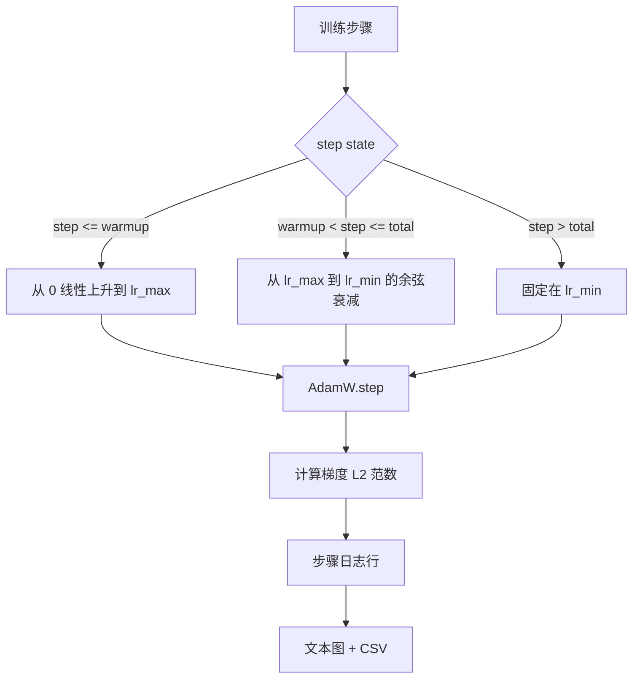

# Cosine LR with Linear Warmup

> 学习率调度是在损失函数之后的第二重要决策。带线性预热的 AdamW 搭配余弦衰减是语言模型训练的现代默认，因为它使模型在脆弱的前一千次更新中见到较小的有效步长，逐步上升到配置的峰值，然后平滑地衰减回接近零。本课实现该调度，绘制训练步上的曲线，在调度旁记录梯度范数，并证明该调度在预热、峰值和衰减边界处是正确的。

**Type:** 构建  
**Languages:** Python  
**Prerequisites:** Phase 19 课程 30-37  
**Time:** ~90 分钟

## 学习目标

- 实现一个与带线性预热的余弦学习率调度相连的 AdamW 优化器。
- 在任意步上精确计算调度值，避免跨运行的浮点漂移。
- 将梯度 L2 范数与学习率并列记录，以便观察训练健康状况。
- 将调度渲染为易读的文本图和可被任意工具消费的 CSV。

## 问题

训练的前一千次更新是最危险的。模型权重仍接近初始化，优化器的二阶矩估计尚未稳定，梯度范数很大且噪声明显。如果在这些更新期间学习率处于峰值，模型要么直接发散，要么陷入无法逃脱的损失平台期。两个常见修复方法是梯度裁剪（Phase 19 第 45 课）和一个从小到大的学习率调度（即预热）。

带预热的余弦调度有三个区间。从步 0 到 `warmup_steps`，学习率线性从 0 缩放到配置的峰值 `lr_max`。从 `warmup_steps` 到 `total_steps`，学习率遵循余弦曲线的上半段，从 `lr_max` 衰减到 `lr_min`。在 `total_steps` 之后学习率固定在 `lr_min`，以防训练器配置错误而超出预期范围时无声地偏离调度。

实现问题在于调度很容易出现越界（off-by-one）错误。越界通常在训练运行几个小时后显现为在模型开始过拟合的关键时刻学习率高或低约 1%，这在未对边界进行详尽测试时常常不可见。

## 概念



### 预热公式

对于 `step` 属于 `[0, warmup_steps]` 且 `warmup_steps > 0` 的情况，学习率为 `lr_max * step / warmup_steps`。退化情况 `warmup_steps = 0` 被视为“无预热”：调度在步 0 直接从 `lr_max` 开始并立即进入余弦衰减。有些测试框架会传入 `warmup_steps = 0` 来检查调度是否仍能产生可用曲线。

### 余弦公式

对于 `step` 属于 `(warmup_steps, total_steps]`，学习率为 `lr_min + 0.5 * (lr_max - lr_min) * (1 + cos(pi * progress))`，其中 `progress = (step - warmup_steps) / max(1, total_steps - warmup_steps)`。在 `step = warmup_steps` 时余弦为 `cos(0) = 1`，得到 `lr_max`，与预热端点精确匹配。在 `step = total_steps` 时余弦为 `cos(pi) = -1`，得到 `lr_min`，与衰减端点精确匹配。

两端点处的连续性不是巧合。这就是为什么将调度实现为关于 `step` 的单一函数而不是拼接三个不同函数的原因。拼接调度在第一次更改 `lr_max` 时会丢失一个边界。

### total steps 之后的下限

对于 `step > total_steps`，学习率保持在 `lr_min`。契约是明确的：调度既不报错也不外推；它钉在下限并让训练器记录警告。需要延长训练的训练器会调整调度的 `total_steps`，而不是更改训练循环。

### 与学习率并列记录梯度范数

调度是训练健康的一半，梯度范数是另一半。训练循环应在每步记录两者。发散的训练运行通常会在损失之前显示梯度范数的激增；良好调谐的预热会使范数随学习率线性上升；过激的峰值会表现为预热后范数仍然很高。磁盘上的数据集为 `step, lr, grad_l2_norm, loss`。CSV 是唯一的持久记录。

## 构建实现

`code/main.py` 实现了：

- `CosineWithWarmup` - 一个无状态函数 `lr(step) -> float`，表示配置的调度。
- `TrainState` - 将模型、`AdamW` 优化器和调度包装为单个步函数。
- `TrainState.step` - 运行一次前向传播、一次反向传播，记录梯度 L2 范数，并将 `lr(step)` 应用到优化器。
- `plot_schedule_ascii` - 将调度渲染为易读的文本图。
- `write_schedule_csv` - 以每步一行的方式输出学习率到 CSV。

文件底部的演示构建了一个微小的 `nn.Linear` 模型，在固定输入小批次上训练 20 步，并打印每步的学习率、梯度范数和损失。调度也会以文本图的形式渲染以供视觉检查。

运行它：

```bash
python3 code/main.py
```

脚本以零退出，并打印每步训练日志以及调度图。

## 生产实践

四种模式能将调度提升为生产级构件。

- 调度应存在于配置中，而非硬编码在代码里。训练器从 YAML 或 JSON 配置读取 `warmup_steps`、`total_steps`、`lr_max`、`lr_min` 并提交到 git。调度可复现，因为配置是内容寻址的；调度可审计，因为配置是 PR diff 的一部分。
- 步计数器要单调且与 epoch 解耦。一些框架在数据分片或 dataloader 重启时会混淆步和 epoch。调度应从训练器的检查点读取 `global_step`，而不是本地计数器。恢复运行会在正确的调度位置继续，因为步计数器是持久的时间轴。
- 在运行目录中保存调度图。每次训练运行将 `outputs/lr_schedule.png`（在本课中为文本图）写入其运行目录。审阅者只需浏览目录就能对调度进行合理性检查，无需重新运行任何内容。这在 PR 阶段就能捕获调度配置错误的类问题。
- 日志行的 schema 固定为 `step, lr, grad_l2_norm, loss`（按此顺序）。下游笔记本或看板按该 schema 读取；在不更新版本号的情况下重命名列会使所有现有看板失效。

## 使用建议

生产实践：

- 在扫其他参数之前先扫峰值（peak）。`lr_max` 是最敏感的旋钮。先在小模型上对其进行扫参；最优 `lr_max` 随模型规模的缩放较弱，因此小模型的扫参是很强的先验。
- 预热应是总步数的一个比例，而不是绝对计数。一个 2 亿步的训练若只用 2,000 步预热会几乎立刻达到峰值；而一个 20,000 步的训练在相同预热步数下则会预热 10%。将预热配置为一个比例（典型：1-3%）以便随训练时长伸缩。
- `lr_min` 有意设置为非零。一个为 `lr_max` 的 10% 的下限能在长尾期间保持优化器学习。`lr_min = 0` 的调度在图上看起来很好，但模型实际上可能还没有完成训练。

## 发布

在真实项目中，`outputs/skill-cosine-warmup.md` 会描述哪个配置承载调度、从训练器的哪个步骤读取全局计数器，以及哪个 `lr_max` 的扫参产生了部署值。本课交付的是引擎实现。

## 练习

1. 添加一个反平方根（inverse-square-root）变体的调度，并在 200 步的玩具训练上比较。哪个曲线在最终损失上更低？
2. 添加一个 `--restart` 标志，在 `total_steps / 2` 处增加第二次预热。论证在玩具实验中重启式预热是提升还是有害的。
3. 添加单元测试验证调度连续性：对于 `[0, total_steps]` 中的每个步，差值 `|lr(step+1) - lr(step)|` 被界定在 `lr_max / warmup_steps` 之内。
4. 将调度接入 `torch.optim.lr_scheduler.LambdaLR`，以便它能与框架代码组合。本课使用了纯步函数；包装器会带来哪些改变？
5. 添加 `--plot-png` 标志，使用 `matplotlib` 写出真实 PNG 图。论证本课的文本图和 PNG 哪个更适合 CI 运行的默认选项。

## 关键术语

| 术语 | 外行说法 | 实际含义 |
|------|---------|----------|
| 预热 (Warmup) | "慢启动" | 在前 `warmup_steps` 次更新上从 0 线性上升到 `lr_max` |
| 余弦衰减 (Cosine decay) | "平滑下降" | 在剩余步数上从 `lr_max` 到 `lr_min` 的余弦上半段 |
| 下限 (Floor) | "训练之后" | 在 `total_steps` 之后调度固定的 `lr_min` 值 |
| 梯度范数 (Gradient norm) | "梯度的 L2" | 将所有梯度拼接后的欧几里得范数，每步记录一次 |
| 全局步 (Global step) | "调度轴" | 一个单调的步计数器，可在重启后保留并驱动调度 |

## 延伸阅读

- [Loshchilov and Hutter, SGDR: Stochastic Gradient Descent with Warm Restarts (arXiv 1608.03983)](https://arxiv.org/abs/1608.03983) - 余弦调度的参考论文  
- [Loshchilov and Hutter, Decoupled Weight Decay Regularization (arXiv 1711.05101)](https://arxiv.org/abs/1711.05101) - AdamW 的参考论文  
- [PyTorch torch.optim.lr_scheduler](https://docs.pytorch.org/docs/stable/optim.html#how-to-adjust-learning-rate) - 关于步函数如何与框架调度器组合的文档  
- Phase 19 · 42 - 本调度所消费语料的下载器  
- Phase 19 · 43 - 与调度共同演化的数据加载器  
- Phase 19 · 45 - 梯度裁剪与 AMP，本循环的下一层功能