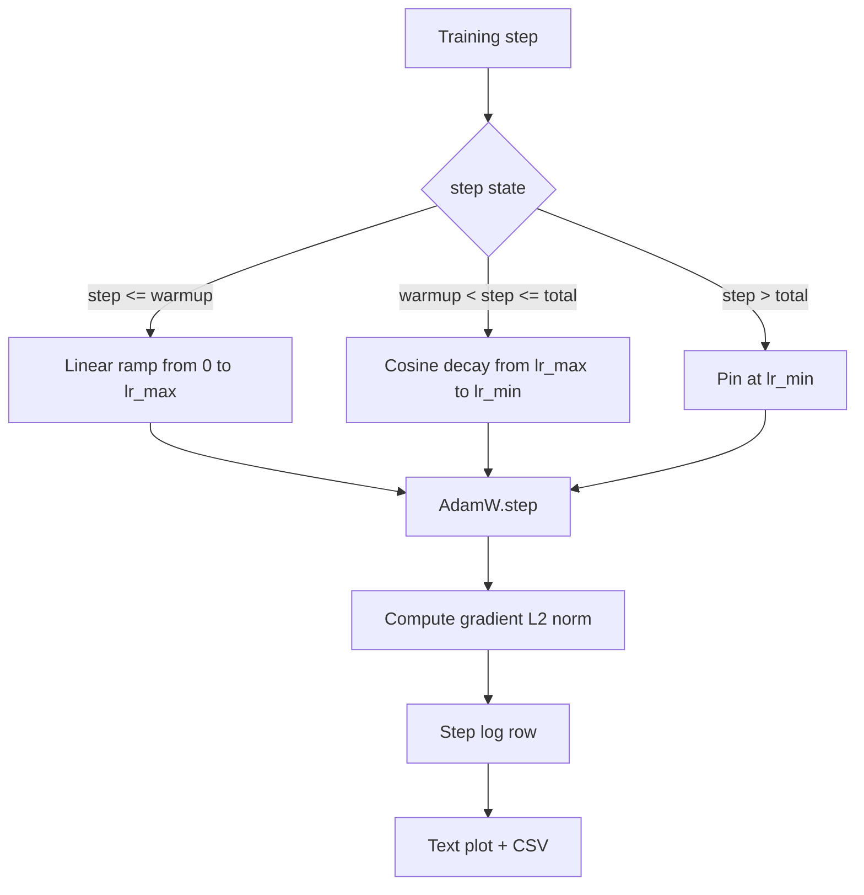

# Cosine LR with Linear Warmup

> The learning-rate schedule is the second most important decision after the loss function. AdamW with a cosine decay and a linear warmup is the modern default for language-model training because it lets the model see a small effective step size during the brittle first thousand updates, ramps up to a configured peak, and decays smoothly back toward zero. This lesson builds that schedule, plots the curve over training steps, logs gradient norms next to the schedule, and proves the schedule honors warmup, peak, and decay boundaries.

**Type:** Build
**Languages:** Python
**Prerequisites:** Phase 19 lessons 30-37
**Time:** ~90 minutes

## Learning Objectives

- Implement an AdamW optimizer wired to a cosine learning-rate schedule with linear warmup.
- Compute the schedule's exact value at any step without floating-point drift across runs.
- Log gradient L2 norm side by side with the learning rate so training health is observable.
- Render the schedule to a text plot the eye can read and a CSV any tool can consume.

## The Problem

The first thousand training updates are the loudest. The model's weights are still close to initialization. The optimizer's running second-moment estimate has not stabilised. The gradient norm is large and noisy. If the learning rate is at its peak during these updates the model either diverges outright or settles into a loss plateau it never escapes. The two well-known fixes are gradient clipping, which is the subject of Phase 19 lesson 45, and a learning-rate schedule that starts small and ramps up.

The cosine-with-warmup schedule has three regions. From step zero to step `warmup_steps` the learning rate scales linearly from zero to the configured peak `lr_max`. From step `warmup_steps` to step `total_steps` the learning rate follows the upper half of a cosine curve, decaying from `lr_max` to `lr_min`. After `total_steps` the learning rate is pinned at `lr_min` so a misconfigured trainer that overshoots does not silently exit the schedule.

The build problem is that schedules are easy to get wrong off by one. The off-by-one shows up six hours into a training run as a learning rate that is 1 percent too high or too low at the moment the model starts overfitting, which is invisible unless the schedule is exhaustively tested at boundaries.

## The Concept



### Warmup formula

For `step` in `[0, warmup_steps]` with `warmup_steps > 0`, the learning rate is `lr_max * step / warmup_steps`. The degenerate `warmup_steps = 0` case is treated as "no warmup": the schedule starts directly at `lr_max` at step zero and immediately enters cosine decay. Some test harnesses pass `warmup_steps = 0` to check the schedule still produces a usable curve.

### Cosine formula

For `step` in `(warmup_steps, total_steps]` the learning rate is `lr_min + 0.5 * (lr_max - lr_min) * (1 + cos(pi * progress))` where `progress = (step - warmup_steps) / max(1, total_steps - warmup_steps)`. At `step = warmup_steps` the cosine evaluates to `cos(0) = 1`, which gives `lr_max`, matching the warmup endpoint exactly. At `step = total_steps` the cosine evaluates to `cos(pi) = -1`, which gives `lr_min`, matching the decay endpoint exactly.

The continuity at both endpoints is not an accident. It is the reason the schedule is implemented as a single function over `step`, not as three different functions glued together. A glued schedule loses one boundary the first time `lr_max` is changed.

### Floor after total steps

For `step > total_steps` the learning rate stays at `lr_min`. The contract is explicit: the schedule does not error out and does not extrapolate; it pins at the floor and lets the trainer log a warning. Trainers that need to extend training change the schedule's `total_steps`, not the loop.

### Gradient norm logging alongside the rate

The schedule is half of training health. The gradient norm is the other half. The training loop logs both per step. A divergent training run shows the gradient norm spike before the loss does; a well-tuned warmup keeps the norm rising linearly with the rate; a too-aggressive peak shows up as a norm that stays high after warmup. The dataset on disk is `step, lr, grad_l2_norm, loss`. The CSV is the only durable record.

## Build It

`code/main.py` implements:

- `CosineWithWarmup` - a stateless function `lr(step) -> float` over the configured schedule.
- `TrainState` - wraps a model, an `AdamW` optimizer, and the schedule into a single step function.
- `TrainState.step` - runs one forward pass, one backward pass, logs gradient L2 norm, and applies `lr(step)` to the optimizer.
- `plot_schedule_ascii` - renders the schedule as a text plot the eye can read.
- `write_schedule_csv` - emits one row per step with the learning rate.

A demo at the bottom of the file builds a tiny `nn.Linear` model, trains for 20 steps over a fixed input batch, and prints the per-step learning rate, gradient norm, and loss. The schedule is also rendered as a text plot for the visual sanity check.

Run it:

```bash
python3 code/main.py
```

The script exits zero and prints a per-step training log plus the schedule plot.

## Production Patterns

Four patterns elevate the schedule to a production artifact.

**Schedule lives in a config, not in code.** The trainer reads `warmup_steps`, `total_steps`, `lr_max`, `lr_min` from a YAML or JSON config that is committed to git. The schedule is reproducible because the config is content-addressed; the schedule is auditable because the config is part of the PR diff.

**Step counter is monotonic and decoupled from epochs.** Some frameworks confuse step and epoch when the dataset is sharded or the dataloader restarts. The schedule reads `global_step` from the trainer's checkpoint, not from a local counter. A resumed run continues at the right schedule position because the step counter is the durable axis.

**Schedule plot in the run directory.** Every training run writes `outputs/lr_schedule.png` (or in this lesson a text plot) into its run directory. A reviewer who skims the directory can sanity-check the schedule without re-running anything. This catches the misconfigured-schedule class of bugs at PR time.

**Log row schema is fixed.** `step, lr, grad_l2_norm, loss` in that order. A downstream notebook or dashboard reads the schema; renaming a column without bumping a version invalidates every existing dashboard.

## Use It

Production patterns:

- **Sweep peak before sweeping anything else.** `lr_max` is the most sensitive knob. Sweep it on a small model first; the optimal `lr_max` scales weakly with model size, so the small-model sweep is a strong prior.
- **Warmup is a fraction of total steps, not an absolute count.** A 200-million-step run with 2,000 warmup steps starts at peak almost immediately; a 20,000-step run with the same number warms up for 10 percent. Configure warmup as a fraction (typical: 1-3 percent) so the schedule scales with training duration.
- **`lr_min` is non-zero on purpose.** A floor that is 10 percent of `lr_max` keeps the optimizer learning during the long tail. A `lr_min = 0` schedule produces a training curve that looks great on a plot and a model that has not actually finished training.

## Ship It

`outputs/skill-cosine-warmup.md` would, on a real project, describe which config carries the schedule, which trainer step the global counter is read from, and what `lr_max` sweep produced the deployed value. This lesson ships the engine.

## Exercises

1. Add an inverse-square-root variant of the schedule and compare it on a 200-step toy training run. Which curve produces the lower final loss?
2. Add a `--restart` flag that adds a second warmup at `total_steps / 2`. Defend whether warm restarts improve or hurt on the toy run.
3. Add a unit test that the schedule is continuous: for every step in `[0, total_steps]` the difference `|lr(step+1) - lr(step)|` is bounded by `lr_max / warmup_steps`.
4. Wire the schedule into a `torch.optim.lr_scheduler.LambdaLR` so it composes with framework code. The lesson uses a plain step function; what does the wrapper change?
5. Add a `--plot-png` flag that writes a real plot via `matplotlib`. Defend whether the lesson's text plot or the PNG is the better default for CI runs.

## Key Terms

| Term | What people say | What it actually means |
|------|-----------------|------------------------|
| Warmup | "Slow start" | Linear ramp from zero to `lr_max` over the first `warmup_steps` updates |
| Cosine decay | "Smooth drop" | Upper-half cosine curve from `lr_max` to `lr_min` over the remaining steps |
| Floor | "After training" | The fixed `lr_min` value the schedule pins at past `total_steps` |
| Gradient norm | "L2 of grads" | The Euclidean norm of the concatenated gradient vector, logged each step |
| Global step | "Schedule axis" | A monotonic step counter that survives restarts and drives the schedule |

## Further Reading

- [Loshchilov and Hutter, SGDR: Stochastic Gradient Descent with Warm Restarts (arXiv 1608.03983)](https://arxiv.org/abs/1608.03983) - the cosine schedule's reference paper
- [Loshchilov and Hutter, Decoupled Weight Decay Regularization (arXiv 1711.05101)](https://arxiv.org/abs/1711.05101) - AdamW's reference paper
- [PyTorch torch.optim.lr_scheduler](https://docs.pytorch.org/docs/stable/optim.html#how-to-adjust-learning-rate) - how step functions compose with framework schedulers
- Phase 19 · 42 - the downloader whose corpus this schedule consumes
- Phase 19 · 43 - the dataloader the schedule co-evolves with
- Phase 19 · 45 - gradient clipping and AMP, the next layer in the loop
