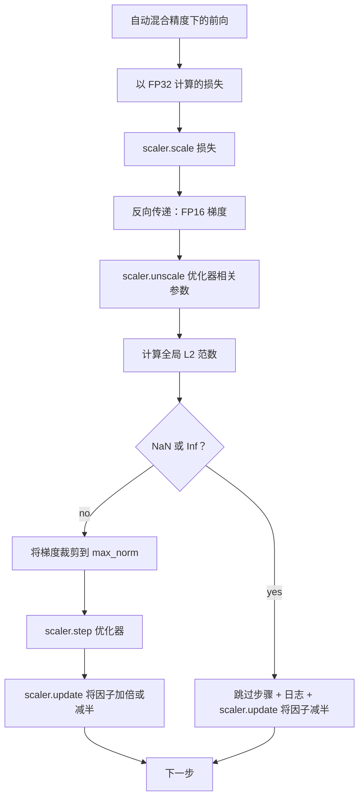

# 梯度裁剪与混合精度

> 上一课的优化器和调度假设梯度是合理的。通常并非如此。单个有问题的批次就可能使梯度范数暴涨三个数量级。混合精度训练通过在损失端引入 FP16 溢出进一步放大了这个问题。本课构建生产训练无法缺少的两道安全带：将梯度裁剪到配置的全局 L2 范数，以及带有 autocast 和 GradScaler 的混合精度循环，该循环可检测 NaN 和 Inf，干净地跳过该步，并记录缩放因子以便取证。

**Type:** 构建  
**Languages:** Python  
**Prerequisites:** Phase 19 课程 30-37  
**Time:** ~90 分钟

## 学习目标

- 计算所有参数梯度的全局 L2 范数，并在超过配置阈值时原地裁剪。
- 在 autocast 与 GradScaler 中封装训练步骤，使 FP16 的前向和大部分反向传递在溢出时能幸存。
- 检测损失或梯度中的 NaN 与 Inf，跳过优化器步骤并记录跳过原因。
- 每步报告 GradScaler 的缩放因子，以便立即看出连续跳过的情况。

## 问题描述

昨天运行良好的训练在第 8,217 步时损失曲线突然竖直飙升。罪魁祸首是一个批次，其梯度范数为 4,200，是先前峰值的二十倍。如果不裁剪，优化器会应用一个更新，这个更新会把模型在过去一小时内学到的一切全部重置。若对全局 L2 以范数 1.0 裁剪，同一批次只会贡献单位范数的更新；损失保持在趋势线上；训练得以生存下来。

混合精度训练通过将前向和大部分反向以 FP16 计算把吞吐量提高 2-3 倍。代价是 FP16 的指数范围狭窄。典型的在 FP16 中溢出的梯度会评估为 Inf，随后在后续层传播为 NaN，然后在下一次优化器步将每个权重置为 NaN。PyTorch 的 GradScaler 通过在反向之前将损失乘以一个大的缩放因子，并在优化器步之前对梯度做相同的逆缩放来解决这个问题。如果在 unscale 时有任何梯度是 Inf 或 NaN，scaler 会跳过该步并将缩放因子减半；如果前 N 步都正常，则 scaler 会将因子加倍。随着训练进行，因子会找到 FP16 范围允许的最大值。

构建问题是要把两者正确连接起来。在 unscale 之前裁剪会使阈值作用于已缩放的梯度；在 unscale 之后裁剪则需要注意 GradScaler 的操作顺序。正确顺序是：`scaler.scale(loss).backward()`，然后 `scaler.unscale_(optimizer)`，然后 `clip_grad_norm_`，然后 `scaler.step(optimizer)`，最后 `scaler.update()`。任何其他顺序都会产生静默失效的循环。

## 概念



### 全局 L2 范数

全局 L2 范数是将所有参数梯度拼接后的欧几里得范数，而不是按参数的范数。PyTorch 将其实现为 `torch.nn.utils.clip_grad_norm_(parameters, max_norm)`。该函数返回裁剪前的范数，以便本课记录自然范数和被裁剪后的范数，这对于诊断“我们每步都在裁剪”是必要的。

### autocast 和 GradScaler

`torch.amp.autocast(device_type)` 是上下文管理器，选择性地在 FP16 下运行兼容的操作（大多数矩阵乘法类操作）。`torch.amp.GradScaler(device_type)` 是在反向之前缩放损失并在优化器步之前反向缩放梯度的辅助工具。两者是配套设计的；只使用其中一个而不使用另一个是一种配置错误，测试应能捕获到这一点。

本课使用 CPU autocast 因为 CI 中是用 CPU；只需把 `device_type="cpu"` 改为 `device_type="cuda"`，相同模式即可逐字转移到 CUDA。CPU 上的 GradScaler 是一个桩（CPU autocast 通常默认使用 BF16 并不需要损失缩放），但本课仍包含调用位点以便其与 GPU 循环的布线完全一致。

### NaN 和 Inf 检测

检测发生在两个位置。首先，在反向之前使用 `torch.isfinite` 检查损失；Inf 或 NaN 的损失不会产生有用梯度，应在进入优化器前被跳过。第二，在 `scaler.unscale_(optimizer)` 之后，本课扫描未缩放的梯度（使用 `has_non_finite_grad(...)`）并将任何 Inf 或 NaN 当作跳过。两次检查一起覆盖了前向失败和反向失败两种模式。

### 缩放因子诊断

缩放因子是 GradScaler 的内部状态。每步本课都会读取 `scaler.get_scale()` 并把它连同学习率和梯度范数一起记录。健康的训练过程中，缩放因子会以 2 的幂增长直到在 `2^17` 或 `2^18` 附近饱和。异常的训练会看到因子在高值与低值之间振荡，这表明模型的梯度有时在可表示范围内，有时不在。没有日志，这个诊断是不可见的。

## 构建实现

`code/main.py` 实现了：

- `clip_global_l2_norm` - 封装 `torch.nn.utils.clip_grad_norm_`，返回裁剪前与裁剪后的范数。
- `has_non_finite_grad` - 扫描梯度以查找 NaN 和 Inf 的辅助函数。
- `AmpTrainState` - 封装模型、`AdamW` 优化器、GradScaler 和 autocast 设备。暴露 `step(inputs, targets)`，运行完整的裁剪、缩放与遇 NaN 则跳过的流水线。
- `StepLog` 与 `SkipLog` - 每步的结构化记录。
- 一个演示：训练一个小型 `nn.Linear` 模型 20 步，在第 5 步向梯度注入 Inf 以触发跳过路径，并打印生成的日志。

运行示例：

```bash
python3 code/main.py
```

脚本以零退出并打印每步日志，每行带有 `STEP` 或 `SKIP` 标签；至少会有一行是 `SKIP`。

## 生产模式

四种模式能将该循环提升为生产训练步骤。

- 跳过计数作为告警而非仅是日志行。训练中出现少量跳过是健康的。每个 epoch 出现数百次跳过是严重告警：模型处于 FP16 无法维持的区间并且循环在静默失败。本课跟踪一个 1,000 步滚动跳过率，并且在生产中当率超过 5% 时会触发报警。
- 裁剪阈值应存放在配置中。`max_norm = 1.0` 是现代大型语言模型训练的默认值。先在小模型上做搜索；更大的阈值可以让模型从真正困难的批次中恢复；更小的阈值能在代价是更嘈杂的损失曲线的情况下界定最坏情形。阈值应与第 44 课中的调度放在同一个 YAML 或 JSON 配置里。
- 范数日志应与调度一并写入 CSV。CSV 列为 `step, lr, grad_l2_pre_clip, grad_l2_post_clip, loss, skipped, skip_reason, scaler_scale`。审查者打开文件时能在一行中看到调度、梯度故事、缩放因子和跳过结果（及其原因）。把这些列分散到多个文件会导致对齐分析出错。
- `scaler.update()` 每步都要运行，即使在跳过路径上也是如此。在干净的步骤上，scaler 读取其无 Inf 的计数器，递增计数，并可能将因子加倍；在跳过步骤上，scaler 将因子减半并重置计数器。在跳过路径忘记调用 `update()` 会导致“缩放因子从未改变”的错误。

## 使用细则

生产使用建议：

- Autocast 设备应与优化器设备匹配。GPU 训练请使用 `torch.amp.autocast(device_type="cuda")`；CPU 使用 `torch.amp.autocast(device_type="cpu")`。混用设备会产生一种静默的类型错误，其表现为看似正常的损失曲线但模型并未学习。
- 在反向之前检查损失。`torch.isfinite(loss).all()` 是一次张量归约；开销可忽略，但在遇到 NaN 损失时能节省整整一步训练。务必使用它。
- 在 `zero_grad` 中使用 `set_to_none=True`。该设置将梯度置为 `None` 而不是零，这让优化器跳过未受影响的参数组的计算。该设置既能提高吞吐量，也能略微减少问题面。

## 交付说明

在真实项目中，`outputs/skill-clip-amp.md` 会说明训练步骤使用的裁剪阈值和 autocast 设备、每步 CSV 在版本控制中的存放位置、以及生产跳过率告警阈值。本课交付了引擎实现。

## 练习

1. 用真实的损失峰值（将某批次的目标乘以 1e8）替换合成的 Inf 注入，并验证跳过路径被触发。
2. 添加一个 `--bf16` 模式，使 autocast 使用 BF16 而不是 FP16。BF16 的指数范围比 FP16 宽，通常不需要损失缩放；验证在相同演示上跳过率降为零。
3. 添加单元测试，验证当不发生裁剪时梯度裁剪包装器返回的裁剪前和裁剪后范数是正确的。
4. 添加滚动窗口的跳过率计算和一个 CLI 标志，当该率在连续 100 步内超过配置阈值时使运行失败。
5. 将循环接入写入规范 CSV（`step, lr, grad_l2_pre_clip, grad_l2_post_clip, loss, skipped, skip_reason, scaler_scale`），并确认文件在 Ctrl-C 中断后通过每行刷新仍能保存。

## 关键术语

| 术语 | 常说 | 真实含义 |
|------|------|---------|
| 全局 L2 范数 (Global L2 norm) | “裁剪目标” | 将所有可训练参数的梯度向量拼接后的欧几里得范数 |
| autocast | “混合精度” | 在 `with` 块内选择性地以 FP16（或 BF16）执行兼容操作 |
| GradScaler | “损失缩放器” | 在反向之前乘以损失并在优化器步骤之前对梯度做逆缩放的辅助工具 |
| Skip（跳过） | “坏步” | 因梯度或损失为非有限值而拒绝的优化器步骤；scaler 会将因子减半 |
| 缩放因子 (Scaling factor) | “Scaler 状态” | GradScaler 当前的乘数；在连续干净步骤后加倍，在每次跳过后减半 |

## 延伸阅读

- [Micikevicius et al., Mixed Precision Training (arXiv 1710.03740)](https://arxiv.org/abs/1710.03740) - 最初的损失缩放提案  
- [Pascanu, Mikolov, Bengio, On the difficulty of training recurrent neural networks (arXiv 1211.5063)](https://arxiv.org/abs/1211.5063) - 梯度裁剪参考论文  
- [PyTorch torch.amp.GradScaler](https://docs.pytorch.org/docs/stable/amp.html) - 本课封装的 scaler API  
- [PyTorch torch.nn.utils.clip_grad_norm_](https://docs.pytorch.org/docs/stable/generated/torch.nn.utils.clip_grad_norm_.html) - 本课使用的裁剪原语  
- Phase 19 · 42 - 为本循环提供语料的下载器  
- Phase 19 · 43 - 循环所消费的数据加载器  
- Phase 19 · 44 - 本循环与之组合的调度器