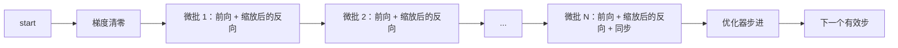
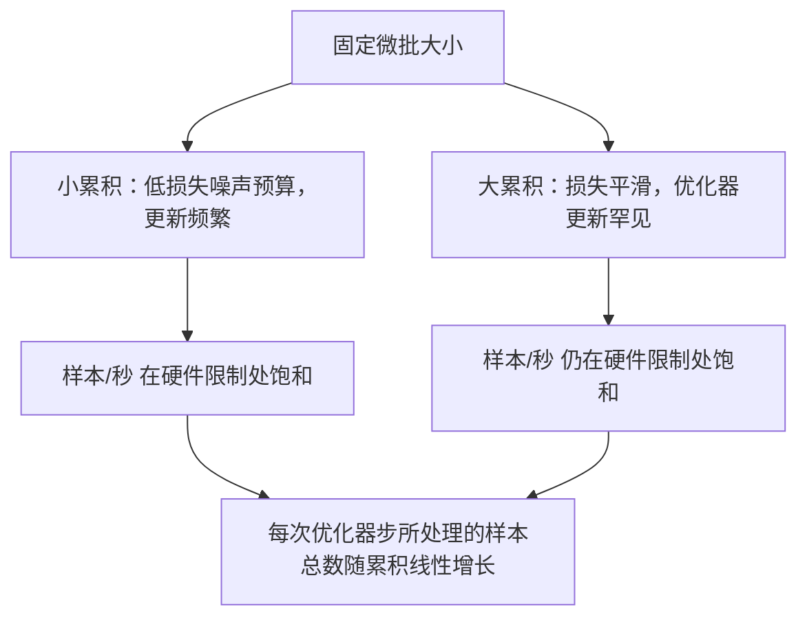

# 梯度累积

> 在你负担不起的有效批次下训练，一次一个微批。缩放损失，延后优化器步进，让梯度在缓冲区中累积。

**Type:** 构建  
**Languages:** Python  
**Prerequisites:** Phase 19 第42到45课  
**Time:** ~90 分钟

## 学习目标

- 推导有效批次恒等式：`effective_batch = micro_batch * accum_steps`。
- 实现每个微批的损失缩放，使得累积梯度与单个整批的反向传播一致。
- 在最后一个微批之前跳过优化器的同步（sync-on-last-step）。
- 读取“吞吐量对有效批次”的曲线并解释收益递减现象。

## 问题背景

你想以有效批次 512 进行训练，因为在该规模下损失曲线更平滑，优化器的步进在语义上也更合理。桌面加速器在内存耗尽前只能容纳 32 个样本。加倍微批不可行，缩小模型也不可行。业界自 2017 年以来采用并持续使用的技巧是：运行 16 次反向传播，让梯度在参数缓冲区中累积，只有当计数达到目标时才执行优化器步进。

风险在于损失不再等于大批次下的那个数值。简单地把 16 个小批次的交叉熵相加会得到单个整批损失的 16 倍。若不缩放，梯度方向是正确的但幅度错误，优化器的步长会大约放大 16 倍。修正方法只需除以一个数。但这个修正也容易被忘记。

## 概念



约定很简单：

- 每个微批的损失在 `backward()` 之前除以 `accum_steps`。PyTorch 默认将梯度累加到 `param.grad`；除法操作将运行中的累加和缩放回正确的量级。
- 优化器步进只在每个有效批次之后触发，即在最后一个微批的 backward 之后。中途步进会扭曲参数，使得后续所有计算都基于错误的参数。
- 优化器的状态（动量缓冲，Adam 的一阶二阶矩）应按有效步进推进，而不是按每个微批。否则指数移动平均会看到错误的频率并消耗掉调度计划。
- 在单设备上这只是记账。在多卡集群上，同样的模式会把非最终微批用 `no_sync` 上下文包裹，从而跳过梯度的 all-reduce；最后一个微批把完整累积的梯度一次性归约，而不是把网络成本付 N 次。

### 代码等价性证明

```python
loss = criterion(model(x_full), y_full)
loss.backward()
opt.step()
```

等价于

```python
for x, y in chunks(x_full, y_full, n):
    scaled = criterion(model(x), y) / n
    scaled.backward()
opt.step()
```

（浮点求和顺序的差异会带来微小差别。）循环结束时的累积梯度缓冲区与单次整批反向传播产生的张量相同。课件代码在 `equivalence_check` 中断言两者的最大绝对差小于 1e-4。

### 成本去向

每个微批都会付出一次前向和一次反向传播。通过累积，你用时间换内存。`outputs/accum-curve.json` 中的吞吐曲线展示了在固定微批下随着有效批次增长会发生什么：



没有免费午餐。将 `accum_steps` 翻倍会把每次优化器步的墙钟时间翻倍。变化的是梯度估计的方差：在相同的墙钟预算下，你的优化步数变少，但每一步是基于更多样本的平均。文献把大批和小批视为不同的优化问题；这里的结论是机械性的，而非统计性的。

## 实现

`code/main.py` 是可运行的成品。它完成三件事。

### 第 1 步：等价性检测

`equivalence_check()` 用相同的随机种子构建了两份相同的网络。一个在一次前向中看到 16 个样本；另一个看到四个 4 样本的分块，并在每个分块上将损失除以 4。该函数在优化器步进之前比较梯度缓冲区，并在步进之后比较参数。断言为 `max_abs_diff < 1e-4`。

### 第 2 步：只在最后同步模式

`train_one_optimizer_step` 遍历微批。对于除了最后一个之外的每个微批，它都会进入 `no_sync_context(model)`。在单进程上该上下文是无操作；在 DDP 上这里会跳过梯度 all-reduce。记账方法在任何情况下相同。一个 `sync_counter` 记录我们离开 `no_sync` 范围的次数；对于 N 个微批，计数是每个有效步一次，而不是 N 次。

### 第 3 步：吞吐曲线

`sweep_effective_batches` 在固定微批和一系列累积步数下运行相同模型。对于每个设置它会记录：

- `samples_per_sec`: 总样本数除以墙钟时间
- `median_step_ms`: 每个有效步的中位耗时
- `sync_calls`: 调用集合通信的次数
- `avg_loss`: 在该配置下优化器步的平均损失

输出写入 `outputs/accum-curve.json`，可以在笔记本中重用。

运行方式：

```bash
python3 code/main.py
```

脚本会打印等价性差异、接着打印扫表，然后给出 JSON 路径。退出码为零表示成功。

## 在生产中的使用

在生产训练中，梯度累积通常由一个参数控制。PyTorch 的常用模式是 `accumulation_steps = effective_batch // (micro_batch * world_size)`。不能在此处使用的框架会封装同样的循环，但步骤相同：缩放损失、在非最终微批跳过同步、累积、按有效批步进一次。

三种常见模式：

- 微批大小选为使设备内存饱和。任何更小都浪费加速器周期；任何更大都会 OOM。
- 有效批次由学习率调度决定。大的有效批次需要缩放学习率和预热（warmup）；这是自 2017 年以来讨论的线性缩放规则。
- 累积次数是两者之间的桥梁，也是运行时唯一无需重写数据加载器即可调整的旋钮。

## 交付

`outputs/skill-gradient-accumulation.md` 总结了配方，便于同事把它直接放进新仓库：按 `accum_steps` 缩放损失、在非最终微批跳过优化器同步、每个有效批步进一次优化器、把吞吐随有效批的变化记录为 JSON，以便可视化权衡。

## 练习

1. 使用 `--num-steps 100` 重新运行扫表并绘制样本/秒对有效批的曲线。曲线在哪里开始平坦？
2. 添加一个错误的缩放变体（不做除法），并在第 1 步展示参数与参考实现的差异。
3. 将 SGD 换成 AdamW，确认优化器状态按有效步进推进，而不是按每个微批推进。
4. 引入真实的 `DistributedDataParallel` 包装并把 `no_sync_context` 定向到其方法。确认 `sync_calls` 每个有效批减少 N-1 次。
5. 修改等价性检测以比较两种不同的微批划分（2×8 对比 4×4），并解释你需要放宽的容差。

## 关键词

| 术语 | 人们怎么说 | 实际含义 |
|------|-----------|----------|
| 微批 (Micro batch) | 你前向的批次 | 在一次前向传递中能装入内存的切片 |
| 累积步数 (Accum steps) | 每次步进的反向次数 | 在一次优化器步进之前累加的反向次数 |
| 有效批次 (Effective batch) | 批次 | 微批大小 × 累积步数 × 数据并行的 world_size |
| 损失缩放 (Loss scaling) | 除以 N | 每个微批的除法，以便累加的梯度匹配整批梯度 |
| 仅在最后同步 (Sync on last) | 跳过其余 | 仅在窗口中的最后一次反向传播上运行梯度集合通信 |

## 延伸阅读

- PyTorch 文档中关于 `DistributedDataParallel.no_sync` 的说明，用于生产环境下的只在最后同步技巧。
- Goyal et al., 2017，关于大批训练的线性缩放，是关注有效批次的规范性理由。
- PyTorch 问题追踪中关于梯度累积与混合精度缩放（unscaling）交互的讨论。
- Phase 19 第42到45课涵盖了本课假定的模型、数据加载器、优化器和训练器脚手架。
- Phase 19 第47课涵盖检查点与恢复，以便长期累积运行能在墙钟时间受限时继续。