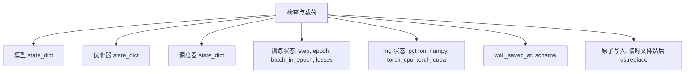
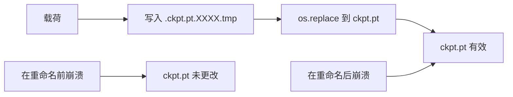
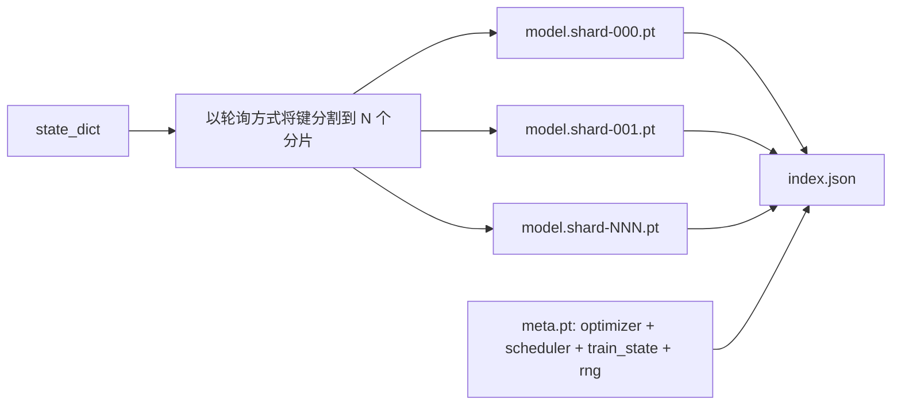

# Checkpoint Save and Resume

> Train interrupts kill runs; checkpoints let them continue. Save model, optimizer, scheduler, loss history, step counter, and RNG state, atomically, so a kill at any moment leaves a valid file on disk.

**Type:** 构建  
**Languages:** Python  
**Prerequisites:** Phase 19 课程 42 到 45  
**Time:** ~90 分钟

## 学习目标

- 将完整训练状态捕获到单一负载中，以便在新进程中重新加载。
- 实现原子保存：先写入临时文件然后重命名（os.replace），保证崩溃不会留下半写入的文件。
- 恢复 Python、NumPy 和 PyTorch 的 RNG 状态，使得恢复后的 loss 曲线与不中断的基线匹配。
- 为无法放入单个文件的大模型构建分片检查点布局，包含哈希校验的分片和一个 JSON 索引。

## 问题

你启动了一个 18 小时的训练作业，但墙钟限制是 4 小时。集群在第 11 小时重启，因为有人批准了内核升级。没有检查点你就得重头开始。没有 resume 还会丢失前 11 小时学到的优化器状态，所以即使模型权重保留下来，AdamW 的动量和自适应矩估计也被清空，下一步会偏离已走过的训练轨迹。

正确的工件是一个包含继续训练所需全部内容的单文件：模型参数、优化器状态、调度器状态、用于绘图的 loss 历史、当前 step、epoch、batch-in-epoch 计数器，以及所有随机源的 RNG 状态。没有 RNG 状态，恢复后的 loss 曲线会不同：模型、数据相同，但洗牌不同、dropout 掩码不同，仪表板的数字也不同。

原子保存是合同的另一半。直接写入目标文件名意味着写入中断会留下损坏文件；恢复时读到的是垃圾。先在同目录写入临时文件再重命名意味着写入中断会保留先前的良好文件。POSIX 文件系统上的重命名是原子的。

## 概念



### 五个状态桶

| Bucket | Why it matters |
|--------|----------------|
| Model | 权重和 buffer；定义模型的具体数值。 |
| Optimizer | 动量和自适应矩估计；没有这些，下一个步长就是一个不同的优化问题。 |
| Scheduler | 学习率在其曲线上的位置；尤其是余弦调度很敏感。 |
| Train counters | Step、epoch、batch-in-epoch，以及绘制仪表板所需的 loss 历史。 |
| RNG state | 对 dropout、数据洗牌和模型内部任何采样的确定性保障。 |

### 原子保存



两条规则。第一，临时文件必须位于与目标相同的目录，这样重命名才会停留在同一文件系统内；跨设备重命名不是原子的。第二，临时名字对每次尝试都要唯一，以免两个写入者互相覆盖。

### 分片检查点

当模型变大时，单文件负载变得难以快速加载、难以检查，并且网络共享在中途读取抖动时代价很高。解决方法是将参数状态拆成分片，并写一个小的索引来将它们关联起来。



索引记录分片数、每个分片的 sha256，以及 meta 文件的 sha256。若任何哈希不匹配，加载器应明确失败。分片可以位于不同的物理磁盘；meta 文件很小且先读取。

### 恢复可以在 epoch 中间继续

恢复跳到下一个 epoch 的开头会浪费几分钟到一天不等。解决办法是保存 `(epoch, batch_in_epoch)` 加上 RNG 状态。加载后，训练循环将随机数生成器快进已消耗的那些 batch，然后从 `batch_in_epoch` 继续。本课程代码正是这样做的；断点后的 loss 轨迹与不中断的基线在 1e-4 范围内一致是断言。

## 实现

`code/main.py` 提供了四个原语和一个演示驱动。

### 第 1 步：捕获并恢复 RNG 状态

`capture_rng_state` 返回一个字典，包含 Python 的 `random.getstate`、NumPy 的 `np.random.get_state`，以及 PyTorch CPU 和 CUDA 的 RNG 字节。`restore_rng_state` 则反向操作。CPU 张量是一个 uint8 字节缓冲区，PyTorch 的 RNG 知道如何消费它。

### 第 2 步：原子保存

`atomic_save` 将负载写入目标目录下的临时文件，然后用 `os.replace` 交换到最终文件名。`atomic_write_json` 对分片索引执行相同操作。

### 第 3 步：完整检查点的往返

`save_checkpoint` 将模型、优化器、调度器、训练状态和 RNG 打包成一个字典。`load_checkpoint` 则反向操作并返回一个 `TrainState`。`schema` 字段是升级钩子：未来格式改动会提升版本字符串，加载器据此分派处理逻辑。

### 第 4 步：分片变体

`save_sharded_checkpoint` 将参数键以轮询方式分配到 N 个分片，为每个分片执行原子保存，写入包含优化器、调度器和训练状态的 meta 文件，并写入包含分片 sha256 的 JSON 索引。`load_sharded_checkpoint` 在合并前验证每个分片。

### 第 5 步：恢复演示

`run_resume_demo` 对一个小模型训练 `total_steps`，在 `interrupt_at` 保存检查点，然后继续训练。第二个进程恢复检查点并运行剩余步骤。函数返回中断点后两个 loss 轨迹的最大绝对差。若恢复了 RNG，差异为零或浮点噪声。

运行它：

```bash
python3 code/main.py
```

单文件和分片演示都断言最大差异小于 1e-4。汇总结果写入 `outputs/resume-demo.json`。

## 使用方式

生产训练框架将检查点作为 trainer 的一部分上船。形状相同：model + optimizer + scheduler + 计数器 + RNG，原子写入，按 step 命名以便容易找到最新的。分片布局支持并行读取以加速大模型加载；index.json 是其关键。

要强制执行三种模式：

- **Schema 在负载中为字符串。** 迁移根据它分支。没有它就无法在不破坏旧运行的情况下演化格式。
- **对每个分片做 sha256。** 没有报警的截断下载是最糟糕的 bug；加载器要么快速失败，要么在很晚才失败。
- **保持检查点节奏诚实。** 每 N 步保存一次，且每隔若干墙钟分钟（取较短者）保存一次。否则崩溃时长步会浪费整整一个窗口的工作。

## 交付

`outputs/skill-checkpoint-save-resume.md` 是任何新训练脚本的配方：负载结构、原子写入、RNG 捕获、分片索引。把该技能放入仓库，在定期保存位置接入 `save_checkpoint`，在启动时接入 `load_checkpoint`，运行即可在被杀死后幸存。

## 练习

1. 将轮询分片替换为按参数组分片（以 `.weight` 结尾的层 vs `.bias`）。何时每种布局更优？  
2. 扩展保存循环以保留最近 K 个检查点并修剪更旧的。磁盘很小的时候合适的 K 是多少？  
3. 添加 `--ckpt-every-seconds` 参数，使保存可按墙钟间隔触发，而不仅仅按 step 计数。  
4. 添加启动时的校验路径，扫描目录中每个检查点并报告哪些已损坏。  
5. 实现 `migrate_v1_to_v2` 函数，向负载添加新字段并提升 schema 字符串。使加载兼容两种版本。

## 关键术语

| 术语 | 大家怎么说 | 实际含义 |
|------|-----------|----------|
| Atomic save | “写了就祈祷” | 在同一目录写临时文件，然后 os.replace 到目标名（原子写入） |
| State dict | “权重” | 模型参数和 buffers，按参数名键控 |
| Sharded checkpoint | “大模型文件” | 多个文件（每个分片一个），再加上一个 meta 文件和一个包含 sha256 的 JSON 索引 |
| RNG state | “随机种子” | 捕获的 Python random、NumPy、torch CPU、torch CUDA 的完整状态；不仅仅是种子 |
| Mid-epoch resume | “重启” | 快进 RNG 并从当前 epoch 的下一个 batch 继续 |

## 延伸阅读

- POSIX `rename` 语义，关于 `os.replace` 所依赖的原子性声明。  
- PyTorch 文档中关于 `torch.save` 与 `torch.load` 的说明，包括用于跨设备恢复的 `map_location`。  
- Phase 19 第 46 课涵盖了本课检查点负载能跨越的梯度累积。  
- Phase 19 第 48 课涵盖了分布式封装，其 state_dict 格式与本方案兼容。  
- Linux 内核 `fsync` 文档，关于原子重命名背后的持久性保证。