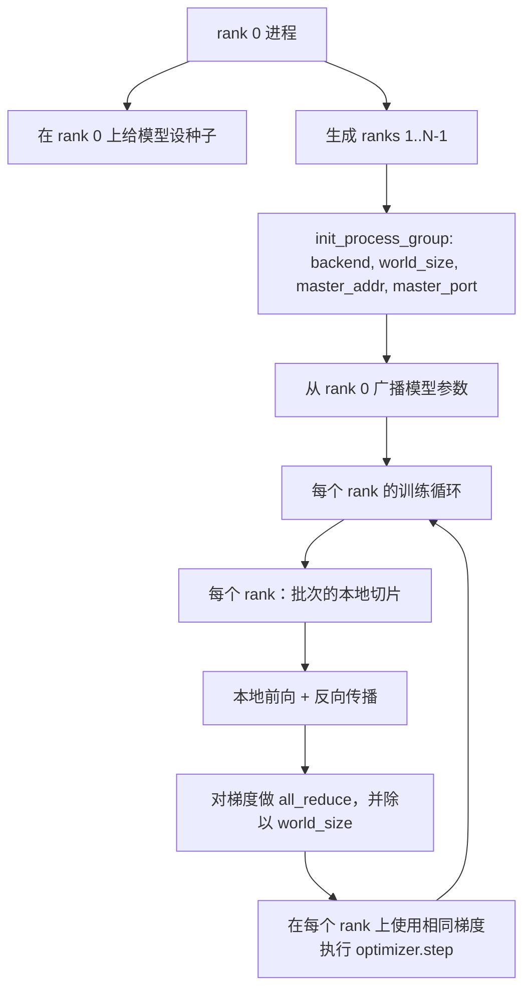
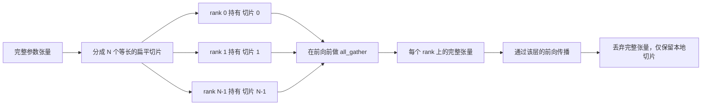

# Distributed Data Parallel and FSDP from Scratch

> Multi-rank training is two collectives and one rule. Broadcast the parameters at startup, average the gradients after backward, never let the ranks disagree about what step they are on.

**Type:** 构建
**Languages:** Python
**Prerequisites:** 第19阶段 第42至45课
**Time:** ~90 分钟

## 学习目标

- 使用 `gloo` 后端在 N 个 rank 之间建立 process group，无需特殊硬件。
- 实现一个最小化的 DDP 包装器，在构造时广播参数，并在 backward 后对梯度做 all-reduce。
- 证明按 rank 求和再平均的梯度等价于在拼接输入上单进程计算得到的梯度。
- 草拟 FSDP 参数分片：每个 rank 持有一个切片，在前向传播前收集完整张量，之后释放。

## 问题背景

模型能在单个设备上放下，但数据集放不下。优化预算要求你每秒看到 N 倍的样本。第一种手段是数据并行：每个 rank 在批次的不同切片上运行相同模型，然后在优化器 step 之前对梯度求平均。第二种手段是 FSDP：模型在单个设备上也放不下，所以每个 rank 持有每个参数的一部分，并在前向传播时按层重建完整张量。

痛点在于记账。如果参数在各 rank 之间漂移，训练将悄然损坏。如果你平均了梯度但没平均损失，监控面板会误导你。如果集体通信后端就拓扑达不成一致，运行会永远挂起。解决办法是自己手写一次这些 collectives，并且不要信任你无法复现的封装。

本课程在 CPU 上运行，不假定 CUDA 可用。`gloo` 后端随每个 PyTorch 构建一起发布并接受 `torch.multiprocessing` 工作进程；相同代码在多 GPU 节点上切换到 `nccl` 时结构无需改变。

## 概念



### 两个关键的 collective

| Collective | 它的作用 | 何时使用 |
|------------|----------|----------|
| `broadcast` | 将一个张量从一个 rank 复制到所有其它 rank | 参数初始化、调度器状态、任何一对多同步 |
| `all_reduce` | 在所有 rank 上对一个张量做求和（或求平均、求最大），每个 rank 都得到结果 | backward 之后做梯度平均 |
| `all_gather` | 每个 rank 提供一个张量，每个 rank 都得到拼接结果 | logits 收集、FSDP 参数反分片（unshard） |

DDP 的契约是在构造时做 `broadcast`，在 backward 后做 `all_reduce`。FSDP 的草图在每层的前向之前添加 `all_gather`。

### 梯度平均等价于单进程梯度

在 N 个 rank 上训练、每个 rank 使用批次大小为 B 的情况下，得到的梯度必须与单进程在大小为 N*B 的拼接批次上训练所得梯度相同。技巧在于对每个 rank 的梯度求和再除以 N，会得到与在整个批次上用 mean reduction 的交叉熵一致的平均损失梯度。本课代码断言手动 all-reduce 后的梯度与参考单进程梯度之间的 max-abs-diff 小于 1e-3。

### FSDP 草图



内存收益是精确的：每个 rank 的参数内存降为原来的 1/N。代价是每次前向都要做一次 gather。生产环境的 FSDP 会把 gather 与前一层的计算重叠，因此运行时间远小于简单估算。本课在每个参数上做往返并断言重建与原始张量在位级相等。

### CPU 与 `gloo` 后端

CUDA 是生产目标，但相同的代码路径也存在于 CPU。`gloo` 是 CPU 的 collective 后端。它比 GPU 上的 `nccl` 慢几个数量级，但 API 接口是相同的。本课的 process group 用 `backend="gloo"` 初始化，ranks 用 `torch.multiprocessing` 生成；两者最终都调用相同的 `torch.distributed` APIs。在多 GPU 节点上，唯一的变化是 `backend="nccl"`、设备张量，以及用 `torchrun` 启动。

## 实现它

`code/main.py` 是可运行的工件。

### 第 1 步：建立 process group

```python
os.environ["MASTER_ADDR"] = "127.0.0.1"
os.environ["MASTER_PORT"] = str(port)
dist.init_process_group(backend="gloo", rank=rank, world_size=world_size)
```

`MASTER_ADDR` 和 `MASTER_PORT` 是 rendezvous：每个 rank 都连接到同一主机上的同一端口。本课通过先 bind 再 close 的技巧选择一个空闲端口，以避免多次运行在同一机器上冲突。

### 第 2 步：在构造时广播

`MinimalDDP.__init__` 遍历每个参数和 buffer，并调用 `dist.broadcast(tensor, src=0)`。rank 0 的值成为规范的初始化值。否则每个 rank 会用各自的 seed 初始化，rank 从第一步就会偏离。

### 第 3 步：在 backward 后 all-reduce 梯度

```python
def all_reduce_grads_(module, world_size):
    for p in module.parameters():
        if p.grad is None:
            p.grad = torch.zeros_like(p.data)
        dist.all_reduce(p.grad.data, op=dist.ReduceOp.SUM)
        p.grad.data.div_(world_size)
```

每个 rank 最终都会得到相同的平均梯度。此时 optimizer.step 对每个 rank 都是相同的输入，因此参数能在运行中保持同步。

### 第 4 步：证明等价性

`manual_all_reduce_matches_single_process` 在 rank 0 上构建相同的模型，并比较 all-reduce 之后的梯度与单进程在拼接输入上计算得到的梯度。max-abs-diff 大约为 1e-8。

### 第 5 步：FSDP 往返检验

`fsdp_round_trip_sketch` 将每个参数扁平化、填充到 world_size 的倍数、切片、all-gather，然后去填充。每个 rank 的重建都等于原始张量。这就是 unshard（反分片）步骤；其逆操作（在前向后重新分片）就是对 gathered 张量取一个切片。

运行：

```bash
python3 code/main.py
```

默认 world size 为 2。两个 CPU 进程会被生成，通过 `gloo` 相互通信，并以零退出。输出文件 `outputs/ddp-demo.json` 捕获了每个 rank 的参数和、all-reduce 后的梯度范数、FSDP 往返结果，以及手动和参考梯度差异。

## 使用建议

生产训练栈使用相同的原语。PyTorch 的 `DistributedDataParallel` 增加了：在 backward 后挂载梯度钩子以把 all-reduce 与 backward 重叠、bucketed all-reduce 将多个小梯度合并到一个 collective，以及第 46 课中提到的 `no_sync` 上下文。

PyTorch 的 FSDP 增加了：每层的扁平参数视图，使每个 rank 持有一个连续的缓冲区、把下一层的反分片与当前层的计算重叠，以及可选的切片 CPU offload。

整体形态不变：启动时广播，backward 后 reduce，在参数无法放下时做分片。

## 交付物

`outputs/skill-distributed-fsdp-ddp.md` 包含了新训练脚本的配方：对于 CPU 使用 `gloo`，GPU 使用 `nccl` 来建立 process group，用一个在构造时广播、在 backward 后 reduce 的 DDP 外壳包装模型，必要时使用 FSDP 草图中的 `all_gather` 模式对参数做分片。

## 练习

1. 使用 `--world-size 4` 运行并确认整个运行过程中参数差异保持在 1e-3 以下。
2. 用 `dist.all_reduce(op=dist.ReduceOp.AVG)` 替换手动平均，并计时比较差异。
3. 在 DDP 包装器中添加后向钩子，使 all-reduce 与剩余的 backward 重叠；测量墙钟时间改进。
4. 实现 FSDP 的重新分片（re-shard）步骤：前向结束后，将完整张量替换回本地切片。确认每个 rank 的内存下降。
5. 在有 CUDA 的机器上将后端切换为 `nccl`。注意哪些环境变量会变化，哪些保持不变。

## 关键术语

| 术语 | 常说法 | 实际含义 |
|------|--------|----------|
| Backend | "gloo or nccl" | 实现 collective 操作的库；`gloo` 是 CPU，`nccl` 是 GPU |
| World size | "Total ranks" | group 中的进程数量；collectives 在该 group 上执行 |
| Rank | "Worker id" | group 内的进程标识，从 0 开始编号 |
| All-reduce | "Sum the grads" | 在所有 rank 上对张量求和，每个 rank 最终得到相同结果 |
| Unshard | "Gather the params" | 通过 `all_gather` 从每个 rank 的切片重建完整张量 |

## 延伸阅读

- PyTorch `torch.distributed` 文档，了解本课所依赖的 collective 语义。
- `gloo` 库的 collective 列表，其形态与 CUDA 支撑的 `nccl` 原语一致。
- 第 19 阶段第 46 课，关于包装 DDP all-reduce 的梯度累积模式（`no_sync`）。
- 第 19 阶段第 47 课，关于能在 DDP 和 FSDP 运行中存活的检查点布局。
- PyTorch FSDP 文档，了解本课所草拟的参数分片在生产环境中的实现。