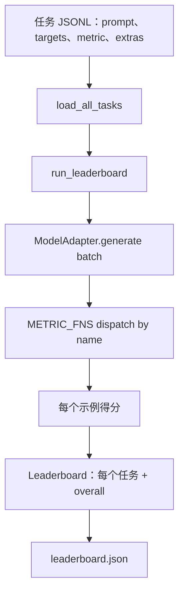
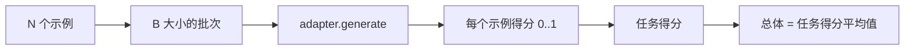

# Language Model Evaluation Harness

> 一个在你无法定义的任务上表现良好的模型，恰好是表现良好的模型。这个 harness（评估工具）就是任务定义、度量、运行器和排行榜，整合为一个简短且可替换的形式。

**Type:** 构建
**Languages:** Python
**Prerequisites:** 第19阶段课程 42 到 45
**Time:** ~90 分钟

## 学习目标

- 将任务定义为一个 JSONL 文件，每行示例包含 `prompt`、`targets`、`metric` 和可选的 `extras`。
- 实现五种度量：exact match（完全匹配）、rouge-l F1、可执行检查、multiple choice（多项选择）和 substring contains（子串包含）。
- 构建一个运行器，该运行器按任务对示例进行批处理并分发给可替换的模型适配器（adapter）。
- 输出一个包含每个任务分数、延迟和可复现总体平均值的排行榜 JSON。

## 问题描述

每周都会出现新的语言模型。市场宣传的说法是它表现很好。诚实的问题是：在哪个任务上？诚实的答案是：你自己写的排行榜，因为厂商的排行榜是他们优化过的。

如果仓库里没有 harness，你就只能凭感觉比较两个模型。有了 harness，你可以通过在固定任务集与固定度量上的分数来比较，并输出可 diff 的 JSON。harness 是昨天运行和今天运行之间的契约。没有它，回归会被发布。

陷阱是把 harness 过拟合到单一模型上。解决方法是反向避免同一陷阱：harness 足够小，能在十五分钟内读完；任务足够小，可以随仓库一起提交；度量从头实现，方便同事审计；适配器是唯一包含模型特定代码的地方。替换适配器，排行榜会变化；替换任务，排行榜也会变化。其他东西不应改变。

## 概念



### 任务规范

每个示例为一行 JSONL：

```json
{"id": "arith-00", "prompt": "compute: 2 + 2", "targets": ["4"], "metric": "exact_match"}
```

对于需要评分辅助信息的度量，`extras` 携带额外载荷：

```json
{
  "id": "code-00",
  "prompt": "python: write a function f that doubles its input",
  "targets": ["ok"],
  "metric": "code_exec",
  "extras": {"io_pairs": [[1, 2], [3, 6]]}
}
```

一个任务是放在 `outputs/tasks/` 下的 `.jsonl` 文件。文件名即为任务名。文件中的所有示例共享同一度量。

### 五个示例任务

| Task | Metric | What it tests |
|------|--------|---------------|
| arithmetic | exact_match | 对确定性答案的逐标记正确性 |
| summary | rouge_l | 针对一行参考摘要的最长公共子序列 F1 |
| code-exec | code_exec | 可执行测试：预测的函数必须满足一系列输入-输出对 |
| multiple-choice | multiple_choice | 预测的首字母必须匹配允许的选项字母 |
| generation | substring_contains | 自由生成文本必须包含至少一个目标子串 |

### 度量契约

每个度量都是一个函数，签名为 `(prediction, targets, extras) -> float in [0.0, 1.0]`。harness 将对示例级评分求平均得到任务分数，然后对任务分数求平均得到总体分数。度量函数都很小：

- `exact_match`：小写化、合并空白、相等比较。
- `substring_contains`：同样的归一化，进行子串测试。
- `multiple_choice`：取首字符并大写比较。
- `rouge_l`：LCS（最长公共子序列）长度除以预测与参考长度，取精确率与召回率的 F1。
- `code_exec`：在受限命名空间中执行预测，对每个输入调用 `f(x)` 并比较输出。

code_exec 度量在一个剥离了内置函数的命名空间中运行预测。本课测试断言 `import os` 会失败，因为 `os` 不在命名空间中；从代码预测中不能访问文件系统。

### 模型适配器

```python
class ModelAdapter(Protocol):
    def generate(self, prompts: Sequence[str]) -> List[str]: ...
    @property
    def name(self) -> str: ...
```

适配器是接缝点。课程附带 `ToyAdapter`，这是一个确定性的模式匹配器，对五个示例任务中的每个 prompt 都返回正确答案。真实的适配器则调用模型并返回其输出。harness 不关心是哪一种。

### 运行器

`run_task` 将以 `batch_size` 为单位对 prompts 进行批次处理，并分发到度量函数。`run_leaderboard` 遍历每个任务并进行平均。`write_leaderboard` 输出带有 schema 字符串的 JSON，以便将来的格式变化不会悄然破坏仪表盘。



```figure
eval-harness-matrix
```

## 实现

`code/main.py` 是可运行的产物。

### 第 1 步：初始化示例任务

`seed_fixture_tasks(target_dir)` 会写入这五个 `.jsonl` 文件。当目录为空时，首次运行 `main.py` 会进行初始化。

### 第 2 步：加载任务

`load_all_tasks(task_dir)` 读取每个 `.jsonl` 文件并返回一个字典，键为任务名，值为 `Example` 记录列表。以 `#` 开头的注释行和空行会被跳过，便于贡献者对文件做注释。

### 第 3 步：实现度量

每个度量都是一个小函数，并有单元测试。课程的测试套件包含 13 个用例，覆盖归一化、部分重叠、代码执行以及不安全代码的拒绝等场景。

### 第 4 步：编写运行器

`run_task` 迭代批次并生成 `TaskResult`，包含分数、正确计数、总计数和延迟。`run_leaderboard` 遍历所有任务并生成带总体平均值的 `Leaderboard`。

### 第 5 步：输出 JSON

`write_leaderboard` 将排行榜序列化。`--include-per-example` 标志会导出每个示例记录，便于在分数变化时 diff 当天模型的预测。

运行命令：

```bash
python3 code/main.py
```

脚本首次运行会初始化示例、用 toy adapter（对所有示例均回答正确）对其评分，并写入 `outputs/leaderboard.json`。使用 toy adapter 时总体分数为 1.0；`test_main.py` 中的 stub adapter 测试表明，当适配器无法回答时，相同的 harness 会产生 0.0。

## 使用方法

要接入真实模型，实现一个适配器。形式示例：

```python
class HttpAdapter:
    name = "vendor.v1"

    def __init__(self, endpoint, api_key):
        self.endpoint = endpoint
        self.api_key = api_key

    def generate(self, prompts):
        out = []
        for prompt in prompts:
            response = http_post(self.endpoint, prompt, self.api_key)
            out.append(response["text"])
        return out
```

在 `main()` 的顶部将 `ToyAdapter` 替换为 `HttpAdapter` 即可。harness、任务、度量和排行榜保持不变。

在将 harness 投入真实项目时需遵循的三种模式：

- **固定任务文件。** leaderboard.json 应携带任务内容的哈希或携带这些 JSONL；否则当任务文件变化时分数会改变，且无法判定原因。
- **比较预测，而不仅仅是分数。** `--include-per-example` 标志允许你看到分数下降那天模型具体说了什么。
- **限制批大小（cap the batch size）。** 真实适配器有速率限制。较小的批次能让 harness 在不同供应商间更兼容。

## 交付

`outputs/skill-lm-eval-harness.md` 包含配方：JSONL 任务规范、五种度量、可替换适配器、分批运行器、带 schema 字符串的排行榜 JSON。`outputs/tasks/` 中的任务文件是示例；将它们复制到真实项目作为起点。

## 练习

1. 添加第六个任务，编写一个从头实现的自定义度量（BLEU 类重叠、BLEURT 类参考评分，或任何具有明确契约的方法）。
2. 扩展 `code_exec`，以捕获 stdout 并接受一组期望 stdout 作为 targets。
3. 添加排行榜差异命令：给定两个 `leaderboard.json` 文件，打印哪些任务发生了变动以及变动幅度。
4. 对每个示例限制延迟。为适配器调用增加超时；在排行榜中显式展示单独的 `timeouts` 列。
5. 在排行榜中用 sha256 固定任务内容，以便未来读者核实他们评估的是相同的任务集。

## 术语

| Term | What people say | What it actually means |
|------|-----------------|------------------------|
| Task spec | "The eval format" | JSONL 文件，每个示例包含 prompt、targets、metric，可选 extras |
| Metric | "How you score" | 函数：(prediction, targets, extras) -> [0, 1] 之间的浮点数 |
| Adapter | "The model client" | 实现 generate(prompts) -> list[str] 方法的对象；唯一的模型特定代码 |
| Leaderboard | "The scoreboard" | 包含每个任务分数、总计数、延迟和总体平均值的 JSON |
| Code exec metric | "Run it and check" | 在受限命名空间执行预测，并与输入-输出对比较 |

（注：文中使用的术语翻译遵循常见 AI 工程用语，例如“提示词工程”、“嵌入”、“微调”、“上下文窗口”、“少样本”、“思维链”、“护栏”、“函数调用”、“投机性解码”、“位置嵌入”、“自注意力”、“指令微调”、“分布式训练”等。）

## 延伸阅读

- 原始的 lm-evaluation-harness，作为生产参考，规模更大但形状相同。
- HuggingFace 的 lighteval，提供了相同契约的另一种实现。
- 第19阶段第46课覆盖了评分所用训练栈中的梯度累积模式。
- 第19阶段第47课覆盖了你要评分的检查点格式；在排行榜中固定检查点哈希。
- 第19阶段第48课覆盖了产生被测试模型的分布式训练栈。