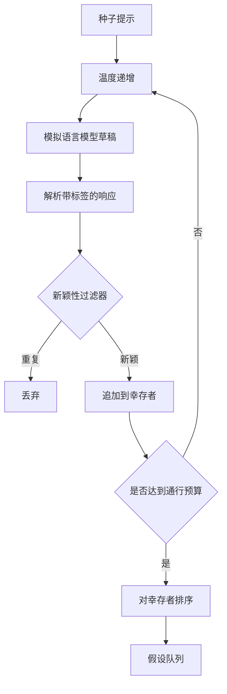

# 假设生成器

> 一个向同一个问题问两次的研究代理是在浪费 tokens。诀窍是强制每个草稿落在新的位置。

**Type:** 构建  
**Languages:** Python  
**Prerequisites:** 第19阶段 Track A 的第20-29课  
**Time:** ~90 分钟

## 学习目标
- 从种子提示驱动采样器，并将其输出转换为类型化的假设记录。
- 在每次循环中提高采样器的温度，使下一次草稿相对于上一次有更大偏移。
- 使用小型嵌入模型和余弦距离阈值过滤近重复项。
- 使用融合新颖性、具体性和可测试性的评分函数对幸存者进行排序。
- 保持每一步的确定性，使得相同的种子总是产生相同的队列。

## 为什么先生成再过滤

对一个模型只询问一次的规划器会得到一个假设。对于示例是可以的，但对于研究循环来说形状不对。循环需要一个有深度的排序队列，这样当第一个假设失败时，runner 有下一个已准备好的假设，而无需再支付一次完整的采样开销。

两个想法结合产生了该队列。第一个是温度递增：每次通过采样器时提高温度一个档位，因此较晚的草稿被鼓励偏移得更远。第二个是新颖性过滤：在每次草稿之后，生成器测量该草稿与每个之前幸存者的嵌入距离，并拒绝任何落入簇内的草稿。

本课提供了一个模拟语言模型（mock），它针对固定提示返回脚本化的令牌序列。这个模拟足以演练完整路径：种子提示输入，应用温度递增，解析候选项，运行新颖性过滤，输出排序队列。

## Hypothesis 的结构

```text
Hypothesis
  id             : int           (在一次运行中单调递增)
  text           : str           (断言文本)
  variables      : list[str]     (在不同条件间会变化的项)
  metric         : str           (runner 将要衡量的指标)
  baseline_ref   : str | None    (比较所引用的论文或运行)
  draft_pass     : int           (产生此草稿的采样器轮次)
  temperature    : float         (草稿时的采样器温度设置)
  novelty_score  : float         (与先前幸存者的距离, 0..1)
  rank_score     : float         (用于排序的加权和)
```

`variables` 和 `metric` 不是自由文本。解析器会从带标签的响应中提取它们。第五十二课中的 runner 在构建实验配置时会直接读取这些字段。

`baseline_ref` 是可选但推荐的。第五十三课中的评估器需要一个基线进行比较。如果假设省略了基线，评估器会回退到在相同指标上先前的运行。

## 架构



循环很直接。有趣的部分是每个模块都有严格的契约。

## 温度递增

从 `t_min` 开始，到 `t_max` 结束，步长为 `(t_max - t_min) / (n_passes - 1)`。每次通过采样器使用当前温度调用采样器，`GeneratorConfig.schedule()` 生成 `n_passes` 个均匀间隔的值。模拟模型通过在 `(prompt, temp_bucket)` 键上切换一小组脚本化响应来响应温度。分桶是开区间，因此温度的微小变化会选取不同的桶并产生不同的草稿。生产环境中采样器会是真实模型，并以 `temperature=t` 传入。

默认计划是从 `0.2` 到 `1.2` 的六次采样。六次足以填充队列，而不会为新颖性过滤器最终会拒绝的样本额外付费。低于 `0.2` 时模型会复述种子提示；高于 `1.2` 时响应往往偏离主题并导致解析器失败。

## 新颖性过滤器

在每次草稿解析之后，生成器对文本进行嵌入并将其与每个已接受的假设比较。嵌入是对单词令牌的哈希包表示，并归一化为单位长度。两个单位向量之间的余弦距离为 `1 - dot(a, b)`。如果一个草稿到任一先前幸存者的最小距离大于 `novelty_threshold`，则通过该过滤。默认值是 `0.25`。

这种哈希嵌入并不复杂。它是确定性的、零依赖的，并且足以捕捉明显情况：共享大部分名词的两个草稿。生产部署会替换为小型句子嵌入模型。接口保持不变。

## 排名分数

```text
rank_score = w_novelty * novelty_score
           + w_specificity * specificity_score
           + w_testability * testability_score
```

三个子得分。`novelty_score` 是与先前幸存者的最小嵌入距离。`specificity_score` 是假设中具体变量的计数除以目标计数。`testability_score` 若假设同时指定了指标和基线则为 1，若只指定了指标则为 0.5，否则为 0。

默认权重为 `0.4`, `0.3`, `0.3`。这些权重保存在生成器配置中，因此下游课程可以在不分叉代码的情况下调整它们。

## 模拟语言模型

```python
class MockLLM:
    def sample(self, prompt: str, temperature: float, seed: int) -> str:
        ...
```

在 `(prompt, temperature, seed)` 三元组确定的情况下采样器是确定性的。模拟器保留一个以 `(prompt_signature, temperature_bucket)` 为键的脚本化响应表。如果表中没有某个键的条目，采样器会返回一个导致解析失败的后备响应。测试中会覆盖这条后备路径。

seed 会混入到响应中，因此相同的 `(prompt, temperature)` 在不同的 seed 下会产生不同草稿。测试中我们会固定 seed 以保持结果可复现。在真实部署中 seed 会来自系统时钟或计数器。

## 输出队列

输出是按 `rank_score` 降序排序的 `Hypothesis` 记录列表。第五十二课中的 runner 弹出队列头，运行实验，第五十三课中的评估器写回判定。如果判定表明假设是错误的，runner 会弹出下一个假设。

队列是有限的。当其为空时，编排器可以要么扩大种子提示并重新运行生成器，要么停止并报告预算耗尽。

## 如何阅读代码

`code/main.py` 定义了 `Hypothesis`, `MockLLM`, `HypothesisGenerator` 以及一个确定性的演示。生成器暴露一个单一的 `run(seed_prompt)` 方法，返回排序后的队列；轮次数量从 `GeneratorConfig.n_passes` 读取，而不是作为参数传入。嵌入是令牌的哈希包表示。新颖性过滤器是一个单独的函数。排名分数是一个单独的函数。没有依赖 `numpy`；嵌入计算使用纯标准库数学，使得课程保持可移植性。

`code/tests/test_generator.py` 覆盖了线性路径、重复拒绝路径、解析失败路径、温度递增边界以及排序顺序。

## 该模块在整体流程中的位置

第五十课生成队列。第五十一课取队列头并进行文献检索以确认或反驳它。第五十二课取同一队列头并运行实际实验。第五十三课读取两者输出并写回判定。这四课组成了一个无人参与的人类研究循环；人类可以在任一边界处介入。