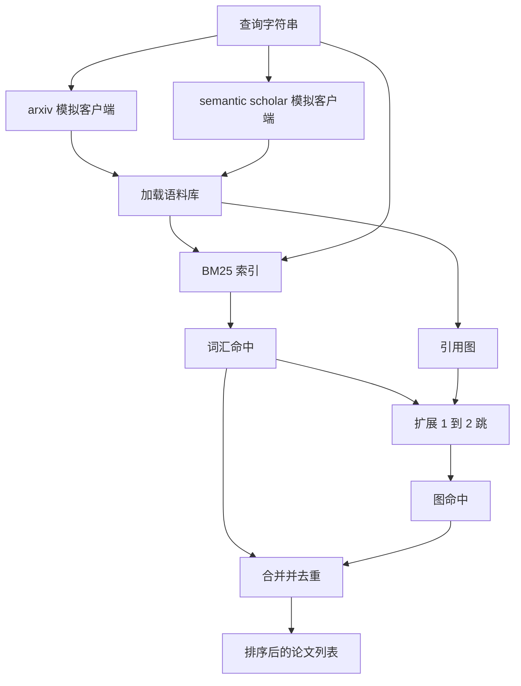

# Literature Retrieval

> A hypothesis is cheap. Knowing whether someone already proved it is the expensive part. Build the retrieval layer that answers that question before the runner spins up a sandbox.

**Type:** 构建  
**Languages:** Python  
**Prerequisites:** Phase 19 Track A lessons 20-29  
**Time:** ~90 分钟

## Learning Objectives
- 使用下游循环将读取的字段建模一个小型的论文记录（Paper）。
- 仅使用标准库数据结构在摘要上构建 BM25 索引。
- 遍历引用图以发现词汇检索遗漏的论文。
- 通过稳定的论文 id 对词汇检索和图检索的命中去重。
- 将两个模拟外部 API 包装在单一客户端后面，以便当真实端点到位时上游调用方接口保持不变。

## 为什么要两个检索阶段

对摘要的关键词搜索会返回与查询共享词汇的论文，这覆盖了大部分表面情况。但它遗漏两类情况。第一类是基础性论文使用不同词汇；例如查询“sparse attention（稀疏注意）”可能会错过标题为“block selection in transformer routing”的论文。第二类是当相关论文是引用已知锚点的后续工作时：找到锚点并向前遍历比对整个摘要池进行暴力搜索更高效。

本课同时构建这两个阶段。对摘要的 BM25 捕获词汇命中。引用图遍历将种子集合向前或向后扩展一到两跳。两者的并集按论文 id 去重并按一个小的合成得分排序。

## The Paper shape

```text
Paper
  id          : str           (stable identifier, "p001" for the mock corpus)
  title       : str
  abstract    : str
  year        : int
  authors     : list[str]
  references  : list[str]     (paper ids this paper cites)
  citations   : list[str]     (paper ids that cite this paper)
  source      : str           (which mock api supplied it, "arxiv" or "s2")
```

references 和 citations 字段构成有向引用图。两个模拟 API 返回的字段有重叠但不完全相同，因此语料加载器会在 `id` 上合并它们。

## Architecture



检索客户端负责两个阶段和合并。调用方给它一个查询，返回一个排序列表，其中每个条目携带每篇论文的评分字段（`bm25_score`, `graph_distance`, `recency_score`, `final_score`）以解释排序原因。

## BM25 from scratch

实现采用标准 Okapi BM25，默认参数 `k1=1.5`, `b=0.75`。索引由两个字典组成：`term -> doc_frequency` 和 `term -> list of (doc_id, term_count)`。文档长度是摘要的令牌数。平均文档长度在索引构建时计算一次。对查询的打分是对查询项上 `idf * tf_norm` 的求和，其中 `tf_norm` 是标准 BM25 的长度归一化词频。

分词器为先 `lower` 然后在非字母数字处分割。不进行词干化。生产系统会替换为小型词干器。接口保持不变。

```text
idf(t)      = log((N - df + 0.5) / (df + 0.5) + 1.0)
tf_norm(t)  = (f * (k1 + 1)) / (f + k1 * (1 - b + b * dl / avgdl))
score(d, q) = sum over t in q of idf(t) * tf_norm(t)
```

## 引用图遍历

图从语料库构建一次。前向边从一篇论文指向其 references。后向边从一篇论文指向其 citations。遍历是以顶级 BM25 命中为种子的广度优先搜索，限制为两跳。

两跳是有意的上限。一跳太浅；代理通常需要立即的祖先或后代。三跳会在连通图上让结果数暴涨并倾向于偏离主题。本课将跳数上限作为配置项暴露，以便下游循环可以收紧它。

## 去重与排序

两个阶段返回的集合有重叠。合并以论文 id 为键。对于每篇论文，最终得分是加权混合：

```text
final_score = w_bm25 * bm25_score_norm
            + w_graph * graph_score
            + w_recency * recency_score
```

`bm25_score_norm` 是 BM25 得分除以合并集合中的最大 BM25 得分（因此该字段位于 0 到 1 之间）。`graph_score` 对直接的词汇命中为 1，对一跳为 `0.6`，对两跳为 `0.3`，否则为零。`recency_score` 是从语料库最小年份到最大年份线性映射到 0 到 1 的斜率函数。

默认权重为 `0.5`, `0.3`, `0.2`。权重是可配置的；陈旧主题可能会把 recency 调低，而快速演进的主题会提高它。

## Mock corpus

语料库包含一百篇论文，由 `build_corpus()` 生成。每篇论文都有在五个主题之一上手工编写的标题和摘要：注意力稀疏（attention sparsity）、检索增强（retrieval augmentation）、低秩适配器（low rank adapters）、数据集蒸馏（dataset distillation）和评估工具链（evaluation harnesses）。references 和 citations 的连线使每个主题形成一个连通子图，并有一些跨主题边。

两个模拟 API 客户端（`ArxivMockClient`, `SemanticScholarMockClient`）读自同一语料库但暴露不同字段。Arxiv 返回 title、abstract、year、authors。Semantic Scholar 额外提供 references 和 citations。检索客户端会在 id 上进行合并；跨客户端字段不一致的处理留到后续课程。

## What lessons 52 and 53 read

第 52 课中的 runner 将 `paper.id`, `paper.title`，以及摘要的前三句作为实验上下文读取。第 53 课的评估器读取 `paper.year` 和 `paper.references` 以将基线归因到特定论文。

检索客户端返回一个 `RetrievalResult`，其中同时包含排序列表和每次查询的度量：命中数、平均得分、最高得分、总耗时。runner 会记录这些，以便下游可观测性流程绘制质量随时间的变化。

## How to read the code

`code/main.py` 定义了 `Paper`, `ArxivMockClient`, `SemanticScholarMockClient`, `BM25Index`, `CitationGraph`, `RetrievalClient`，以及一个确定性演示。模拟客户端和语料库放在同一文件中以保持课程可移植。BM25 实现是一个类，约六十行。图遍历是一个方法。

`code/tests/test_retrieval.py` 覆盖了词汇路径、图路径、合并、去重以及空查询的情况。

## Where this slots in

第 50 课产生一个假设。第 51 课在文献中搜索以判断该假设是否已被解决。若未解决，第 52 课运行实验。第 53 课读取检索结果和实验指标以写出结论。检索客户端是这四个阶段中成本最低的，且在编排器中首先运行。