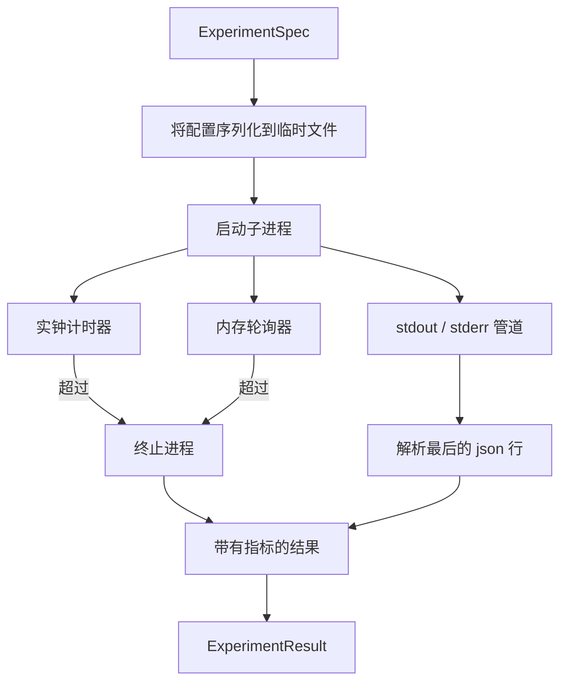

# Experiment Runner

> 循环的可靠性取决于其测量的诚实性。构建一个接收规范、在沙箱化的子进程中执行该规范，并生成一个评估器可以信任的 json 指标 blob 的 runner。

**Type:** 构建  
**Languages:** Python  
**Prerequisites:** 第19阶段 Track A 第20-29课  
**Time:** ~90 分钟

## 学习目标
- 将实验编码为一个可序列化到子进程的有类型规范（spec）。
- 启动带有硬性实钟超时和软性内存上限的子进程，并将两者作为终止条件上报。
- 将 stdout、stderr 和结构化的 metrics blob 捕获到单一结果记录中。
- 构建逐一调节配置旋钮（knob）的消融表（ablation table），在固定的基础 spec 上依次扫过每个值。
- 在给定 seed 的情况下保持每个结果的确定性，以便评估器在多次运行中看到相同的数值。

## 为什么使用子进程

研究循环会运行不受信任的代码。假设来自采样器，实验脚本来自相同路径；在进程内将任一者视为安全，会导致一次崩溃带走整个编排器。子进程是语言自带的最简单隔离方式：独立进程、独立地址空间、父进程侧可接收的信号句柄。

此处的 runner 并不实现完整的沙箱机制。没有 cgroup、没有 seccomp 过滤、没有命名空间重映射。它具备的是实钟超时、用于内存增长的轮询循环，以及在任一限制触发时终止进程的路径。这就是每个更复杂沙箱都扩展的运行时契约。本课将契约保持得足够小，使人能一读就懂。

## ExperimentSpec 结构

```text
ExperimentSpec
  spec_id        : str            (stable id, "exp_001")
  hypothesis_id  : int            (link back to the queue from lesson 50)
  script_path    : str            (path to the python script to run)
  config         : dict           (passed to the script as one json arg)
  seed           : int            (deterministic seed for the experiment)
  wall_timeout_s : float          (hard timeout, killed on exceed)
  memory_cap_mb  : int            (soft cap, polled; killed on exceed)
  metric_keys    : list[str]      (which fields the evaluator will read)
```

脚本位于磁盘上；runner 会把 config 写到一个临时文件路径，脚本从该路径读取。脚本预期在 stdout 上打印一行 json，该 json 的键为 `metric_keys` 的超集。stdout 上的其他任何输出都会被捕获，但不会被指标解析器采用。

## 架构



runner 是一个类，包含一个主方法。轮询器是一个小线程，每隔一个轮询间隔唤醒一次，在可用时从 proc 文件系统读取子进程的等价 psutil 信息；在平台不暴露这些信息时则退化为不执行操作。

## 为什么使用软性内存上限

硬性内存上限需要 `resource.setrlimit`，且只在 POSIX 上工作。本课采用了便携的方法：轮询平台上的常驻集大小（RSS），如果超过上限则终止子进程。该上限是软性的，因为轮询器有非零的间隔；进程可能在两次轮询之间冲高超出上限然后再回落。runner 会记录观察到的最大 RSS，以便评估器看到运行离上限有多近。

在不支持进程检查的系统上，轮询器会记录一次性警告并禁用自身。实钟超时仍然适用。本课的测试覆盖这两条路径。

## 捕获 stdout 和 stderr

runner 在完成时会读取并清空两个管道。以行读取 stdout；最后一个能被解析为包含所有必需 `metric_keys` 的 json 行将被视为指标 blob。早期的 json 行保存在结果中作为 `intermediate_metrics`；评估器可以将它们用于学习曲线（learning curves）。

stderr 原封不动地被捕获到结果中。runner 不会因为非零退出码而抛出异常；相反会在结果中记录该退出码。任何非零退出都被标记为 `"crash"`，即使脚本打印了指标，因此评估器默认将部分运行视为失败。

## 消融表（Ablation table）

```python
def ablate(base: ExperimentSpec, knob: str, values: list[Any]) -> list[ExperimentSpec]:
    ...
```

给定一个基础 spec 和一个旋钮名，辅助函数返回每个值对应的一个 spec，`config[knob]` 被覆盖为该值。每个 spec 都得到一个派生的 `spec_id`（`f"{base.spec_id}_{knob}_{value}"`）。runner 附带一个 `AblationRunner`，按顺序运行它们并返回一个以旋钮值为键的 `AblationTable`。

为什么一次只调一个旋钮。全因子（full factorial）扫描会呈指数级膨胀并产生评估器无法解释的结果。一次只调一个旋钮会产生一个干净的坐标轴，评估器可以绘制。课程只支持以重复单旋钮消融组成的多旋钮扫描，由调用方负责组合。

## 确定性

每个 spec 都携带一个 seed。runner 通过 config 字典将 seed 转发给脚本（`config["__seed"] = spec.seed`）。`code/experiments/` 中的模拟实验脚本会遵循该 seed，并在多次运行中产生相同的指标。第 53 课的评估器依赖于此；没有确定性的话，“回归” 可能仅仅是不同的随机初始化导致的差别。

## 模拟实验脚本

课程提供了一个实验脚本：`code/experiments/sparsity_experiment.py`。它是一个真实脚本，从配置文件读取配置，使用 numpy 随机过程模拟一次小型训练运行，并打印一个 json 指标行。脚本支持 `sleep_s` 旋钮用于测试超时，和 `allocate_mb` 旋钮用于测试内存轮询器。

该模拟并不是训练任何真实模型。它是一个数值计算，模仿训练循环的形状：损失曲线、最终困惑度（perplexity）、墙钟时间。课程的重点是 runner，而不是模拟。真实的实验脚本会导入一个模型。

## 结果结构

```text
ExperimentResult
  spec_id              : str
  hypothesis_id        : int
  exit_code            : int
  terminal             : "ok" | "timeout" | "oom" | "crash"
  wall_time_s          : float
  peak_rss_mb          : float | None
  metrics              : dict
  intermediate_metrics : list[dict]
  stdout_tail          : str
  stderr_tail          : str
```

评估器首先读取 `metrics` 和 `terminal`。如果 terminal 为除 `"ok"` 之外的任何值，该实验计为失败运行，评估器的裁决是自动的。否则指标将传入显著性检验。

## 如何阅读代码

`code/main.py` 定义了 `ExperimentSpec`、`ExperimentResult`、`ExperimentRunner`、`AblationRunner`，以及一个确定性的演示。子进程管理是一个类。内存轮询器是一个小线程。消融辅助函数是一个单函数。

`code/experiments/sparsity_experiment.py` 是测试中使用的模拟实验。它从 argv 读取配置文件路径，并在完成时写出一行 json 指标。

`code/tests/test_runner.py` 覆盖了成功路径、超时路径、崩溃路径、消融表，以及跨两次运行的确定性检查。

## 该模块在整体流程中的位置

第 50 课生成假设。第 51 课过滤掉文献已解决的项。第 52 课对剩余项运行实验。第 53 课读取结果、运行显著性检验，并将裁决写入与 hypothesis id 关联的存储。