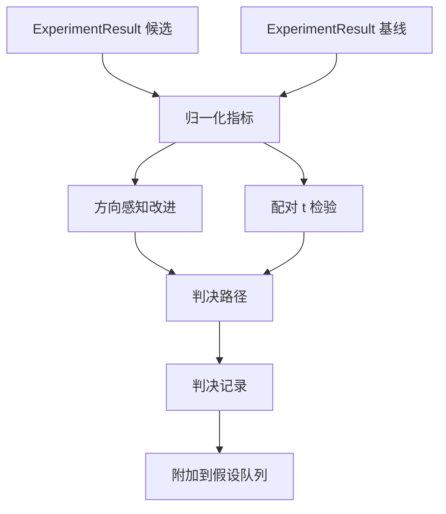

# 结果评估器

> 运行器产生了数值。评估器决定这些数值是改进、退步，还是噪声。构建将指标转化为一行结论的判决路径。

**Type:** 构建
**Languages:** Python
**Prerequisites:** Phase 19 Track A 课程 20-29
**Time:** ~90 分钟

## 学习目标
- 使用方向感知改进和固定阈值，将候选运行与基线进行比较。
- 从头实现基于每个种子指标的配对 t 检验并读取得到的 p 值。
- 对对数尺度的指标进行归一化，以便下游报告可以与线性指标混合展示。
- 发出每个假设的判决，供第五十课的编排器附加到队列。
- 保持每一步的纯函数性质，使相同输入始终产生相同判决。

## 为什么要做配对检验

来自运行器的单个数值无法说明变化是否真实。相同配置在不同随机种子下会得到不同的困惑度。变化可能只是噪声。正确的比较方式是配对：在相同数据集、相同种子下，分别用候选和基线运行一次。每个种子贡献一个差异值。这些差异的平均值就是效应；这些差异的标准误是噪声底线。

本课从头实现检验。不使用 `scipy.stats`。所需的数学量很小，可以一屏看完。

```text
diffs    = [a_i - b_i for i in seeds]
mean     = sum(diffs) / n
variance = sum((d - mean) ** 2 for d in diffs) / (n - 1)
t_stat   = mean / sqrt(variance / n)
df       = n - 1
p_value  = two_sided_p(t_stat, df)
```

双侧 p 值使用正则化的不完全贝塔函数。课程附带了一个使用 Lentz 连分数的小型实现，整个实现只有大约六十行纯标准库数学代码。

## 方向感知改进

有些指标值越大越好（如准确率、吞吐量）。另一些指标值越小越好（如损失、困惑度、耗时）。评估器在每个指标上携带一个 `direction` 字段。

```text
if direction == "higher_is_better":
    improvement = (candidate - baseline) / abs(baseline)
elif direction == "lower_is_better":
    improvement = (baseline - candidate) / abs(baseline)
```

improvement 带符号。对于“越大越好”的指标，负的 improvement 表示候选更差。判决路径同时读取符号和幅值。

使用一个固定阈值（`improvement_threshold=0.02`，即 2%）决定变化是否足够大以发出判决。低于该阈值则无论 p 值如何均判为“噪声”；系统不关心用户无法测量的变化。

## 架构



评估器运行三条独立计算并在判决路径中合并它们。每个计算都是无共享状态的纯函数。

## 对数归一化

困惑度对损失呈指数关系。损失下降 0.1 在困惑度上对应的下降会大很多。直接比较两个配置下的困惑度是可以的，但要在单个报告中将其与线性指标混合，需要先归一化。

本课对任何 `scale` 字段为 `"log"` 的指标，在计算改进前先取自然对数。阈值随后在对数空间中应用。从 32 降到 28 的困惑度，在“越小越好”的尺度上是 `log(28) - log(32) = -0.133`，这远大于 2% 的阈值。

```text
if scale == "log":
    a = log(candidate)
    b = log(baseline)
else:
    a = candidate
    b = baseline
```

`scale="linear"`（默认）的指标跳过变换。相同的代码路径处理两种情况。

## 每个种子的配对检验

第五十二课的运行器为每次运行输出一个最终的指标 blob。对于配对检验，评估器需要候选和基线在每个随机种子上的各一个 blob。编排器在一组种子上用两种配置分别运行同一实验，并将两个 `ExperimentResult` 列表交给评估器。

评估器按种子配对它们（种子保存在 `result.metrics["seed"]`），并遍历请求的指标。如果两个列表中的种子不匹配，评估器会抛出 `PairingError`。编排器应当重新运行。

## 判决结构

```text
Verdict
  hypothesis_id          : int
  metric                 : str
  direction              : "higher_is_better" | "lower_is_better"
  scale                  : "linear" | "log"
  candidate_mean         : float
  baseline_mean          : float
  improvement            : float       (signed, fraction; see direction rules)
  p_value                : float | None  (None if n < 2)
  significance_threshold : float
  improvement_threshold  : float
  verdict                : "improved" | "regressed" | "noise" | "failed"
  rationale              : str
```

判决路径是一个小型决策表：

```text
1. If any candidate result has terminal != "ok": verdict = "failed"
2. else if |improvement| < improvement_threshold:  verdict = "noise"
3. else if p_value is None or p_value > significance: verdict = "noise"
4. else if improvement > 0:                          verdict = "improved"
5. else:                                             verdict = "regressed"
```

rationale 是一行可读的人类可理解句子，编排器可以将其与假设 id 一起记录。

## 如何阅读代码

`code/main.py` 定义了 `MetricSpec`、`Verdict`、`Evaluator`、t 统计量和不完全贝塔辅助函数，以及一个确定性的演示。t 检验是用纯标准库数学实现的；仅在读取指标列表和计算均值与方差时使用了 numpy。

`code/tests/test_evaluator.py` 覆盖了“改进”路线、“退步”路线、“噪声”（幅值太小）、“噪声”（样本量太小）、“失败的 terminal 路径”、对数归一化路径、与已知参考值的 t 检验以及配对错误。

## 本模块放在哪

第五十课产生了假设队列。第五十一课过滤掉了文献已定论的内容。第五十二课在候选和基线配置上跨种子运行实验。第五十三课读取这些运行结果并写入判决。编排器将这四部分缝合在一起：

```text
for hypothesis in queue:
    literature = retrieval.search(hypothesis.text)
    if literature_settles(hypothesis, literature):
        attach(hypothesis, verdict="settled")
        continue
    candidates = runner.run_all(specs_for(hypothesis))
    baselines  = runner.run_all(baseline_specs_for(hypothesis))
    metric_spec = MetricSpec("perplexity", direction=LOWER, scale=LOG)
    verdict = evaluator.evaluate(hypothesis.id, metric_spec, candidates, baselines)
    attach(hypothesis, verdict)
```

该编排器不在本课中；四个课程通过它们各自定义的数据类无缝组合在一起，彼此之间无需额外粘合代码。