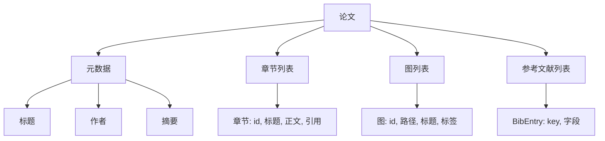
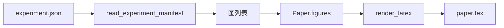
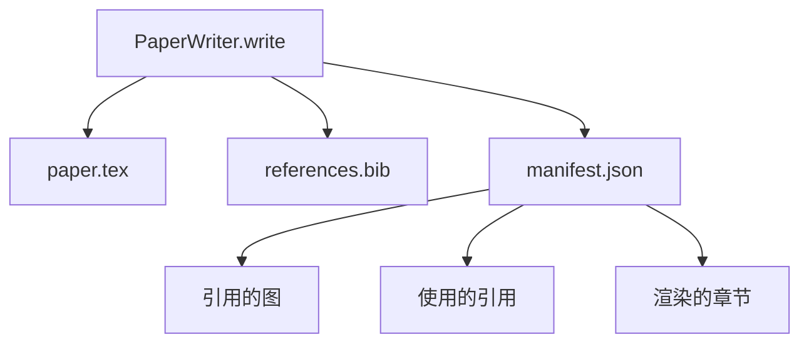

# Paper Writer

> 一个 LaTeX 骨架是研究者与排版者之间的契约。如果契约被打破，文档无法编译，且失败非常明显。先构建骨架，然后再填充内容。

**Type:** 构建  
**Languages:** Python  
**Prerequisites:** Phase 19 的第 50-53 课  
**Time:** ~90 分钟

## 学习目标

- 将研究论文视为具有已知章节图的结构化工件，而不是自由格式的文档。
- 生成一个 LaTeX 骨架，在任何正文写入之前声明其摘要、章节、图槽和参考文献键。
- 通过确定性的槽机制将实验输出（路径和标题）注入到骨架中的图中。
- 接入一个模拟的正文生成器，该生成器根据结构化大纲填充每个章节，使得在没有模型的情况下也能对工具链进行测试。
- 输出单个 `paper.tex`、一个 `references.bib` 与一个列出所有引用图和被使用引用的清单（manifest）。

## 为什么先做骨架

以正文开始的草稿会积累结构性债务。引言扩展出三段本应属于相关工作的内容。一个图在定义之前就被引用。参考文献最终出现了同一篇论文的三个键。等作者注意到时，重写的成本往往高于重写前的写作成本。

骨架则颠倒了这一点。结构在一开始就作为数据被声明。章节是具有名称和顺序的槽。图是具有 id 和标题的槽。参考文献键在顶部声明并指向它们对应的条目。正文被逐个生成到这些槽中。工具链可以在任何正文写入之前进行校验：每个图是否都有槽、每个引用是否有条目、每个章节是否出现在目录中。

这与早期课程对计划、工具调用和追踪所施行的纪律相同。结构就是契约。

## 论文形状

每个字段都是普通的 Python 数据。渲染器是一个从 `Paper` 到 LaTeX 字符串的纯函数。工具链可以在渲染之前对论文进行内省：统计章节数、列出缺失的图文件、检查每个 `\cite{key}` 是否都有匹配的 `BibEntry`。

## 渲染契约

渲染器保证三个属性。首先，骨架中的每个图槽都会输出一个带有形式为 `fig:<id>` 的稳定标签的 `\begin{figure}` 块。其次，每个章节都会输出一个带有形式为 `sec:<id>` 的稳定标签的 `\section{}`，以便交叉引用工作。第三，参考文献会输出一个 `\bibliography` 块，其 `references.bib` 恰好包含论文上声明的那些条目，既不多也不少。

违反任何一项都是渲染错误，而非警告。骨架就是契约；默默丢弃某个图的渲染就是违约。

## 从实验注入图

早期课程生成的实验输出为 JSON 清单。每个清单包含带路径和简短标题的工件列表。Paper Writer 读取该清单并生成 `Figure` 记录。

注入是确定性的。图 id 从实验名加上单调计数器派生。标题来自清单。路径相对于论文的输出目录进行归一化，这样即使实验输出位于磁盘上的其他位置，LaTeX 仍然可以编译。

## 模拟的正文生成器

本课不调用模型。`MockProseGenerator` 读取一个大纲形状并确定性地生成正文。大纲形状为每个章节提供一个简短字符串。生成器将该字符串扩展为两段简短段落，并将章节标题编织入文中。生成的正文会在大纲声明的位置恰好点名引用图和引用条目。

这足以测试 writer 的每个行为。真实实现会把生成器替换为模型调用。其周围的工具链不变。这就是将正文生成器声明为可调用对象的价值：测试环境替换为确定性的生成器，生产环境替换为模型，管道的其余部分保持不变。

## 清单输出

Writer 将三个文件输出到输出目录。

清单（manifest）是下游评估器或批评回路读取的内容。它不解析 LaTeX；它读取的是清单。下一课，批评回路会以该清单为输入并生成反馈列表。这就是为什么清单是契约的一部分而 LaTeX 不是。

## 验证关卡

Writer 在写入任何文件之前运行四个关卡（gates）。

1. 每个图 id 在论文内唯一。
2. 每个章节的 `cites` 字段所引用的参考文献键都已在论文上声明。
3. 摘要非空。
4. 标题非空。

失败的关卡会抛出 `PaperValidationError` 并给出精确原因。工具链会将该原因作为失败模式进行呈现。不允许部分写入：要么所有三个文件都被写出，要么都不写。

## 如何阅读代码

`code/main.py` 定义了 `Paper`、`Section`、`Figure`、`BibEntry`、`PaperValidationError`、`MockProseGenerator`、`PaperWriter`，以及一个 `render_latex` 函数。`write` 方法接受一个输出目录并输出 `paper.tex`、`references.bib` 和 `manifest.json`。辅助函数 `read_experiment_manifest` 将一组实验清单转换为 `Figure` 记录。

`code/tests/test_paper_writer.py` 覆盖了：无章节时的骨架渲染、包含两章两图的完整渲染、缺失引用的门控、重复图 id 的门控、清单内容，以及 LaTeX 字符串契约（每个章节都输出一个 `\section{}`，每个图都输出一个 `\begin{figure}`）。

## 进一步拓展

真实实现会想要的两个扩展。第一，多格式渲染：相同的 `Paper` 形状可以编译为博客文章用的 Markdown 或用于预览的 HTML。渲染器成为 `Paper` 上的一个策略（strategy）。第二，引用增强：Writer 从引用键获取 BibTeX 条目，给定一个本地 DOI 缓存。两者都能增值，且都可以在不触及骨架契约的情况下添加。

骨架就是赌注。章节、图和引用作为数据被声明，正文被生成到槽中，清单与 LaTeX 同时输出。其他所有改进都可以在其之上组合。