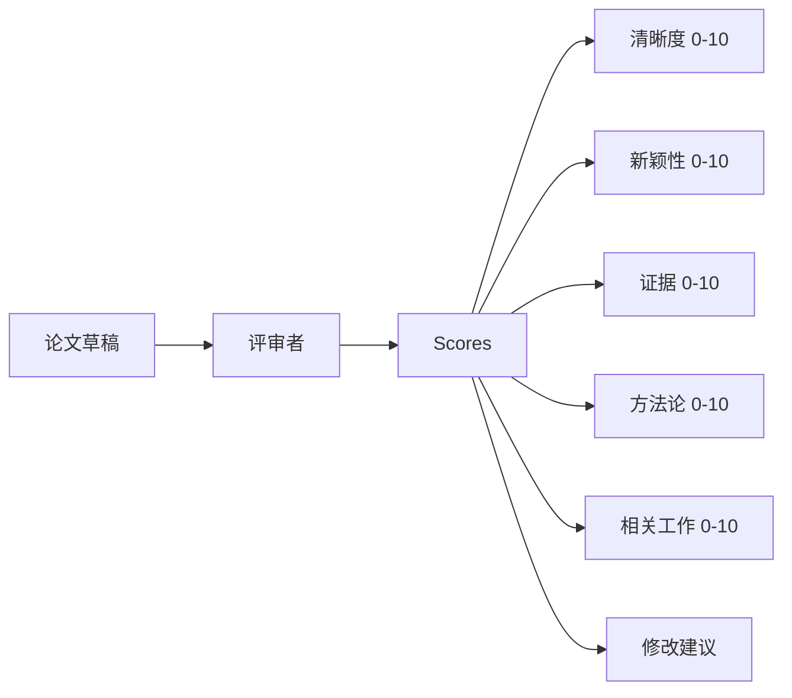
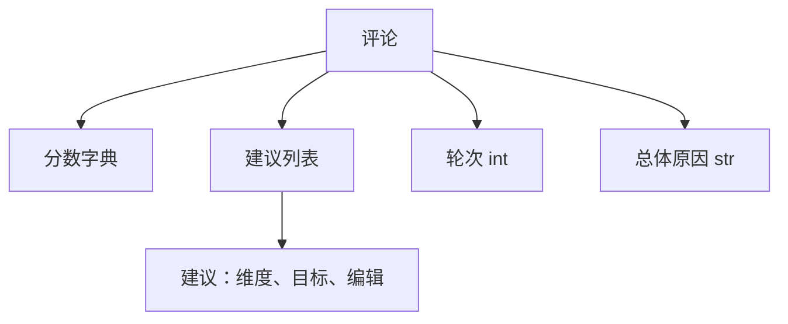
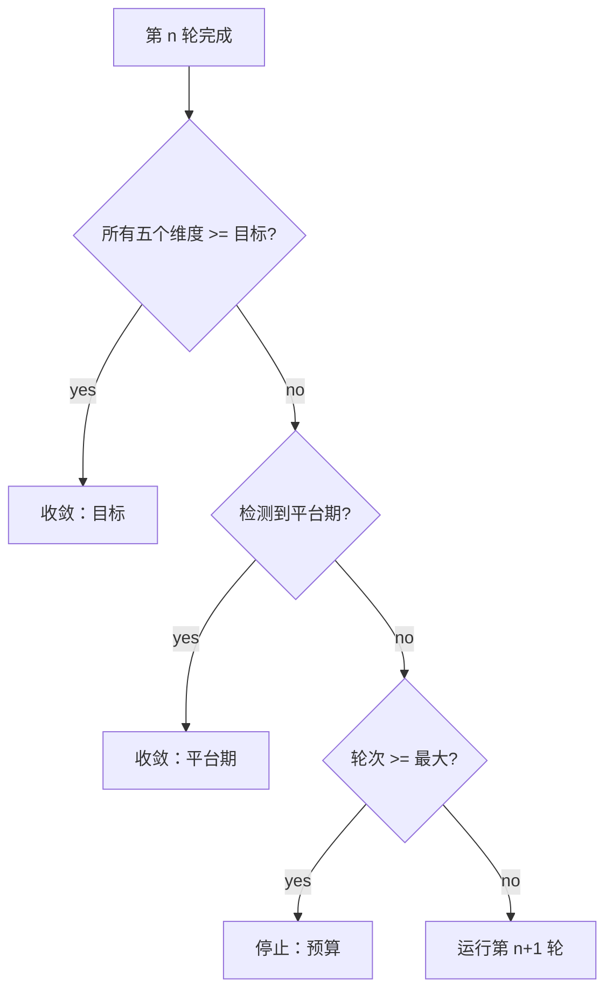
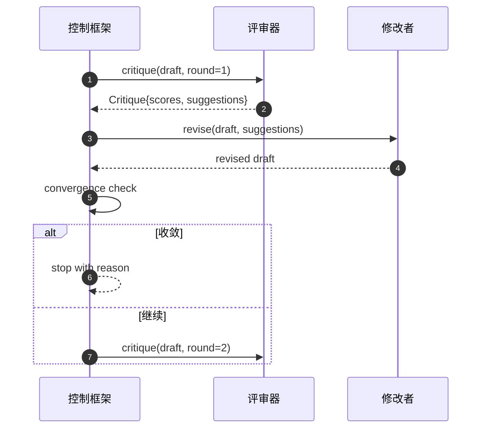

# Critic Loop

> 第一次就返回“看起来不错”的评审是有问题的。一直返回“需要改进”的评审也是有问题的。有趣的评审是能够收敛的那个，而你必须为收敛做工程设计。

**Type:** 构建
**Languages:** Python
**Prerequisites:** 第19阶段 第50-53课
**Time:** ~90 分钟

## Learning Objectives

- 按五个固定维度对论文草稿评分：clarity、novelty、evidence、methodology、related-work。
- 将每一轮的批评应用为结构化的修订 diff，而不是自由格式的重写。
- 通过比较各轮分数检测收敛；在达到平台期、目标或耗尽预算时停止。
- 为轮次设置最大迭代预算，以防止不收敛的评审无限运行。
- 输出每轮的 trace，以便仪表盘或下一阶段可以呈现分数轨迹。

## Why five fixed dimensions

自由格式的评审是模型返回一段建议性段落。下一轮的修订将该段落作为背景上下文。由于批评没有结构化，无法验证重写是否真正解决了这些批评。

五个维度为测试框架提供了一个契约。



分数是一个向量。框架会在各轮之间观察每个维度。一个把清晰度提高但把证据搞砸的修订就是在证据上回退，收敛检查会看到这一点。仅靠模型的评审无法提供这种保证。

## The Critique shape



每条建议都包含要改进的维度、目标的部分，以及修订者可以应用的 `edit` 指令。修订者本身也是可调用的。课程附带一个确定性的修订器，它将 `edit` 指令解释为“追加到指定章节”的操作。基于模型的修订器则会将同一字段解释为提示词。契约不变。

## Convergence rules, in order

评审循环在以下三种条件任一触发时终止。



目标是最严格的情况：五个维度（clarity、novelty、evidence、methodology、related_work）中的每一个必须达到 `>= target_score`（默认 `8.0`），循环才返回成功。平均分很高但有一个薄弱维度是不够的。平台期检测比较当前轮的均值与上一轮的均值。如果两轮连续改进小于 `plateau_epsilon`（默认 `0.1`），循环以 `plateau` 退出。预算是轮次的硬上限（默认 `5`），以 `budget` 退出。

顺序很重要。目标优先于平台期，平台期优先于预算。如果第三轮在同一次迭代中既达到目标又触发平台期，结果应为 `target`，而不是 `plateau`。

## Why plateau detection runs over two rounds

一轮的“平台期”可能是噪声。即使在固定草稿上，真实的评审每次迭代仍会返回略有不同的分数，因为确定性评分仍取决于哪些建议被应用以及应用顺序。要求两轮连续的平台期可以过滤掉这种噪声。如果框架报告平台期，则草稿确实已停止改进。

## The deterministic critic in this lesson

本课不调用模型。提供的评审器是一个可调用对象，根据三个信号对草稿评分：平均章节正文长度（clarity）、图表数量与引用数量（evidence），以及论文元数据中的 `originality_tag` 字段（novelty）。修订者知道如何提升每个分数。

```text
clarity      当平均章节正文长度增加时增长
novelty      当 originality_tag 被设置为 "high" 时增长
evidence     当某节的 figure_refs 非空时增长
methodology  当存在标题为 "Method" 的章节且有正文时增长
related-work 当存在标题为 "Related Work" 的章节且有正文时增长
```

修订者将每条建议解释为有针对性的追加操作。第一轮之后，框架可以观察到分数上升。测试利用这一属性来断言循环减少了差距。

## The full loop contract



框架拥有轮次计数、trace 和收敛检查。评审拥有分数。修订者拥有差异（diff）。三者互不修改对方的状态。

## The Trace output

每轮都会发出一个 trace 事件，包含轮次编号、分数向量、建议数，以及收敛结论。完整的 trace 会与最终草稿一起返回。下游的仪表盘可以呈现每轮分数图。下一课（迭代调度器）会读取 trace 以决定该分支是否值得保留。

## Budgets that protect against bad critics

一个产生永远无法提升分数的建议的评审会将循环锁在最大迭代上限。trace 会使该问题可见：五轮，分数平坦，结论为 `budget`。用户会将其理解为评审器的 bug，而不是草稿的 bug。替代方案只展示最终草稿，则会掩盖诊断。以 trace 为先的设计将其显现出来。

## How to read the code

`code/main.py` 定义了 `Critique`、`Suggestion`、`Critic` 协议、`Reviser` 协议、`CriticLoop`，以及返回确定性评审器和匹配修订器的工厂函数 `make_deterministic_critic_pair`。包含了一个最小的 `Paper` 结构，以便课程独立成立。

`code/tests/test_critic_loop.py` 覆盖的测试包括：第一轮后的单调改进、调优草稿的目标收敛、两轮平坦后的平台期检测、无建议能改进时的预算耗尽、修订者对建议的应用以及 trace 形状。

## Going further

两个真实实现可能想要的扩展。第一，维度权重：研讨会论文可能对新颖性权重更高；期刊则可能权重相反。收敛检查变为加权均值。第二，配对评审：一个评审负责评分，第二个评审在修订者看到建议之前对建议进行裁定。两者都很有价值，并且都可以在相同的 `Critique` 形状上进行组合。

关键在于分数向量。一旦批评被结构化，其他所有改进、收敛规则、仪表盘、配对评审都可以不改变循环而直接接入。