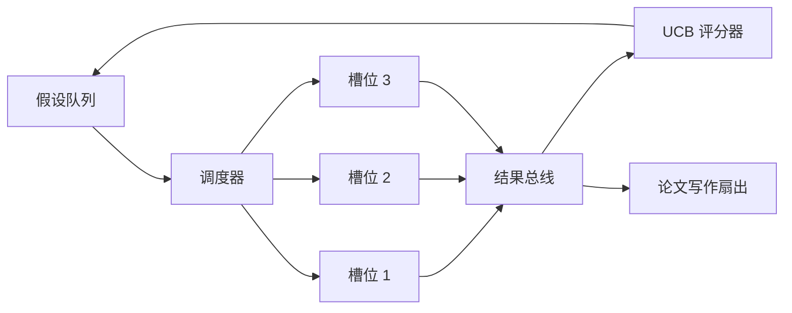
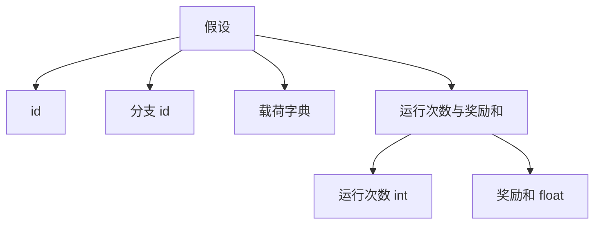
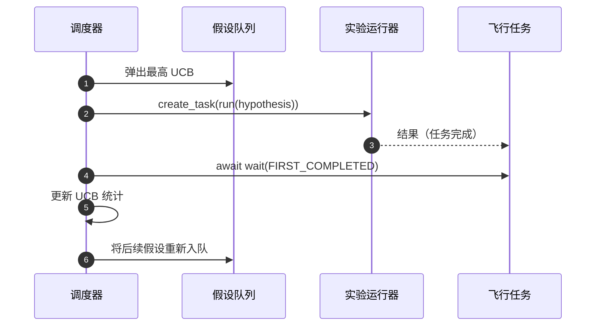

# Iteration Scheduler

> A research loop without a scheduler is a queue with delusions. The scheduler is where the loop decides what to stop exploring, and that decision is the whole game.

**Type:** 构建
**Languages:** Python
**Prerequisites:** 第19阶段第50-53课
**Time:** ~90 分钟

## 学习目标

- 将研究工作流建模为一个假设队列，向并行实验槽位提供任务，实验结果再汇回合并。
- 使用 asyncio 并发运行多个实验，使调度器保持所有槽位繁忙。
- 使用 UCB 对每个假设分支打分，以便调度器能在不放弃探索的前提下修剪低产出分支。
- 将完成的结果扇出到论文写作阶段和重新入队阶段，使高产出分支生成后续假设。
- 生成每次迭代的痕迹，包含分支分数、槽位占用情况和剪枝决策。

## 为什么要用调度器，而不是简单的工作列表

一个扁平的工作列表按提交顺序运行作业。当每个作业相互独立时，这没问题。研究并不独立：第三个实验的发现会改变第四和第五个实验的优先级。一个读取结果汇入并重新排序队列的调度器可以在单位计算资源下完成更多有用工作。

有趣的设计选择是评分规则。一个贪婪的评分器总是选择当前领先者而从不探索。一个均匀的评分器从不利用。UCB（上置信界）是中间道路：一方面利用领先分支，另一方面为尝试较少的分支保留容量。

## 系统形状



队列保存假设。每当一个槽位空闲时，调度器会选取 UCB 最高的假设。每个槽位异步运行一个实验。完成的实验将其结果扇送到总线。总线在源分支上更新 UCB 统计，并在分支产出超过阈值时扇出到论文写作阶段。

## 假设的形状



`branch` 是 UCB 统计的键。多个假设可能共享一个分支（分支代表研究方向；假设是该方向下的一次试验）。`runs` 是该分支已完成实验的计数，`reward_sum` 是累计奖励。UCB 会读取两者。

## UCB 评分

本课使用的 UCB 公式是经典的 UCB1。

```text
ucb(branch) = mean_reward(branch) + c * sqrt( ln(total_runs) / runs(branch) )
```

`total_runs` 是跨所有分支已完成实验的总计数。`c` 是探索权重；本课默认为 `sqrt(2)`。运行次数为零的分支得到 `+inf`，因此未尝试的分支总是优先被调度。高均值奖励的分支会保持较高分数，直到其他分支赶上；连续多次运行却回报不高的分支会被尝试较少的替代分支超越。

剪枝门（pruning gate）与选择器是分离的。剪枝在某个分支的均值奖励在至少经过 `prune_after_runs` 次试验（默认 `3`）后低于绝对下限（默认 `0.2`）时，将该分支从未来调度中移除。这可以保持队列有界。

## 使用 asyncio 的并行槽位

调度器使用 `asyncio.create_task` 驱动实验。每个任务运行实验运行器（一个 `async def` 可调用对象），并返回一个 `Result`。主循环使用 `asyncio.wait(..., return_when=asyncio.FIRST_COMPLETED)` 在飞行任务集合上等待，并在每次完成时触发评分更新。



三个槽位并发运行。主循环不会被单个实验阻塞。只要队列非空或有任务在飞行，调度器就会在槽位空出时继续启动新任务。

## 扇出：论文触发

当某个分支的均值奖励越过 `paper_threshold`（默认 `0.7`）且该分支尚未产出论文时，调度器会在输出列表上扇出一个 `paper.trigger` 事件。下游的论文写作者（第 54 课）会拾取该事件。在本课中该触发作为列表被捕获以便测试断言。

## 扇出：后续假设

当出现高产出结果时，调度器可以调用用户提供的 `expander` 来为相同分支生成一个或多个后续假设。expander 是一个从 `Result` 到 `list[Hypothesis]` 的纯函数。本课提供了一个确定性的 expander：对于任何奖励超过论文阈值的结果，都会生成两个后续假设。

## 预算限制

两个预算保护调度器免于无限循环。

```text
max_experiments    : total count of experiments run across all branches
max_seconds        : wall-clock cap (asyncio time)
```

当任一预算触发时，调度器停止调度新任务，等待已在飞的任务完成，并返回最终痕迹（trace）。痕迹包含一个 `stop_reason`。

## 痕迹与最终报告

每次调度决策（选择、调度、结果、剪枝、扇出）都会发出一个事件。最终报告汇总每个分支的统计信息、总运行数、总墙钟时间和触发的论文事件。下一课的端到端演示会读取该报告以驱动论文写作。

## 如何阅读代码

`code/main.py` 定义了 `Hypothesis`、`Result`、`BranchStats`、`IterationScheduler`，以及一个 `make_deterministic_runner` 工厂函数，该函数返回一个具有可预测奖励的 asyncio 实验运行器。该运行器会睡眠固定的 `delay_ms`（默认 `5ms`），因此并发性是可观察的。

`code/tests/test_scheduler.py` 覆盖的场景包括：UCB 优先选择未尝试分支、并行槽位占用、当阈值被越过时触发论文、低产出试验后的分支剪枝、高产出结果的扇出后续假设，以及预算退出（包括实验计数和墙钟时间）。

## 深入扩展

真实实现会希望添加三项扩展。首先，跨会话持久化 UCB 统计：当前统计保存在内存；真实的调度器会检查点这些统计，以便重启时保留已消耗的探索预算。其次，多目标评分：结果不是标量奖励而是向量，UCB 将变成帕累托式选择器。第三，上下文化的赌博机（contextual bandits）：选择器以假设特征（长度、复杂度）为条件，使相似假设共享探索经验。

调度器是研究从工作列表走向智能探索的关键。一旦 UCB 接入并且槽位并行运行，其他任何改进都可以在其上组合叠加。