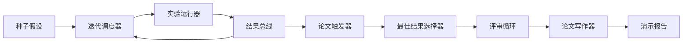
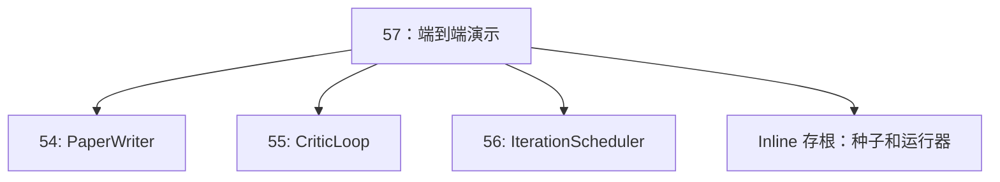
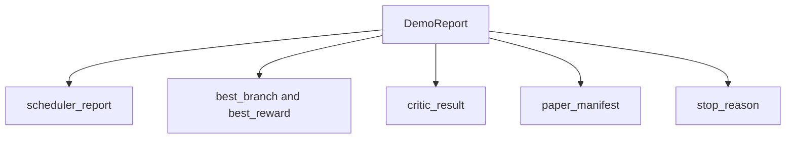

# End-to-End Research Demo

> A demo is the place where every contract you wrote earlier has to compose. If any one of them leaks, the demo is the lesson that catches it.

**Type:** 构建  
**Languages:** Python  
**Prerequisites:** 阶段 19 课程 50-53  
**Time:** ~90 分钟

## Learning Objectives

- 将自动研究循环端到端串联：假设种子、实验运行器、调度器、评审循环、论文写作器。
- 通过普通的 Python import（而非框架），组合四个早期 D 轨课程中的原语。
- 运行该循环直到自我终止，并输出一个包含每个阶段输出的单一演示报告。
- 保持演示的确定性，以便测试套件能够断言最终形态。
- 当任一阶段的合约破裂时，显式暴露清晰的失败模式，防止下游阶段使用损坏的输入继续运行。

## What composes here



五个阶段。种子是一组三个假设。调度器在这些假设上运行六次实验，具有三个并行槽位。结果总线报告一个或多个论文触发。选择器从中选出单个最佳结果。评审循环在基于该结果构建的草稿上反复迭代。论文写作器输出最终的 LaTeX、BibTeX 和 manifest。

## Why import, not copy

每个早期课程都发布了一个带有公共 dataclasses 和函数的 `main.py`。演示通过将 `sys.path` 调整到每个课程的上级目录来导入它们。这不是框架级的接线；这是与早期课程测试文件已经使用的相同 import 方式。



内联存根替代了课程 50 到 53：它是一个小的假设生成器和一个同步的奖励函数。用户可以通过调整两处 import 将内联存根替换为那些课程中的真实原语。

## Determinism guarantees

演示在设计上是确定性的。实验运行器使用带种子的 numpy。评审循环中的修订器按固定维度以固定顺序遍历。论文写作器的生成器使用课程 54 中的模拟版本。调度器的 UCB 选择器在并列时按迭代顺序而非随机选择以保持确定性。

给定相同的种子，演示会输出相同的报告。测试通过运行演示两次并比较 manifest 来断言该属性。

## The demo report shape



每个字段直接来自上游阶段。演示不会对任何输出做转换；这就是对该组合的测试。

## Failure mode handling

每个阶段要么成功，要么抛出带类型的错误。

```text
Scheduler ........ 返回 SchedulerReport，带有 stop_reason
                   值在 {queue_empty, max_experiments, deadline}
Best-result pick . 如果没有论文触发器触发则抛出 NoTriggerError
Critic loop ...... 返回 LoopResult，状态为 converged 或 stopped
Paper writer ..... 在合约违约时抛出 PaperValidationError
```

任一阶段的失败会用带类型的异常短路演示。测试固定了这个合约：`test_no_triggers_raises_typed_error` 和 `test_best_picker_raises_when_no_triggers` 断言当没有分支触发触发器时，选择器会抛出 `NoTriggerError` / `BestResultError`，且写作器不会被调用。

## The best-result picker

调度器按分支发出论文触发。选择器选择在所有触发中平均奖励最高的分支。若并列，则按分支 id 的字母序断开，因此演示保持确定性。选择器是一个小的纯函数；测试基于固定的 scheduler_report 固定其行为。

## Wiring the critic loop

课程 55 的评审循环在 `MiniPaper` 上操作。演示通过填充摘要为分支 id、为两个章节（Introduction 和 Results）播种内容，并根据分支的平均奖励设置 `originality_tag`（若 >= 0.8 则为 high，若 >= 0.6 则为 medium，否则为 low）来从选中的分支构建 `MiniPaper`。

随后修订器将草稿迭代至收敛。输出会传入论文写作器。

## Wiring the paper writer

课程 54 的论文写作器在包含图表和参考文献的完整 `Paper` 结构上工作。演示通过 `mini_to_full_paper` 将已收敛的 `MiniPaper` 升级为完整 `Paper`，为所选分支附加一幅图，并基于评审建议的引用键集合构建一个小的合成参考文献。演示添加的每个引用也都会添加到参考文献列表中，以使验证通过。

## How to read the code

`code/main.py` 定义了 `BestResultError`、`NoTriggerError`、`DemoReport`、`pick_best_branch`、`build_mini_paper`、`mini_to_full_paper` 和 `run_demo`。文件顶部的导入仅调整一次 `sys.path`，并从对应课程中拉取 `PaperWriter`、`CriticLoop` 和 `IterationScheduler`。

`code/tests/test_e2e.py` 覆盖的内容包括：演示端到端运行并输出包含所有五个字段的报告、两次运行的确定性、当没有分支超过阈值时抛出 NoTriggerError、当写作器合约破裂时抛出 PaperValidationError、论文 manifest 包含被选中分支的图，以及调度器的 stop_reason 为预期值之一。

## Going further

三个值得在演示通过后连接的扩展。第一，持久化状态：每个阶段的结果写入一个小的 JSON 存储，这样重启可以无需重新运行便宜的阶段即可恢复。第二，仪表板：将调度器和评审循环的跟踪事件渲染为单一时间线。第三，真实模型调用：将模拟的文本生成器和确定性的评审器替换为基于模型的实现；接线工作不需要改变。

演示的任务是证明组合即是架构。五个课程，四个 import，一个报告。下一次你添加一个阶段，接线只会增长一行。