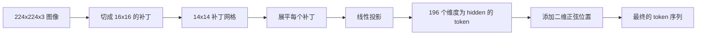

# Vision Encoder Patches

> 一个读取像素的视觉模型需要一个像素的 tokenizer。Patch embedding 就是那个 tokenizer。把图像切成网格方块，展平每个方块，通过一个线性层投影，然后加上二维位置信号，让 transformer 知道每个方块在原图中的位置。

**Type:** 构建  
**Languages:** Python  
**Prerequisites:** 第 19 阶段 第 30-37 课（Track B 基础）  
**Time:** ~90 分钟

## 学习目标

- 将图像标记化为固定长度的 patch embedding 序列。  
- 实现一个基于 `Conv2d` 的 patch 投影，使其在数学上等价于 unfold-then-linear。  
- 构建一个确定性的二维正弦位置嵌入，使 token 顺序编码空间位置。  
- 在合成测试用例上验证 patch 数量、嵌入形状以及 `Conv2d` 与 unfold 等价性。

## 问题背景

Transformer 处理的是向量序列。图像是三通道的格点。把每个像素当作一个 token 会把序列长度炸开：一个 224x224 的 RGB 图像是 150,528 个 token，12 层的 transformer 在注意力上无法承受。把整张图当作一个巨大的扁平向量又会丢失局部性，注意力层无法从中恢复局部结构。编码器前端的工作就是把像素格压缩成几百个 token，每个 token 概括一个方形区域。

Patch embedding 用一个线性投影解决这个问题。将 224x224 的图像切成 16x16 的补丁会得到 14x14 的 196 个补丁网格。每个补丁从 `(3, 16, 16) = 768` 个像素值展平为一个向量，然后用线性层把它映射到模型的 hidden 维。Transformer 会看到 196 个维度为 `hidden`（常见为 768）的 token，再加上一个 CLS token。这就是后续网络可以处理的序列。

## 概念



### 为什么用补丁而不是像素

注意力的计算复杂度与序列长度的平方成比例。一个 196-token 的序列每层每个头需要计算 `196 * 196 = 38,416` 个注意力分数；而 150,528-token 的序列需要 `150,528 * 150,528 = 226 亿` 个分数。补丁带来了约 590,000 倍的注意力计算量缩减，且一个 16x16 区域已经包含了高层视觉任务所需的大部分信号。代价是补丁内部的细粒度空间细节丢失，这就是为什么在需要精细定位的下游多模态架构中常常会运行第二条高分辨率分支。

### 为什么线性投影就足够了

每个补丁被视为独立的向量。投影会学习一组基：边缘检测器、颜色滤波器、简单纹理等。单层线性层参数量小（ViT-Base 的 `768 * 768 = 589,824` 参数）且训练快。也存在更深的卷积干（“hybrid” ViT），但扁平的线性投影是标准做法，大多数现代开源权重的编码器就是这个形状。

### `Conv2d` 技巧

`Conv2d(in_channels=3, out_channels=hidden, kernel_size=patch_size, stride=patch_size)` 在不使用填充的情况下，数值上等价于 unfold-then-linear，因为每个输出位置都是把补丁像素与一个滤波器做点积。卷积就是补丁投影，很多生产代码库都这样实现，因为在 GPU 上更快且少一次 reshape。

### 位置嵌入

投影出来的 tokens 没有顺序信息。二维正弦嵌入给每个 token 一个固定信号，编码它的 (row, col) 位置。嵌入维度的一半用多频率的 sin/cos 编码行位置；另一半编码列位置。该编码是确定性的，因此可以在不重训练的情况下切换分辨率，并能在模型训练时未见过的网格上进行平滑插值。

| Component | Shape | Parameters |
|-----------|-------|------------|
| Patch projection (`Conv2d`) | `(hidden, 3, patch, patch)` | `3 * P * P * hidden + hidden` |
| Position embedding (fixed) | `(num_patches, hidden)` | 0（计算得出，非学习） |
| CLS token (learned) | `(1, hidden)` | `hidden` |

对于在 224 分辨率下的 ViT-Base/16：投影层有 590,592 个参数，CLS token 有 768 个参数，正弦位置嵌入为零参数。下一课（59）会在这个前端上堆一个 12 层的 transformer。

### 等价性作为健全性检查

patch 步骤有两种写法：`Conv2d` 投影和显式的 unfold-then-linear。对于相同的权重它们必须产生相同的输出。如果不相同，unfold 的数学推导就是错的，后续的编码器就没有可信的基石。本课中的测试会验证这一等价性。

## 实现

`code/main.py` 实现了：

- `PatchEmbed`：一个封装 `Conv2d` 的 `nn.Module`，用于 patch 投影。  
- `sinusoidal_2d(grid_h, grid_w, dim)`：一个无状态函数，构建二维位置表。  
- `VisionFrontEnd`：将 patch embedding、CLS 前置、位置相加组合成一次前向传递。  
- 一个 `synthesize_image(seed)` 辅助函数，从 `numpy.random` 构建确定性的 224x224x3 测试图。  
- 一个演示，将一个测试图像送入前端并打印输出形状、CLS token 范数和位置嵌入的一行。

运行：

```bash
python3 code/main.py
```

输出：224x224 的测试图被标记化为形状为 `(1, 197, 768)` 的序列。第一个 token 是 CLS；接下来的 196 个是 patch tokens。位置嵌入在同一行内的范数是一致的，这就是正弦编码的特征。

## 使用场景

相同的 patch 前端出现在每个现代视觉-语言模型中：CLIP ViT-L/14、SigLIP、DINOv2、Qwen-VL 家族和 InternVL 堆栈等，都以 `Conv2d` 的 patch 投影加位置信号为起点。不同家族的差异体现在下游（CLS 与无-CLS 的池化、register tokens、不同的 patch 大小 14 vs 16、通过插值实现的动态分辨率）。本课的前端是这些模型共同的基底。

## 测试

`code/test_main.py` 覆盖了：

- patch 数量等于 `(image_size / patch_size) ** 2`  
- 输出形状为 `(batch, num_patches + 1, hidden)`  
- `Conv2d` 投影与手动 unfold-then-linear 在小型测试用例上相等  
- 正弦位置表在多次调用间具有确定性  
- CLS token 在 batch 维上广播时不会发生泄漏

运行它们：

```bash
python3 -m unittest code/test_main.py
```

## 练习

1. 用学习型的 `nn.Parameter` 替换正弦位置，并在一个小型合成分类任务上比较第一轮的 loss。学习型位置在固定分辨率下更有优势；在训练后更改分辨率时正弦位置更有优势。  

2. 把 `Conv2d` 换成显式的 `nn.Unfold` 加上 `nn.Linear`，并断言两者在浮点容差内输出匹配。相同的数学，不同的实现方式。  

3. 添加对非方形 patch 大小的支持（例如针对宽高比大的输入使用 32x16），并验证位置表能处理非方形网格。  

4. 在 batch sizes 为 1、8、64 时对 patch 步骤做性能分析。patch 投影很少是瓶颈；下游的注意力层通常主导耗时。  

5. 将前端作为冻结的特征提取器，在一个 4 类合成形状数据集（圆、方、三角、星）上训练。CLS token 的输出应能被线性分离。

## 关键术语

| 术语 | 含义 |
|------|---------------|
| Patch（补丁） | 图像的方形子区域，通常为 14x14 或 16x16 |
| Patch embedding（补丁嵌入） | 将展平后的补丁线性投影到 hidden 维 |
| Sequence length（序列长度） | patch 标记化后的 token 数，通常再加上 CLS |
| Sinusoidal position（正弦位置） | 用 sin/cos 的固定信号编码二维网格坐标 |
| CLS token | 学习得来的向量，前置到序列用于池化头 |

## 延伸阅读

- "An Image is Worth 16x16 Words" (ViT, 2021) — 原始的 patch-embed 论文。  
- "Attention Is All You Need" (2017) — 用于本处二维位置公式的原始正弦位置来源。  
- DINOv2 论文 — 关于 register tokens 的扩展，可作为练习 6 的参考。