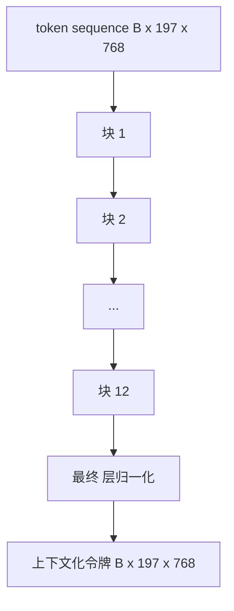
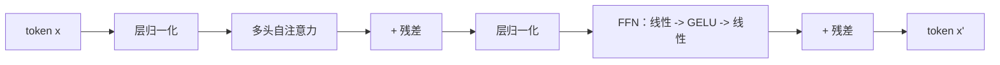

# Vision Transformer Encoder

> Patches alone do not see. A 12-layer pre-LN transformer with 12 attention heads turns the sequence of patch tokens into a sequence of contextual tokens, with the CLS token pooling whole-image features in its final hidden state. This lesson is the engine room of every modern vision-language model.

**Type:** 构建  
**Languages:** Python  
**Prerequisites:** 第 19 阶段 第 30-37 课（Track B 基础）  
**Time:** ~90 分钟

## 学习目标

- 实现一个带有多头自注意力和前馈子层的 pre-LN Transformer block（前置 LayerNorm）。
- 堆叠 12 个 block、每层 12 个 heads，构成一个 ViT-Base 编码器。
- 将第 58 课的 patch 前端接入编码器并运行一次前向传播。
- 验证 CLS token 汇聚了来自每个 patch 的信息。

## 问题背景

patch 嵌入会产生 197 个 token 的序列，每个向量对其他 patch 都没有感知。要识别一只猫的图像，需要每个 patch 知道哪些 patch 含有胡须、哪些是背景、哪些包含眼睛。Transformer 是建立这种感知的机制，一层注意力一层地构建。没有它，patch 前端只是一个聪明的分词器，但没有理解能力。

标准配方是 12 层深、12 头宽，采用前置 LayerNorm（pre-LN）、GELU 激活，以及 4x 的前馈扩展。这个配方是 CLIP ViT-L、SigLIP、DINOv2、Qwen-VL 系列、InternVL，以及 2025-2026 年所有开源视觉编码器的脊柱。该配方足够稳定，你可以阅读这些论文并假设 block 形状除非另有说明。

## 概念图





### Pre-LN vs post-LN

原始 Transformer 将 LayerNorm 放在残差之后。Pre-LN（在每个子层之前做 LayerNorm）是每个现代视觉-语言模型使用的版本，因为它在无需学习率预热技巧的情况下训练得更稳定。区别在于前向传递的一行代码，但在深度 12+ 时的梯度流差异如白天与黑夜。

### 多头自注意力

每个 head 将 token 向量投影为其自己的 (query, key, value) 三元组，维度为 `head_dim = hidden / num_heads`。当 `hidden = 768` 且 `heads = 12` 时，每个 head 的 `dim = 64`。12 个头并行注意力，然后它们的输出 concat 回 768 维，并通过输出投影。多头的意义在于：一个 head 可以学会“关注猫眼”，另一个学会“关注背景渐变”，互不干扰。

### 为什么 FFN 扩展是 4x

FFN 的结构是 `hidden -> 4 * hidden -> hidden`，中间用 GELU。4 的因子是经验性的，自 2017 年以来在语言与视觉 Transformer 中都被验证有效。更小（2x）会欠拟合；更大（8x）在固定数据预算下会过拟合。MLP 是模型存储大部分学习事实的地方，宽中间层是这些知识驻留的空间。

| Component | Parameters at ViT-Base scale |
|-----------|------------------------------|
| qkv projection per block | `3 * 768 * 768 = 1.77M` |
| output projection per block | `768 * 768 = 590K` |
| FFN per block (4x expansion) | `2 * 768 * 4 * 768 = 4.72M` |
| LayerNorm per block | `4 * 768 = 3K` |
| Total per block | about 7.1M |
| 12 blocks | about 85M |
| Plus front end | about 86M total |

ViT-Base 是一个约 86M 参数的编码器。以 2026 年的标准来说它算小（SigLIP-So400M 为 400M，Qwen-VL 的 ViT 为 675M），但架构在宽度和深度上相同。

### 是否需要因果掩码？

视觉 Transformer 是仅编码器且双向的：token `i` 可以在任何对 `j` 上进行注意。无需掩码。解码器侧的 cross-attention（第 61 课）将使用因果掩码，但在视觉编码器内部，注意力是全连接的。

### CLS token 学到的东西

CLS token 被初始化为一个可学习参数，它自身不含 patch 内容，通过注意力在每个 block 中累积信息。到最终层时，CLS 的那一行成为整张图像的向量摘要；下游的 head 将这个向量投影为分类 logits、对比嵌入，或作为文本解码器的 cross-attention key。

## 构建

`code/main.py` 实现了：

- `MultiHeadSelfAttention`，包含 `qkv` 和输出投影、缩放点积注意力计算，以及形状断言。
- `FeedForward`，4x 扩展的 GELU MLP。
- `Block`，一个由注意力和前馈子层组成并带残差的 pre-LN block。
- `ViT`，由 12 个 block 堆叠并带最终 LayerNorm。
- `VisionEncoder`，将第 58 课的 `VisionFrontEnd` 接入 `ViT` 堆栈，并暴露一个 `forward()`，返回上下文化序列和池化后的 CLS 向量。
- 一个演示程序，将合成的 224x224 固定输入图像通过完整编码器，并打印输入形状、输出形状、参数计数，以及每隔一层的 CLS 范数。

运行：

```bash
python3 code/main.py
```

输出：该固定装置会被编码为一个 `(1, 197, 768)` 张量。CLS 的范数在层叠过程中向上漂移，然后在最终 LayerNorm 处稳定。总参数数在大约 86M 附近。

## 使用场景

此处定义的编码器，在宽度和深度之外，与 2025-2026 年内发布的所有开源 VLM 内部所使用的 block 堆栈相同。差异体现在：

- **宽度与深度。** ViT-Large 为 `hidden=1024, depth=24, heads=16`；SigLIP So400M 为 `hidden=1152, depth=27, heads=16`。相同的 block。
- **池化头。** CLS 池化（本课） vs 平均池化（SigLIP） vs 注意力池化（后续 VLM）。
- **位置处理。** 固定正弦（第 58 课） vs 可学习的一维 vs ALiBi vs 2D RoPE。block 的数学不变。
- **注册令牌。** DINOv2 在前面再加 4 个可学习令牌。只需一行代码。

这个 block 堆栈是基底。接下来的课程（60-63 课）将建立在其之上。

## 测试

`code/test_main.py` 包含：

- 单个 block 保持形状并对输入批大小不敏感。
- 注意力得分在 key 轴上和为一（softmax 校验）。
- 残差路径已连通（零输入仍能通过 CLS 令牌产生非零输出）。
- 4 层堆叠的前向传播产生正确形状。
- 梯度会从 CLS 输出流向 patch 投影层。

运行它们：

```bash
python3 -m unittest code/test_main.py
```

## 练习

1. 添加 register tokens（在 CLS 之后 prepend 4 个可学习向量）并重新运行。通过最后一层 softmax 分布的熵比较注意力图的平滑性。

2. 将 pre-LN 换成 post-LN，在一个合成形状分类器上训练一个 epoch。观察哪个在无学习率预热情况下训练更稳定。

3. 实现因果掩码作为 `attn_mask` 参数，以便同一个 block 可复用为解码器 block。掩码形状为 `(seq, seq)`，为下三角矩阵。

4. 使用 `torch.profiler` 在批量大小 1、8、64 下分析一次前向传播。MLP 层占据壁钟时间的主要部分，而非注意力。

5. 用低秩 LoRA 适配器替换其中一个注意力头的 q-k-v 投影，冻结其余部分，并验证梯度仅在你期望的地方流动。

## 关键术语

| 术语 | 含义 |
|------|------|
| Pre-LN（前置 LayerNorm） | 在每个子层之前应用 LayerNorm，而不是之后 |
| 自注意力 (Self-attention) | 每个 token 在同一序列内对其他所有 token 进行注意力计算 |
| 多头 (Multi-head) | 隐藏维度被分割为 `H` 个独立的注意力头 |
| FFN 扩展 | 前馈层在收缩回 `hidden` 之前被扩展到 `4 * hidden` |
| CLS 池化 (CLS pooling) | 使用第一个 token 的最终隐藏状态作为图像摘要 |

## 延伸阅读

- An Image is Worth 16x16 Words (ViT, 2021) — 编码器配方参考。  
- DINOv2 (2023) — 关于 register tokens 与自监督预训练目标的资料。  
- SigLIP (2023) — 关于平均池化变体与第 62 课使用的 sigmoid 对比损失的资料。