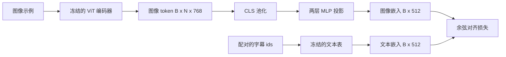

# Projection Layer for Modality Alignment

> 一个视觉编码器输出图像 token。一个文本解码器消费文本 token。二者处于不同的向量空间。一个小的两层 MLP 将图像 token 投影到文本嵌入空间，对应的配对字幕的余弦对齐损失会把两个空间拉到一致。这个投影是视觉-语言模型中最小且对迁移最关键的部分。

**Type:** 构建
**Languages:** Python
**Prerequisites:** Phase 19 lessons 30-37 (Track B foundations)
**Time:** ~90 分钟

## Learning Objectives

- 构建一个将图像特征映射到文本嵌入空间的两层 MLP 投影。
- 构造一个模拟文本嵌入表（不使用预训练分词器，也不使用真实语料）。
- 计算投影后的图像 token 与配对字幕嵌入之间的余弦对齐损失。
- 在冻结的视觉编码器与冻结的文本表上，仅训练投影层。

## The Problem

你有一个视觉编码器（课程 58-59）产生维度为 `vision_hidden = 768` 的 token。你有一个希望接入的文本解码器，其嵌入维度为 `text_hidden = 512`（其他数值同样可行）。解码器期望文本形状的 token。图像 token 并非文本形状：它们位于编码器在视觉单独预训练期间学到的基底中，与解码器的词向量没有关系。

两层 MLP 投影（linear, GELU, linear）弥合了这个差距。它足够小（大约 `768 * 1024 + 1024 * 512 = 1.3M` 参数），可以在单 GPU 上几分钟内训练完成，并且在对齐阶段是唯一必须学习的部分。视觉编码器保持冻结，文本嵌入表保持冻结，只有投影会更新。这正是 LLaVA 在 2023 年使用的配方，BLIP-2 将其重构为 Q-Former，之后的每个开源权重 VLM 都以某种形式采用了类似方案。

## The Concept



### Pooling before projection

视觉编码器输出 197 个 token。文本端只有一个字幕级别的嵌入。要对齐它们，你需要每个样本一个图像级向量。CLS 池化是最简单的：取编码器的第一个 token 并对其投影。对全部 197 个 token 求均值池化是另一种选择，这也是 SigLIP 使用的方式。无论哪种方式，都会把 197 个向量池化成一个。

### Why two layers and not one

单层线性投影可以旋转与缩放，但无法修正两个空间在“曲率”上的不匹配。两层线性之间的 GELU 为投影提供了一个非线性弯折，经验上足够将 CLIP 风格的特征对齐到语言模型的嵌入。更深的投影（LLaVA-NeXT 使用 GLU；Qwen-VL 使用多层注意力堆栈）是扩展；两层 MLP 是规范的基线，也是 BLIP-2 的 Q-Former 投影头底层所采用的形式。

| Layer | Shape | Parameters |
|-------|-------|------------|
| fc1 | `(vision_hidden, projection_hidden)` | `768 * 1024 + 1024` |
| activation | GELU | 0 |
| fc2 | `(projection_hidden, text_hidden)` | `1024 * 512 + 512` |

对于 `768 -> 1024 -> 512` 的 head，大约 1.3M 参数。

### Cosine alignment loss

对齐并不意味着 `image_emb == text_emb`。对齐意味着 `image_emb` 在联合空间中与 `text_emb` 指向相同的方向。余弦损失为 `1 - cos_sim(image, text)`，范围从 0（完全对齐）到 2（方向相反）。训练会把这个值对每对样本趋近于 0。第 62 课将此推广到对比批次（InfoNCE），要求每张图像比批次中任何其他字幕都更接近自己的字幕；本课用的是逐对版本以便观察动态。

### Frozen encoder is the trick

视觉编码器有 8600 万参数。文本表又有数百万参数。从一个模拟语料上训练全部这些参数不可行。冻结两者意味着投影的 1.3M 参数是唯一变化的部分，几百步的合成对就足以把损失拉低。这正是基于适配器的 VLM 的运作形态：重量级部分保持冻结，轻量桥接训练。

## Build It

`code/main.py` 实现了：

- `MLPProjector(in_dim, hidden_dim, out_dim)`，两层线性 MLP，GELU 激活。
- `MockTextEmbedding(vocab_size, dim)`，使用固定种子进行确定性初始化的冻结嵌入表。
- `make_pair(seed, vocab_size)`，合成一对（图像，字幕）样本。字幕是短的 id 序列；字幕嵌入通过 token 嵌入的均值池化得到。
- `cosine_alignment_loss(image_emb, text_emb)`，逐对的 `1 - cos_sim` 目标。
- 一个训练循环，在 32 个合成样本上循环运行 200 步，仅训练投影，视觉编码器和文本表均冻结，每 25 步打印一次损失。

运行它：

```bash
python3 code/main.py
```

输出：训练报告显示初始损失约 1.07，在 200 步内下降到约 0.80，说明仅靠投影就能把图像 token 拉向文本空间。每对样本的最终余弦相似度也会被打印出来。

## Use It

相同的模式出现在每个开源 VLM 中：

- **LLaVA 1.5。** 从 CLIP-ViT-L 隐藏维到 LLaMA 嵌入维的两层 GELU MLP 投影。冻结视觉编码器、冻结 LLM，仅训练投影（然后在第二阶段解冻 LLM）。
- **BLIP-2。** Q-Former 将 32 个可学习的查询 token 通过与图像 token 的交叉注意力，然后投影到 LLM 嵌入维。Q-Former 最后端的投影头就是本课 MLP 的对应物。
- **MiniGPT-4。** 从 BLIP-2 Q-Former 输出到 Vicuna 嵌入维的单层线性投影。
- **Qwen-VL。** 使用若干层的交叉注意力适配器，但最终部分仍然是投影到 LM 嵌入维。

形状可能不同，但角色完全相同：池化图像 token，投影到文本嵌入维，仅训练桥接部分。

## Tests

`code/test_main.py` 涵盖：

- 投影器输出形状与配置的 `out_dim` 匹配
- 冻结文本嵌入表的参数 `requires_grad` 为 False
- 余弦损失在相同向量上为 0，在反向平行向量上为 2
- 投影器在一次反向传播后有梯度流
- 训练循环在第 0 步和第 200 步之间降低损失

运行它们：

```bash
python3 -m unittest code/test_main.py
```

## Exercises

1. 用对 196 个 patch token 求均值池化替换 CLS 池化，并比较 200 步后的最终损失。均值池化通常在合成数据上训练更快；CLS 在自然图像上更样本高效。

2. 在余弦损失中加入一个可学习的标量温度（`cos / tau`），观察当 `tau` 太小（梯度噪声）或太大（损失停滞在高位）时发生的情况。

3. 用单层线性替换两层 MLP，并量化损失差距。非线性在自然图像特征上更重要，在合成特征上影响较小。

4. 在投影器权重上加入小的 L2 惩罚，观察它与余弦对齐的相互作用（余弦对齐在尺度上不变，因此 L2 惩罚主要会收缩未被使用的方向）。

5. 保存投影器权重，然后重载并在不做视觉编码器反向传播的情况下运行推理，以验证部署时只需投影器即可。

## Key Terms

| Term | What it means |
|------|---------------|
| Modality alignment | 使图像与文本嵌入在同一共享空间中可比的行为 |
| Projection head | 将一个空间映射到另一个空间的小模块，通常是两层 MLP |
| Cosine similarity | 点积除以 L2 范数的乘积 |
| Frozen encoder | 视觉（或文本）模型的所有参数的 `requires_grad=False` |
| Mock corpus | 用于训练的合成配对，使训练无需下载数据集 |

## Further Reading

- LLaVA 论文，关于两阶段训练（先训练投影，然后解冻 LM）。
- BLIP-2 论文，关于 Q-Former 作为可学习投影的替代方案。
- Qwen-VL 技术报告，关于交叉注意力适配器作为更深层投影头的设计。