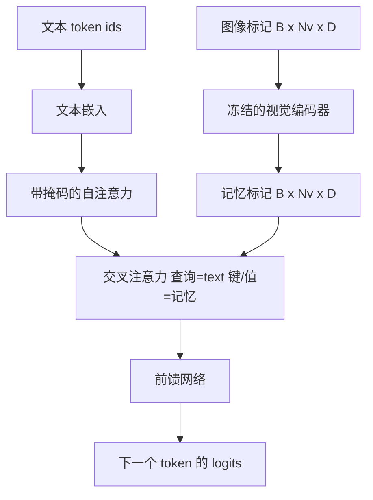
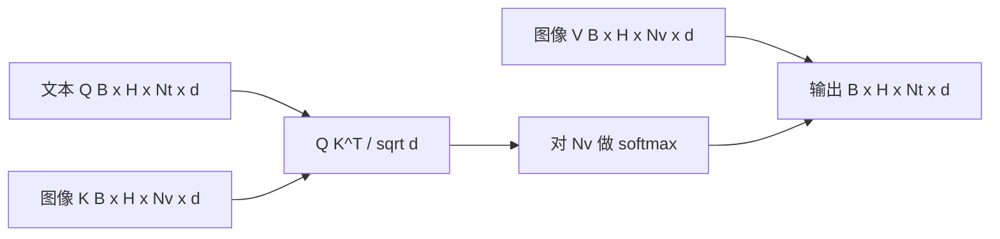

# Cross-Attention Fusion

> 投影层将一个图像向量与一个字幕向量对齐。一个真正的视觉-语言解码器需要每个文本 token 都能注意到每个 patch token，以便模型可以将每个词与一个区域建立锚定。交叉注意力就是这种锚定发生的方式。文本发出查询；视觉给出键和值。本课构建交叉注意力块、因果文本自注意力以及保持两者合法的掩码形状。

**Type:** 构建
**Languages:** Python
**Prerequisites:** Phase 19 lessons 30-37 (Track B foundations)
**Time:** ~90 分钟

## 学习目标

- 实现多头交叉注意力，其中查询流是文本，键/值流是视觉。
- 组合一个解码器块：因果自注意力 + 交叉注意力 + 前馈网络。
- 使掩码形状正确：自注意力使用因果掩码，交叉注意力不使用掩码。
- 使用成批文本 tokens 和固定的图像 token 池运行一次前向传播。

## 问题描述

将图像 tokens 与文本 tokens 连接成一个序列是一种融合选项（早期融合，Chameleon 和 Emu3 采用的路径）。交叉注意力是另一种（后期融合，Flamingo 引入的路径，之后的所有 Flamingo 形解码器基本都采用此法）。在后期融合中，文本解码器只在文本 tokens 上运行，并在每一层通过交叉注意力“伸手”到图像流。

后期融合有两个优点。首先，文本流保持纯净，模型保留了纯文本能力。其次，图像流在每张图像上只计算一次，并可在每个解码步复用，因此即使在生成长字幕时也很便宜。代价是每个块多出一个注意力子层。

## 概念





### 掩码形状

解码器块内的两个注意力需要不同的掩码：

| Attention | Query length | Key length | Mask | Why |
|-----------|--------------|------------|------|-----|
| Self-attention | `Nt` (text) | `Nt` (text) | 因果：下三角 `(Nt, Nt)` | 文本 token 在自回归过程中不能看向未来 |
| Cross-attention | `Nt` (text) | `Nv` (vision) | 无掩码 | 每个文本位置都能看到整张图像 |

本课包含一个形状校验函数，这样把它们混淆时会抛出 `ValueError`，比损失曲线被悄然破坏要好得多。

### 为什么交叉注意力不需要掩码

图像在任何文本生成之前就是完全可观测的。字幕的第 t 个 token 可以关注图像的任意 patch；图像 patch 之间不存在时间顺序。一些 Flamingo 变体在交叉多张图像和文本段时会添加每样本的遮罩模式，但对于单张图像加一个字幕的情况，交叉注意力能看到全部内容。

### 键/值 缓存（KV-cache）

图像的键和值在解码开始时只计算一次并保存在缓存中。每个新的文本 token 使用缓存而不重新计算。这正是推理时字幕生成快速的原因：沉重的 ViT 只运行一次；交叉注意力为每一步复用其键和值。本课暴露缓存并测试缓存命中路径。

### 块的组成

一个解码器块的运行流程是：pre-LN -> 自注意力 -> 残差 -> pre-LN -> 交叉注意力 -> 残差 -> pre-LN -> 前馈 -> 残差。三个子层，每个子层都有自己的 LayerNorm。Flamingo 论文在交叉注意力上加入了一个可学习门控，以便模型可以选择在训练时不使用图像路径（代价是稳定性）；这里使用的基线实现没有门控。

```python
class DecoderBlock:
  def forward(self, text_tokens, image_tokens, text_mask, cross_mask):
      text_tokens = text_tokens + self.self_attn(self.ln1(text_tokens),
                                                 mask=text_mask)
      text_tokens = text_tokens + self.cross_attn(self.ln2(text_tokens),
                                                  image_tokens,
                                                  mask=cross_mask)
      text_tokens = text_tokens + self.ffn(self.ln3(text_tokens))
      return text_tokens
```

## 构建

`code/main.py` 实现了：

- `CrossAttention(hidden, heads)`：多头交叉注意力，具有独立的 `q` 和 `kv` 投影。
- `CausalSelfAttention(hidden, heads)`：标准解码器中的带掩码自注意力。
- `DecoderBlock`：组合三个子层并采用 pre-LN 残差。
- `VisionLanguageDecoder`：四层解码器，由一个模拟的视觉编码器输出和一个小型文本嵌入表喂入。
- `causal_mask(length)`：返回一个 `(length, length)` 的下三角布尔张量。
- 一个演示，喂入批量为 2 的两个文本序列（长度 10）和长度为 197 的图像记忆，打印输出形状、自注意力掩码形状，以及每个位置的交叉注意力输出范数。

运行：

```bash
python3 code/main.py
```

输出：解码器产生一个 `(2, 10, text_vocab)` 的 logits 张量。掩码形状是 `(10, 10)`。KV 缓存复用检查确认缓存路径与非缓存路径的 logits 相同。

## 使用场景

交叉注意力出现在两类生产体系中：

- **Flamingo 和 IDEFICS。** 每隔 K 个语言模型块插入一个交叉注意力子层，并冻结 LM。视觉-语言适配器即是交叉注意力块加上其门控。
- **BLIP-2。** Q-Former 使用一组固定的 32 个查询 token 对图像特征做交叉注意力，然后将查询投影到 LM 嵌入空间。

本课中模块的形状可以直接映射到两者。掩码规范（自注意力使用因果掩码，交叉注意力不使用）也是相同的。

## 测试

`code/test_main.py` 涵盖：

- 因果掩码为下三角并匹配期望的布尔形状
- 交叉注意力输出形状为 `(B, Nt, hidden)`，与键长度无关
- KV 缓存路径与非缓存路径在浮点容忍度范围内相同
- 文本与图像流之间的形状不匹配会引发明确的 `ValueError`
- 完整的解码器前向传播生成正确的批次与序列形状

运行它们：

```bash
python3 -m unittest code/test_main.py
```

## 练习

1. 给交叉注意力残差添加一个可学习的 tanh 门（Flamingo 技巧），并验证在门从近零初始值开始时训练会收敛。门初始为 0；模型在混合图像流之前会先恢复到纯文本行为。

2. 实现交错注意力（interleaved attention），使同一解码器消费多张图像和多段文本。为每个样本构建交叉注意力掩码，防止文本段 2 访问图像 1。

3. 在 `Nt=64, Nv=576`（更高分辨率下的 24x24 网格）情形下对交叉注意力与自注意力进行性能分析。交叉注意力的成本为 `Nt * Nv`，在高图像分辨率下占主导地位。

4. 在交叉注意力的注意力图上对查询端添加 dropout，并在演示中测量字幕多样性（交叉注意力图的 dropout 会增加字幕采样的方差）。

5. 将交叉注意力层换成 Q-Former 风格的注意力块，其中固定的 32-token 查询池每层对图像特征做一次注意力。

## 术语

| 术语 | 含义 |
|------|------|
| 后期融合 (Late fusion) | 文本和视觉保持在独立流；交叉注意力在每个块处将二者桥接 |
| 交叉注意力 (Cross-attention) | 查询来自一个流，键和值来自另一个流 |
| 因果掩码 (Causal mask) | 下三角布尔掩码，防止在自回归中向前看 |
| KV 缓存 (KV cache) | 图像的键和值只存储一次并在每个解码步骤复用 |
| 记忆标记 (Memory tokens) | 解码器可以访问的冻结图像 tokens |

## 参考阅读

- Flamingo (2022)：关于带门控交叉注意力的规范后期融合设计。
- BLIP-2 (2023)：关于 Q-Former 的工作，Q-Former 是一种被包装成学习型查询池的交叉注意力块。
- IDEFICS (2023)：对 Flamingo 配方的开源权重复现。