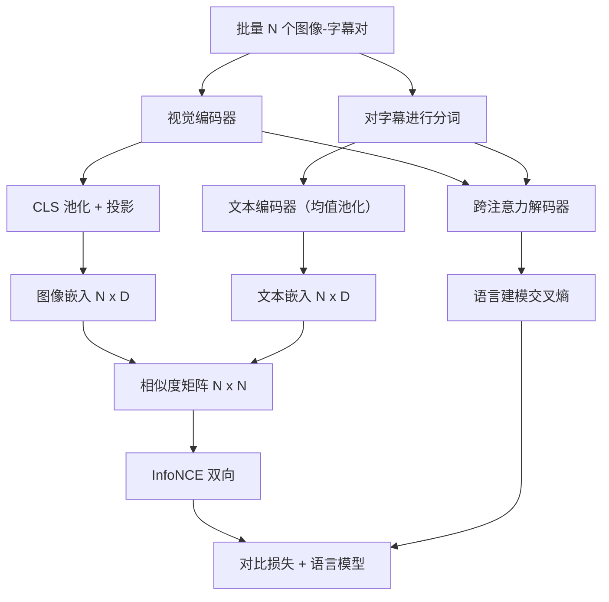

# 视觉-语言 预训练

> 编码器、投影器和解码器已连接。现在一起训练它们。两个目标驱动学习：一种对比的图像-文本损失（`InfoNCE`），在联合嵌入空间中将匹配对拉近；另一种语言建模损失，要求解码器为每张图像生成字幕。两者结合，既教会网络为字幕找到正确的图像，也教会它为图像写出字幕。

**Type:** 构建  
**Languages:** Python  
**Prerequisites:** 第19阶段 第30–37课（Track B 基础）  
**Time:** ~90 分钟

## 学习目标

- 实现跨一批图像-字幕对的 `InfoNCE` 对比损失。  
- 将对比损失与自回归语言建模损失组合。  
- 合成一个 200 对的模拟图像-字幕语料库，无需下载真实数据集。  
- 运行一个 50 步的演示训练循环，观察两种损失都下降。

## 问题描述

一个视觉-语言模型需要两项能力。它必须排序：给定一个字幕，从许多图像中找到正确的图像。它必须生成：给定一张图像，写出字幕。仅对其中一项技能进行预训练只能得到半个系统。CLIP 弄明白了排序但不能生成字幕。GPT-4V 可以生成字幕但使用了单独的检索头来做排序。多目标预训练可以在一次训练中同时获得两者。

InfoNCE 处理排序那半部分。对于一批 N 对，模型把这 N 个匹配对视为正样本，而把 `N^2 - N` 个不匹配对视为负样本，然后在得到的 `(N, N)` 相似度矩阵上运行交叉熵损失。LM（语言模型）损失处理生成部分：解码器在每个位置进行条件下一步词预测。两种损失都是可微的，可以共享编码器、投影器和解码器的权重。

## 概念



### 用一句话解释 InfoNCE

把 N 个图像嵌入按行堆叠，把 N 个文本嵌入按行堆叠。对两者做 L2 归一化。计算 `N x N` 矩阵 `S = I T^T / tau`，其中 `tau` 是可学习的温度。对角线条目是匹配对；非对角线条目是负样本。对行应用交叉熵，目标是对角线：行 `i` 的最大值应在列 `i`。对列做同样的对称操作。总损失是两者的平均。这就是用八行代码实现的 CLIP 损失。

### 温度很重要

温度 `tau` 控制 softmax 的尖锐程度。太小（例如 `tau = 0.01`）时，梯度只来自最难的负样本，训练噪声大。太大时 softmax 会变平坦，梯度消失。CLIP 将 `tau` 作为参数学习；此处演示采用相同做法。

### 语言建模损失

解码器通过跨注意力消费图像记忆（image memory）令牌，并在每个位置预测下一个文本令牌。损失是标准的交叉熵，对下一个位置的目标进行计算。对填充位置要在损失中屏蔽（mask out）。

### 损失的组合

`total = contrastive + lm_weight * lm`，其中 `lm_weight` 是一个标量（通常为 1.0）。两种损失都会将梯度传回编码器和投影器；只有解码器会接收 LM 损失的梯度。这是 CoCa、BLIP 和 SigLIP 风格模型普遍采用的多任务配方，权重有所不同。

| Component | Loss surface | Affects |
|-----------|--------------|---------|
| InfoNCE | 对联合空间中的对排序的损失面 | Encoder + projection + text head |
| LM | 在图像条件下的令牌预测 | Encoder + projection + decoder |
| Combined | 多任务 | 整个堆栈 |

### 为什么 50 步对演示足够

模拟语料库是一个合成的 200 对数据集，包含随机图像和随机字幕 id。使用批量大小 16、进行 50 步 SGD 后，两种损失都会明显下降，即使绝对值仍高于真实数据训练的水平。演示的目的是确认梯度连接端到端工作，并且添加 LM 损失不会使对比目标不稳定。

## 构建说明

`code/main.py` 实现了：

- `MultimodalModel`，组合一个小型 ViT 编码器、MLP 投影器、一个小型文本侧编码器（对嵌入 id 做均值池化），以及第 61 课中的跨注意力解码器。  
- `info_nce_loss(image_emb, text_emb, temperature)`，双向 CLIP 风格的对比损失。  
- `lm_loss(logits, target_ids, padding_id)`，带掩码的下一个词位置交叉熵。  
- `make_mock_corpus(seed, n_pairs)`，返回 200 个确定性的（图像，caption_ids）对。  
- 一个训练循环，运行 50 步，批量大小 16，使用 Adam 优化器，并学习对数温度参数。两种损失每 5 步打印一次。

运行：

```bash
python3 code/main.py
```

输出：对比损失从约 `ln(16) = 2.77` 向 2.4 下降；LM 损失从随机均匀基线 `ln(512) ≈ 6.24` 向约 4.7 下降。两个损失的下降证明了梯度连接正确。真实模型通常训练数百万步；动力学是相同的。

## 使用场景

这是以下工作中使用的相同损失配方：

- **CLIP (2021).** 仅图像-文本对比，使用一个单独的冻结编码器做字幕探测。  
- **CoCa (2022).** 在单个模型中同时进行图像-文本对比和图像字幕的 LM 损失。本课构建的正是该模式。  
- **BLIP (2022) 与 BLIP-2.** 对比 + LM + 图像-文本匹配头。三种损失并用。  
- **SigLIP (2023).** 用 sigmoid 对偶损失替换 InfoNCE；对比作用相同，函数形式不同。  
- **LLaVA 系列。** 两阶段训练：第一阶段是对齐（在冻结的 LM 上用余弦），第二阶段增加 LM 损失并解冻 LM。第 60 课对应第一阶段；本课对应第二阶段。

## 测试

`code/test_main.py` 覆盖：

- InfoNCE 损失对图像/文本行是对称的。  
- 当相似度矩阵是大正值的完美对角时，InfoNCE 损失返回 0。  
- LM 损失正确屏蔽填充位置。  
- 模型前向传递能产生两种损失且无错误。  
- 5 步训练循环能降低组合损失。

运行它们：

```bash
python3 -m unittest code/test_main.py
```

## 练习

1. 用 SigLIP 风格的 sigmoid 对偶损失替换 InfoNCE，并在模拟语料上比较收敛情况。  

2. 添加难负样本挖掘步骤：每隔一个批次，从前一批中选择最困难的非对角配对并追加它。训练并观察对比损失是否更快下降。  

3. 在联合嵌入之上添加一个图像-文本匹配的二分类头（真/假：是否匹配？），作为第三个损失，复现 BLIP 的三头结构。  

4. 用基于图像哈希条件的马尔可夫链抽取的 caption-id 序列替换模拟语料库。由于存在真实可学习的信号，字幕损失应该进一步下降。  

5. 分别用 `lm_weight = 0` 和 `lm_weight = 1` 训练同一模型。比较对比损失；LM 损失不应使排序目标退化。

## 关键术语

| 术语 | 含义 |
|------|------|
| InfoNCE | 噪声对比估计：对相似度矩阵的交叉熵 |
| Temperature | 控制对比 softmax 峰度的标量（温度） |
| Hard negative | 模型认为混淆的非对角负样本，对采样有用 |
| LM loss | 在字幕侧的标准下一个令牌交叉熵（语言模型损失） |
| Joint embedding space | 图像与文本向量经过投影后共享的联合嵌入空间 |

## 延伸阅读

- CLIP 论文，关于最初的对比配方。  
- CoCa 论文，关于在单个模型中同时进行对比与字幕生成。  
- SigLIP 论文，关于 sigmoid 对偶损失的变体以及为何其更易扩展。