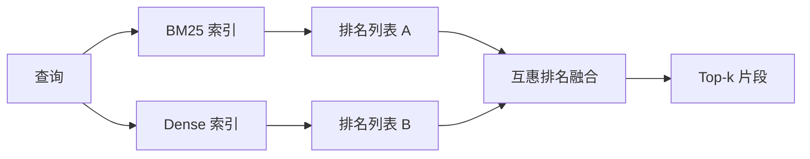

# Hybrid Retrieval with BM25 and Dense Embeddings

> 词汇检索和语义检索在相反的查询分布上会失败。使用互惠排名融合 (reciprocal rank fusion) 的混合检索并不是插值，它是投票 —— 而且在每个查询类别上投票获胜。

**Type:** 构建
**Languages:** Python
**Prerequisites:** Phase 11 lessons 04 (嵌入), 06 (RAG); Phase 19 Track B foundations (lessons 20-29); Phase 19 lesson 64 (chunking strategies)
**Time:** ~90 分钟

## 学习目标
- 从 Robertson 和 Sparck Jones 的公式出发，从头实现 BM25，包含字段加权、文档长度归一化，以及可调的 k1 和 b。
- 在确定性的 mock embedding 上构建一个 dense retriever，使整个流程可以离线运行。
- 精确实现 Cormack、Clarke 和 Buettcher 在 2009 年发表的 reciprocal rank fusion，并解释为什么它优于基于分数的插值。
- 调优 RRF 的 k 常数和每个模态的权重，并在一个小型示例语料上读取权衡。

## 问题

当查询包含语料库中逐字出现的标识符时，词汇搜索占优。对于 `AbortMultipartOnFail` 的查询，BM25 在微秒级别就能返回正确的 Go 函数。相同的查询被嵌入后，位于三个相似性簇的边界处，dense retriever 会把错误的文件排在第一位。

当查询被改述离开语料库的字面令牌时，dense 检索占优。用户询问“how do we handle cancelled uploads” 时，从未键入 abort 或 multipart 这样的词。BM25 返回了“上传大文件”页面的文档块，因为该页面包含 uploads 这个词。Dense 检索找到了其摘要中提到 cancellation 的 abort 函数。

两者之间的选择不是静态的。查询分布是变量。生产级 RAG 系统从同一个端点处理这两类查询，因此检索必须同时处理两者。这就是混合检索。合并步骤是必须做对的部分。

## 概念



### 一段话讲清 BM25

BM25 对每个查询-文档对的评分通过对查询词求和实现：逆文档频率因子乘以包含长度归一化修正的饱和词频因子。两个旋钮。`k1` 控制词频的饱和；默认 1.5 是论文建议，未经基准不应随意更改。`b` 控制文档长度的重要性；默认 0.75 表示较长文档会被惩罚，但不是线性惩罚。

IDF 公式使用平滑的 Robertson 和 Sparck Jones 定义，即 `log((N - df + 0.5) / (df + 0.5) + 1)`。log 内的加一在一个词出现在超过半数语料时保持 IDF 为正。在小语料库中这很重要，因为停用词在技术上也可能变得稀有。

字段加权允许你告诉 BM25：符号名中的匹配比正文中的匹配更重要。实现时是在索引期间对词频做乘法，而不是在评分时做。这保持了数学形式不变并避免为每个字段维护单独的得分。

### 一段话讲清 Dense 检索

将每个片段用嵌入模型映射到固定维度向量。在查询时，将查询嵌入，按余弦相似度对每个片段进行排序，返回 top-k。模型决定质量。检索算法本身就是两行代码：点积和排序。

本课使用确定性的基于哈希的嵌入，这样你可以在没有网络调用的情况下读懂融合的数学。该哈希将基于 token 进行的偏移累加到一个 96 维向量上并做归一化。余弦排序在多次运行间是确定性的，这是测试套件所要求的。

### 互惠排名融合，已发表的公式

两个排名列表。对于出现在任一列表中的每个候选项，累加其倒数秩（reciprocal-rank）贡献。2009 年论文使用的是 `1 / (k + rank)`，默认 k 等于 60。按总分排序。这就是全部算法。

论文中的常数 k = 60 并非随意。k = 60 时 rank-1 的贡献是 1 / 61，rank-10 的贡献是 1 / 70。贡献衰减很慢，因此深层候选项仍然会投票。较小的 k 会使顶端结果占主导。较大的 k 会平坦化贡献曲线。

在我们的实现中有两个可调旋钮。`k` 常数，以及一对每模态的权重，用于在你有先验证据某一模态在语料上更好时增强 BM25 或 dense。将秩贡献乘以权重是最简单且有原则的实现；它保持秩衰减形状并且无量纲。

### 为什么融合胜过基于分数的插值

BM25 分数是无界且依赖语料的。余弦相似度在 -1 到 1 之间有界。线性组合 `alpha * bm25 + (1 - alpha) * cosine` 需要针对每个语料调优 alpha，并且每次重新索引都会破坏它。基于秩的融合则不会。两个排名在模态间是可比的。自 2010 年以来，发表的 RRF 基线在每个公开的 TREC 任务中都优于分数插值。

这与 Vespa 和 Weaviate 文档中关于 RankFusion vs RRF 的讨论是同一个论点。他们得出相同结论：除非你有非常强的证据支持分数插值，否则保持基于秩。

## 实现

`code/main.py` 实现了：

- `tokenize(text)` - 一个快速的正则分词器。
- `BM25Index` - 支持字段加权，包含 `add` 和 `search`，并可调 k1、b。
- `mock_embed`, `DenseIndex` - 与 lesson 64 相同的确定性嵌入，使片段可比较。
- `rrf(rankings, k, weights)` - 已发表的融合方法，支持多模态权重。
- `HybridRetriever` - 将 BM25 和 dense 结合起来。
- 一个演示 `main()`，加载一个小的示例语料，运行三个分别考验每个检索器强弱的查询，并打印每个模态的排名以及融合后的列表。

运行：

```bash
python3 code/main.py
```

并排阅读演示输出。字面标识符查询在 BM25 中位列第 1，dense 中位列第 4，RRF 中位列第 1。改述查询在 BM25 中位列第 6，dense 中位列第 1，RRF 中位列第 1。模棱两可的查询在 BM25 中位列第 3，dense 中位列第 3，RRF 中位列第 1。融合并不是简单的折衷；它是在每个查询类别上胜出的系统。

## 调参要点

| 旋钮 | 默认 | 增大时的理由 | 减小时的理由 |
|------|---------|----------------|------------------|
| BM25 k1 | 1.5 | 词在文档中重复且你希望词频更重要 | 文档较短且词重复是噪声 |
| BM25 b | 0.75 | 长文档每词信息量确实更少 | 文档长度与主题无关 |
| RRF k | 60 | 希望深层候选仍然保有投票权 | 希望 top-1 占主导 |
| BM25 weight | 1.0 | 语料包含逐字标识符且查询匹配这些标识符 | 查询是用户改述的 |
| Dense weight | 1.0 | 查询被改述 | 查询是逐字匹配的 |

通过在你的保留查询集上重新运行 lesson 68 的评估工具来调参，而不是凭直觉。

## 演示会隐藏的失败模式

**语料外令牌。** BM25 的 IDF 是从语料计算的，所以只出现在查询中的词不会贡献分数。Dense 嵌入会为相同的词“编造”一个向量。对于语料外的标识符，dense 模态可能返回看起来合理但错误的邻居。融合会吸收这种情况，因为 BM25 不会返回任何结果，且秩贡献会被忽略，但前提是你按文档去重而不是按片段去重。

**停用词主导。** BM25 对“the”这样的词会在语料中产生均匀排名。在索引时过滤停用词，或者接受高 IDF 词自然地主导结果。

**模态间内容相同。** 如果你的语料足够小，BM25 的 top-1 也恰好是 dense 的 top-1，RRF 会给出相同的 top-1 和相同的邻居。这是正确行为，不是失败，但会让融合看起来不起作用。通过在评估中加入对抗性的查询对来验证融合确实在工作。

## 使用建议（生产模式）

- 在进程内索引 BM25；瓶颈是词频字典，而不是向量。
- 将 dense 向量索引到一个独立的存储（本课使用平面列表；生产中会用 HNSW）。
- 并行运行两次查询；融合是在并集上做常数时间合并。
- 持久化每个检索命中的模态，以便下游的 reranker 能看到是谁投的票。

## 部署路线

Lesson 66 将使用本课的融合 top-k 并用 cross-encoder 进行重排序。Lesson 68 使用精度、召回、MRR 和 nDCG 来评估整个流水线。本课的混合检索器是 lesson 69 端到端系统的第一阶段。

## 练习

1. 用你提供商的真实模型替换 `mock_embed`。重新运行演示并报告密述查询上 dense-only 排名如何变化。
2. 添加第三个模态：单独索引片段摘要并作为第三个排名列表融合。衡量增益。
3. 在 10, 30, 60, 100, 200 上扫 RRF k。绘制 lesson 68 中的 recall@k 曲线。报告在你的语料上曲线达到顶点时的 k 值。
4. 正式实现 BM25F（按字段进行长度归一化，而不是重复令牌的技巧），并在符号匹配最重要的语料上比较效果。

## 术语表

| 术语 | 人们怎么说 | 实际含义 |
|------|-----------------|------------------------|
| BM25 | “词汇检索” | 概率排序：idf × 饱和 tf × 长度归一化 |
| RRF | “排序融合” | 对排名列表求和 1 / (k + rank)；默认 k = 60 |
| k1 | “词频饱和” | 控制重复词停止增加分数的速度 |
| b | “长度惩罚” | 0 表示忽略文档长度，1 表示完全归一化 |
| Field weighting | “符号增强” | 在索引期间重复令牌以提升该字段的匹配 |
| Rank-based vs score-based fusion | “为什么 RRF 胜过线性” | 模态间的秩可比；分数不可比 |

## 延伸阅读

- Cormack, Clarke, Buettcher, "Reciprocal Rank Fusion outperforms Condorcet and individual rank learning methods", SIGIR 2009
- Robertson, Walker, Beaulieu, Gatford, Payne, "Okapi at TREC-3" (原始 BM25 论文)
- [Vespa: Hybrid Retrieval with BM25 and Embeddings](https://docs.vespa.ai/en/tutorials/hybrid-search.html)
- [Weaviate: Hybrid Search](https://weaviate.io/developers/weaviate/search/hybrid)
- Phase 11 lesson 06 - RAG fundamentals
- Phase 19 lesson 64 - chunkers whose output is indexed here
- Phase 19 lesson 66 - cross-encoder reranker that consumes the fused top-k